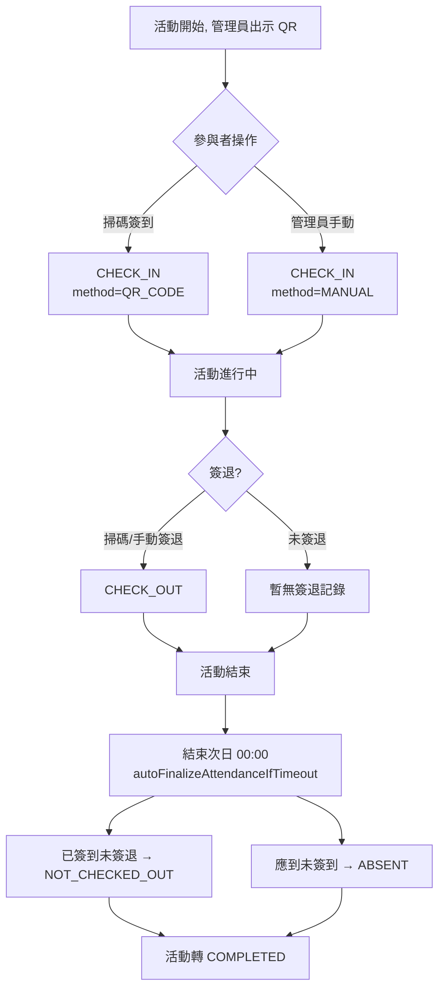
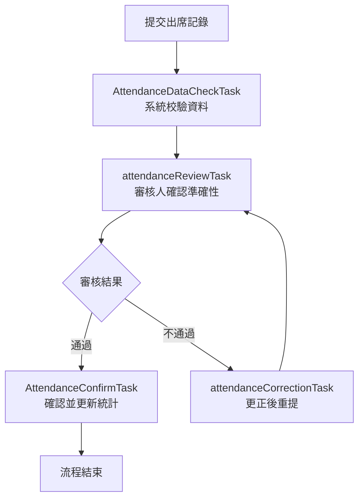

# 活動出席（QR 簽到）

> 本文檔面向 Demo 執行人、UAT 測試人與業務培訓人員，目標是讓使用者**不依賴開發人員陪同**，也能完成 QR 簽到、手動補簽與出席終結。
>
> 本指南基於 `SLAS_PRO` / `SLAS_UI` 當前實現撰寫。
> 出席模組支援：QR 碼自助簽到/簽退、管理員手動與批次處理、活動結束後的自動終結（補缺席），並可串接 BPMN `attendance_review` 做出席稽核。
> 角色稱呼以 DB `SYSTEM_ROLE.NAME` 為權威名（見 `roles-menus-permissions-matrix.md`）。

---

## 1. 模組概覽

### 1.1 業務目標

記錄參與者在活動現場的出席情況（簽到/簽退），自動判定遲到/早退/缺席，並在活動結束後終結出席資料，供後續報告與統計使用。

### 1.2 觸發條件

- 簽到/簽退：活動進行期間，由參與者掃 QR 或由管理員手動處理。
- 自動終結：活動結束日的**次日 00:00** 由系統觸發。

### 1.3 出席結果總覽

| 出席類型（`attendanceType`） | 業務含義 |
|:--|:--|
| `CHECK_IN` | 已簽到 |
| `CHECK_OUT` | 已簽退 |
| `NOT_CHECKED_OUT` | 已簽到但未簽退（終結時補記） |
| `ABSENT` | 缺席（應到未簽到） |

> 細分出席判定 `AttendanceStatusEnum`：`NOT_CHECKED_IN` / `CHECKED_IN_ONLY` / `FULLY_ATTENDED` / `LATE_CHECK_IN`（遲到）/ `EARLY_CHECK_OUT`（早退）/ `ABSENT`。

### 1.4 與其他模組的關係

- 「應到名單」來自「活動報名」最終 `APPROVED` 名冊與獲接受的嘉賓邀請。
- 出席結果是「事件/活動報告」與統計的資料來源；自動終結還會把活動轉為 `COMPLETED`。

---

## 2. 角色與職責

| 角色（`SYSTEM_ROLE.NAME`） | 職責 |
|:--|:--|
| `Student` / `Guest`（參與者） | 掃 QR 自助簽到/簽退 |
| `Group Leader`（`sg_leader`, 114）/ `Supervisor`（`supervisor`, 116） | 出示 QR、手動補簽、批次簽到/簽退、批次標記缺席（需通過 `ActivityAccessGuard.canManageAttendance`） |
| `Coordinator`（`coordinator`, 115） | 出席稽核（BPMN `attendance_review`）審核人，確認出席資料準確性 |
| 系統（排程） | 活動結束次日 00:00 自動終結，補 `NOT_CHECKED_OUT` / `ABSENT`，活動轉 `COMPLETED` |

> 出席稽核 `attendanceReviewTask` 的指派為 Flowable 候選組 `115`（`Coordinator`）；不通過時 `attendanceCorrectionTask` 退回發起人（`startUserId`）更正後重提。

---

## 3. 流程圖

### 3.1 出席主流程

### 3.2 出席稽核（BPMN `attendance_review`）

---

## 4. 關鍵步驟詳述

- **核心端點**（`ActivityAttendanceController.java`，前綴 `/activity/attendance`）
  - 自助：`POST /check-in`、`/check-out`（需登入）。
  - 管理：`POST /manual-check-in`、`/batch-check-in`、`/batch-check-out`、`/batch-mark-absent`；`PUT /update`（修正單筆已存在的出席記錄）。
  - 查詢：`GET /enhanced-page`（出席花名冊分頁，見下）、`/detail/{userId}`（按使用者 ID + 活動 ID，未簽到者亦可查）、`/detail-by-attendance/{attendanceId}`（按出席記錄 ID 直接定位，避免與 `userId` + `activitySessionId` 的查法混用）、`/get`。
  - 稽核：`POST /submit-review`（按活動場次啟動出席稽核流程）、`POST /start-diff-review`（啟動出席**差異**稽核流程）、`GET /workflow-status`（查該活動場次的稽核流程狀態）。

> **`enhanced-page` 為服務端分頁**（2026-08 更新）。分頁籤共 **5 個**：`PENDING_CHECK_IN`（待簽到）/ `CHECKED_IN`（已簽到）/ `NOT_CHECKED_OUT`（待簽退）/ `CHECKED_OUT`（已簽退）/ `ABSENT`（缺席）；不傳 `tab` 或傳 `ALL` 表示全部。回應除當前頁籤的**一頁**資料外，另附五個頁籤在相同篩選條件下的人數，因此頁籤上的計數是全量統計，不受當前頁碼影響。
>
> 早期版本一次回傳整份花名冊並逐行補查使用者資料，數百人的活動載入很慢；改為服務端分頁後，翻頁需要重新請求，匯出/全量核對請改用頁籤計數或分頁逐頁取得，不要假設一次回應即包含全部人員。
- **服務實現**（`ActivityAttendanceServiceImpl`）
  - `autoFinalizeAttendanceIfTimeout(activityId)`：以「活動最晚結束日 + 1 天的 00:00」為截止；到點後，把已簽到未簽退者補 `NOT_CHECKED_OUT`，把已 `APPROVED` 報名/已接受嘉賓但無任何出席記錄者補 `ABSENT`，並把活動轉 `COMPLETED`。
- **QR 碼生成**：`SystemQrCodeServiceImpl`（ZXing），編碼活動 ID + 時間戳；前端 `QRCodePage.vue` 提供**動態**（含倒數刷新）與**靜態**兩種模式。
- **業務規則**
  - 遲到：簽到時間晚於排定開始；早退：簽退時間早於排定結束。
  - 區分學生與嘉賓（嘉賓可能無系統帳號，`userId` 可為 0），嘉賓以 email 去重。
  - 衝突偵測：檢查使用者是否同時報名了時間重疊的活動。
  - 權限：所有管理操作前置 `ActivityAccessGuard.canManageAttendance(activityId)`。

### 4.1 場次（Session）與「日」粒度（2026-08 新增）

一個活動可包含多個**場次**（`ActivitySessionDO`，帶 `SESSION_DATE`）。多日活動**每一日發一個靜態 QR**。出席的判定粒度是**「日」**，不是單一場次——這一整套規則在 2026-08 才確立，舊版文檔完全沒有提及。

| 規則 | 行為 |
|:--|:--|
| **簽到擴散** | 一次簽到會**覆蓋同一 `SESSION_DATE` 的所有場次**；被連帶寫入的那些記錄 `method` 標為 `SAME_DAY_AUTO`，只有使用者實際掃的那一筆是 `QR_CODE` |
| **同日不可重複簽到** | 當日只要**已存在任何簽到記錄**即拒絕再簽——**包括已經簽退之後**（不能同日簽到→簽退→再簽到） |
| **簽退可重複** | 可重複簽退，**最後一次就地覆寫**先前的簽退時間，並清掉 `NOT_CHECKED_OUT` 標記 |
| **遲到簽到會清掉誤判缺席** | 若當日場次已被自動補記 `ABSENT`，使用者稍後在同日簽到時，這些過期的自動缺席記錄會被移除 |
| **批次標記缺席同樣按日** | `batch-mark-absent` 標記**整日**而非單一場次，連帶寫入的記錄同樣標為 `SAME_DAY_AUTO` |

**自助掃碼僅限當日**（`validateSessionAttendanceDay`）：`LocalDate.now()` 必須等於場次的 `SESSION_DATE`，否則報錯——

| 情況 | 錯誤 |
|:--|:--|
| 今天早於場次日期 | `SESSION_NOT_STARTED`（1003003016）「This session has not started yet」 |
| 今天晚於場次日期 | `SESSION_ALREADY_ENDED`（1003003017）「This session has already ended」 |

> 只比對**日期**，不比對時分（場次的起訖時間在庫中存為字串）。
>
> **此限制只套用於使用者自助掃碼路徑**（`check-in` / `check-out`）。管理端補登路徑——`manual-check-in`、`batch-check-in`、`batch-check-out`、`batch-mark-absent`——**不受當日限制**，管理員仍可跨日補登；這是刻意保留的，是否收緊待另行決定。
>
> 註：管理端**沒有**與 `manual-check-in` 對稱的單筆手動簽退端點。單人補簽退請用 `batch-check-out`（可只傳一名），或用 `PUT /update` 修正既有記錄。
>
> 此限制修正的問題：多日活動在第 1 日時，使用者可以掃第 2 日的 QR，記錄會存成 `SESSION_DATE` = 第 2 日但 `ATTENDANCE_TIME` = 第 1 日，並擴散到第 2 日的所有場次。

---

## 5. 狀態與資料模型

### 5.1 關鍵欄位（`ActivityAttendanceDO`，表 `activity_attendance`）

`activityId`、`userId`、`studentId`、`activitySessionId`、`attendanceType`、`attendanceTime`、`method`（`QR_CODE` / `MANUAL` / `TOKEN` / `SAME_DAY_AUTO` / `AUTO_MARK_NOT_CHECKED_OUT` / `AUTO_MARK_ABSENT`）、`locationInfo`、`deviceInfo`、`ipAddress`、`isConflictResolved`、`conflictActivities`、`deptId`。

> `SAME_DAY_AUTO` 代表這筆記錄不是使用者/管理員直接產生的，而是由同一日另一個場次的操作**連帶寫入**的（見 §4.1）。統計出席人數時若把它當成獨立的一次出席，多場次活動會重複計算。

### 5.2 前端入口

`views/organiser/ManageAttendance/`：`index.vue`（活動選擇 + 簽到/簽退 QR 按鈕）、`QRCodePage.vue`（動態/靜態 QR）、`AttendanceBmpIntegration.vue`（出席記錄送入 BPMN 稽核 + 工作流狀態展示）。API 包裝 `api/attendance/attendanceApi.ts`。

---

## 6. 端到端 Demo 指南

### 6.1 準備條件

- 一個進行中、且已有 `APPROVED` 報名名單的活動。
- 至少 2 名已錄取學生帳號（一名演示完整簽到簽退，一名演示缺席）。
- 組織者帳號（可管理該活動出席）。

### 6.2 主線：簽到 → 簽退 → 自動終結

1. **組織者**進 `/organiser/ManageAttendance`，選擇活動，打開「簽到 QR」（`QRCodePage.vue`），可切換動態/靜態模式。
2. **學生 A**掃碼簽到 → 產生 `CHECK_IN`（`method=QR_CODE`）。
   - 驗證點：`enhanced-page` 的「已簽到」頁籤出現學生 A。
3. 活動尾聲，**學生 A**掃「簽退 QR」→ `CHECK_OUT`，判定 `FULLY_ATTENDED`。
4. **學生 B**全程不簽到。
5. 模擬活動結束次日 00:00 觸發 `autoFinalizeAttendanceIfTimeout`：
   - 驗證點：學生 B 補記 `ABSENT`；任何只簽到沒簽退者補 `NOT_CHECKED_OUT`；活動狀態轉 `COMPLETED`。

### 6.3 旁支：手動補簽與批次

1. 組織者對漏簽的學生用「手動簽到」（`manual-check-in`，可填原因）。
2. 用「批次簽到/簽退」一次處理多名；用「批次標記缺席」處理被拒名單。
   - 驗證點：對應 `method` 顯示為 `MANUAL`；分頁籤計數正確。

### 6.4 旁支：出席稽核（選做）

1. 在 `AttendanceBmpIntegration.vue` 提交出席記錄進入 `attendance_review`（`POST /submit-review`，按**活動場次**提交）。
2. 審核人確認準確性 → 通過則確認並更新統計；不通過則進更正任務後重提。
3. 頁面上的工作流狀態由 `GET /workflow-status` 取得；另有 `POST /start-diff-review` 可針對出席**差異**單獨起一輪稽核。
   - 前置檢查：此流程不在自動部署清單內，演示前請先確認目標環境已部署（見 §7）。

---

## 7. 邊界與已知限制

- 自動終結以「結束日次日 00:00」為界，未到點前不會補缺席，Demo 需模擬時間或等待排程。
- 嘉賓無系統帳號時以 email 識別與去重，請避免重複 email。
- 動態 QR 會依設定秒數刷新，掃碼端需即時取得最新碼。
- **多日活動的自助掃碼只在該場次當日有效**（見 §4.1）。Demo 多日活動時，不能在第 1 日預先演示第 2 日的簽到，會被 `SESSION_NOT_STARTED` 擋下；要跨日補登只能走管理端的手動／批次路徑。
- **管理端補登不受當日限制**，這是刻意保留的缺口：管理員可以為任意日期的場次補簽到／簽退／缺席。
- **出席稽核流程 `attendance_review` 不在系統啟動時的自動部署清單內**（`BpmProcessDeploymentInitializer` 的預期流程鍵共 8 個，未含此鍵）。控制器的 `submit-review` / `start-diff-review` 確實會啟動它，因此在新環境或重建流程庫之後，**請先確認該流程定義已部署**，再演示 §6.4；UAT 應優先覆蓋這一段。
- `enhanced-page` 改為服務端分頁後，一次回應只含當前頁籤的一頁資料，需全量核對時請逐頁取得（見 §4）。
