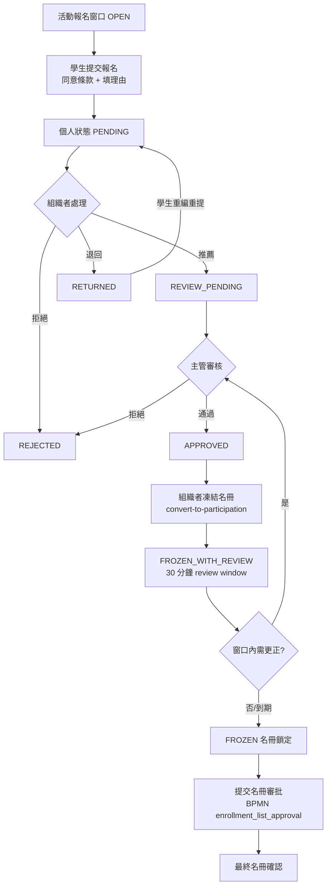

# 活動報名

> 本文檔面向 Demo 執行人、UAT 測試人與業務培訓人員，目標是讓使用者**不依賴開發人員陪同**，也能完整走完報名 → 推薦 → 審核 → 凍結名冊 → 名冊審批。
>
> 本指南基於 `SLAS_PRO` / `SLAS_UI` 當前實現撰寫。
> 活動報名是一條「學生申請 → 組織者推薦 → 主管審核 → 凍結名冊 →（BPMN）名冊審批」的多階段流程。
> 角色稱呼以 DB `SYSTEM_ROLE.NAME` 為權威名（見 `roles-menus-permissions-matrix.md`）。

---

## 1. 模組概覽

### 1.1 業務目標

讓學生對開放報名的活動提交申請，由活動組織者篩選推薦、主管審核，最終凍結並透過 BPMN 流程確認最終參與名冊。

### 1.2 兩層狀態

報名有**活動層**與**個人層**兩套狀態，務必分清：

- **活動層 `EnrollmentStatusEnum`**（數字碼）：控制整個活動的報名窗口。
- **個人層 `ActivityEnrollmentDO.status`**：單一學生的申請進度。

### 1.3 活動層結束狀態總覽

| 活動層狀態（code） | 業務含義 | 後續操作 |
|:--|:--|:--|
| `OPEN`（1） | 開放報名 | 學生可提交申請 |
| `CLOSED`（2） | 關閉報名 | 不再接受新申請 |
| `FROZEN`（3） | 名冊凍結 | 名冊鎖定，不可變更 |
| `FROZEN_WITH_REVIEW`（4） | 凍結待審核 | 凍結後 30 分鐘內仍可審核更正 |

### 1.4 個人層狀態總覽

| 個人狀態 | 業務含義 | 後續操作 |
|:--|:--|:--|
| `PENDING` | 學生已提交，待組織者推薦 | 組織者推薦 / 退回 / 拒絕 |
| `REVIEW_PENDING` | 已推薦，待主管審核 | 主管通過 / 拒絕 |
| `APPROVED` | 主管通過，最終錄取 | — |
| `RETURNED` | 被退回修改 | 學生重新編輯後重提 |
| `REJECTED` | 被拒（組織者或主管） | 終局 |
| `WITHDRAWN` | 學生主動退出 | 終局 |
| `CANCELLED` | 報名被取消 | 終局 |

### 1.5 與其他模組的關係

- 報名最終名冊（`APPROVED`）是「活動出席」識別應到名單、判定缺席（`ABSENT`）的依據。
- 報名可由「活動推廣」的報名窗口導流。

### 1.6 報名入口路徑 vs 名冊審批啟動時機（活動導入 / 活動推廣）

報名記錄有**兩條來源路徑**，它們對「活動層 `enrollment_status`」與「主管審批 UI 可見性」的影響截然不同，務必分清：

| 來源路徑 | 報名記錄怎麼產生 | 是否自動啟動名冊審批流程 | 活動層 `enrollment_status` |
|:--|:--|:--|:--|
| **活動導入**（OC 名單隨活動匯入） | 匯入時自動把 OC 成員建為 `PENDING`，**緊接著自動發起** `enrollment_list_approval`（`ActivityServiceImpl` 匯入後呼叫 `startRosterApprovalProcess`），並把這批記錄置為 `REVIEW_PENDING` | **會**（匯入後一次性發起，一個活動只發起一次） | 被置為 **`FROZEN_WITH_REVIEW`（4）** |
| **活動推廣 / 一般報名** | 學生經推廣報名窗口提交 → `PENDING`；組織者**逐條推薦**（`recommend` / `batch-recommend`）→ `REVIEW_PENDING` | **不會**（`recommend` 只在流程已存在時補發通知，流程不存在時僅記 warning，不啟動） | 保持 **`NULL`**（從未被置為 4） |

**對可見性的關鍵影響：**

- 主管（`Supervisor`）的「批量通過 / 拒絕」按鈕，**可見性只取決於「待許可（`pendingApproval`）分頁是否有 `REVIEW_PENDING` 記錄」**，**不**依賴活動層是否為 `FROZEN_WITH_REVIEW`（4）。後端 `approveEnrollment` 也只校驗個人層 `status ∈ {REVIEW_PENDING, …}`，不檢查活動層狀態。
- 因此「活動推廣 / 一般報名」的活動雖然 `enrollment_status` 為 `NULL`，只要組織者推薦過、產生了 `REVIEW_PENDING` 記錄，主管即可正常看到並執行審批。
- 歷史問題：前端曾以「活動層 `enrollment_status===4`」作為主管審批按鈕的顯示前提，導致推廣來源活動（`enrollment_status=NULL`）即使已有 `REVIEW_PENDING` 記錄、後端也願意放行，主管仍看不到審批按鈕。此前提已移除（拿活動層凍結旗標去管個人層審批動作屬於兩個維度誤用）。
- `submit-roster-approval` 端點仍存在，但 OC「管理報名」頁的「提交名冊審批」按鈕已移除、主管端對應函式亦未綁定按鈕；故目前**實務上唯一**會把活動層置為 4 的入口是活動導入。

---

## 2. 角色與職責

| 角色（`SYSTEM_ROLE.NAME`） | BPMN 候選組 | 職責 |
|:--|:--|:--|
| `Student`（`student`, 112；報名人） | — | 提交報名、同意條款、可主動退出 |
| `Group Leader`（`sg_leader`, 114；活動組織者 / OC 成員） | — | 推薦合格申請者、退回/拒絕、凍結名冊、提交名冊審批 |
| `Supervisor`（`supervisor`, 116） | 候選組 116（`supervisorApprove`） | 審核被推薦/凍結的名冊，於 review window 內通過/拒絕 |

> 名冊審批 BPMN `enrollment_list_approval` 的 `supervisorApprove` 任務指派為候選組 `116`（`Supervisor`）；被拒時 `handleRejection` 退回發起人（`startUserId`，即組織者）重辦。

---

## 3. 流程圖

---

## 4. 關鍵步驟詳述

- **核心端點**（`ActivityEnrollmentController.java`，共 40+ 個）
  - 學生：`POST /activity/enrollment/apply`（報名）、`POST /activity/enrollment/withdraw`（退出）、`GET /activity/enrollment/check-enrolled`（防重複）。
  - 組織者：`POST /activity/enrollment/recommend/{id}`、`/batch-recommend`（推薦）、`PUT /activity/enrollment/batch-approve`、`/return`、`/batch-return`、`/reject`、`/batch-reject`。
  - 名冊：`POST /activity/enrollment/convert-to-participation`（凍結並轉名冊）、`PUT /activity/enrollment/freeze-list`、`/unfreeze-list`、`POST /activity/enrollment/submit-roster-approval`（提交 BPMN 審批）。
  - review window：`GET /activity/enrollment/check-review-window/{activityId}`、`PUT /activity/enrollment/open-review-window`、`/close-review-window`。
  - 狀態/統計：`GET /activity/enrollment/status`、`/check-open`、`/statistics/{activityId}`、`/manage-list`。
- **服務實現**（`ActivityEnrollmentServiceImpl`）
  - BPMN：`enrollment_list_approval`（名冊審批）、`enrollment_list_audit`（名冊稽核）。
  - `enrollActivityWithSsoInfo`：校驗報名開放（`isEnrollmentOpen`）、防重複（`isUserEnrolledAtAll`）、容量（`isActivityFull`），建立 `status=PENDING` 的報名記錄。
- **業務規則**
  - 僅在活動層 `OPEN` 時可報名。
  - 同一學生同一活動不得重複報名。
  - 達到 `maxParticipants` 上限即不可再報。
  - 報名須勾選同意條款（`agreed=1`）。
  - 凍結後有 30 分鐘 `FROZEN_WITH_REVIEW` 窗口供更正，逾時轉 `FROZEN`。

---

## 5. 狀態與資料模型

### 5.1 關鍵欄位（`ActivityEnrollmentDO`）

`activityId`、`userId`、`studentId`、`status`、`enrollmentTime`、`approvalTime`、`approvalComment`、`approvedBy`、`participantCategory`（OC / NON_OC / Participant）、`enrollmentReason`、`recommendedBy`、`rejectedBy`、`returnedBy`、`rejectionReason`、`returnReason`。

### 5.2 前端入口

`views/organiser/ManageEnrollment/`：`index.vue`（三段式：未開始 / 進行中 / 已結束）、`OrganizerManageEnrollment.vue`、`SupervisorManageEnrollment.vue`、`EnrollmentProcessFlow.vue`（流程可視化）、`detail.vue`。API 包裝 `api/activities/enrollmentApi.ts`。

---

## 6. 端到端 Demo 指南

### 6.1 準備條件

- 一個報名窗口為 `OPEN` 的活動，設定一個較小的 `maxParticipants`（便於演示容量限制）。
- 一個學生帳號、一個組織者帳號、一個 `Supervisor` 帳號。

### 6.2 主線：報名 → 推薦 → 審核 → 凍結 → 名冊審批

1. **學生**打開活動，點「報名」，勾選同意條款、填寫理由，提交。
   - 驗證點：個人狀態 `PENDING`；再次報名應被擋（防重複）。
2. **組織者**進 `/organiser/manage-enrollment`「進行中」段，打開該活動的報名列表。
3. 對該學生點「推薦」→ 個人狀態轉 `REVIEW_PENDING`。
   - 旁支：對另一位學生點「退回」→ `RETURNED`，學生可重編重提；點「拒絕」→ `REJECTED`。
4. **主管**在 `SupervisorManageEnrollment` 審核被推薦名單，點「通過」→ `APPROVED`。
5. **組織者**「凍結名冊」（`convert-to-participation`）→ 活動層轉 `FROZEN_WITH_REVIEW`，開始 30 分鐘窗口。
   - 驗證點：`check-review-window` 回傳窗口開啟；窗口內仍可更正。
6. 窗口到期或手動關閉後 → 活動層 `FROZEN`；最終名冊確認後鎖定。
   - 注意：上述 5–6 的「凍結 → 提交名冊審批」是**活動導入**情境下的完整流程（導入時即自動發起 `enrollment_list_approval`，活動層為 `FROZEN_WITH_REVIEW`）。**活動推廣 / 一般報名**情境下不會自動發起該流程、活動層維持 `NULL`，主管直接在「待許可」分頁逐條/批量審批 `REVIEW_PENDING` 記錄即可（見 §1.6）。
   - OC「管理報名」頁已無「提交名冊審批」按鈕；`submit-roster-approval` 端點僅供既有/特殊路徑使用。

### 6.3 容量與退出旁支

1. 連續報名至達 `maxParticipants`，確認後續報名回報「已額滿」。
2. 已報名學生點「退出」→ 個人狀態 `WITHDRAWN`，名額釋放。

---

## 7. 邊界與已知限制

- 活動層 `CLOSED`/`FROZEN` 後學生無法再報名。
- 30 分鐘 review window 是更正名冊的最後機會，逾時需走 unfreeze 才能再調整。
- 個人層與活動層狀態互相獨立：個人 `APPROVED` 不代表整體名冊已 `FROZEN`/審批完成。
- 活動層 `enrollment_status=NULL`（推廣 / 一般報名來源）**不代表**主管不能審批；主管審批可見性只看是否有 `REVIEW_PENDING` 記錄，與活動層是否為 4 無關（見 §1.6）。
