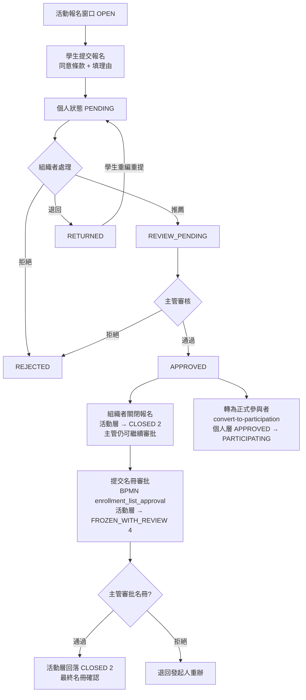

# 活動報名

> 本文檔面向 Demo 執行人、UAT 測試人與業務培訓人員，目標是讓使用者**不依賴開發人員陪同**，也能完整走完報名 → 推薦 → 審核 → 關閉報名 → 名冊審批。
>
> 本指南基於 `SLAS_PRO` / `SLAS_UI` 當前實現撰寫。
> 活動報名是一條「學生申請 → 組織者推薦 → 主管審核 → 關閉報名 →（BPMN）名冊審批」的多階段流程。
> 角色稱呼以 DB `SYSTEM_ROLE.NAME` 為權威名（見 `roles-menus-permissions-matrix.md`）。

---

## 1. 模組概覽

### 1.1 業務目標

讓學生對開放報名的活動提交申請，由活動組織者篩選推薦、主管審核，最終凍結並透過 BPMN 流程確認最終參與名冊。

### 1.2 兩層狀態

報名有**活動層**與**個人層**兩套狀態，務必分清：

- **活動層 `EnrollmentStatusEnum`**（數字碼）：控制整個活動的報名窗口。
- **個人層 `ActivityEnrollmentDO.status`**：單一學生的申請進度。

### 1.3 活動層結束狀態總覽

| 活動層狀態（code） | 業務含義 | 後續操作 |
|:--|:--|:--|
| `NULL`（未設值） | 推廣 / 一般報名活動的常態 | 報名開放與否改由推廣窗口日期即時判定（見 §1.7） |
| `OPEN`（1） | 開放報名 | 學生可提交申請 |
| `CLOSED`（2） | 關閉報名 | 不再接受新申請，但**主管仍可繼續審批**已提交的人 |
| `FROZEN`（3） | 名冊凍結（**遺留狀態**） | 禁止一切審批動作。當前主線流程**不會**讓活動停在此狀態 |
| `FROZEN_WITH_REVIEW`（4） | **名冊審批中** | 名冊已提交 BPMN 審批；審批通過後活動層回落 `CLOSED`（2） |

> **⚠️ 這張表在 2026-08 有實質變更，舊版描述已作廢：**
>
> 1. **`CLOSED`（2）不等於「什麼都不能做」。** 它的語義是「關上報名的門，但審批繼續」——組織者按「關閉報名」時系統寫入 `CLOSED` 而**不是** `FROZEN`，正是為了讓主管能繼續審批已經報上來的人。
> 2. **`FROZEN`（3）已退居遺留狀態。** 寫入它的方法已標記 `@Deprecated`；名冊審批通過時雖然會短暫經過它，但同一次操作立刻覆寫為 `CLOSED`（2），實務上觀察不到。
> 3. **`FROZEN_WITH_REVIEW`（4）的業務含義已改為「名冊審批中」**，不再是「凍結後的 30 分鐘更正窗口」。提交名冊審批時活動層被置為 4，審批走完回落 2。
> 4. **「30 分鐘更正窗口」在主線上不再存在**——見 §1.7。

### 1.4 個人層狀態總覽

| 個人狀態 | 業務含義 | 後續操作 |
|:--|:--|:--|
| `PENDING` | 學生已提交，待組織者推薦 | 組織者推薦 / 退回 / 拒絕 |
| `REVIEW_PENDING` | 已推薦，待主管審核 | 主管通過 / 拒絕 |
| `APPROVED` | 主管通過，最終錄取 | 可再轉為 `PARTICIPATING` |
| `PARTICIPATING` | 已轉為正式參與者 | 由 `convert-to-participation` 批次把該活動所有 `APPROVED` 轉入此狀態 |
| `RETURNED` | 被退回修改 | 學生重新編輯後重提 |
| `REJECTED` | 被拒（組織者或主管） | 終局 |
| `WITHDRAWN` | 學生主動退出 | 終局 |
| `CANCELLED` | 報名被取消 | 終局 |

### 1.5 與其他模組的關係

- 報名最終名冊（`APPROVED`）是「活動出席」識別應到名單、判定缺席（`ABSENT`）的依據。
- 報名可由「活動推廣」的報名窗口導流。

### 1.6 報名入口路徑 vs 名冊審批啟動時機（活動導入 / 活動推廣）

報名記錄有**兩條來源路徑**，它們對「活動層 `enrollment_status`」與「主管審批 UI 可見性」的影響截然不同，務必分清：

| 來源路徑 | 報名記錄怎麼產生 | 是否自動啟動名冊審批流程 | 活動層 `enrollment_status` |
|:--|:--|:--|:--|
| **活動導入**（OC 名單隨活動匯入） | 匯入時自動把 OC 成員建為 `PENDING`，**緊接著自動發起** `enrollment_list_approval`（`ActivityServiceImpl` 匯入後呼叫 `startRosterApprovalProcess`），並把這批記錄置為 `REVIEW_PENDING` | **會**（匯入後一次性發起，一個活動只發起一次） | 被置為 **`FROZEN_WITH_REVIEW`（4）** |
| **活動推廣 / 一般報名** | 學生經推廣報名窗口提交 → `PENDING`；組織者**逐條推薦**（`recommend` / `batch-recommend`）→ `REVIEW_PENDING` | **不會**（`recommend` 只在流程已存在時補發通知，流程不存在時僅記 warning，不啟動） | 保持 **`NULL`**（從未被置為 4） |

**對可見性的關鍵影響：**

- 主管（`Supervisor`）的「批量通過 / 拒絕」按鈕，**可見性只取決於「待許可（`pendingApproval`）分頁是否有 `REVIEW_PENDING` 記錄」**，**不**依賴活動層是否為 `FROZEN_WITH_REVIEW`（4）。後端 `approveEnrollment` 也只校驗個人層 `status ∈ {REVIEW_PENDING, …}`，不檢查活動層狀態。
- 因此「活動推廣 / 一般報名」的活動雖然 `enrollment_status` 為 `NULL`，只要組織者推薦過、產生了 `REVIEW_PENDING` 記錄，主管即可正常看到並執行審批。
- 歷史問題：前端曾以「活動層 `enrollment_status===4`」作為主管審批按鈕的顯示前提，導致推廣來源活動（`enrollment_status=NULL`）即使已有 `REVIEW_PENDING` 記錄、後端也願意放行，主管仍看不到審批按鈕。此前提已移除（拿活動層凍結旗標去管個人層審批動作屬於兩個維度誤用）。
- `submit-roster-approval` 端點仍存在，但 OC「管理報名」頁的「提交名冊審批」按鈕已移除、主管端對應函式亦未綁定按鈕；故目前**實務上唯一**會把活動層置為 4 的入口是活動導入。

### 1.7 「30 分鐘更正窗口」與「報名截止自動凍結」的現況（2026-08 更新）

舊版文檔描述的兩條規則已不再適用，UAT / Demo 時請按下表理解：

| 舊版描述 | 現況 |
|:--|:--|
| 「凍結後有 30 分鐘 `FROZEN_WITH_REVIEW` 窗口供更正，逾時轉 `FROZEN`」 | **主線上不會發生。** 提交名冊審批時活動層雖被置為 4，但**不寫入凍結時間**，所以計時窗口從未啟動；且負責「逾時轉 `FROZEN`」的排程已停用，狀態 4 不會自動變 3 |
| 「報名截止後系統自動凍結名單」 | **排程已停用**（issue #355）。報名是否截止改為在**學生按下報名的當下即時比對推廣窗口日期**：未開始回報「報名尚未開始」，已結束回報「報名已截止」。截止立即生效、不依賴排程、也不會把活動卡在錯誤狀態 |

> **仍會啟動 30 分鐘窗口的唯一情況**：手動呼叫「開啟審核窗口」端點（`open-review-window`）。該端點會同時寫入狀態 4 與凍結時間，此後超過 30 分鐘，主管的審批動作會被拒絕（提示「審核窗口已逾期」），且**不會**自動回到可審批狀態，需另行處理。標準流程請勿使用此端點。
>
> **停用背景**：舊排程讀錯了日期欄位、且會在報名截止日（往往早於活動日一整週）就把主管鎖在審批之外，反而造成「學生報得進來、主管審不了」的孤兒報名。

---

## 2. 角色與職責

| 角色（`SYSTEM_ROLE.NAME`） | BPMN 候選組 | 職責 |
|:--|:--|:--|
| `Student`（`student`, 112；報名人） | — | 提交報名、同意條款、可主動退出 |
| `Group Leader`（`sg_leader`, 114；活動組織者 / OC 成員） | — | 推薦合格申請者、退回/拒絕、凍結名冊、提交名冊審批 |
| `Supervisor`（`supervisor`, 116） | 候選組 116（`supervisorApprove`） | 審核被推薦/凍結的名冊，於 review window 內通過/拒絕 |

> 名冊審批 BPMN `enrollment_list_approval` 的 `supervisorApprove` 任務指派為候選組 `116`（`Supervisor`）；被拒時 `handleRejection` 退回發起人（`startUserId`，即組織者）重辦。

---

## 3. 流程圖

> 圖中 **K → M** 這段只在「活動導入」情境下自動發生（導入時即自動發起名冊審批）。**活動推廣 / 一般報名**情境下不會走 K，活動層維持 `NULL`，主管直接逐條/批量審批 `REVIEW_PENDING` 記錄即可（見 §1.6）。
>
> `convert-to-participation`（圖中 P）**只改個人層**，不碰活動層狀態，與名冊審批是兩件獨立的事。

---

## 4. 關鍵步驟詳述

- **核心端點**（`ActivityEnrollmentController.java`，共 40+ 個）
  - 學生：`POST /activity/enrollment/apply`（報名）、`POST /activity/enrollment/withdraw`（退出）、`GET /activity/enrollment/check-enrolled`（防重複）。
  - 組織者：`POST /activity/enrollment/recommend/{id}`、`/batch-recommend`（推薦）、`PUT /activity/enrollment/batch-approve`、`/return`、`/batch-return`、`/reject`、`/batch-reject`。
  - 名冊：`POST /activity/enrollment/convert-to-participation`（把該活動所有 `APPROVED` 轉為 `PARTICIPATING`，**不改活動層狀態**）、`PUT /activity/enrollment/freeze-list`（⚠️ 已標記 `@Deprecated`）、`/unfreeze-list`、`POST /activity/enrollment/submit-roster-approval`（提交 BPMN 審批）。
  - review window：`GET /activity/enrollment/check-review-window/{activityId}`、`PUT /activity/enrollment/open-review-window`、`/close-review-window`。⚠️ 這三個端點屬於已停用的 30 分鐘窗口機制，標準流程不使用（見 §1.7）。
  - 狀態/統計：`GET /activity/enrollment/status`、`/check-open`、`/statistics/{activityId}`、`/manage-list`。
- **服務實現**（`ActivityEnrollmentServiceImpl`）
  - BPMN：`enrollment_list_approval`（名冊審批）。**主線上實際會被啟動的報名流程只有這一條**；另有兩個容易混淆的流程鍵，說明見 §7「已知限制」。
  - `enrollActivityWithSsoInfo`：校驗報名開放（`isEnrollmentOpen`）、防重複（`isUserEnrolledAtAll`）、容量（`isActivityFull`），建立 `status=PENDING` 的報名記錄。
  - `validatePromotionRegistrationWindow`：報名寫入路徑上的即時窗口校驗，取代已停用的自動凍結排程（見 §1.7）。判定所依據的**推廣報名窗口**規則（何謂「生效中」推廣、多筆窗口如何取聯集、`ENROLLMENT_NOT_STARTED` 與 `ENROLLMENT_CLOSED` 何時各自拋出）詳見 `activity-promotion-guide.md` §1.5。
- **業務規則**
  - 活動層為 `OPEN`（1），或活動層未設值（`NULL`）但推廣報名窗口在期內，方可報名。
  - 同一學生同一活動不得重複報名。
  - 達到 `maxParticipants` 上限即不可再報。**額滿判定與畫面上顯示的人數是兩套口徑**（2026-08 更新，#342）：
    - **額滿閘門**（`isActivityFull`）只數 `APPROVED`。因此在主管尚未審批之前，即使 `PENDING` 的申請數已超過名額，報名仍會放行——這是刻意設計（申請可超額，錄取不超額），主管審批到第 `maxParticipants` 人之後，後續審批通過會被「已額滿」擋下。
    - **顯示用的已報名人數**（活動卡片、推廣卡片、學生端的目前報名數）數的是**仍佔位的狀態**：`PENDING`、`PENDING_SUPERVISOR`、`REVIEW_PENDING`、`APPROVED`。已退回、已拒絕、已取消、已退出的記錄**不再計入**。變更前此處是無條件全表計數，顯示的分子會超過實際收生數。
  - 報名須勾選同意條款（`agreed=1`）。
  - 關閉報名（活動層 `CLOSED`）只擋新申請，**不擋主管審批**已提交的人。
  - 名冊提交審批期間活動層為 `FROZEN_WITH_REVIEW`（4），審批通過後回落 `CLOSED`（2）。

---

## 5. 狀態與資料模型

### 5.1 關鍵欄位（`ActivityEnrollmentDO`）

`activityId`、`userId`、`studentId`、`status`、`enrollmentTime`、`approvalTime`、`approvalComment`、`approvedBy`、`participantCategory`（OC / NON_OC / Participant）、`enrollmentReason`、`recommendedBy`、`rejectedBy`、`returnedBy`、`rejectionReason`、`returnReason`。

> **報名列表不再顯示已刪除記錄（2026-08 修正）**：報名列表的分頁查詢先前未過濾軟刪除標記，已被刪除的報名記錄仍會出現在列表中，並把「總筆數」撐大到與分頁籤計數徽章對不上（列表顯示的總數多於各頁籤加總）。現已在**分頁查詢與計數查詢**同時過濾，兩者一致。若在既有環境中仍見到兩者不符，請確認後端已更新至此版本。
>
> **學號遮罩（2026-08 變更，#340）**：報名列表的 `studentId` 預設**遮罩**顯示。`Supervisor` 角色，以及持有 `query-studentid` 權限者，看到的是**完整未遮罩**學號——列表頁與匯出檔皆然。變更前列表 VO 無條件遮罩，導致 Supervisor 從「管理報名」匯出的檔案裡學號是星號，無法核對名單。

### 5.2 前端入口

`views/organiser/ManageEnrollment/`：`index.vue`（三段式：未開始 / 進行中 / 已結束）、`OrganizerManageEnrollment.vue`、`SupervisorManageEnrollment.vue`、`EnrollmentProcessFlow.vue`（流程可視化）、`detail.vue`。API 包裝 `api/activities/enrollmentApi.ts`。

> **組織者端與主管端是同一個頁面。** `OrganizerManageEnrollment.vue` 與 `SupervisorManageEnrollment.vue` 都只是薄包裝，各自以 `role` 參數（`organizer` / `supervisor`）渲染同一個 `index.vue`，差異由該參數在頁內分流（可見分頁籤、可用動作、學號是否遮罩等），並非兩套獨立實作。因此兩端的行為差異若需調整，應理解為同一頁面的角色分支。
>
> 對應的選單路徑分別是 `/organiser/OrganizerManageEnrollment`（選單 84）與 `/admin/SupervisorManageEnrollment`（權限 `activity:enrollment:management`）。

---

## 6. 端到端 Demo 指南

### 6.1 準備條件

- 一個報名窗口為 `OPEN` 的活動，設定一個較小的 `maxParticipants`（便於演示容量限制）。
- 一個學生帳號、一個組織者帳號、一個 `Supervisor` 帳號。

### 6.2 主線：報名 → 推薦 → 審核 → 關閉報名 → 名冊審批

1. **學生**打開活動，點「報名」，勾選同意條款、填寫理由，提交。
   - 驗證點：個人狀態 `PENDING`；再次報名應被擋（防重複）。
2. **組織者**進「管理報名」（選單路徑 `/organiser/OrganizerManageEnrollment`）的「進行中」段，打開該活動的報名列表。
3. 對該學生點「推薦」→ 個人狀態轉 `REVIEW_PENDING`。
   - 旁支：對另一位學生點「退回」→ `RETURNED`，學生可重編重提；點「拒絕」→ `REJECTED`。
4. **主管**進「管理報名」（選單路徑 `/admin/SupervisorManageEnrollment`）審核被推薦名單，點「通過」→ `APPROVED`。
5. **組織者**「關閉報名」→ 活動層轉 `CLOSED`（2）。
   - 驗證點：學生端不再能提交新報名；**主管端仍看得到並能繼續審批**尚未處理完的 `REVIEW_PENDING` 記錄。這是刻意設計，不是缺陷。
   - 注意：不要期待看到「30 分鐘更正窗口」倒數——該機制已停用（見 §1.7）。
6. 名冊審批（僅**活動導入**情境）：導入時系統即自動發起 `enrollment_list_approval`，活動層置為 `FROZEN_WITH_REVIEW`（4）。
   - 驗證點：主管在 BPM 待辦看到名冊審批任務；通過後活動層回落 `CLOSED`（2）。
   - **活動推廣 / 一般報名**情境下不會自動發起該流程、活動層維持 `NULL`，主管直接在「待許可」分頁逐條/批量審批 `REVIEW_PENDING` 記錄即可（見 §1.6）。
   - OC「管理報名」頁已無「提交名冊審批」按鈕；`submit-roster-approval` 端點僅供既有/特殊路徑使用。
7. （可選）**組織者**執行 `convert-to-participation`，把所有 `APPROVED` 轉為 `PARTICIPATING`。這只改個人層，與活動層狀態及名冊審批無關。

### 6.3 容量與退出旁支

1. 演示額滿時請注意：**只靠學生連續提交報名是演不出「已額滿」的**——額滿閘門只數 `APPROVED`。正確做法是先讓主管把 `maxParticipants` 名學生審批為 `APPROVED`，之後：
   - 學生端再報名 → 回報「已額滿」；
   - 主管再審批下一位 `REVIEW_PENDING` 為通過 → 同樣被「已額滿」擋下。
2. 已報名學生點「退出」→ 個人狀態 `WITHDRAWN`，名額釋放。
   - 驗證點：畫面上的已報名人數應**立即減少**（退出不再佔位），若該學生原本已是 `APPROVED`，額滿狀態亦隨之解除。
3. 對某位學生點「退回」→ `RETURNED`。
   - 驗證點：畫面已報名人數同樣減少（退回中的申請不佔位），但這**不影響**額滿閘門（閘門本來就只數 `APPROVED`）。

---

## 7. 邊界與已知限制

- 活動層 `CLOSED`/`FROZEN` 後學生無法再報名；但 `CLOSED` **不影響**主管繼續審批已提交的人。
- 「30 分鐘 review window」與「報名截止自動凍結」兩條舊規則均已失效，請以 §1.7 為準。若在環境中真的觀察到活動被鎖在 `FROZEN_WITH_REVIEW` 且主管審批被拒（提示審核窗口已逾期），代表有人手動呼叫過 `open-review-window`，需人工處理。
- 個人層與活動層狀態互相獨立：個人 `APPROVED` 不代表整體名冊已審批完成；反之活動層停在 `FROZEN_WITH_REVIEW` 也只表示名冊審批進行中。
- 活動層 `enrollment_status=NULL`（推廣 / 一般報名來源）**不代表**主管不能審批；主管審批可見性只看是否有 `REVIEW_PENDING` 記錄，與活動層是否為 4 無關（見 §1.6）。
- **有兩個與報名相關、但主線上不會被啟動的流程鍵**，看到它們時請勿誤判為另一條審批路徑：
  - `enrollment_review`：**有**流程定義檔，程式中也有對應的啟動方法，但目前**沒有任何呼叫點**，且不在系統啟動時的自動部署清單內。它是保留的獨立「單筆報名審核」路徑，尚未接入主線；如日後啟用，UAT 應優先覆蓋。
  - `enrollment_list_audit`：僅是程式中保留的一個歷史鍵字串常數，**沒有對應的流程定義檔**，也沒有被用來啟動流程。BPM 待辦的部分顯示邏輯仍認得這個舊鍵，屬相容處理，不代表存在同名流程。
- 名冊審批流程 `enrollment_list_approval` **在**自動部署清單內，無須另行確認。
