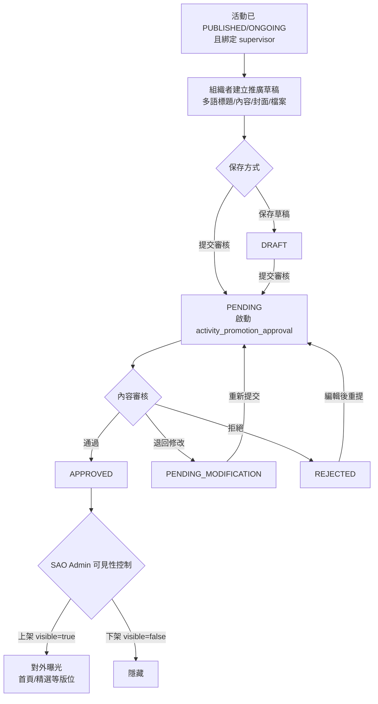

# 活動推廣

> 本文檔面向 Demo 執行人、UAT 測試人與業務培訓人員，目標是讓使用者**不依賴開發人員陪同**，也能完成活動推廣的提交、審核與上架。
>
> 本指南基於 `SLAS_PRO` / `SLAS_UI` 當前實現撰寫。
> 活動推廣是把**已發布**的活動，經內容審核後，透過首頁/精選等版位對外曝光的機制；它走獨立的 BPMN 流程 `activity_promotion_approval`。
> 角色稱呼以 DB `SYSTEM_ROLE.NAME` 為權威名（見 `roles-menus-permissions-matrix.md`）。

---

## 1. 模組概覽

### 1.1 業務目標

讓活動組織者為已通過審批的活動申請對外推廣（首頁橫幅、精選、部門版位等），由審核人把關推廣內容，最後由 `SAO Administrator` 控制最終可見性。

### 1.2 觸發條件（前置）

推廣申請的建立需同時滿足：

- 活動狀態為 `PUBLISHED` 或 `ONGOING`；
- 活動已綁定 supervisor；
- 該活動沒有尚在 `PENDING` 的推廣申請（避免重複提交）。

### 1.3 結束狀態總覽

推廣有兩層狀態：**內容審核狀態 `PromotionStatusEnum`** 與 **可見性 `visible`**。

| 內容狀態 | 業務含義 | 後續操作 |
|:--|:--|:--|
| `DRAFT` | 草稿，未提交審核 | 可編輯、可提交審核 |
| `NOT_PROMOTED` | 活動尚未申請推廣（預設） | 可新建推廣 |
| `PENDING` | 已提交，等待內容審核 | 等待審核人決定 |
| `APPROVED` | 內容審核通過 | 由 SAO Admin 控制可見性 |
| `REJECTED` | 推廣申請被拒 | 可編輯後重新提交 |
| `PENDING_MODIFICATION` | 需修改後重新提交 | 可編輯、可重新提交 |

> 輔助判斷（`PromotionStatusEnum`）：`isEditable()` = DRAFT/REJECTED/PENDING_MODIFICATION；`canSubmitForReview()` = DRAFT/PENDING_MODIFICATION；`canReview()` = PENDING；`canControlVisibility()` = APPROVED。

### 1.4 與其他模組的關係

- 推廣建立在「活動發布審批」之後（活動須先 `PUBLISHED`）。
- 推廣可帶自己的報名起訖時間，串接「活動報名」的開放窗口。

---

## 2. 活動資料來源與兩種建立方式的差異

> 推廣只接受**已發布**的活動，但「已發布」的活動其實有兩種來路，落庫的資料並不相同。本章說明資料從哪來、兩種方式差在哪、以及對推廣與其後續流程（報名 / 出席 / 報告）的實際影響。UAT / Demo 時若用「導入」造資料，務必讀本章。

### 2.1 兩個來源

| 來源 | 怎麼產生 | 達到 `PUBLISHED` 的方式 |
|:--|:--|:--|
| **活動申請**（正常主線） | 組織者 `/create` 建立 → OC 認可 → 提交 → 走 `activity_publish` 審批流（Coordinator → Checker → Supervisor → VP/IRG → Chair） | 審批流末端 `publishActivity` 才置 `PUBLISHED`/`APPROVED` |
| **活動導入**（批次造數） | 管理員上傳 Excel：`POST /activity/import-excel-with-attachments`（`activity:activity:import`） | INSERT 當下**直接寫死** `status=PUBLISHED`、`approvalStatus=APPROVED`、`enrollmentStatus=OPEN`，完全繞過審批流 |

> 注意：本文件 §1.4 提到的「推廣建立在活動發布審批之後」，對**導入活動並不成立**——導入活動沒有經過任何發布審批，只是被直接標記為已審批。

### 2.2 兩種方式的資料差異

兩者最終的 `activity` 主表狀態欄位看起來一致（都是 PUBLISHED/APPROVED），但**圍繞活動的關聯資料差很多**：

| 資料項 | 活動申請 | 活動導入 | 是否一致 |
|:--|:--|:--|:--:|
| `activity` 主表狀態 | 審批流末端寫入 | 插入即寫死 | 終態同、來路不同 |
| **活動審批 BPM 流程實例**（投票 / AI summary / 審批歷史） | 有完整實例 | **完全沒有** | ✗ |
| **OC 認可** `activity_oc_endorsement` | `initializeEndorsements` 初始化 | **不寫** | ✗ |
| **時間安排** | 寫 `activity_schedule` | 寫 `activity_session`（**不同表**） | ✗ |
| **活動成員** `activity_member` | `saveActivityMembers` 寫入 | **不寫** | ✗ |
| OC 成員 `activity_oc_member` | 由成員同步 | 直接 insert | 大致同 |
| **supervisor 綁定** `activity_supervisor` | 審批流中 Coordinator 選定後寫入 | 導入時直接從 Excel 寫入 | 同表、來源/時機不同 |
| OC 成員報名 | 不自動報名 | `autoEnrollOcMembers` 自動建報名（狀態 `PENDING`）並**自動發起名單審批流** | ✗ |

### 2.3 對「活動推廣」的影響：**無障礙，甚至更順**

推廣走的是**獨立** BPMN `activity_promotion_approval`，與活動本身的發布審批流程實例無關。其前置與啟動只讀：`activity` 主表狀態、`activity_supervisor`、`activity_oc_member`、`deptId`——這些導入活動全都有：

- §1.2 的兩條硬前置（`PUBLISHED`/`ONGOING` + 已綁定 supervisor），導入活動**天生滿足**（狀態寫死 + Excel 已寫入 supervisor）。
- 推廣全程**不讀** `activity_member` / `activity_schedule` / `activity_oc_endorsement` / 活動發布流程實例，因此導入活動缺的那幾樣不構成障礙。
- 反向差異更值得注意：**一個停在 `DRAFT` 或尚未被 Coordinator 指定 supervisor 的「申請活動」反而過不了推廣前置**（會被狀態校驗或 supervisor 校驗擋下）。

> 唯一非阻斷的弱點：若導入活動的 `deptId` 未能從社團前綴解析（留空），推廣審核任務的資料權限過濾可能影響「審核人可見範圍」，但不報錯、不阻斷發起。

### 2.4 對其餘後續流程的影響

| 流程 | 導入活動可否走通 | 說明 |
|:--|:--|:--|
| **報名 enrollment** | ✅ 能 | 報名全程只讀 `activity` 主表欄位（狀態、`enrollmentEndDate`、`maxParticipants`）＋ `activity_supervisor`，**不讀 schedule/session/member**。導入 `OPEN` 即滿足。名單審批是現場新起的獨立流程。 |
| **出席 attendance** | ⚠️ 部分 | 缺 `activity_schedule` 時遲到判定**回退到 `activity.activityEndDate`**，有兜底不報錯。**唯一實際卡點**：導入的 OC 成員報名狀態是 `PENDING`，而簽到要求 `APPROVED`——必須先讓 supervisor 在那條自動發起的名單審批流把人批成 `APPROVED` 才能簽到。普通學生「報名 → 審批 → 簽到」不受影響。 |
| **活動報告 report** | ✅ 能 | 報告走獨立 BPMN `activity_report_audit`，提交資格只看 `activity.activityEndDate` 推算 +1/+14 天，不依賴發布流程實例或 endorsement。 |

### 2.5 關鍵提醒（UAT / Demo 必讀）

1. **OC 成員的報名/簽到在兩種活動下完全不同**：簽到門 `validateUserCanAttend` 要求報名狀態為 `APPROVED`（對兩類活動一視同仁），但「誰幫 OC 成員報名」不同——

   | | 導入活動 | 申請活動 |
   |:--|:--|:--|
   | 誰幫 OC 成員報名 | `autoEnrollOcMembers` 自動建，狀態 `PENDING`（只在導入路徑） | 沒人建——`publishActivity` 只置 PUBLISHED、不碰報名 |
   | OC 成員直接簽到的結局 | 撞 `USER_ENROLLMENT_NOT_APPROVED`（已排隊、待批） | 撞 `USER_NOT_ENROLLED_FOR_ACTIVITY`（根本沒報名，除非是已接受嘉賓） |
   | 要能簽到須先 | supervisor 在自動發起的名單審批流把人批成 `APPROVED` | OC 成員**自行報名** → 審批 `APPROVED`，或作為已接受嘉賓 |

   > 一句話：**導入幫 OC 成員預先排了隊（但未批），申請活動的 OC 成員預設根本不在報名名單**。兩類活動的普通學生「報名 → 審批 → 簽到」則完全一致、互不影響。

2. **`activity_schedule` vs `activity_session`**：申請活動的時間安排在 `activity_schedule`，導入活動在 `activity_session`。目前報名/出席主要讀活動主表日期欄位，差異影響有限——簽到遲到判定 `getActivityLatestEndTime` 對申請活動讀 `activity_schedule`，對導入活動讀不到時**回退活動結束日期**（有兜底、不報錯）。但**任何未來直接讀 `activity_schedule` 來顯示議程/時段的功能，對導入活動會顯示空**。
3. **導入活動沒有 `activity_member`**：目前下游的權限與出席判定走 `activity_oc_member` / `activity_enrollment`，不讀 `activity_member`，影響有限；但凡是依賴 `activity_member` 判定 OC 身份的功能（見 `import-modules-guide.md` §1.4），對導入活動需另行驗證。
4. **導入活動沒有審批歷史 / OC 認可**：任何「查看活動發布審批歷程、投票記錄、AI summary、OC 認可狀態」的畫面，對導入活動會是空的——這是預期行為，因為它根本沒走發布審批。

---

## 3. 角色與職責

| 角色（`SYSTEM_ROLE.NAME`） | BPMN 候選組 | 職責 |
|:--|:--|:--|
| `Group Leader`（`sg_leader`, 114；活動組織者 / OC 成員） | — | 建立/編輯推廣草稿，提交內容審核 |
| `Supervisor`（`supervisor`, 116） | 候選組 116（`supervisorApprovalTask`） | 對 `PENDING` 推廣審核：通過 / 退回修改 / 拒絕 |
| `SAO Administrator`（`sao_admin`, 120） | — | 對 `APPROVED` 推廣控制最終可見性（上架/下架、批次可見性） |

> 內容審核環節 `supervisorApprovalTask` 的指派為 Flowable 候選組 `116`（即 `Supervisor`）。

---

## 4. 流程圖

---

## 5. 關鍵步驟詳述

- **核心端點**（`ActivityPromotionController.java`）
  - `POST /activity/promotion/save-draft`：保存草稿。
  - `POST /activity/promotion/create`：建立並提交推廣申請（進入 `PENDING` 並啟動流程）。
  - `PUT /activity/promotion/update`：更新推廣。
  - `POST /activity/promotion/apply`：申請推廣。
  - `PUT /activity/promotion/approve`：審核人通過/拒絕。
  - `POST /activity/promotion/visibility-control`、`/batch-visibility-control`：SAO Admin 控制可見性。
  - `GET /activity/promotion/page`、`/get`、`/get-by-activity`、`/getPromotionReviewDetail`、`/view`：查詢。
  - 首頁曝光：`GET /activity/promotion/homepage/list`（HOT/LATEST/UPCOMING/ALL）、`/homepage/summary`。
- **服務實現**（`ActivityPromotionServiceImpl`）
  - `PROCESS_DEFINITION_KEY = "activity_promotion_approval"`。
  - `createActivityPromotion` 先校驗活動狀態（PUBLISHED/ONGOING）、supervisor 綁定、無重複 PENDING，再寫入多語欄位、設 `status=PENDING` 並啟動 Flowable 流程。
- **通知口徑**
  - 推廣審批完成通知發給該筆 `activity_promotion` 記錄的建立人（`creator`），而不是僅按活動 organizer 反查；若流程變量缺失，仍會用 promotion business key 反查申請人。
  - 其他 Supervisor / Group Leader 的同步通知會排除當前審批人與申請人，避免同一人重複收到同一結果通知。
- **業務規則**
  - 同一活動同時只允許一個 `PENDING` 推廣。
  - 只有 `APPROVED` 的推廣才能被控制可見性。
  - 多語內容（En/Sc/Tc）皆可填寫，前台依語言展示。

---

## 6. 狀態與資料模型

### 6.1 推廣類型 `PromotionTypeEnum`

| code | 含義 |
|:--|:--|
| `HOMEPAGE` | 首頁橫幅/輪播 |
| `FEATURED` | 精選 |
| `DEPARTMENT` | 部門版位 |
| `GENERAL` | 一般/預設 |

### 6.2 工作流狀態 `WorkflowStatusEnum`

`PENDING`（審批中）/ `APPROVED`（流程通過）/ `REJECTED`（流程拒絕）/ `ACTIVE`（推廣進行中）/ `EXPIRED`（已過期）。

### 6.3 關鍵欄位（`ActivityPromotionDO`）

`activityId`、`promotionType`、`promotionTitle{En/Sc/Tc}`、`promotionContent{En/Sc/Tc}`、`status`、`workflowStatus`、`registrationStartDate/EndDate`、`promotionStartTime/EndTime`、`visible`、`viewCount`、`clickCount`。

---

## 7. 端到端 Demo 指南

### 7.1 準備條件

- 一個狀態為 `PUBLISHED` 且已綁定 supervisor 的活動。
- 一個組織者帳號、一個審核人帳號、一個 `SAO Administrator` 帳號。

### 7.2 主線：建立 → 審核 → 上架

1. **組織者**進入 `/organiser/promote-activities`（`views/organiser/PromoteActivities/`），對目標活動「建立推廣」。
2. 填寫多語標題與內容、上傳封面，選擇 `HOMEPAGE` 類型，可選填推廣與報名起訖時間。
3. 先「保存草稿」→ 確認狀態為 `DRAFT`（可再編輯）。
4. 「提交審核」→ 狀態轉 `PENDING`，後台啟動 `activity_promotion_approval`。
5. **審核人**在推廣審核入口（`views/review/ActivityPromotion.vue`）打開該申請，查看內容後選擇「通過」。
   - 驗證點：狀態轉 `APPROVED`；若選「退回修改」應轉 `PENDING_MODIFICATION`，「拒絕」轉 `REJECTED`。
6. **SAO Administrator**對 `APPROVED` 推廣執行可見性控制（上架）。
   - 驗證點：`visible=true`；前台首頁 `homepage/list` 能查到該推廣，`viewCount` 隨瀏覽增加。

### 7.3 邊支：退回與重提

1. 審核人對 `PENDING` 推廣選「退回修改」→ `PENDING_MODIFICATION`。
2. 組織者編輯後重新提交 → 回到 `PENDING`。
3. 驗證點：審核歷史（`ActivityPromotionAuditHistory`）可見每次決定與意見。

---

## 8. 邊界與已知限制

- 活動未 `PUBLISHED`/`ONGOING` 或未綁定 supervisor 時，建立推廣會被擋下。
- 已有 `PENDING` 推廣時無法再提交新申請，需先讓上一筆審完。
- 可見性與內容審核是兩件事：`APPROVED` 不等於對外可見，仍需 SAO Admin 手動上架。
