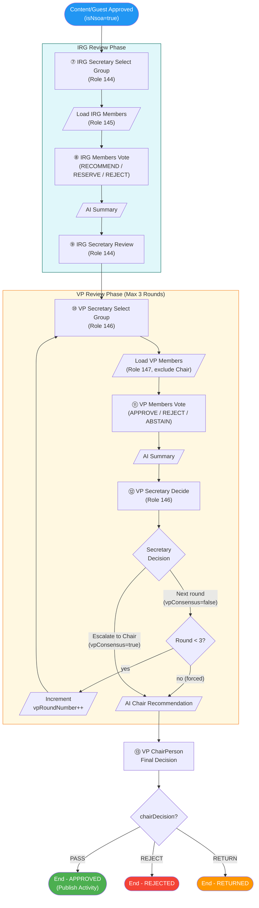

# 活動發布審批流程設計文檔

## Activity Publish Approval Workflow Design

> 本文檔描述 SLAS 系統中活動發布審批的完整流程，包括 NSOA（新生迎新活動）和非 NSOA 兩種場景。

---

## 1. 流程概覽

活動發布審批流程是一個條件分支流程，根據活動類型和特性決定審批路徑：

- **非 NSOA 活動**：經過基礎審批後直接發布
- **NSOA 活動**：需要額外經過 IRG（Initial Review Group）和 VP（Vetting Panel）評審

---

## 2. 條件變量

| 變量 | 類型 | 說明 | 來源 |
|:-----|:-----|:-----|:-----|
| `isNsoa` | Boolean | 是否為 NSOA（新生迎新活動） | 活動數據 |
| `hasCampusCommonAreas` | Boolean | 是否使用校園公共區域 | 活動數據 |
| `assignChecker` | Boolean | 是否分配 Checker | Coordinator 決定 |
| `hasSponsorship` | Boolean | 是否有贊助 | 活動數據 |
| `hasExternalGuest` | Boolean | 是否有外部嘉賓 | 活動數據（外部嘉賓人數 > 0） |

---

## 3. 審批角色

### 3.1 角色定義

| 角色 ID | 角色名稱 | 職責 |
|:--------|:---------|:-----|
| 140 | Activity Coordinator | 初審、分配 Checker |
| 141 | Estate Office | 審批校園公共區域使用 |
| - | Checker | 詳細審查（由 Coordinator 指定） |
| - | Supervisors | 監督審核（流程啟動時從 `activity_supervisor` 表加載，多人並行） |
| **148** | **Head** | 贊助審批（與 Dean 任一審批即可） |
| **149** | **Dean** | 贊助審批 / 內容嘉賓審批 |
| **150** | **Delegate** | 內容和嘉賓審批（與 Dean 任一審批即可） |
| 144 | IRG Secretary | IRG 流程管理 |
| 145 | IRG Member | IRG 投票成員 |
| 146 | VP Secretary | VP 流程管理 |
| 147 | VP Member | VP 投票成員 |
| - | VP ChairPerson | VP 主席（最終決定） |

### 3.2 多角色審批規則（方案 B）

| 審批任務 | 可審批角色 | 規則 |
|:---------|:-----------|:-----|
| ⑤ 贊助審批 | Head **或** Dean | 任一角色的用戶都可認領並審批 |
| ⑥ 內容/嘉賓審批 | Delegate **或** Dean | 任一角色的用戶都可認領並審批 |

> **注意**：這意味著 Dean 角色的用戶同時有權審批贊助和內容/嘉賓兩個任務。

---

## 4. 完整流程圖

### 4.1 整體流程（Mermaid）

```mermaid
flowchart TD
    Start(["Start: Activity Publish Submitted<br/>(ActivityServiceImpl.startApprovalWorkflow)"])
    Start --> Coordinator

    subgraph Phase1["Phase 1: Initial Review"]
        Coordinator["① Coordinator Review<br/>(Role 140)<br/>Assign Checker"]
        Coordinator --> CoordGate{Coordinator<br/>Decision}
        CoordGate -->|"approved=true"| EoCheck
        CoordGate -->|"approved=false<br/>(rejectTask)"| EndRejected

        EoCheck{isNsoa=false AND<br/>hasCampusCommonAreas=true?}
        EoCheck -->|"true"| EO
        EoCheck -->|"false"| CheckerCheck

        EO["② EO Approval<br/>(Role 141)<br/>Campus Common Areas"]
        EO --> EoGate{EO<br/>Decision}
        EoGate -->|"approved=true"| CheckerCheck
        EoGate -->|"approved=false"| EndRejected

        CheckerCheck{assignChecker?}
        CheckerCheck -->|"true"| Checker
        CheckerCheck -->|"false"| Supervisors

        Checker["③ Checker Review<br/>(Assigned by Coordinator)<br/>checkerUserId"]
        Checker --> CheckerGate{Checker<br/>Decision}
        CheckerGate -->|"approved=true"| Supervisors
        CheckerGate -->|"approved=false"| EndRejected
    end

    subgraph Phase2["Phase 2: Supervisor Review"]
        Supervisors["④ Supervisors Review<br/>(Parallel Multi-Instance)<br/>Collection: supervisorUserIds<br/>(loaded at process start)"]
        Supervisors --> SuperGate{supervisorsAllApproved?}
        SuperGate -->|"true"| SponsorCheck
        SuperGate -->|"false<br/>(any rejection flips flag)"| EndRejected
    end

    subgraph Phase3["Phase 3: Senior Approval"]
        SponsorCheck{hasSponsorship?}
        SponsorCheck -->|"true"| Sponsor
        SponsorCheck -->|"false"| ContentGuest

        Sponsor["⑤ Sponsorship Approval<br/>(Role 148 Head / 149 Dean)<br/>candidateGroups: 148,149"]
        Sponsor --> SponsorGate{Sponsorship<br/>Decision}
        SponsorGate -->|"approved=true"| ContentGuest
        SponsorGate -->|"approved=false"| EndRejected

        ContentGuest["⑥ Content & Guest Approval<br/>(Role 150 Delegate / 149 Dean)<br/>candidateGroups: 149,150"]
        ContentGuest --> ContentGate{Content/Guest<br/>Decision}
        ContentGate -->|"approved=true"| NsoaCheck
        ContentGate -->|"approved=false"| EndRejected

        NsoaCheck{isNsoa?}
        NsoaCheck -->|"false"| PublishTask
        NsoaCheck -->|"true"| IRGSelect
    end

    subgraph Phase4["Phase 4: IRG Review (NSOA Only)"]
        IRGSelect["⑦ IRG Secretary Select Group<br/>(Role 144)"]
        IRGSelect --> LoadIRG
        LoadIRG[/"Load IRG Members<br/>(activityIrgLoadMembersDelegate)<br/>By Role 145 → irgMemberUserIds"/]
        LoadIRG --> IRGVote

        IRGVote["⑧ IRG Members Vote<br/>(Parallel Multi-Instance)<br/>RECOMMEND / RESERVE / REJECT"]
        IRGVote --> IRGAiSummary
        IRGAiSummary[/"AI Generate IRG Summary<br/>(activityIrgAiSummaryDelegate)<br/>→ irgAiSummary"/]
        IRGAiSummary --> IRGReview

        IRGReview["⑨ IRG Secretary<br/>Review AI Summary<br/>(Role 144)"]
        IRGReview --> VPSelect
    end

    subgraph Phase5["Phase 5: VP Review (NSOA Only, Max 3 Rounds)"]
        VPSelect["⑩ VP Secretary Select Group<br/>(Role 146)<br/>Set vpTimeoutDays"]
        VPSelect --> LoadVP
        LoadVP[/"Load VP Members<br/>(activityVpLoadMembersDelegate)<br/>By Role 147, exclude ChairPerson<br/>→ vpMemberUserIds, vpChairPersonUserId"/]
        LoadVP --> VPVote

        VPVote["⑪ VP Members Vote<br/>(Parallel Multi-Instance)<br/>APPROVE / REJECT / ABSTAIN"]
        VPVote -->|"All completed"| VPAiSummary
        VPVote -.->|"Timeout at vpVoteDeadline<br/>(activityVpTimeoutDelegate)<br/>Auto-APPROVE for non-voters"| VPAiSummary

        VPAiSummary[/"AI Generate VP Summary<br/>(activityVpAiSummaryDelegate)<br/>→ vpAiSummary"/]
        VPAiSummary --> VPConsensus

        VPConsensus["⑫ VP Secretary<br/>Review & Decide<br/>(Role 146)"]
        VPConsensus --> ConsensusGate{Secretary<br/>Decision}
        ConsensusGate -->|"Start next round<br/>(vpConsensus=false)"| RoundCheck{vpRoundNumber < 3?}
        RoundCheck -->|"true"| IncrementRound
        IncrementRound[/"Increment Round<br/>(activityVpIncrementRoundDelegate)<br/>vpRoundNumber++"/]
        IncrementRound --> VPSelect
        RoundCheck -->|"false (forced)"| ChairAI
        ConsensusGate -->|"Escalate to Chair<br/>(vpConsensus=true)"| ChairAI
    end

    subgraph Phase6["Phase 6: ChairPerson Decision (NSOA Only)"]
        ChairAI[/"AI Generate Chair Recommendation<br/>(activityChairAiRecommendDelegate)<br/>→ chairAiRecommendation"/]
        ChairAI --> Chair

        Chair["⑬ VP ChairPerson<br/>Final Decision<br/>(vpChairPersonUserId)"]
        Chair --> ChairGate{chairDecision?}
        ChairGate -->|"PASS"| PublishTask
        ChairGate -->|"REJECT"| EndRejected
        ChairGate -->|"RETURN"| EndReturned
    end

    PublishTask[/"Publish Activity<br/>(activityPublishDelegate)"/]
    PublishTask --> EndApproved

    EndApproved(["End - APPROVED<br/>(Activity published)"])
    EndRejected(["End - REJECTED"])
    EndReturned(["End - RETURNED<br/>(Applicant can revise & resubmit)"])

    style Start fill:#4CAF50,color:#fff
    style EndApproved fill:#4CAF50,color:#fff
    style EndRejected fill:#f44336,color:#fff
    style EndReturned fill:#FF9800,color:#fff
    style Phase1 fill:#E3F2FD,stroke:#1565C0
    style Phase2 fill:#FFF3E0,stroke:#E65100
    style Phase3 fill:#F3E5F5,stroke:#6A1B9A
    style Phase4 fill:#E0F7FA,stroke:#00695C
    style Phase5 fill:#FFF8E1,stroke:#F57F17
    style Phase6 fill:#FCE4EC,stroke:#AD1457
```



### 4.2 非 NSOA 簡化流程

```mermaid
flowchart LR
    Start(["Start"]) --> A

    A["① Coordinator<br/>(Role 140)"]
    A --> B{EO needed?}
    B -->|"isNsoa=false AND<br/>hasCampusCommonAreas=true"| C["② EO<br/>(Role 141)"]
    B -->|"skip"| D
    C --> D{Checker?}
    D -->|"assignChecker=true"| E["③ Checker"]
    D -->|"skip"| F
    E --> F["④ Supervisors<br/>(Parallel)"]
    F --> G{Sponsorship?}
    G -->|"hasSponsorship=true"| H["⑤ Sponsorship<br/>(Role 148/149)"]
    G -->|"skip"| I
    H --> I["⑥ Content/Guest<br/>(Role 149/150)"]
    I --> Pub
    Pub[/"Publish<br/>(activityPublishDelegate)"/]
    Pub --> End(["End - APPROVED"])

    style Start fill:#4CAF50,color:#fff
    style End fill:#4CAF50,color:#fff
```



### 4.3 NSOA 專屬流程



---

## 5. 流程場景示例

### 場景 1：非 NSOA + 最簡路徑
**條件**：`isNsoa=false`, `hasCampusCommonAreas=false`, `assignChecker=false`, `hasSponsorship=false`

```
① Coordinator → ④ Supervisors → ⑥ Content/Guest → 發布 ✅
```

### 場景 2：非 NSOA + 完整路徑
**條件**：`isNsoa=false`, `hasCampusCommonAreas=true`, `assignChecker=true`, `hasSponsorship=true`

```
① Coordinator → ② EO → ③ Checker → ④ Supervisors → ⑤ Sponsorship → ⑥ Content/Guest → 發布 ✅
```

### 場景 3：NSOA + 最簡路徑
**條件**：`isNsoa=true`, `hasCampusCommonAreas=false`, `assignChecker=false`, `hasSponsorship=false`

```
① Coordinator → ④ Supervisors → ⑥ Content/Guest
→ ⑦ IRG 選組 → ⑧ IRG 投票 → ⑨ IRG 審核
→ ⑩ VP 選組 → ⑪ VP 投票 → ⑫ VP 共識 → ⑬ 主席決定 → 發布 ✅
```

### 場景 4：NSOA + 完整路徑 + VP 多輪投票
**條件**：所有條件都觸發，VP 投票未達共識

```
① Coordinator → ② EO → ③ Checker → ④ Supervisors → ⑤ Sponsorship → ⑥ Content/Guest
→ ⑦ IRG 選組 → ⑧ IRG 投票 → ⑨ IRG 審核
→ ⑩ VP 選組 → ⑪ VP 投票 → ⑫ VP 共識(否)
→ ⑩ VP 選組(第2輪) → ⑪ VP 投票 → ⑫ VP 共識(否)
→ ⑩ VP 選組(第3輪) → ⑪ VP 投票 → ⑫ VP 共識(否)
→ ⑬ 主席決定（強制進入）→ 發布/拒絕/退回
```

---

## 6. 任務節點詳細說明

### 6.1 Coordinator 審核（coordinatorReviewTask）
- **角色**：Activity Coordinator（角色 140）
- **職責**：
  1. 審核活動基本信息
  2. 決定是否需要 Checker（設置 `assignChecker`）
  3. 分配 Checker（設置 `checkerUserId`）
- **輸出變量**：`approved`, `assignChecker`, `checkerUserId`

> **注意**：`supervisorUserIds` 在流程啟動時從 `activity_supervisor` 表自動加載，不由 Coordinator 在審核時分配。

### 6.2 EO 審批（eoApprovalTask）
- **角色**：Estate Office
- **觸發條件**：`isNsoa == false && hasCampusCommonAreas == true`
- **職責**：審批校園公共區域使用
- **輸出變量**：`approved`

### 6.3 Checker 審核（checkerReviewTask）
- **角色**：Checker（由 Coordinator 指定的用戶）
- **觸發條件**：`assignChecker == true`
- **職責**：詳細審查活動內容
- **輸出變量**：`approved`

### 6.4 Supervisors 審核（supervisorsReviewTask）
- **角色**：Supervisors（多人並行，流程啟動時從 `activity_supervisor` 表加載）
- **特性**：並行多實例任務（BPMN `multiInstanceLoopCharacteristics`，遍歷 `supervisorUserIds`）
- **職責**：監督審核活動
- **輸出變量**：`supervisorsAllApproved`（需要所有人都通過）
- **聚合邏輯**：`supervisorsAllApproved` 初始值為 `true`，任何一位 Supervisor 拒絕時立即在代碼中設為 `false`（見 `ActivityApprovalServiceImpl.supervisorVote()`）。並發投票場景下，`BpmTaskServiceImpl.approveTask()` 會從 Runtime 重新讀取最新值，防止過期快照覆蓋拒絕結果。

### 6.5 贊助審批（sponsorshipApprovalTask）
- **角色**：Sponsorship Approver（Head/Dean）
- **觸發條件**：`hasSponsorship == true`
- **職責**：審批贊助相關內容
- **輸出變量**：`approved`

### 6.6 內容和嘉賓審批（contentGuestApprovalTask）
- **角色**：Content/Guest Approver（Delegate 150 / Dean 149）
- **職責**：
  1. 審核活動內容描述
  2. 審核外部嘉賓信息
- **輸出變量**：`approved`

### 6.7 IRG Secretary 選組（irgSecretarySelectGroupTask）
- **角色**：IRG Secretary（角色 144）
- **觸發條件**：`isNsoa == true`
- **職責**：選擇 IRG 評審組（記錄 `selectedIrgGroupId`）
- **輸出變量**：`selectedIrgGroupId`

> **注意**：選組僅用於記錄元數據。後續加載 IRG 成員時按角色 145 查詢所有用戶，不依賴所選組篩選成員。

### 6.8 加載 IRG 成員（loadIrgMembersTask - ServiceTask）
- **委託**：`activityIrgLoadMembersDelegate`
- **邏輯**：通過 `PermissionService.getUserRoleIdListByRoleId(145)` 加載所有 IRG Member 角色用戶
- **輸出變量**：`irgMemberUserIds`（List）, `irgMemberCount`（int）

### 6.9 IRG 成員投票（irgMembersVoteTask）
- **角色**：IRG Members（並行多實例，遍歷 `irgMemberUserIds`）
- **投票選項**：`RECOMMEND` / `RESERVE` / `REJECT`
- **職責**：對活動進行 IRG 投票
- **記錄表**：`activity_irg_vote`

### 6.10 AI 生成 IRG 摘要（irgAiSummaryTask - ServiceTask）
- **委託**：`activityIrgAiSummaryDelegate`
- **輸出變量**：`irgAiSummary`（String）

### 6.11 IRG Secretary 審核摘要（irgSecretaryReviewSummaryTask）
- **角色**：IRG Secretary（角色 144）
- **職責**：審核 AI 生成的 IRG 投票摘要

### 6.12 VP Secretary 選組（vpSecretarySelectGroupTask）
- **角色**：VP Secretary（角色 146）
- **職責**：選擇 VP 評審組並設置投票超時時間
- **輸出變量**：`selectedVpGroupId`, `vpTimeoutDays`（默認 7 天）
- **輪次初始化**：首次進入時設置 `vpRoundNumber = 1`，後續輪次由 `activityVpIncrementRoundDelegate` 遞增

### 6.13 加載 VP 成員（loadVpMembersTask - ServiceTask）
- **委託**：`activityVpLoadMembersDelegate`
- **邏輯**：
  1. 通過 `PermissionService.getUserRoleIdListByRoleId(147)` 加載所有 VP Member 角色用戶
  2. 通過 `ActivityApprovalGroupApi.getVpGroupChairPersonUserId(selectedVpGroupId)` 獲取主席
  3. 將主席從投票成員中排除（主席有獨立的決定步驟）
  4. 計算投票截止時間 `vpVoteDeadline = now + vpTimeoutDays`
- **輸出變量**：`vpMemberUserIds`, `vpMemberCount`, `vpChairPersonUserId`, `vpVoteDeadline`

### 6.14 VP 成員投票（vpMembersVoteTask）
- **角色**：VP Members（並行多實例，遍歷 `vpMemberUserIds`）
- **投票選項**：`APPROVE` / `REJECT` / `ABSTAIN`
- **超時機制**：`vpVoteDeadline` 到期後觸發 `activityVpTimeoutDelegate`，為未投票成員自動記錄 `APPROVE`
- **記錄表**：`activity_vp_vote`（含 `roundNumber` 和 `isTimeoutDefault` 欄位）

### 6.15 VP Secretary 檢查共識（vpSecretaryCheckConsensusTask）
- **角色**：VP Secretary（角色 146）
- **職責**：審核投票結果並**手動決定**是否進入下一輪或提交主席
- **共識判定邏輯**（供 Secretary 參考）：排除棄權票後，所有有效票一致為 APPROVE 或 REJECT 即為達成共識
- **Secretary 操作**：
  - 選擇「開始下一輪」→ 設置 `vpConsensus = false` → 流程回到 VP 選組（若未達最大輪次）
  - 選擇「提交主席決定」→ 設置 `vpConsensus = true` → 流程進入 ChairPerson 決定

### 6.16 ChairPerson 決定（chairPersonDecisionTask）
- **角色**：VP ChairPerson（由 `vpChairPersonUserId` 指定）
- **觸發條件**：`vpConsensus == true` 或 `vpRoundNumber >= 3`
- **決定選項**：
  - `PASS`：活動通過，流程進入發布
  - `REJECT`：活動被拒絕
  - `RETURN`：活動退回修改
- **輸出變量**：`chairDecision`
- **同步更新**：ChairPerson 決定後會同步更新 `activity.approvalStatus`，不依賴異步 BPM 事件處理
