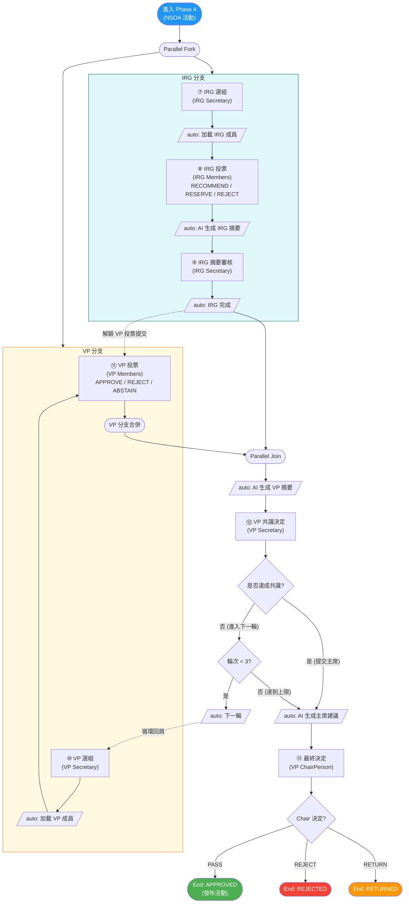

# 活動發布審批流程

> 本文檔描述 SLAS 系統中活動發布審批的完整業務流程，覆蓋 NSOA（新生迎新活動）與非 NSOA 兩種場景。

---

## 1. 流程概覽

### 1.1 業務目標

對學生組織提交的活動申請進行多層審批，確保符合校方規範後正式發布到活動列表。

### 1.2 觸發條件

申請人在系統中提交活動申請後自動啟動。

### 1.3 結束狀態總覽

| 狀態 | 業務含義 | 申請人後續操作 |
|:-----|:--------|:-------------|
| `APPROVED` | 活動通過審批，已發布 | — |
| `REJECTED` | 活動被拒絕（終局） | 不可重新提交 |
| `RETURNED` | 活動退回 | 可修改後重新提交 |

### 1.4 審批路徑差異

- **非 NSOA 活動**：經過基礎審批後直接發布。
- **NSOA 活動**：在基礎審批之後，額外經過 IRG（Initial Review Group）與 VP（Vetting Panel）**並行評審**，再由 VP ChairPerson 作最終決定。

---

## 2. 角色與職責

### 2.1 角色清單

| 角色名稱 | 職責 |
|:---------|:-----|
| Activity Coordinator | 初審；判斷是否需要 Checker；指派 Checker |
| Checker | 對活動內容作詳細審查（由 Coordinator 指定） |
| Supervisor | 監督審核（多人並行）；確認場地是否涉及課後使用 |
| Estate Office | 審批場地課後使用 |
| Sponsorship Approver | 審批贊助相關內容 |
| Guest Approver | 審批外部嘉賓 |
| IRG Secretary | 管理 IRG 評審；選組；審核 IRG 摘要 |
| IRG Member | 對 NSOA 活動進行 IRG 投票 |
| VP Secretary | 管理 VP 評審；選組；判定是否達成共識 |
| VP Member | 對 NSOA 活動進行 VP 投票 |
| VP ChairPerson | 對 NSOA 活動作最終決定 |

### 2.2 多人並行 / 候選組規則

| 任務 | 規則 |
|:----|:----|
| Supervisor 審核 | 所有 Supervisor 並行審核，全部完成後系統按聚合規則得出最終結果（見 §5） |
| 贊助審批 / 嘉賓審批 | 候選組內任一審批人可認領並審批，採「先到先審」 |
| IRG 投票 | 所有 IRG Member 並行投票 |
| VP 投票 | 所有 VP Member 並行投票；VP 投票有截止時間，超時自動視為棄權 |

---

## 3. 圖例

本節定義流程圖統一規範，兩份審批流程文檔共用。

### 3.1 節點形狀

| 形狀 | Mermaid 語法 | 含義 |
|:-----|:-------------|:-----|
| 矩形 | `["Name"]` | **人工任務** — 需要審批人手動操作 |
| 平行四邊形 | `[/"auto: Name"/]` | **系統任務** — 自動執行,無需用戶操作 |
| 菱形 | `{Question?}` | **判斷網關** — 根據條件分流,文字以問號結尾 |
| 圓角 | `(["Name"])` | **流程起點／終點** 或 並行 Fork/Join |

### 3.2 連線類型

| 樣式 | Mermaid 語法 | 含義 |
|:-----|:-------------|:-----|
| 實線箭頭 | `-->` | 正向順序流（happy path） |
| 虛線箭頭 | `-.->` | 計時器觸發（超時／提醒）、退回循環、跨分支依賴 |

### 3.3 節點標籤格式

| 類型 | 格式 | 範例 |
|:-----|:-----|:-----|
| 人工任務 | `<編號> <步驟名><br/>(角色名)` | `① Coordinator 審核<br/>(Activity Coordinator)` |
| 系統任務 | `auto: <行為描述>` | `auto: 聚合投票結果` |
| 判斷網關 | 以問號結尾的問句 | `{是否有贊助?}` |
| 結束點 | `End: <狀態><br/>(<業務含義>)` | `End: APPROVED<br/>(活動已發布)` |

### 3.4 步驟編號

帶圈數字（①、②、…）標註人工任務的順序。系統任務不參與編號。

| 編號 | 步驟 | 角色 | 階段 |
|:----:|:-----|:-----|:----:|
| ① | Coordinator 審核 | Activity Coordinator | Phase 1 |
| ② | Checker 審核 | Designated Checker | Phase 1 |
| ③ | Supervisors 審核 | Supervisors（並行） | Phase 2 |
| ④ | EO 審批 | Estate Office | Phase 3 |
| ⑤ | 贊助審批 | Sponsorship Approver | Phase 3 |
| ⑥ | 嘉賓審批 | Guest Approver | Phase 3 |
| ⑦ | IRG 選組 | IRG Secretary | Phase 4 |
| ⑧ | IRG 投票 | IRG Members（並行） | Phase 4 |
| ⑨ | IRG 摘要審核 | IRG Secretary | Phase 4 |
| ⑩ | VP 選組 | VP Secretary | Phase 4 |
| ⑪ | VP 投票 | VP Members（並行） | Phase 4 |
| ⑫ | VP 共識決定 | VP Secretary | Phase 5 |
| ⑬ | 最終決定 | VP ChairPerson | Phase 6 |

---

## 4. 流程圖

### 4.1 整體流程

```mermaid
flowchart TD
    Start(["Start: 活動已提交"])
    Start --> Coordinator

    subgraph Phase1["Phase 1: 初審"]
        Coordinator["① Coordinator 審核<br/>(Activity Coordinator)"]
        Coordinator --> CoordGate{Coordinator 是否通過?}
        CoordGate -->|"通過"| CheckerCheck
        CoordGate -->|"退回"| EndReturned

        CheckerCheck{需要 Checker?}
        CheckerCheck -->|"是"| Checker
        CheckerCheck -->|"否"| Supervisors

        Checker["② Checker 審核<br/>(Designated Checker)"]
        Checker --> CheckerGate{Checker 是否通過?}
        CheckerGate -->|"通過"| Supervisors
        CheckerGate -->|"拒絕"| EndRejected
    end

    subgraph Phase2["Phase 2: Supervisor 審核"]
        Supervisors["③ Supervisors 審核<br/>(Supervisors, 並行)"]
        Supervisors --> SuperAggregate[/"auto: 聚合 Supervisor 投票"/]
        SuperAggregate --> SuperGate{聚合結果?}
        SuperGate -->|"RECOMMEND"| EoCheck
        SuperGate -->|"RETURN"| EndReturned
        SuperGate -->|"REJECT"| EndRejected
    end

    subgraph Phase3["Phase 3: 高級審批"]
        EoCheck{場地是否課後使用?}
        EoCheck -->|"是"| EO
        EoCheck -->|"否"| SponsorCheck

        EO["④ EO 審批<br/>(Estate Office)"]
        EO --> EoGate{EO 是否通過?}
        EoGate -->|"通過"| SponsorCheck
        EoGate -.->|"退回 (循環)"| Supervisors

        SponsorCheck{是否有贊助?}
        SponsorCheck -->|"是"| Sponsor
        SponsorCheck -->|"否"| GuestCheck

        Sponsor["⑤ 贊助審批<br/>(Sponsorship Approver)"]
        Sponsor --> SponsorGate{是否通過?}
        SponsorGate -->|"通過"| GuestCheck
        SponsorGate -->|"拒絕"| EndRejected

        GuestCheck{是否有外部嘉賓?}
        GuestCheck -->|"是"| Guest
        GuestCheck -->|"否"| NsoaCheck

        Guest["⑥ 嘉賓審批<br/>(Guest Approver)"]
        Guest --> GuestGate{是否通過?}
        GuestGate -->|"通過"| NsoaCheck
        GuestGate -->|"拒絕"| EndRejected
    end

    subgraph Phase4["Phase 4: NSOA 並行評審 (僅 NSOA)"]
        NsoaCheck{是否為 NSOA?}
        NsoaCheck -->|"否"| PublishTask
        NsoaCheck -->|"是"| ParallelFork

        ParallelFork(["Parallel Fork"])
        ParallelFork --> IRGSelect
        ParallelFork --> VPSelect

        IRGSelect["⑦ IRG 選組<br/>(IRG Secretary)"]
        IRGSelect --> LoadIRG[/"auto: 加載 IRG 成員"/]
        LoadIRG --> IRGVote["⑧ IRG 投票<br/>(IRG Members)"]
        IRGVote --> IRGAiSummary[/"auto: AI 生成 IRG 摘要"/]
        IRGAiSummary --> IRGReview["⑨ IRG 摘要審核<br/>(IRG Secretary)"]
        IRGReview --> IRGCompletion[/"auto: IRG 完成"/]
        IRGCompletion --> ParallelJoin
        IRGCompletion -.->|"解鎖 VP 投票提交"| VPVote

        VPSelect["⑩ VP 選組<br/>(VP Secretary)"]
        VPSelect --> LoadVP[/"auto: 加載 VP 成員"/]
        LoadVP --> VPVote["⑪ VP 投票<br/>(VP Members)"]
        VPVote -->|"全部投票完成"| VPMerge
        VPVote -.->|"超時 (自動 ABSTAIN)"| VPTimeout[/"auto: VP 超時處理"/]
        VPTimeout --> VPMerge
        VPMerge(["VP 分支合併"]) --> ParallelJoin

        ParallelJoin(["Parallel Join"])
    end

    subgraph Phase5["Phase 5: VP 共識 (僅 NSOA, 最多 3 輪)"]
        ParallelJoin --> VPAiSummary[/"auto: AI 生成 VP 摘要"/]
        VPAiSummary --> VPConsensus

        VPConsensus["⑫ VP 共識決定<br/>(VP Secretary)"]
        VPConsensus --> ConsensusGate{是否達成共識?}
        ConsensusGate -->|"是 (提交主席)"| ChairAI
        ConsensusGate -->|"否 (進入下一輪)"| RoundCheck

        RoundCheck{輪次 < 3?}
        RoundCheck -->|"是"| IncrementRound[/"auto: 下一輪"/]
        IncrementRound -.->|"循環回跳"| VPSelect
        RoundCheck -->|"否 (達到上限)"| ChairAI
    end

    subgraph Phase6["Phase 6: ChairPerson 決定 (僅 NSOA)"]
        ChairAI[/"auto: AI 生成主席建議"/]
        ChairAI --> Chair["⑬ 最終決定<br/>(VP ChairPerson)"]
        Chair --> ChairGate{Chair 決定?}
        ChairGate -->|"PASS"| PublishTask
        ChairGate -->|"REJECT"| EndRejected
        ChairGate -->|"RETURN"| EndReturned
    end

    PublishTask[/"auto: 發布活動"/]
    PublishTask --> EndApproved

    EndApproved(["End: APPROVED<br/>(活動已發布)"])
    EndRejected(["End: REJECTED"])
    EndReturned(["End: RETURNED<br/>(申請人可修改)"])

    style Start fill:#4CAF50,color:#fff
    style EndApproved fill:#4CAF50,color:#fff
    style EndRejected fill:#f44336,color:#fff
    style EndReturned fill:#FF9800,color:#fff
    style Phase1 fill:#E3F2FD,stroke:#1565C0
    style Phase2 fill:#FFF3E0,stroke:#E65100
    style Phase3 fill:#F3E5F5,stroke:#6A1B9A
    style Phase4 fill:#E0F7FA,stroke:#00695C
    style Phase5 fill:#FFF8E1,stroke:#F57F17
    style Phase6 fill:#FCE4EC,stroke:#AD1457
```



> 圖中虛線 `-.->` 表示三類非主路徑：① ④ EO 退回時回跳到 ③ Supervisors 重審；② ⑪ VP 投票超時自動 ABSTAIN；③ IRG 完成後解鎖 VP 投票提交。

### 4.2 非 NSOA 簡化路徑

僅展示非 NSOA 活動的「快樂路徑」（所有審批均通過），用於快速理解主幹流程。完整退回／拒絕分支見 [§4.1](#41-整體流程)。

```mermaid
flowchart LR
    Start(["Start"]) --> A["① Coordinator 審核<br/>(Coordinator)"]
    A --> D{需要 Checker?}
    D -->|"是"| E["② Checker 審核<br/>(Designated Checker)"]
    D -->|"否"| F
    E --> F["③ Supervisors 審核<br/>(Supervisors, 並行)"]
    F --> FA[/"auto: 聚合投票"/]
    FA --> B{場地是否課後使用?}
    B -->|"是"| C["④ EO 審批<br/>(Estate Office)"]
    B -->|"否"| G
    C --> G{是否有贊助?}
    G -->|"是"| H["⑤ 贊助審批<br/>(Sponsorship Approver)"]
    G -->|"否"| I
    H --> I{是否有外部嘉賓?}
    I -->|"是"| J["⑥ 嘉賓審批<br/>(Guest Approver)"]
    I -->|"否"| Pub
    J --> Pub
    Pub[/"auto: 發布活動"/]
    Pub --> End(["End: APPROVED"])

    style Start fill:#4CAF50,color:#fff
    style End fill:#4CAF50,color:#fff
```



### 4.3 NSOA 專屬流程（Phase 4–6）

僅展示 NSOA 活動進入並行評審後的細節。前置 Phase 1–3 與非 NSOA 一致，見 [§4.1](#41-整體流程)。



#### 4.3.1 VP 多輪循環

當 ⑫ VP Secretary 判定**未達成共識**時：

1. 流程從 ⑫ 之後的網關回跳到 ⑩ VP 選組，僅 VP 分支重新執行（IRG 分支首輪結束時已完成,不會再次觸發）。
2. 第二、第三輪 VP 分支完成後到達 Parallel Join 時，IRG 分支保持已完成狀態,因此 Join 立即通過。
3. 最多執行 3 輪。第 3 輪結束時無論共識與否都強制進入 ⑬ ChairPerson 決定。

#### 4.3.2 跨分支依賴：VP 投票提交鎖

⑪ VP 投票在流程上與 IRG 分支獨立並行,但在業務上：

- IRG 分支完成（即 ⑨ IRG 摘要審核結束）**之前**,VP Members 可以查看任務、暫存草稿,但不能正式提交投票。
- IRG 完成後,VP Members 才能提交投票。

業務上不希望 VP 在缺少 IRG 摘要參考時投票，因此設立此鎖。圖中以虛線 `IRG 完成 -.-> VP 投票` 表達此依賴。

---

## 5. 步驟詳述

按 ①–⑬ 順序列出所有人工任務。

### ① Coordinator 審核

- **執行人**：Activity Coordinator
- **動作**：審核活動基本信息；判斷是否需要 Checker；如需要則指派一位 Checker
- **結果**：
  - 通過 → 進入 ② Checker 審核（如已指派）或 ③ Supervisors 審核
  - 退回 → 流程結束（`RETURNED`）

### ② Checker 審核

- **執行人**：Designated Checker（由 Coordinator 指定）
- **觸發條件**：① 中決定需要 Checker
- **動作**：對活動內容作詳細審查
- **結果**：
  - 通過 → 進入 ③ Supervisors 審核
  - 拒絕 → 流程結束（`REJECTED`）

### ③ Supervisors 審核（並行）

- **執行人**：所有 Supervisor 並行
- **動作**：每位 Supervisor 給出個人決定（`RECOMMEND` / `REJECT` / `RETURN`）；同時確認場地是否涉及課後使用
- **聚合規則**（系統自動執行）：
  1. 任何一位投 `RETURN` → 聚合 = `RETURN`（最高優先級）
  2. 全部投 `RECOMMEND` → 聚合 = `RECOMMEND`
  3. 有 `REJECT` 但無 `RETURN` → 聚合 = `REJECT`
  4. `RECOMMEND` 與 `REJECT` 混合 → 聚合 = `REJECT`
- **結果**：
  - `RECOMMEND` → 進入 Phase 3
  - `RETURN` → 流程結束（`RETURNED`）
  - `REJECT` → 流程結束（`REJECTED`）

### ④ EO 審批

- **執行人**：Estate Office
- **觸發條件**：Supervisor 在 ③ 確認場地涉及課後使用
- **動作**：審批場地課後使用
- **結果**：
  - 通過 → 進入 ⑤ 贊助檢查
  - 退回 → **回跳到 ③ Supervisors 重新審核**（循環，非拒絕）

> EO 不能直接拒絕活動,僅能批准或退回 Supervisors 重新評估。

### ⑤ 贊助審批

- **執行人**：Sponsorship Approver（候選組,先到先審）
- **觸發條件**：活動聲明有贊助
- **動作**：審批贊助相關內容
- **結果**：
  - 通過 → 進入 ⑥ 嘉賓檢查
  - 拒絕 → 流程結束（`REJECTED`）

### ⑥ 嘉賓審批

- **執行人**：Guest Approver（候選組,先到先審）
- **觸發條件**：活動聲明有外部嘉賓
- **動作**：審核外部嘉賓信息
- **結果**：
  - 通過 → 進入 NSOA 判斷（NSOA 走 ⑦, 非 NSOA 直接發布）
  - 拒絕 → 流程結束（`REJECTED`）

### ⑦ IRG 選組

- **執行人**：IRG Secretary
- **觸發條件**：NSOA 活動進入並行評審
- **動作**：選擇本次的 IRG 評審組
- **結果**：系統自動加載該組成員,進入 ⑧

### ⑧ IRG 投票（並行）

- **執行人**：所有 IRG Member 並行
- **動作**：每位投 `RECOMMEND` / `RESERVE` / `REJECT`
- **結果**：全部完成後進入「auto: AI 生成 IRG 摘要」, 再進入 ⑨

### ⑨ IRG 摘要審核

- **執行人**：IRG Secretary
- **動作**：審核系統 AI 自動生成的 IRG 投票摘要
- **結果**：完成後 IRG 分支結束;觸發兩件事：
  1. 解鎖 VP 投票的提交（見 §4.3.2）
  2. 進入並行 Join

### ⑩ VP 選組

- **執行人**：VP Secretary
- **觸發條件**：NSOA 活動進入並行評審；或 ⑫ 判定未達共識時回跳重新選組
- **動作**：選擇本次的 VP 評審組;設定 VP 投票截止時間
- **結果**：系統自動加載成員、計算截止時間、識別並排除 ChairPerson,進入 ⑪

### ⑪ VP 投票（並行,有截止時間）

- **執行人**：所有 VP Member 並行（不含 ChairPerson）
- **動作**：每位投 `APPROVE` / `REJECT` / `ABSTAIN`
- **業務約束**：在 ⑨ IRG 摘要審核完成之前無法提交投票（見 §4.3.2）
- **超時處理**：投票截止時間到達時,系統自動為未投票成員記為 `ABSTAIN`,並推進流程
- **結果**：全部投票完成（或超時觸發後）→ 進入並行 Join

### ⑫ VP 共識決定

- **執行人**：VP Secretary
- **動作**：審核 VP 投票結果, 手動判定本輪是否達成共識（共識判定參考：排除棄權票後, 所有有效票一致為 `APPROVE` 或 `REJECT`）
- **結果**：
  - 已達成共識 → 進入 ⑬ ChairPerson 決定
  - 未達成共識且輪次 < 3 → 回到 ⑩ 重新選組投票
  - 未達成共識且已是第 3 輪 → 強制進入 ⑬ ChairPerson 決定

### ⑬ 最終決定

- **執行人**：VP ChairPerson
- **觸發條件**：⑫ 達成共識,或已完成 3 輪投票
- **前置**：系統自動生成「主席建議」供 ChairPerson 參考
- **結果**：
  - `PASS` → 系統自動發布活動,流程結束（`APPROVED`）
  - `REJECT` → 流程結束（`REJECTED`）
  - `RETURN` → 流程結束（`RETURNED`）

---

## 6. 結果對照表

| 決策點 | 決定 | 最終狀態 | 申請人後續可進行 |
|:-------|:-----|:--------|:----------------|
| ① Coordinator | 退回 | `RETURNED` | 修改後重新提交 |
| ② Checker | 拒絕 | `REJECTED` | — |
| ③ Supervisor 聚合 | `RETURN` | `RETURNED` | 修改後重新提交 |
| ③ Supervisor 聚合 | `REJECT` | `REJECTED` | — |
| ④ EO | 退回 | （不結束）回到 ③ Supervisors 重新審核 | — |
| ⑤ Sponsorship | 拒絕 | `REJECTED` | — |
| ⑥ Guest | 拒絕 | `REJECTED` | — |
| ⑬ ChairPerson | `PASS` | `APPROVED` | — |
| ⑬ ChairPerson | `REJECT` | `REJECTED` | — |
| ⑬ ChairPerson | `RETURN` | `RETURNED` | 修改後重新提交 |

---

## 7. 場景示例

### 場景 1：非 NSOA 最簡路徑

**條件**：非 NSOA, 無 Checker, 場地不涉及課後使用, 無贊助, 無外部嘉賓

```
① Coordinator → ③ Supervisors → 聚合(RECOMMEND) → 發布 ✅
```

### 場景 2：非 NSOA 完整路徑

**條件**：非 NSOA, 需 Checker, 場地涉及課後使用, 有贊助, 有外部嘉賓

```
① Coordinator → ② Checker → ③ Supervisors → 聚合 → ④ EO → ⑤ 贊助 → ⑥ 嘉賓 → 發布 ✅
```

### 場景 3：非 NSOA + EO 退回

**條件**：場地涉及課後使用, EO 不批准

```
① Coordinator → ③ Supervisors → 聚合 → ④ EO(退回) → ③ Supervisors(重新審核) → ...
```

### 場景 4：NSOA 最簡路徑

**條件**：NSOA, 無 Checker, 場地不涉及課後使用, 無贊助, 無外部嘉賓

```
① Coordinator → ③ Supervisors → 聚合
→ 並行: { ⑦ IRG 選組 → ⑧ IRG 投票 → ⑨ IRG 審核 → IRG 完成 }
         { ⑩ VP 選組 → ⑪ VP 投票 }
→ 並行 Join → VP AI 摘要 → ⑫ VP 共識 → ⑬ 主席決定 → 發布 ✅
```

### 場景 5：NSOA 完整路徑 + VP 多輪投票

**條件**：所有條件均觸發, VP 共識未達成

```
① Coordinator → ② Checker → ③ Supervisors → 聚合 → ④ EO → ⑤ 贊助 → ⑥ 嘉賓
→ 並行: { IRG 流程 } + { VP 投票 } → 並行 Join
→ VP AI 摘要 → ⑫ VP 共識(否)
→ ⑩ VP 選組(第 2 輪) → ⑪ VP 投票 → VP AI 摘要 → ⑫ VP 共識(否)
→ ⑩ VP 選組(第 3 輪) → ⑪ VP 投票 → VP AI 摘要 → ⑫ VP 共識(否)
→ ⑬ 主席決定（強制進入）→ 發布／拒絕／退回
```
