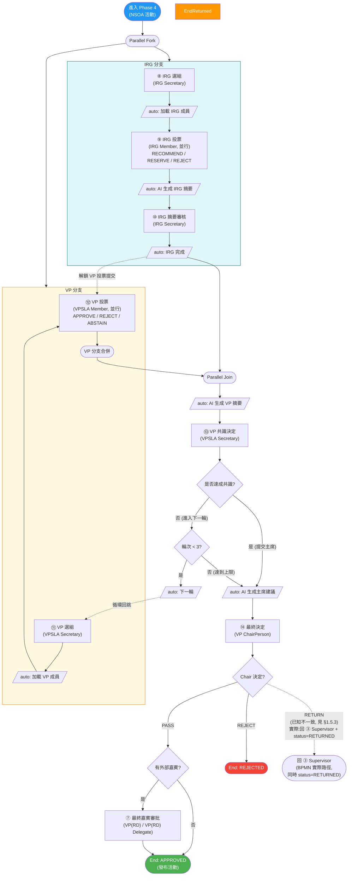

# 活動發布審批流程

> 本文檔描述 SLAS 系統中活動發布審批的完整業務流程，覆蓋 NSOA（新生迎新活動）與非 NSOA 兩種場景。
> 除流程節點名稱外，文中凡涉及角色稱呼，均以 `SYSTEM_ROLE.NAME` 為主。

---

## 1. 流程概覽

### 1.1 業務目標

對學生組織提交的活動申請進行多層審批，確保符合校方規範後正式發布到活動列表。

### 1.2 觸發條件

申請人在系統中提交活動申請後自動啟動。

### 1.3 結束狀態總覽

| 狀態 | 業務含義 | 申請人後續操作 |
|:-----|:--------|:-------------|
| `APPROVED` | 活動通過審批，已發布 | — |
| `REJECTED` | 活動被拒絕（終局） | 不可重新提交 |
| `RETURNED` | 活動退回 | 可修改後重新提交 |

### 1.4 審批路徑差異

- **有外部嘉賓的活動**：在 EO 之後，先進入 `Dean / Delegate` 的 **Guest Endorsement**。
- **有贊助的活動**：在 Guest Endorsement 之後，再進入 `Dean / Delegate` 的 **Sponsorship Approval**。
- **任何活動（必經）**：在 Guest Endorsement / Sponsorship Approval 之後（即便都跳過），都會進入 `Dean / Delegate` 的 **Activity Content Approval**（活動內容 / 預算審批）。Dean 在此節對活動整體做 `Approve / Return / Reject` 決定。
- **非 NSOA 活動**：Activity Content 通過後，如活動有外部嘉賓，會再進入 `VP(RD) / VP(RD) Delegate` 的 **Final Guest Approval**，然後發布。
- **NSOA 活動**：Activity Content 通過後，先進入 IRG（Initial Review Group）與 VP（Vetting Panel）**並行評審**；若 `Chair PASS`，且活動有外部嘉賓，之後仍會再進入 `VP(RD) / VP(RD) Delegate` 的 **Final Guest Approval**。

> **重要說明**：依據當前 BPMN，只要 `hasExternalGuest == true`，活動最終都可能進入 `VP(RD) / VP(RD) Delegate` 的 `guestApprovalTask`。
> - `非 NSOA`：在一般高級審批後進入
> - `NSOA`：在 `IRG / VP` 完成且 `Chair PASS` 後進入
>
> **編輯鎖說明**：最新 `SLAS_UI` 在活動編輯頁（`mode=edit`）進入時，會先呼叫 `/activity/acquire-editing` 取得 30 分鐘短鎖；若拿鎖失敗，前端目前會顯示錯誤訊息並跳回 `ActivityListForStudent`，而不是在原頁面顯示一個「已鎖定、只讀」狀態。成功更新後後端會自動釋放鎖；若使用者直接關閉頁面，則主要依賴鎖超時失效。
>
> **名稱口徑說明**：本文按最新 `SYSTEM_ROLE.NAME` 使用 `VP(RD)` / `VP(RD) Delegate`；但當前 BPMN 註釋、前端任務標題與部分變量名仍常寫作 `VPRD / VPRD Delegate`，兩者在本文中視為同一組角色。

### 1.5 全局退回 / 拒絕行為說明

> 本節為**全文後續所有"拒絕 / 退回"描述**提供統一語義基礎。讀後續 §4 流程圖、§5 步驟詳述與 §6 結果表時請以本節為準。

#### 1.5.1 通用節點：`/bpm/task/reject` 短路至 `endEventReturned`

EO、Guest Endorsement、Sponsorship、Activity Content、Final Guest（VPRD）等高級審批節點，前端「拒絕」按鈕統一調用通用接口 `PUT /bpm/task/reject`，後端進入 `BpmTaskServiceImpl.rejectTask`。

該方法**不走 BPMN 上畫的 `flow_xxx_rejected` sequence flow**。它的實際邏輯：

1. 偵測流程定義裡是否存在 ID 含 `returned` 字樣的 EndEvent。
2. `activity_publish.bpmn20.xml` 有 `endEventReturned` → 條件成立 → 直接 `moveTaskToEnd(processInstanceId, endEventReturned.getId(), ...)`。
3. 流程實例狀態置為 `RETURN`，活動 `approvalStatus` 變 `RETURNED`，發送退回通知給申請人，**流程結束**。

因此：
- 任何上述節點選擇「拒絕」，**結局都是申請人收到退回通知，可改稿後從草稿重新提交**。
- BPMN 上畫的 `flow_xxx_rejected → supervisorsReviewTask` 是**無法被觸發的死代碼**，僅作流程定義文件結構完整性保留。

#### 1.5.2 例外節點：使用 `approveTask + 顯式變量` 真正走 BPMN gate

下列節點不走通用 `/bpm/task/reject`，而由各自服務方法封裝 `approveTask`，把決定塞進流程變量讓 gate 真正分支：

| 節點 | 服務方法 | 如何向 BPMN 表達"非通過"決定 |
|:----|:--------|:-----------------------|
| ③ Supervisor | `supervisorApprove(...)` | 設 `supvAggregateDecision = REJECT / RETURN`、`supervisorsAllApproved = false`，BPMN gate 真正按值分流 → `endEventRejected` 或 `endEventReturned` |
| ⑭ ChairPerson | `chairPersonDecision(...)` | 設 `chairDecision = PASS / REJECT / RETURN`，BPMN gate 真正按值分流 |

#### 1.5.3 ⑭ ChairPerson `RETURN` 已知不一致（待業務確認）

`chairPersonDecision` 在處理 `RETURN` 時做了**兩件事**，目前互相矛盾：

1. **Java 同步更新活動狀態**：`updateActivityApprovalStatus(activityId, "RETURNED", comment)`（見 [`ActivityApprovalServiceImpl.java`](https://example.invalid) 中 chairPersonDecision 末尾），意圖是退回申請人。
2. **BPMN 流轉**：`flow_chair_return` 的 `targetRef` 指向 `supervisorsReviewTask`，與其它 RETURN 路徑（Coordinator/Checker/Supervisor）一律 `→ endEventReturned` 不一致。

實際表現：申請人那邊看到狀態變 `RETURNED`，**同時主管會收到一個新的待辦任務**，審核歷史的「下一個處理人」也顯示主管。

> 本文後續涉及 ⑭ Chair `RETURN` 的描述均按目前實際行為標注，並保留「**待業務確認**」標記，等修正方向確定後再統一更新。

#### 1.5.4 supervisor 在 ③ 步勾選的"贊助／嘉賓"等附加標記不影響後續 gate

主管審批表單裡的 `sponsorshipConfirmed` / `campusPublicVenueConfirmed` / `venueAfterHoursConfirmed` / `elatEligible` 等欄位中：

- `campusPublicVenueConfirmed` / `venueAfterHoursConfirmed` 會以 sticky-OR 語意寫入流程變量 `supvCampusPublicVenue` / `supvVenueAfterhrs`，**真正驅動** `checkEoAfterHoursGate`。
- 其餘欄位（含 `sponsorshipConfirmed`、`elatEligible` 等）**只寫回 `ActivityDO` 的 `supv*` 列**，**不更新對應流程變量**。

因此：
- `checkSponsorshipGate` 永遠讀流程啟動時冻結的 `hasSponsorship`（來自申請人填的 `activity.hasSponsorship`），supervisor 即便勾選 `sponsorshipConfirmed=true` 也不會新增贊助分支。
- 同理 `checkGuestEndorsementGate` / `checkGuestGate` 永遠讀啟動時的 `hasExternalGuest`。

---

## 2. 角色與職責

### 2.1 系統角色清單

下表為本流程涉及的系統定義角色（`SYSTEM_ROLE.NAME`）與文中流程別名。
以下內容優先對齊**當前運行時代碼**；若你的資料庫仍停留在舊補丁階段，可能仍會看到歷史口徑。

| 角色 ID | `SYSTEM_ROLE.NAME` | 職責 |
|:-------:|:-------------------|:-----|
| 115 | Coordinator | 初審；判斷是否需要 Checker；指派 Checker |
| 142 | Activity Application Checker | 對活動內容作詳細審查（由 Coordinator 指派） |
| 116 | Activity Application Referrer | 對組織與活動的第一級審核員；多人並行（由活動數據逐活動指派） |
| 141 | EO Venue Reviewer | 審批校園場地相關使用 |
| 149 | Dean | 外部嘉賓背書、贊助審批與活動內容 / 預算審批 |
| 150 | Delegate | 外部嘉賓背書、贊助審批與活動內容 / 預算審批 |
| 151 | VP(RD) | 外部嘉賓審批 |
| 152 | VP(RD) Delegate | 外部嘉賓審批委派角色 |
| 144 | IRG Secretary | 管理 IRG 評審；選組；審核 IRG 摘要 |
| 145 | IRG Member | 對 NSOA 活動進行 IRG 投票 |
| 146 | VPSLA Secretary | 管理 VP 評審；選組；判定是否達成共識 |
| 147 | VPSLA Member | 對 NSOA 活動進行 VP 投票（包含 ChairPerson 候選） |

### 2.2 流程中的功能性審批組合

下列審批職責在系統中由若干角色或活動數據共同承擔,而非單一系統角色：

| 功能性審批 | 由誰承擔 |
|:----------|:--------|
| Guest Endorsement | 由 `Dean`、`Delegate` 承擔；僅在活動有外部嘉賓時出現 |
| Sponsorship Approval | 由 `Dean`、`Delegate` 承擔；僅在活動有贊助時出現 |
| Activity Content Approval | 由 `Dean`、`Delegate` 承擔；**必經**節點，無論活動是否有嘉賓 / 贊助；對活動整體內容與預算作 `Approve / Return / Reject` 決定 |
| Final Guest Approval | 由 `VP(RD)`、`VP(RD) Delegate` 承擔；只要活動有外部嘉賓就可能出現。`非 NSOA` 在一般高級審批後進入；`NSOA` 在 `Chair PASS` 後進入 |
| Supervisor 多實例 | `Activity Application Referrer` 是當前系統角色名稱；具體本次審核的 Supervisor 名單由活動數據（`activity_supervisor` 表）逐活動指派 |
| VP ChairPerson | 由 `VPSLA Secretary` 在 ⑩ 選組階段指定的一位 `VPSLA Member` |

> **實作備註【开发参考】**
> 1. 最新 Java 啟動代碼已把活動發布流程的 `coordinatorGroupId` 改為 `115`，因此本文以 `Coordinator (115)` 為主。
> 2. SQL 歷史補丁中同時存在 `140` 舊口徑與 `115` 新口徑；若環境未完整同步，介面與資料可能仍混用。
> 3. 當前運行時代碼已把 guest 相關變量拆成三組：`guestEndorsementGroupIds = 149,150`、`sponsorshipApproverGroupIds = 149,150`、`vprdApproverGroupIds = 151,152`。
> 4. `Head (148)` 雖仍存在於 `SYSTEM_ROLE` 裡，但**當前 `activity_publish` BPMN 標準主線不再把 148 放入候選組**；Guest Endorsement 與 Sponsorship Approval 的實際候選組都是 `149,150`，即 `Dean / Delegate`。
> 5. **角色 142 名稱有歧義（資料 vs 同步代碼）**：SQL 補丁 `sql/patch/0004_017_update_approval_role_names.sql` 已將 142 重命名為 `Activity Application Checker`（本文採用此口徑，與 §2.1 表中 `142 | Activity Application Checker` 一致）；但運行時 `slas-module-bpm/.../BpmUserSyncService.java`（`createGroupIfNotExists("142", "Sponsorship Approver", ...)`）仍硬編碼為 **舊名 `Sponsorship Approver`**，服務啟動執行用戶 / 群組同步時可能會把名稱覆寫回舊口徑。若部署環境介面上看到 142 顯示為 `Sponsorship Approver`，以本文 SQL 補丁口徑為準，並建議同步修正 `BpmUserSyncService.java` 的硬編碼。

### 2.3 多人並行 / 候選組規則

| 任務 | 規則 |
|:----|:----|
| Supervisor 審核 | 所有 Supervisor 並行審核,全部完成後系統按聚合規則得出最終結果（見 §5） |
| 嘉賓背書 / 贊助審批 / 活動內容審批 | 候選組（`Dean / Delegate`）內任一審批人可認領並審批,採「先到先審」 |
| IRG 投票 | 所有 IRG Member 並行投票 |
| VP 投票 | 所有 `VPSLA Member` 並行投票（不含 ChairPerson）；VP 投票有截止時間,超時自動視為棄權 |

---

## 3. 圖例

本節定義流程圖統一規範，兩份審批流程文檔共用。

### 3.1 節點形狀

| 形狀 | Mermaid 語法 | 含義 |
|:-----|:-------------|:-----|
| 矩形 | `["Name"]` | **人工任務** — 需要審批人手動操作 |
| 平行四邊形 | `[/"auto: Name"/]` | **系統任務** — 自動執行,無需用戶操作 |
| 菱形 | `{Question?}` | **判斷網關** — 根據條件分流,文字以問號結尾 |
| 圓角 | `(["Name"])` | **流程起點／終點** 或 並行 Fork/Join |

### 3.2 連線類型

| 樣式 | Mermaid 語法 | 含義 |
|:-----|:-------------|:-----|
| 實線箭頭 | `-->` | 正向順序流（happy path） |
| 虛線箭頭 | `-.->` | 計時器觸發（超時／提醒）、退回循環、跨分支依賴 |

### 3.3 節點標籤格式

| 類型 | 格式 | 範例 |
|:-----|:-----|:-----|
| 人工任務 | `<編號> <步驟名><br/>(角色名)` | `① Coordinator 審核<br/>(Coordinator)` |
| 系統任務 | `auto: <行為描述>` | `auto: 聚合投票結果` |
| 判斷網關 | 以問號結尾的問句 | `{是否有贊助?}` |
| 結束點 | `End: <狀態><br/>(<業務含義>)` | `End: APPROVED<br/>(活動已發布)` |

### 3.4 步驟編號

帶圈數字（①、②、…）標註人工任務的順序。系統任務不參與編號。

| 編號 | 步驟 | 角色 | 階段 |
|:----:|:-----|:-----|:----:|
| ① | Coordinator 審核 | Coordinator | Phase 1 |
| ② | Checker 審核 | Activity Application Checker | Phase 1 |
| ③ | Supervisors 審核 | Supervisors（並行） | Phase 2 |
| ④ | EO 審批 | EO Venue Reviewer | Phase 3 |
| ⑤ | 嘉賓背書 | Dean / Delegate | Phase 3 |
| ⑥ | 贊助審批 | Dean / Delegate | Phase 3 |
| ⑥' | 活動內容審批（必經） | Dean / Delegate | Phase 3 |
| ⑦ | 最終嘉賓審批 | VP(RD) / VP(RD) Delegate | Phase 3 |
| ⑧ | IRG 選組 | IRG Secretary | Phase 4 |
| ⑨ | IRG 投票 | IRG Member（並行） | Phase 4 |
| ⑩ | IRG 摘要審核 | IRG Secretary | Phase 4 |
| ⑪ | VP 選組 | VPSLA Secretary | Phase 4 |
| ⑫ | VP 投票 | VPSLA Member（並行） | Phase 4 |
| ⑬ | VP 共識決定 | VPSLA Secretary | Phase 5 |
| ⑭ | 最終決定 | VP ChairPerson | Phase 6 |

---

## 4. 流程圖

### 4.1 整體流程

```mermaid
flowchart TD
    Start(["Start: 活動已提交"])
    Start --> Coordinator

    subgraph Phase1["Phase 1: 初審"]
        Coordinator["① Coordinator 審核<br/>(Coordinator)"]
        Coordinator --> CoordGate{Coordinator 是否通過?}
        CoordGate -->|"通過"| CheckerCheck
        CoordGate -->|"退回"| EndReturned

        CheckerCheck{需要 Checker?}
        CheckerCheck -->|"是"| Checker
        CheckerCheck -->|"否"| Supervisors

        Checker["② Checker 審核<br/>(Activity Application Checker)"]
        Checker --> CheckerGate{Checker 是否通過?}
        CheckerGate -->|"通過"| Supervisors
        CheckerGate -->|"退回"| EndReturned
    end

    subgraph Phase2["Phase 2: Supervisor 審核"]
        Supervisors["③ Supervisors 審核<br/>(Supervisors, 並行)"]
        Supervisors --> SuperAggregate[/"auto: 聚合 Supervisor 投票"/]
        SuperAggregate --> SuperGate{聚合結果?}
        SuperGate -->|"RECOMMEND"| EoCheck
        SuperGate -->|"RETURN"| EndReturned
        SuperGate -->|"REJECT"| EndRejected
    end

    subgraph Phase3["Phase 3: 高級審批"]
        EoCheck{場地是否課後使用?}
        EoCheck -->|"是"| EO
        EoCheck -->|"否"| GuestEndorsementCheck

        EO["④ EO 審批<br/>(EO Venue Reviewer)"]
        EO --> EoGate{EO 是否通過?}
        EoGate -->|"通過"| GuestEndorsementCheck
        EoGate -.->|"退回<br/>(rejectTask 短路, 見 §1.5.1)"| EndReturned

        GuestEndorsementCheck{是否有外部嘉賓?}
        GuestEndorsementCheck -->|"是"| GuestEndorsement
        GuestEndorsementCheck -->|"否"| SponsorCheck

        GuestEndorsement["⑤ 嘉賓背書<br/>(Dean / Delegate)"]
        GuestEndorsement --> GuestEndorsementGate{是否通過?}
        GuestEndorsementGate -->|"通過"| SponsorCheck
        GuestEndorsementGate -.->|"拒絕<br/>(rejectTask 短路, 見 §1.5.1)"| EndReturned

        SponsorCheck{是否有贊助?}
        SponsorCheck -->|"是"| Sponsor
        SponsorCheck -->|"否"| ContentApproval

        Sponsor["⑥ 贊助審批<br/>(Dean / Delegate)"]
        Sponsor --> SponsorGate{是否通過?}
        SponsorGate -->|"通過"| ContentApproval
        SponsorGate -.->|"拒絕<br/>(rejectTask 短路, 見 §1.5.1)"| EndReturned

        ContentApproval["⑥' 活動內容審批 (必經)<br/>(Dean / Delegate)"]
        ContentApproval --> ContentGate{是否通過?}
        ContentGate -->|"通過"| NsoaCheck
        ContentGate -.->|"拒絕 / 退回<br/>(rejectTask 短路, 見 §1.5.1)"| EndReturned
    end

    subgraph Phase4["Phase 4: NSOA / 非 NSOA 分流"]
        NsoaCheck{是否為 NSOA?}
        NsoaCheck -->|"否"| FinalGuestCheck
        NsoaCheck -->|"是"| ParallelFork

        FinalGuestCheck{是否有外部嘉賓?}
        FinalGuestCheck -->|"是"| Guest
        FinalGuestCheck -->|"否"| PublishTask

        Guest["⑦ 最終嘉賓審批<br/>(VP(RD) / VP(RD) Delegate)"]
        Guest --> GuestGate{是否通過?}
        GuestGate -->|"通過"| PublishTask
        GuestGate -.->|"拒絕<br/>(rejectTask 短路, 見 §1.5.1)"| EndReturned

        ParallelFork(["Parallel Fork"])
        ParallelFork --> IRGSelect
        ParallelFork --> VPSelect

        IRGSelect["⑧ IRG 選組<br/>(IRG Secretary)"]
        IRGSelect --> LoadIRG[/"auto: 加載 IRG 成員"/]
        LoadIRG --> IRGVote["⑨ IRG 投票<br/>(IRG Member, 並行)"]
        IRGVote --> IRGAiSummary[/"auto: AI 生成 IRG 摘要"/]
        IRGAiSummary --> IRGReview["⑩ IRG 摘要審核<br/>(IRG Secretary)"]
        IRGReview --> IRGCompletion[/"auto: IRG 完成"/]
        IRGCompletion --> ParallelJoin
        IRGCompletion -.->|"解鎖 VP 投票提交"| VPVote

        VPSelect["⑪ VP 選組<br/>(VPSLA Secretary)"]
        VPSelect --> LoadVP[/"auto: 加載 VP 成員"/]
        LoadVP --> VPVote["⑫ VP 投票<br/>(VPSLA Member, 並行)"]
        VPVote -->|"全部投票完成"| VPMerge
        VPVote -.->|"超時 (自動 ABSTAIN)"| VPTimeout[/"auto: VP 超時處理"/]
        VPTimeout --> VPMerge
        VPMerge(["VP 分支合併"]) --> ParallelJoin

        ParallelJoin(["Parallel Join"])
    end

    subgraph Phase5["Phase 5: VP 共識 (僅 NSOA, 最多 3 輪)"]
        ParallelJoin --> VPAiSummary[/"auto: AI 生成 VP 摘要"/]
        VPAiSummary --> VPConsensus

        VPConsensus["⑬ VP 共識決定<br/>(VPSLA Secretary)"]
        VPConsensus --> ConsensusGate{是否達成共識?}
        ConsensusGate -->|"是 (提交主席)"| ChairAI
        ConsensusGate -->|"否 (進入下一輪)"| RoundCheck

        RoundCheck{輪次 < 3?}
        RoundCheck -->|"是"| IncrementRound[/"auto: 下一輪"/]
        IncrementRound -.->|"循環回跳"| VPSelect
        RoundCheck -->|"否 (達到上限)"| ChairAI
    end

    subgraph Phase6["Phase 6: ChairPerson 決定 (僅 NSOA)"]
        ChairAI[/"auto: AI 生成主席建議"/]
        ChairAI --> Chair["⑭ 最終決定<br/>(VP ChairPerson)"]
        Chair --> ChairGate{Chair 決定?}
        ChairGate -->|"PASS"| FinalGuestCheck
        ChairGate -->|"REJECT"| EndRejected
        ChairGate -.->|"RETURN<br/>(已知不一致, 見 §1.5.3)"| Supervisors
    end

    PublishTask[/"auto: 發布活動"/]
    PublishTask --> EndApproved

    EndApproved(["End: APPROVED<br/>(活動已發布)"])
    EndRejected(["End: REJECTED"])
    EndReturned(["End: RETURNED<br/>(申請人可修改)"])

    style Start fill:#4CAF50,color:#fff
    style EndApproved fill:#4CAF50,color:#fff
    style EndRejected fill:#f44336,color:#fff
    style EndReturned fill:#FF9800,color:#fff
    style Phase1 fill:#E3F2FD,stroke:#1565C0
    style Phase2 fill:#FFF3E0,stroke:#E65100
    style Phase3 fill:#F3E5F5,stroke:#6A1B9A
    style Phase4 fill:#E0F7FA,stroke:#00695C
    style Phase5 fill:#FFF8E1,stroke:#F57F17
    style Phase6 fill:#FCE4EC,stroke:#AD1457
```



> 圖中虛線 `-.->` 表示非主路徑，分三類：① 高級審批節點（EO / Guest Endorsement / Sponsorship / Activity Content / VPRD）拒絕時通過 `rejectTask` 短路至 `endEventReturned`，流程結束、申請人可改稿重提（見 §1.5.1）；② ⑫ VP 投票超時自動 ABSTAIN；③ IRG 完成後解鎖 VP 投票提交；④ ⑭ Chair `RETURN` 目前實際指向 ③ Supervisors（已知不一致，見 §1.5.3）。

### 4.2 非 NSOA 簡化路徑

僅展示非 NSOA 活動的「快樂路徑」（所有審批均通過），用於快速理解主幹流程。完整退回／拒絕分支見 [§4.1](#41-整體流程)。


### 4.3 NSOA 專屬流程（Phase 4–6）

僅展示 NSOA 活動進入並行評審後的細節。前置 Phase 1–3 與非 NSOA 一致，見 [§4.1](#41-整體流程)。



#### 4.3.1 VP 多輪循環

當 ⑫ VPSLA Secretary 判定**未達成共識**時：

1. 流程從 ⑫ 之後的網關回跳到 ⑩ VP 選組，僅 VP 分支重新執行（IRG 分支首輪結束時已完成,不會再次觸發）。
2. 第二、第三輪 VP 分支完成後到達 Parallel Join 時，IRG 分支保持已完成狀態,因此 Join 立即通過。
3. 最多執行 3 輪。第 3 輪結束時無論共識與否都強制進入 ⑬ ChairPerson 決定。

#### 4.3.2 跨分支依賴：VP 投票提交鎖

⑪ VP 投票在流程上與 IRG 分支獨立並行,但在業務上：

- IRG 分支完成（即 ⑨ IRG 摘要審核結束）**之前**,VPSLA Member 可以查看任務、暫存草稿,但不能正式提交投票。
- IRG 完成後,VPSLA Member 才能提交投票。

業務上不希望 VP 在缺少 IRG 摘要參考時投票，因此設立此鎖。圖中以虛線 `IRG 完成 -.-> VP 投票` 表達此依賴。

---

## 5. 步驟詳述

按 ①–⑬ 順序列出所有人工任務。

### ① Coordinator 審核

- **執行人**：Coordinator
- **動作**：審核活動基本信息；判斷是否需要 Checker；如需要則指派一位 Checker
- **結果**：
  - 通過 → 進入 ② Checker 審核（如已指派）或 ③ Supervisors 審核
  - 退回 → 流程結束（`RETURNED`）

### ② Checker 審核

- **執行人**：Activity Application Checker（由 Coordinator 指派）
- **觸發條件**：① 中決定需要 Checker
- **動作**：對活動內容作詳細審查
- **結果**：
  - 通過 → 進入 ③ Supervisors 審核
  - 退回 → 流程結束（`RETURNED`）

### ③ Supervisors 審核（並行）

- **執行人**：所有 Supervisor 並行
- **動作**：每位 Supervisor 給出個人決定（`RECOMMEND` / `REJECT` / `RETURN`）；同時確認場地是否涉及課後使用
- **聚合規則**（系統自動執行）：
  1. 任何一位投 `RETURN` → 聚合 = `RETURN`（最高優先級）
  2. 全部投 `RECOMMEND` → 聚合 = `RECOMMEND`
  3. 有 `REJECT` 但無 `RETURN` → 聚合 = `REJECT`
  4. `RECOMMEND` 與 `REJECT` 混合 → 聚合 = `REJECT`
- **結果**：
  - `RECOMMEND` → 進入 Phase 3
  - `RETURN` → 流程結束（`RETURNED`）
  - `REJECT` → 流程結束（`REJECTED`）

### ④ EO 審批

- **執行人**：EO Venue Reviewer
- **觸發條件**：Supervisor 在 ③ 確認場地涉及課後使用
- **動作**：審批場地課後使用
- **結果**：
  - 通過 → 進入 ⑤ 嘉賓背書檢查
  - 退回 → 流程結束（`RETURNED`），申請人可改稿後從草稿重提（`rejectTask` 短路至 `endEventReturned`，見 §1.5.1）

> EO 表單上只有「通過 / 退回」兩個按鈕，沒有「拒絕」。「退回」按鈕走通用 `/bpm/task/reject` 接口，由於本流程定義有 `endEventReturned`，後端會直接把流程移到該結束節點並通知申請人；BPMN 上原本指向 `supervisorsReviewTask` 的 `flow_eo_return_supv` 是死代碼，永遠不會被觸發。

### ⑤ 嘉賓背書

- **執行人**：Dean / Delegate（候選組,先到先審）
- **觸發條件**：活動聲明有外部嘉賓
- **動作**：對外部嘉賓安排作前置背書
- **結果**：
  - 通過 → 進入 ⑥ 贊助審批檢查
  - 拒絕 → 流程結束（`RETURNED`），申請人可改稿後從草稿重提（`rejectTask` 短路至 `endEventReturned`，見 §1.5.1）

### ⑥ 贊助審批

- **執行人**：Dean / Delegate（候選組,先到先審）
- **觸發條件**：活動聲明有贊助
- **動作**：審批贊助相關內容
- **結果**：
  - 通過 → 進入 ⑥' 活動內容審批
  - 拒絕 → 流程結束（`RETURNED`），申請人可改稿後從草稿重提（`rejectTask` 短路至 `endEventReturned`，見 §1.5.1）

### ⑥' 活動內容審批（必經）

- **執行人**：Dean / Delegate（候選組,先到先審）
- **觸發條件**：**無條件**——Supervisor 通過後一定會進入此節（無論活動是否有嘉賓 / 贊助）
  - 若有嘉賓 / 贊助，則 ⑤ ⑥ 先執行，最後匯流到 ⑥'
  - 若都沒有，則 EO 通過後直接進入 ⑥'
- **動作**：對活動內容與預算等整體資訊作 `Approve` / `Return` / `Reject` 決定
- **結果**：
  - `Approve` → 進入 NSOA / 非 NSOA 分流
  - `Return` / `Reject` → 流程結束（`RETURNED`），申請人可改稿後從草稿重提（`rejectTask` 短路至 `endEventReturned`，見 §1.5.1）

> 說明：表單上的 `Return` 與 `Reject` 兩個按鈕在當前實現裡都調 `/bpm/task/reject`，行為相同；BPMN 上原本指向 `supervisorsReviewTask` 的 `flow_activity_content_rejected` 是死代碼，永遠不會被觸發。如需區分業務語義（駁回 vs 暫退），目前只能依賴主管在 `reason` 欄位自行寫明。

### ⑦ 最終嘉賓審批

- **執行人**：VP(RD) / VP(RD) Delegate（候選組,先到先審）
- **觸發條件**：活動聲明有外部嘉賓，且：
  - `非 NSOA`：在一般高級審批後進入
  - `NSOA`：在 `Chair PASS` 後進入
- **動作**：對外部嘉賓安排作最終審批
- **結果**：
  - 通過 → 直接發布
  - 拒絕 → 流程結束（`RETURNED`），申請人可改稿後從草稿重提（`rejectTask` 短路至 `endEventReturned`，見 §1.5.1。**此節不會產生 `REJECTED` 終局**，BPMN 上原本指向 `supervisorsReviewTask` 的 `flow_guest_rejected` 是死代碼）

> **注意**：`NSOA` 活動不是跳過 ⑦，而是將 ⑦ 延後到 `Chair PASS` 之後。

### ⑧ IRG 選組

- **執行人**：IRG Secretary
- **觸發條件**：NSOA 活動進入並行評審
- **動作**：選擇本次的 IRG 評審組
- **結果**：系統自動加載該組成員,進入 ⑨

### ⑨ IRG 投票（並行）

- **執行人**：所有 IRG Member 並行
- **動作**：每位投 `RECOMMEND` / `RESERVE` / `REJECT`
- **結果**：全部完成後進入「auto: AI 生成 IRG 摘要」, 再進入 ⑩

### ⑩ IRG 摘要審核

- **執行人**：IRG Secretary
- **動作**：審核系統 AI 自動生成的 IRG 投票摘要
- **結果**：完成後 IRG 分支結束;觸發兩件事：
  1. 解鎖 VP 投票的提交（見 §4.3.2）
  2. 進入並行 Join

### ⑪ VP 選組

- **執行人**：VPSLA Secretary
- **觸發條件**：NSOA 活動進入並行評審；或 ⑬ 判定未達共識時回跳重新選組
- **動作**：選擇本次的 VP 評審組;設定 VP 投票截止時間
- **結果**：系統自動加載成員、計算截止時間、識別並排除 ChairPerson,進入 ⑫

### ⑫ VP 投票（並行,有截止時間）

- **執行人**：所有 VPSLA Member 並行（不含 ChairPerson）
- **動作**：每位投 `APPROVE` / `REJECT` / `ABSTAIN`
- **業務約束**：在 ⑩ IRG 摘要審核完成之前無法提交投票（見 §4.3.2）
- **超時處理**：投票截止時間到達時,系統自動為未投票成員記為 `ABSTAIN`,並推進流程
- **結果**：全部投票完成（或超時觸發後）→ 進入並行 Join

### ⑬ VP 共識決定

- **執行人**：VPSLA Secretary
- **動作**：審核 VP 投票結果, 手動判定本輪是否達成共識（共識判定參考：排除棄權票後, 所有有效票一致為 `APPROVE` 或 `REJECT`）
- **結果**：
  - 已達成共識 → 進入 ⑭ ChairPerson 決定
  - 未達成共識且輪次 < 3 → 回到 ⑪ 重新選組投票
  - 未達成共識且已是第 3 輪 → 強制進入 ⑭ ChairPerson 決定

### ⑭ 最終決定

- **執行人**：VP ChairPerson
- **觸發條件**：⑫ 達成共識,或已完成 3 輪投票
- **前置**：系統自動生成「主席建議」供 ChairPerson 參考
- **結果**：
  - `PASS` → 系統自動發布活動,流程結束（`APPROVED`）
  - `REJECT` → 流程結束（`REJECTED`）
  - `RETURN` → ⚠️ **已知不一致(見 §1.5.3)**：BPMN 實際指向 `supervisorsReviewTask`，會生成新的主管待辦任務；同時 Java 將 `activity.approvalStatus` 置為 `RETURNED`、發退回通知給申請人。審核歷史「下一個處理人」顯示主管。等業務確認最終語義後再統一

---

## 6. 結果對照表

| 決策點 | 決定 | 最終狀態 | 申請人後續可進行 |
|:-------|:-----|:--------|:----------------|
| ① Coordinator | 退回 | `RETURNED` | 修改後重新提交 |
| ② Checker | 退回 | `RETURNED` | 修改後重新提交 |
| ③ Supervisor 聚合 | `RETURN` | `RETURNED` | 修改後重新提交 |
| ③ Supervisor 聚合 | `REJECT` | `REJECTED` | — |
| ④ EO | 退回 | `RETURNED` | 修改後重新提交（rejectTask 短路, 見 §1.5.1） |
| ⑤ Guest Endorsement | 拒絕 | `RETURNED` | 修改後重新提交（rejectTask 短路, 見 §1.5.1） |
| ⑥ Sponsorship | 拒絕 | `RETURNED` | 修改後重新提交（rejectTask 短路, 見 §1.5.1） |
| ⑥' Activity Content | `Return` / `Reject` | `RETURNED` | 修改後重新提交（兩按鈕當前都調 `/bpm/task/reject`, rejectTask 短路, 見 §1.5.1） |
| ⑦ Final Guest Approval | 拒絕 | `RETURNED` | 修改後重新提交（rejectTask 短路, 見 §1.5.1。**此節不會產生 `REJECTED` 終局**） |
| ⑭ ChairPerson | `PASS` | （如有外部嘉賓則進入 ⑦，否則 `APPROVED`） | — |
| ⑭ ChairPerson | `REJECT` | `REJECTED` | — |
| ⑭ ChairPerson | `RETURN` | ⚠️ 已知不一致(見 §1.5.3): 同時生成新主管待辦 + `activity.approvalStatus = RETURNED` | 待業務確認最終語義 |

---

## 7. 場景示例

### 場景 1：非 NSOA 最簡路徑

**條件**：非 NSOA, 無 Checker, 不涉及 `campus public venue`, 場地不涉及課後使用, 無贊助, 無外部嘉賓

```
① Coordinator → ③ Supervisor → 聚合(RECOMMEND) → ⑥' Dean / Delegate 活動內容審批 → 發布 ✅
```

> 即便活動沒有贊助和嘉賓，Supervisor 通過後仍須由 Dean / Delegate 在 ⑥' 做最終 `Approve / Return / Reject` 決定才會發布。

### 場景 2：非 NSOA 完整路徑

**條件**：非 NSOA, 需 Checker, 場地涉及課後使用, 有贊助, 有外部嘉賓

```
① Coordinator → ② Activity Application Checker → ③ Supervisor → 聚合 → ④ EO Venue Reviewer → ⑤ Dean / Delegate 背書 → ⑥ Dean / Delegate 贊助審批 → ⑥' Dean / Delegate 活動內容審批 → ⑦ VP(RD) / VP(RD) Delegate → 發布 ✅
```

### 場景 3：非 NSOA + EO 退回

**條件**：場地涉及課後使用, EO 不批准

```
① Coordinator → ③ Supervisor → 聚合 → ④ EO Venue Reviewer(退回) → ③ Supervisor(重新審核) → ...
```

### 場景 4：NSOA 最簡路徑

**條件**：NSOA, 無 Checker, 不涉及 `campus public venue`, 場地不涉及課後使用, 無贊助, 無外部嘉賓

```
① Coordinator → ③ Supervisor → 聚合
→ （如有外部嘉賓）⑤ Dean / Delegate 背書
→ （如有贊助）⑥ Dean / Delegate 贊助審批
→ ⑥' Dean / Delegate 活動內容審批（必經）
→ 並行: { ⑧ IRG 選組 → ⑨ IRG 投票 → ⑩ IRG 審核 → IRG 完成 }
         { ⑪ VP 選組 → ⑫ VP 投票 }
→ 並行 Join → VP AI 摘要 → ⑬ VP 共識 → ⑭ VP ChairPerson 決定
→ （如有外部嘉賓）⑦ VP(RD) / VP(RD) Delegate → 發布 ✅
```

### 場景 5：NSOA 完整路徑 + VP 多輪投票

**條件**：所有條件均觸發, VP 共識未達成

```
① Coordinator → ② Activity Application Checker → ③ Supervisor → 聚合 → ④ EO Venue Reviewer
→ （如有外部嘉賓）⑤ Dean / Delegate 背書
→ （如有贊助）⑥ Dean / Delegate 贊助審批
→ ⑥' Dean / Delegate 活動內容審批（必經）
→ 並行: { IRG 流程 } + { VP 投票 } → 並行 Join
→ VP AI 摘要 → ⑬ VP 共識(否)
→ ⑪ VP 選組(第 2 輪) → ⑫ VP 投票 → VP AI 摘要 → ⑬ VP 共識(否)
→ ⑪ VP 選組(第 3 輪) → ⑫ VP 投票 → VP AI 摘要 → ⑬ VP 共識(否)
→ ⑭ VP ChairPerson 決定（強制進入）
→ （如有外部嘉賓）⑦ VP(RD) / VP(RD) Delegate
→ 發布／拒絕／退回
```

---

## 8. 角色與審批節點對照表

下表為活動發布流程中每個審批節點所對應的系統角色,及其工作職能與下一個環節的處理規則。多人並行的節點按典型實例數重複列出,以反映實際運行時並行的多個角色實例。

| 角色 ID | 系統角色名稱 | 審批節點 | 工作職能描述 | 下一個環節 |
|:-------:|:------------|:--------|:-----------|:----------|
| - | Group Leader | 發起申請 | 學生組織負責人,提交活動申請以觸發審批流程 | ① Coordinator 審核 |
| 115 | Coordinator | ① Coordinator 審核 | 初審活動基本信息;判斷是否需要 Activity Application Checker;如需要則指派一位 Checker | 通過且需 Checker → ② Activity Application Checker 審核;通過且無需 → ③ Supervisor 審核;退回 → 流程結束（`RETURNED`,可修改後重新提交） |
| 142 | Activity Application Checker | ② Checker 審核 | 由 Coordinator 指派,對活動內容作詳細審查 | 通過 → ③ Supervisor 審核;退回 → 流程結束（`RETURNED`,可修改後重新提交） |
| 116 | Activity Application Referrer | ③ Supervisor 審核 (多實例) | 並行多人,各自給 `RECOMMEND` / `REJECT` / `RETURN` 個人決定;同時確認場地是否課後使用 | 全員提交後系統按聚合規則得出最終結果（見 §5） |
| 116 | Activity Application Referrer | ③ Supervisor 審核 (多實例) | 同上 | 同上 |
| 116 | Activity Application Referrer | ③ Supervisor 審核 (多實例) | 同上 | 同上 |
| - | （系統聚合）| auto: 聚合 Supervisor 投票 | 任一 `RETURN` → 整體 `RETURN`;全員 `RECOMMEND` → 整體 `RECOMMEND`;含 `REJECT` 但無 `RETURN` → 整體 `REJECT` | `RECOMMEND` → ④ EO 審批（如場地涉課後使用）或進入 ⑤ 嘉賓背書/⑥ 贊助/⑥' 內容審批 序列;`RETURN` → 流程結束（`RETURNED`）;`REJECT` → 流程結束（`REJECTED`） |
| 141 | EO Venue Reviewer | ④ EO 審批 | 審批場地課後使用（僅當 Supervisor 在 ③ 確認場地涉及課後使用時觸發） | 通過 → 進入 ⑤ 嘉賓背書/⑥ 贊助/⑥' 內容審批 序列;退回 → 流程結束（`RETURNED`,rejectTask 短路, 見 §1.5.1） |
| 149 | Dean | ⑤ 嘉賓背書 / ⑥ 贊助審批 / ⑥' 活動內容審批 (候選組之一) | 對外部嘉賓先作背書，承接贊助審批，並對活動內容 / 預算作必經的最終把關 | ⑤ 通過 → ⑥（如有贊助）或 ⑥'；⑥ 通過 → ⑥'；⑥' 通過 → 進入 NSOA / 非 NSOA 分流；⑤/⑥/⑥' 任一拒絕 → 流程結束（`RETURNED`,rejectTask 短路, 見 §1.5.1） |
| 150 | Delegate | ⑤ 嘉賓背書 / ⑥ 贊助審批 / ⑥' 活動內容審批 (候選組之一) | 與 Dean 共用候選組，先到先審 | 同 ⑤ / ⑥ / ⑥' 各自的下一環節 |
| 151 | VP(RD) | ⑦ 最終嘉賓審批 (候選組之一) | 最新 BPMN 中的最終外部嘉賓審批角色；`非 NSOA` 直接進入，`NSOA` 於 `Chair PASS` 後進入 | 通過 → 直接發布;拒絕 → 流程結束（`RETURNED`,rejectTask 短路, 見 §1.5.1。**此節不會產生 `REJECTED` 終局**） |
| 152 | VP(RD) Delegate | ⑦ 最終嘉賓審批 (候選組之一) | 最新 BPMN 中的最終外部嘉賓審批委派角色；`非 NSOA` 直接進入，`NSOA` 於 `Chair PASS` 後進入 | 通過 → 直接發布;拒絕 → 流程結束（`RETURNED`,rejectTask 短路, 見 §1.5.1。**此節不會產生 `REJECTED` 終局**） |
| - | （系統判斷）| 是否為 NSOA? | 根據活動是否標記為 NSOA 分流 | 是 → 進入並行 IRG / VP 評審分支;否 → 直接發布（`APPROVED`） |
| 144 | IRG Secretary | ⑧ IRG 選組 | 選擇本次的 IRG 評審組 | → 系統自動加載 IRG 成員,進入 ⑨ |
| 145 | IRG Member | ⑨ IRG 投票 (多實例) | 並行多人,各自投 `RECOMMEND` / `RESERVE` / `REJECT` | 全員投票完成 → auto: AI 生成 IRG 摘要 → ⑩ |
| 145 | IRG Member | ⑨ IRG 投票 (多實例) | 同上 | 同上 |
| 145 | IRG Member | ⑨ IRG 投票 (多實例) | 同上 | 同上 |
| 144 | IRG Secretary | ⑩ IRG 摘要審核 | 審核系統 AI 自動生成的 IRG 投票摘要 | 完成 → IRG 分支結束 + 解鎖 VP 投票提交 + 進入並行 Join |
| 146 | VPSLA Secretary | ⑪ VP 選組 | 選擇本次 VP 評審組;設定 VP 投票截止時間;指定 VP ChairPerson | → 系統自動加載成員、計算截止時間、識別並排除 ChairPerson,進入 ⑫ |
| 147 | VPSLA Member | ⑫ VP 投票 (多實例) | 並行多人（不含 ChairPerson）,各自投 `APPROVE` / `REJECT` / `ABSTAIN`;在 IRG 分支完成前無法提交 | 全員投票完成（或超時自動 `ABSTAIN`）→ 進入並行 Join |
| 147 | VPSLA Member | ⑫ VP 投票 (多實例) | 同上 | 同上 |
| 147 | VPSLA Member | ⑫ VP 投票 (多實例) | 同上 | 同上 |
| 146 | VPSLA Secretary | ⑬ VP 共識決定 | 審核 VP 投票結果,手動判定是否達成共識（共識判定參考：排除棄權票後,所有有效票一致為 `APPROVE` 或 `REJECT`） | 達成共識 → ⑭ ChairPerson 決定;未達共識且輪次 < 3 → 回到 ⑪ 重新選組投票（循環,最多 3 輪）;未達共識且為第 3 輪 → 強制進入 ⑭ |
| 147 | VP ChairPerson | ⑭ 最終決定 | 由 VPSLA Secretary 在 ⑪ 階段指定的一位 VPSLA Member,作最終決定 | `PASS` → 系統自動發布,流程結束（`APPROVED`）;`REJECT` → 流程結束（`REJECTED`）;`RETURN` → ⚠️ 已知不一致(見 §1.5.3): 生成新主管待辦 + `activity.approvalStatus = RETURNED`,審核歷史下一個處理人顯示主管 |

> **多實例行說明**：上表中標 "多實例" 的角色（Supervisor、IRG Member、VP Member/VPSLA Member）以 3 行重複列出,僅作格式示意。實際運行時並行的人數依配置而定,可多可少。
