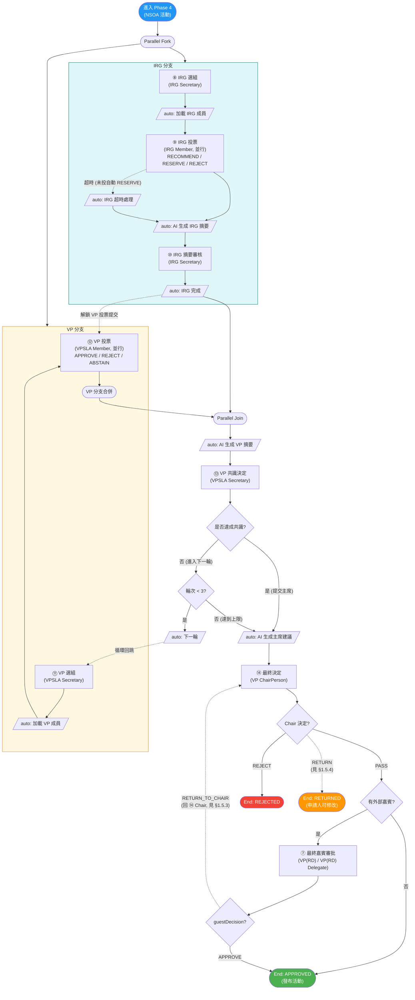

# 活動發布審批流程

> 本文檔描述 SLAS 系統中活動發布審批的完整業務流程，覆蓋 NSOA（新生迎新活動）與非 NSOA 兩種場景。
> 除流程節點名稱外，文中凡涉及角色稱呼，均以 `SYSTEM_ROLE.NAME` 為主。

---

## 1. 流程概覽

### 1.1 業務目標

對學生組織提交的活動申請進行多層審批，確保符合校方規範後正式發布到活動列表。

### 1.2 觸發條件

申請人在系統中提交活動申請後自動啟動。

### 1.3 結束狀態總覽

| 狀態 | 業務含義 | 申請人後續操作 |
|:-----|:--------|:-------------|
| `APPROVED` | 活動通過審批，已發布 | — |
| `REJECTED` | 活動被拒絕（終局） | 不可重新提交 |
| `RETURNED` | 活動退回 | 可修改後重新提交 |

### 1.4 審批路徑差異

- **有外部嘉賓的活動**：在 EO 之後，先進入 `Dean / Delegate` 的 **Guest Endorsement**。
- **有贊助的活動**：在 Guest Endorsement 之後，再進入 `Dean / Delegate` 的 **Sponsorship Approval**。
- **任何活動（必經）**：在 Guest Endorsement / Sponsorship Approval 之後（即便都跳過），都會進入 `Dean / Delegate` 的 **Activity Content Approval**（活動內容 / 預算審批）。Dean 在此節對活動整體做 `Approve / Return / Reject` 決定。
- **非 NSOA 活動**：Activity Content 通過後，如活動有外部嘉賓，會再進入 `VP(RD) / VP(RD) Delegate` 的 **Final Guest Approval**，然後發布。
- **NSOA 活動**：Activity Content 通過後，先進入 IRG（Initial Review Group）與 VP（Vetting Panel）**並行評審**；若 `Chair PASS`，且活動有外部嘉賓，之後仍會再進入 `VP(RD) / VP(RD) Delegate` 的 **Final Guest Approval**。

> **重要說明**：依據當前 BPMN，只要 `hasExternalGuest == true`，活動最終都可能進入 `VP(RD) / VP(RD) Delegate` 的 `guestApprovalTask`。
> - `非 NSOA`：在一般高級審批後進入
> - `NSOA`：在 `IRG / VP` 完成且 `Chair PASS` 後進入
>
> **編輯鎖說明**：最新 `SLAS_UI` 在活動編輯頁（`mode=edit`）進入時，會先呼叫 `/activity/acquire-editing` 取得 30 分鐘短鎖；若拿鎖失敗，前端目前會顯示錯誤訊息並跳回 `ActivityListForStudent`，而不是在原頁面顯示一個「已鎖定、只讀」狀態。成功更新後後端會自動釋放鎖；若使用者直接關閉頁面，則主要依賴鎖超時失效。
>
> **名稱口徑說明**：本文按最新 `SYSTEM_ROLE.NAME` 使用 `VP(RD)` / `VP(RD) Delegate`；但當前 BPMN 註釋、前端任務標題與部分變量名仍常寫作 `VPRD / VPRD Delegate`，兩者在本文中視為同一組角色。

### 1.5 全局退回 / 拒絕行為說明

> 本節為**全文後續所有"拒絕 / 退回"描述**提供統一語義基礎。讀後續 §4 流程圖、§5 步驟詳述與 §6 結果表時請以本節為準。

#### 1.5.1 高級審批節點：`approveTask` + BPMN gate 真正分支

EO、Checker、Guest Endorsement、Sponsorship、Activity Content 等審批節點，前端表單（`SimpleApprovalForm` / `DeanComboApprovalForm`）的「通過 / 退回 / 不同意」按鈕**統一調用** `PUT /bpm/task/approve`，把使用者決定寫入流程變量。

> **例外**：⑦ Final Guest Approval（VPRD）已改為**專屬服務節點**，不走這條統一路徑——詳見 §1.5.3。

##### A) ② Checker / ④ EO — 仍是二值 `approved`

```ts
await approveTask({
  id: props.taskId,
  reason,
  variables: { approved, ...variables },
  taskStatus: approved ? undefined : BpmTaskStatus.RETURN
})
```

BPMN 上的 `flow_xxx_approved` / `flow_xxx_rejected` 按 `${approved == true/false}` 分流。

##### B) ⑤ Guest Endorsement / ⑥ Sponsorship / ⑥' Activity Content — 改為三值 `deanDecision`（commit `6213a252d`, 2026-05-15）

Dean 端的三個審批節點自 2026-05-15 改為**三選項**：`APPROVE` / `RETURN` / `REJECT`。前端 [DeanComboApprovalForm.vue](file:///Users/hugo/codes/project/asl/slas/SLAS_UI/src/views/review/ActivityPublishReview/components/DeanComboApprovalForm.vue) 提交時同時寫入 `decision` 和兼容的 `approved`：

```ts
await approveTask({
  id: props.taskId,
  reason,
  variables: {
    decision: formData.decision,            // 'APPROVE' | 'RETURN' | 'REJECT'
    approved: formData.decision === 'APPROVE',
    ...variables
  },
  taskStatus: formData.decision === 'APPROVE' ? undefined : BpmTaskStatus.RETURN
})
```

BPMN 上的三個 gate（`guestEndorsementDecisionGate` / `sponsorshipDecisionGate` / `activityContentDecisionGate`）按 `${deanDecision == 'APPROVE' | 'RETURN' | 'REJECT'}` 分流，**`REJECT` 是真正的終止路徑**（→ `endEventRejected`），不再像舊版那樣與 `RETURN` 等價回到 Supervisor。

###### Dean Combo `APPROVE` 必填每段評論（commit `8dc0b49e4`, 2026-05-22）

Dean 的綜合審批共用一個決定但**每段（guest / sponsor / content）獨立記錄評論**。本次新增業務規則：

- **`APPROVE` 時，每個觸達的段都必須帶非空評論**（透過 `resolveDeanComboTaskKeys` 在**任一段被 complete 前**統一校驗），否則拋出 `DEAN_COMBO_APPROVE_REASON_REQUIRED`。前置校驗的目的是避免「先 complete 第一段 → 第二段空評論失敗」造成 Flowable 副作用無法乾淨回滾。
- `RETURN` / `REJECT` 不受此規則限制（可只填一段評論）。
- `completeDeanSection` 不再用 `nullToEmpty` 兜底寫入固定英文字串 `"Dean comprehensive approval"`——空評論在 `APPROVE` 已被前置攔截，其他決定路徑保留段別空評論的原樣。

##### 各節點 reject/return 的去向對照表

以當前 [`activity_publish.bpmn20.xml`](file:///Users/hugo/codes/project/asl/slas/SLAS_PRO/slas-server/src/main/resources/processes/activity_publish.bpmn20.xml) 為準：

| 節點 | RETURN 去向 | REJECT 去向 | 業務含義 |
|:----|:----------|:----------|:--------|
| ② Checker | `endEventReturned` | （無獨立 REJECT） | 二值 `approved`：通過或退回申請人 |
| ④ EO | `supervisorsReviewTask` | （無獨立 REJECT） | 二值 `approved`：回到 ③ Supervisor **重新審核** |
| ⑤ Guest Endorsement | `supervisorsReviewTask` | `endEventRejected` | **三值** `deanDecision`：`RETURN` 回 ③ Supervisor；`REJECT` 直接終止 |
| ⑥ Sponsorship | `supervisorsReviewTask` | `endEventRejected` | 同上 |
| ⑥' Activity Content | `supervisorsReviewTask` | `endEventRejected` | 同上 |
| ⑦ Final Guest（VPRD） | `chairPersonDecisionTask`（NSOA, RETURN_TO_CHAIR）/ `activityContentApprovalTask`（非 NSOA, RETURN_TO_DEAN） | （無 reject 路徑） | VPRD 專屬服務節點，詳見 §1.5.3 |

> 注意：上述 ④ EO「回到 Supervisor」並非 bug 而是 BPMN `<!-- EO returns → back to Supervisors (no reject path) -->` 等明文設計；⑤⑥⑥' Dean 自 `6213a252d` 起新增了**獨立 REJECT 路徑**，與 RETURN 不再等價，UI 也分為三個按鈕並有不同確認文案（見 [zh-hk approval.json](file:///Users/hugo/codes/project/asl/slas/SLAS_UI/src/language/locales/zh-hk/approval.json) 的 `returnToSupervisors` / `rejectToApplicant`）。

##### Dean `REJECT` 路徑的通知行為（commit `6213a252d`）

當 Dean 在 ⑤/⑥/⑥' 任一節點選擇 `REJECT`，[`BpmTaskNotificationAsyncService`](file:///Users/hugo/codes/project/asl/slas/SLAS_PRO/slas-module-bpm/slas-module-bpm-biz/src/main/java/hk/eduhk/sao/slas/module/bpm/service/task/BpmTaskNotificationAsyncService.java) 會額外通知**歷史已參與此流程的審批人**：

- 申請人本人（一定通知）
- 該流程啟動以來所有已完成的 IRG / VP / Supervisor 等審批人（透過 `resolveHistoricActivityPublishParticipantIds` 從 `historyService` 提取）

業務含義：Dean 駁回 ≠ 退回；駁回意味著流程結束，所有已投入時間的審批人都應被告知最終結果，避免重複勞動。

#### 1.5.2 通用 `rejectTask` 短路機制（目前 activity_publish 流程**沒有節點調用**）

`BpmTaskServiceImpl.rejectTask` 內部存在一段「若流程定義包含 ID 含 `returned` 的 EndEvent 則短路 `moveTaskToEnd` 到該 EndEvent」的邏輯，但 **`activity_publish` 流程的所有審批節點目前都不調用這條接口**——前端統一走 `approveTask`（見 §1.5.1），supervisor / chair / VPRD 走自己的專屬服務方法（見 §1.5.3）。本節僅作框架行為記錄，方便排查時對齊；本流程文檔中**所有 reject/return 描述以 §1.5.1 / §1.5.3 為準**。

#### 1.5.3 專屬服務節點：`supervisorApprove` / `chairPersonDecision` / `guestApprovalDecision` 直接寫流程變量

下列節點不通過 `SimpleApprovalForm`，而是各自的專屬表單 + 專屬服務方法封裝 `approveTask`，再把決定塞進流程變量讓 gate 真正分支：

| 節點 | 服務方法 / 端點 | 前端表單 | 如何向 BPMN 表達"非通過"決定 |
|:----|:---------------|:--------|:-----------------------|
| ③ Supervisor | `supervisorApprove(...)` | `SupervisorVoteForm` | 設 `supvAggregateDecision = REJECT / RETURN`、`supervisorsAllApproved = false`，BPMN gate 真正按值分流 → `endEventRejected` 或 `endEventReturned` |
| ⑭ ChairPerson | `chairPersonDecision(...)` | `ChairDecisionForm` | 設 `chairDecision = PASS / REJECT / RETURN`，BPMN gate 真正按值分流；`RETURN` → `endEventReturned`（已統一，見 §1.5.4） |
| ⑦ VPRD | `guestApprovalDecision(...)` `POST /activity/approval/guest/decision` | `GuestApprovalForm.vue` | 設 `guestDecision = APPROVE / RETURN_TO_CHAIR / RETURN_TO_DEAN`（見 `GuestDecisionEnum`）；BPMN gate `guestDecisionGate` 真正按值分流：`APPROVE` → 發布，`RETURN_TO_CHAIR`（NSOA only）→ `chairPersonDecisionTask`，`RETURN_TO_DEAN`（非 NSOA only）→ `activityContentApprovalTask`。**無 reject 路徑** |

##### 1.5.3.1 ③ Supervisor 多人聚合 — first-wins 短路(最新規則)

**業務規則(2026-05-20 起,commit `82443a610`):第一個投終局票的 supervisor 說了算,即時短路。**

```
- 第一個投 RETURN → 整體 RETURN,立即取消其他 supervisor 待辦
- 第一個投 REJECT → 整體 REJECT,立即取消其他 supervisor 待辦
- 全部投 RECOMMEND → 整體 RECOMMEND,繼續下一步
```

實現由三部分協同:

1. **`resolveSupervisorAggregateDecision`**:每位 supervisor 提交時讀目前 `supvAggregateDecision`,**第一個非 RECOMMEND 值鎖死、不再升級或降級**(已是 RETURN/REJECT 就保留,否則採用當前決定)。
2. **BPMN `supervisorsReviewTask` completionCondition**:`${nrOfCompletedInstances == nrOfInstances || supvAggregateDecision == 'RETURN' || supvAggregateDecision == 'REJECT'}` — 一旦聚合值變成 RETURN/REJECT,Flowable **取消尚未完成的兄弟 supervisor 多實例任務**(他們的待辦消失);全 RECOMMEND 時則要靠 `nrOfCompletedInstances == nrOfInstances` 等全員投完。
3. **`ActivitySupervisorAggregateDelegate`** (多實例後的 service task):若 `supvAggregateDecision` 已是 RETURN/REJECT 則信任保留;否則(RECOMMEND/null)從單個 `supvDecision` 兜底重算。它的內部 `aggregate()` 仍保留 RETURN>REJECT 優先級代碼,但在短路模型下**多個終局票無法並存**,該分支實際只在全 RECOMMEND 或單 supervisor 場景被觸及。

代表性組合驗證(★ 標出與舊規則的差異):

| 投票順序(按時間) | 最終 `supvAggregateDecision` | 流程走向 |
|:--------|:----------------------------|:---------|
| `[RECOMMEND, RECOMMEND, RECOMMEND]` | RECOMMEND | → ④ EO / ⑤ 嘉賓 / ⑥ 贊助 / ⑥' 內容 |
| `[RECOMMEND, RETURN, …]` | RETURN(RETURN 一出現即短路,第 3 人投不了)| → `endEventReturned`(申請人可修改) |
| `[REJECT, …, …]` | REJECT(第一個 REJECT 即短路)| → `endEventRejected` |
| ★ `[REJECT, RETURN, …]` | **REJECT**(第一個 REJECT 鎖死,RETURN 根本投不了)| → `endEventRejected`(終局,不可重提)|

> **歷史背景 / 規則演進**:
> - commit `5edae8ab9`(2026-05-07)曾實現 **RETURN > REJECT > RECOMMEND 優先級 sticky 升級**:全員投票後聚合,且 REJECT 可被後來的 RETURN 覆蓋(當時 `[REJECT, RETURN, RECOMMEND]` → RETURN)。
> - commit `82443a610`(2026-05-20)按產品決定改為上述 **first-wins 短路**,**推翻**了優先級規則。差異點在 `[REJECT 先, RETURN 後]`:舊規則 → RETURN(可重提),新規則 → REJECT(終局)。結果現在取決於投票先後,不再順序無關。
> - 並發(兩位 supervisor 幾乎同時提交):靠 `resolveSupervisorAggregateDecision` 第一個非 RECOMMEND 鎖死 + Flowable 樂觀鎖,保證 first-wins。
>
> ⚠️ **部署提醒**:short-circuit completionCondition 隨 `82443a610` 才進 BPMN。若現網跑的 `activity_publish` 流程定義版本早於該 commit 部署,supervisor 退回/拒絕後兄弟待辦不會消失(需重新部署讓 Flowable 生成新版本)。

#### 1.5.4 ⑭ ChairPerson `RETURN` 路徑（已統一到 `endEventReturned`）

`chairPersonDecision` 在處理 `RETURN` 時：

1. **Java 同步更新活動狀態**：`updateActivityApprovalStatus(activityId, "RETURNED", comment)`，退回申請人。
2. **BPMN 流轉**：`flow_chair_return` 的 `targetRef` 指向 `endEventReturned`，與其它 RETURN 路徑（Coordinator / Checker）一致——流程結束，申請人狀態為 `RETURNED`，**不再生成新的主管待辦**。

> 歷史背景：早期版本 `flow_chair_return` 曾錯誤指向 `supervisorsReviewTask`，導致 Java 退回 + BPMN 重派 supervisor 的雙重行為。已於 commit `5edae8ab9` 統一為 `endEventReturned`，本文後續所有 ⑭ Chair `RETURN` 描述以當前 BPMN 為準。

#### 1.5.5 supervisor 在 ③ 步勾選的附加標記如何影響後續 gate

主管審批表單裡的 `sponsorshipConfirmed` / `campusPublicVenueConfirmed` / `venueAfterHoursConfirmed` / `elatEligible` 等欄位中：

- **`campusPublicVenueConfirmed` / `venueAfterHoursConfirmed`** 以 sticky-OR 語意寫入流程變量 `supvCampusPublicVenue` / `supvVenueAfterhrs`，**真正驅動** `checkEoAfterHoursGate`。
- **`sponsorshipConfirmed`**(commit `3c653be94`, PR #125, 2026-05-11)以 sticky-OR 語意寫入流程變量 `hasSponsorship`,**真正驅動** `checkSponsorshipGate`。即便申請人提交時填 `hasSponsorship=false`,supervisor 勾選 `sponsorshipConfirmed=true` 也會補救觸發 ⑥ 贊助審批分支。**任一 supervisor 勾選即生效**(sticky-OR 跨多實例),且**不可降級**(一旦寫入 true,後續勾選 false 不會回退)。
- **`elatEligible` / `elatCategory`** 與其他留痕欄位 **只寫回 `ActivityDO` 的 `supv*` 列**，**不更新流程變量**(無對應 gate)。

因此：
- `checkSponsorshipGate` 讀 sticky-OR 後的 `hasSponsorship`(申請人提交值 OR 任一 supervisor 勾選)。
- `checkGuestEndorsementGate` / `checkGuestGate` 仍只讀流程啟動時冻結的 `hasExternalGuest`(supervisor 表單無對應 `externalGuestConfirmed` 欄位,如需此補救機制需先在 `SupervisorApprovalReqVO` 加字段)。

##### 1.5.5.1 場地硬約束：勾選"課後使用"必須先勾"校園公共場地"

`venueAfterHoursConfirmed = true` **必須** 同時 `campusPublicVenueConfirmed = true`。否則：

- **後端**：`supervisorApprove` 拋 `SUPERVISOR_AFTERHOURS_REQUIRES_CAMPUS_VENUE` 業務錯誤碼（commit `82124be71`），返回本地化訊息（不再是不透明的 500）。
- **前端**：`SupervisorVoteForm` 把「Use Venue After Hours」開關 gate 在「Use Campus Public Venue」開關後（commit `05b346f3`）；前者只有在後者勾選時才能變 true。

業務含義：課後場地審批必然發生在校園公共場地的範疇內；只勾「課後使用」而不勾「校園公共場地」是不合法的組合。

### 1.6 活動編輯鎖（Editing Lock）

> 引入時間：commit `51359c9cc`（後端基礎設施，2026-05-05）+ `4b8a19ec1`（主動釋放端點，2026-05-07）+ `f0398a015`（暴露鎖欄位）。
> 前端配套：`20239e1e`（`lockHeld` 與 `beforeunload` 釋放）+ `809ca6cf`（活動列表編輯中徽章）+ `eae9f2b0`（鎖文案）。

#### 1.6.1 目標

防止多個 OC（學生組織負責人）同時編輯同一活動草稿、或同時觸發 `acquire-editing` 後相互覆蓋。

#### 1.6.2 數據模型

`ActivityDO` 新增列（SQL patch `0004_018_add_activity_editing_lock.sql`）：

| 列名 | 含義 |
|:----|:----|
| `editing_user_id` | 當前持鎖人 user id |
| `editing_expire_at` | 鎖的 SQL 端 TTL（30 分鐘） |

`RespVO` 同步暴露 `editingUserId / editingExpireAt`，活動列表據此渲染「編輯中」徽章。

**`editingUserName` 字段**（commit `ca89f930c`, 2026-05-18）：列表接口 `GET /activity/page` 額外返回 `editingUserName`，由後端 `populateEditingUserNames` 透過 [`UserDisplayNameUtils.resolve(user)`](file:///Users/hugo/codes/project/asl/slas/SLAS_PRO/slas-module-activity/slas-module-activity-biz/src/main/java/hk/eduhk/sao/slas/module/activity/util/UserDisplayNameUtils.java) 解析持鎖人的顯示名（`nickname → username` fallback）。解析時用 `DataPermissionUtils.executeIgnore` **繞過數據權限**，確保即使當前用戶看不到該持鎖人所在部門，徽章也能展示「正被 XXX 編輯」而不是只顯示 ID。解析失敗時 `editingUserName = null`，前端應 fallback 顯示 ID 或「他人」字樣。

#### 1.6.3 端點

| 動作 | 端點 | 行為 |
|:----|:----|:----|
| 取鎖 | `POST /activity/acquire-editing` | 進入編輯頁時調用；若無鎖則寫 `editing_user_id` + `editing_expire_at = NOW + 30min`；若已被他人持鎖則 409；若鎖屬於自己則續期 |
| 釋鎖 | `POST /activity/release-editing` | 提交 / 路由切換 / `beforeunload` 時調用；Mapper 用 `editing_user_id` 過濾後再清空，**冪等且只允許持鎖人釋放** |

#### 1.6.4 釋鎖時機

前端三層保險（`useCreateActivity.ts`）：

1. **正常提交成功**：在 update 成功 callback 中調 `releaseEditing`。
2. **路由內導航離開**：`cleanupComponent` 用 axios（best-effort）釋鎖。
3. **`beforeunload`（關閉 tab / 刷新 / 硬導航）**：用 `fetch keepalive`（注意：不能用 `sendBeacon`，因為它**不帶 `Authorization` header**），請求會在頁面卸載時繼續發送。

兜底：30 分鐘 SQL TTL 過期後鎖自動失效，下一個 OC 可以取鎖。

#### 1.6.5 與審批流的關係

編輯鎖只作用於**草稿態 / 退回後重新編輯態**，與 BPMN 流程完全解耦——流程中的審批節點不關心鎖。鎖唯一的關聯是：當活動處於 `RETURNED` 等待修改時，OC 必須先取鎖才能進入編輯頁。

#### 1.6.6 編輯權限（`canEdit` / `ActivityAccessGuard`）

> 引入時間：commit `e04f7546a`（2026-05-18，編輯權限 + 強制鎖）+ `f40ce691b`（OC 自動補位僅限創建者）。前端配套：`11364420`（前端讀後端 `canEdit` 隱藏編輯按鈕 + 本地化權限錯誤）。

在 `e04f7546a` 之前，活動編輯**沒有任何身份範圍校驗**：任何持 `activity:activity:update` 權限的用戶都能取鎖並改任意活動，且編輯鎖只是「建議性」的（update 接受無鎖請求）。本次收緊：

**編輯權限規則（`ActivityAccessGuard.canEdit(activityId, userId)`）：**

1. **狀態門檻**：活動必須是 `DRAFT`。提交後（`SUBMITTED` / `PUBLISHED` / `ONGOING` / `COMPLETED` / `CANCELLED`）一律不可編輯；被退回（`RETURNED`）的活動會回滾到 `DRAFT`（見 §1.7.6）後再次可編輯。
2. **身份白名單**：編輯者 = 申請人(`creatorId`) ∪ `activity_oc_member` ∪ `activity_supervisor`（**該活動的**）。Coordinator / 系統管理員 / 任何其他角色一律拒絕（`ACTIVITY_NO_EDIT_PERMISSION` 1_003_001_021）。
   - ⚠️ Supervisor 仍在**編輯白名單**內，但被產品規則排除在 endorsement reset 之外。
3. **後台批量導入**直接走 `activityMapper.insert`，不經過本方法。

**配套收緊：**

- **強制編輯鎖**：用戶上下文下 `acquire-editing` 與 `updateActivity` 都要求持鎖，`validateCurrentUserEditingLock` 拒絕無鎖請求（`ACTIVITY_EDITING_LOCK_REQUIRED` 1_003_001_022）。BPMN 任務與其他內部調用（無 `LoginUser` 上下文）繞過。
- **`updateActivity` 狀態門檻**收緊為用戶上下文僅 `DRAFT` 可改；系統調用（如 `ActivityPublishTask`）因無登入用戶仍可通過。
- **提交防繞過**：提交審批路徑改為**先 sync OC 成員 + endorsement、再對刷新後的名單跑 `isAllEndorsed`**，堵住「在提交同一請求裡新增一個 OC」把未簽 OC 帶進流程的漏洞（`f40ce691b` 進一步把 OC 自動補位安全網僅限創建者，避免 supervisor / 其他編輯者誤觸發補位）。
- **`canEdit` 字段**（`ActivityRespVO.canEdit`）：僅在 `GET /activity/get` 響應時計算填充（列表接口不填），詳情頁據此隱藏編輯按鈕。
- **移除 OC 時釋鎖**：`syncOcMembersFromActivityMembers` 先快照舊 OC 名單，對本次被移除的 OC 強制釋放編輯鎖（Mapper SQL 按鎖主過濾，對未持鎖者是安全 no-op）。
- **釋鎖時機**：`releaseEditingLock` 移到 `updateActivity` 最後，所有關聯表寫入成功後才釋放。

### 1.7 Endorse 模式（OC 互審不阻塞編輯）

> 引入時間：commit `20239e1e`（前端，2026-05-07）。

#### 1.7.1 為什麼需要

學生組織內常有多位 OC 角色用戶（`Group Leader`），其中一人在編輯草稿時，**另一位想預覽 / 確認內容**——但 §1.6 的編輯鎖會阻塞第二人進入編輯頁。

#### 1.7.2 設計

`CreateActivities` 路由參數 `mode` 新增 `endorse` 值：

| `mode=` | 行為 |
|:-------|:----|
| `edit` | 取編輯鎖，可填寫 / 提交 / 上一步 / 保存草稿 |
| `endorse` | **不取編輯鎖**；隱藏 step navigator + save / prev / submit 按鈕；顯示 endorse-specific 標題與描述；`navigateToStep` 只 gate 在預覽步 |

活動列表頁有一個 `navigateToEndorse` action，從那裡進入時自動帶上 `mode=endorse`。

#### 1.7.3 與編輯鎖的交互

`isEndorse` computed 在 `useCreateActivity.ts` 裡判斷 `mode === 'endorse'`，據此跳過 `acquireEditingLock` 與後續所有 `releaseEditing` 邏輯——endorse 模式整個鎖機制都不參與，因此**不阻塞當前持鎖的編輯者**。

#### 1.7.4 全員 endorse 模型（包含申請人）

> 業務變更：commit `989c3e0db`（2026-05-23）改為**循環 OC endorsement 模型** —— `initializeEndorsements` 不再自動把申請人標為已 endorse，每位 OC 成員（**包括申請人本人**）都必須在 endorse 面板上明確完成 endorse 才能提交。

- 舊行為（已棄）：申請人自動視為已 endorse、單 OC 組織可直接提交。
- 新行為：
  - 編輯頁（`mode=edit`）**只負責保存草稿**，不再承擔提交動作。
  - 申請人可選擇「保存並 endorse 自己」（`ActivitySaveReqVO.endorseOnSave=true` → `endorseAsEditor` 在保存事務內記錄申請人 endorsement）作為便捷入口。
  - 提交按鈕由 **endorse 面板**獨佔，僅在**所有 OC 都完成 endorse** 且 OC 名冊已全員映射到用戶帳號（`isAllEndorsed` 新增 `userId!=null` 與 endorsement 行數=成員數雙重校驗）後才顯示。
  - 即使單 OC 組織也需要該 OC 在面板上點一次 endorse 才能露出提交按鈕。

#### 1.7.5 內容變更失效（cyclic re-endorse）

> 引入時間：commit `989c3e0db`（2026-05-23）。

`updateActivity` 在保存草稿時對「實質欄位」（material-fields）做差異比對，若任一欄位變動 → 呼叫 `invalidateForContentChange`：

- **欄位範圍**：標題 / 描述 / 日期 / 場地 / 贊助 / 預算 / 嘉賓（可由 `sys_config` 鍵 `activity.endorsement.material-fields` 覆寫，否則用程式碼預設）。預算比對採規範化 `(type|category|item|description|amount)` 列表，而非僅比較總額。
- **效果**：所有 OC 的 `endorsed` 一鍵翻回 `false`，但**保留先前的 `endorsedTime`**——面板可顯示「內容已更新，請重新 endorse（上次 endorse: <時間>）」，協助 OC 識別差異。
- **語意**：將 endorsement 從「一次性蓋章」改為「對當前內容版本的承諾」——任何 material 修改都會觸發全員重簽。

#### 1.7.6 退回後重置 endorsement + 回滾 DRAFT

> 引入時間：commit `e04f7546a`（2026-05-18）。

在此之前，活動被退回時只更新了 `approvalStatus`，`status` 仍停在 `SUBMITTED`，導致申請人無法重新編輯，且舊的 endorsement 殘留。本次：

- `updateApprovalStatus("RETURNED", ...)` 現在**同時把 `activity.status` 回滾到 `DRAFT`** 並調用 `resetAllEndorsements(activityId)`：申請人可重新進入編輯流程，**每位 OC 必須對修改後的內容重新 endorse** 才能再次提交。`ActivityApprovalServiceImpl` 內的私有 `updateActivityApprovalStatus` 重構為委派到此處，副作用邏輯集中一處。

**endorsement reset / invalidation 的觸發範圍（按當前代碼）：**

| 觸發點 | 行為 |
|:------|:----|
| 活動被退回（`RETURNED`） | `resetAllEndorsements`：所有 OC 的 `endorsed` 置回 false（不保留時間戳），全員須重簽 |
| DRAFT 保存且 material 欄位變動（§1.7.5） | `invalidateForContentChange`：所有 OC 的 `endorsed` 翻 false，**保留 `endorsedTime`** 以利「內容已更新，請重新 endorse」提示 |
| DRAFT 保存且僅 OC 名冊變動（`syncEndorsements`） | 為新增 OC 創建待簽記錄、為移除 OC 刪記錄；不重置其他人已有的 endorsement |
| 申請人「保存並 endorse 自己」（`endorseOnSave=true`） | `endorseAsEditor` 在保存事務內為申請人記錄 endorsement（其他 OC 不受影響） |

#### 1.7.7 提交審批入口（lock-free `submitForApproval`）

> 引入時間：commit `989c3e0db`（2026-05-23）。

舊版透過 `createActivity` / `updateActivity` 路徑攜帶 `status='SUBMITTED'` 觸發提交，與編輯鎖、material-diff 等流程混在一起；新版拆出獨立入口：

- 端點來自 endorse 面板「提交審批」按鈕，呼叫 `ActivityService.submitForApproval`。
- **無編輯鎖要求**：提交來自 endorse 面板（從不持鎖），因此 lock guard **拒絕任何未過期的編輯鎖（包括申請人自己持有的）**——若有鎖存在，意味著另一人正在編輯，提交應退讓。
- **悲觀行鎖 + 原子升態**：以 `selectByIdForUpdate` 鎖列，避免「讀後其他人改料」窗口；再以 `promoteDraftToSubmitted`（`UPDATE ... WHERE status='DRAFT'`）原子升態為 `SUBMITTED`；同事務內啟動 BPM 工作流。
- **BPM 啟動失敗回滾**：`startActivityApprovalWorkflow` 改為 rethrow（錯誤碼 `ACTIVITY_APPROVAL_WORKFLOW_START_FAILED` 1_003_001_024），整個提交事務回滾——之前是「catch 後僅記日誌」，會留下無流程實例的 `SUBMITTED` 殭屍活動。
- **`createActivity` 不再支援提交分支**：即使請求帶 `status='SUBMITTED'` 也只記日誌並落 `DRAFT`，提交動作完全由 `submitForApproval` 統一驅動。
- **日期一致性也是提交前置**（2026-07 新增）：提交與 OC 認可時會校驗**已存進資料庫**的活動日期、日程日期與申請表場次日期是否彼此一致，不通過即擋下。認可面板會直接標示不通過的原因，OC 不必按下提交才發現問題。完整規則見 §1.11。

### 1.8 待辦可見性與 claim 規則（框架級，跨所有 BPM 流程）

> 引入 / 演進：commit `34af49147`（排除 dept 數據權限，2026-05-20）→ `eb8b8c51d`（按角色 dept 權限收緊可見性）→ `d754ae903`（任一登入角色都能看到該用戶應辦的全部任務）→ `61a1fdb87`（已分配任務只對 assignee 可見）→ `98567d04c`（candidateUser + candidateGroup 同時存在時仍強制走角色 dept 範圍）。實現在 `BpmTaskServiceImpl`，**作用於所有 activity_publish / 學生組織等 BPM 流程**，非本流程專屬。

決定「誰能在待辦列表看到一個任務、誰能 claim / 辦理」的邏輯分兩段：**Flowable 並集查詢** + **內存後置過濾**。

#### 1.8.1 並集查詢 `createOperableTaskQuery`

`OR` 條件（命中任一即進入候選集）：

1. `taskCandidateOrAssigned(userId)` — 直接 assignee 或候選用戶
2. `taskCandidateGroupIn(用戶的角色 IDs)` — 候選組（角色）
3. `processVariableValueEquals("supervisor_<uid>", true)`
4. `processVariableValueEquals("admin_checker_<uid>", true)`
5. `processVariableValueEquals("academic_checker_<uid>", true)`

第 3–5 的 marker 變量是協調員 / 秘書在上一節點審批時**動態指派**具體某人的標記（任務本身可能只掛 candidateGroup、無 assignee）。任意登入角色都會跑同一條查詢——**角色只作授權，不限制可見性**（`d754ae903` 的意圖）。

#### 1.8.2 後置過濾鏈

候選集依次經過三個內存過濾器：

| 過濾器 | 作用 |
|:------|:----|
| `filterTasksByApprovalGroup` | IRG / VP 投票任務只對被選中的投票成員可見 |
| `filterTasksByCheckerDesignation` | 學生組織註冊的 checker 指派過濾 |
| `filterTasksByRoleDeptScope` | 角色 dept 數據權限邊界（見下） |

#### 1.8.3 `filterTasksByRoleDeptScope` 的判定順序

對每個任務：

1. **已分配任務（`assignee` 非空）→ 只對該 assignee 可見**（`61a1fdb87`）。
   - 這是修掉「一個 supervisor 看到兄弟 supervisor 多實例任務」的關鍵：marker 變量活在整個流程實例上，若不在此短路，會讓同輪多實例互相可見。activity_publish 的 supervisor 多實例 `flowable:assignee=${supervisorUserId}` 都有 assignee，因此每人只看到自己那條。
2. **未分配任務**：
   - 顯式指派（candidateUser 身份鏈，或 `supervisor_/admin_checker_/academic_checker_` marker）→ 可見，**marker 故意繞過 dept 數據權限**（agency-wide oversight 不應被部門權限擋住）。
   - 否則走候選組角色匹配：用戶角色須命中任務的 candidateGroup，**且**該角色的 dept 數據權限覆蓋任務的 `deptId` 才可見（`eb8b8c51d`）。
   - **最新收緊**（`98567d04c`）：若同一任務同時帶 `candidateUser` 與 `candidateGroup` identity link，不能只因 candidateUser 命中就繞過 candidateGroup 的 dept 範圍；仍需命中候選組角色且該角色 dept 權限覆蓋任務 `deptId`。只有完全沒有 candidateGroup 的純 candidateUser 任務，才按「顯式指派」直接可見。

> **設計要點**（`34af49147`）：「與用戶同部門」本身**不**授予可見性 / claim 權——必須是上面某種顯式指派。dept 權限只用於收窄 candidate-group 任務的範圍，不單獨開門。

#### 1.8.4 claim / 辦理一致性

`validateTask` 與可見性同源：

- 任務**已有 assignee** → 只有該 assignee 能辦理（`assignee != userId` 直接拋 `TASK_OPERATE_FAIL_ASSIGN_NOT_SELF`）。
- 任務**無 assignee** → 跑與待辦列表相同的並集查詢 + 過濾鏈，通過才自動簽收（`claim`）給當前用戶。

因此「看得到」與「能辦」用同一套規則，不會出現看得到卻點不開、或反之。

#### 1.8.5 Supervisor 的活動列表資料範圍（2026-06 收窄）

> 引入時間：commit `8df5ba969`（2026-06-30），伴隨補丁 `0004_046`。

以上 §1.8.1–1.8.4 講的是**待辦任務**的可見性；**活動列表**是另一套資料範圍，Supervisor 在 2026-06 起改為：

- 只看得到**自己被指派為督導的活動**（依 `activity_supervisor` 綁定），且狀態限於 `APPROVED` 與 `PENDING`。
- **綁定為空時「fail closed」**：一個尚未被指派任何活動的 Supervisor 看到的是空列表，而不是全部活動。這是刻意設計，UAT 時看到空列表請先確認該帳號是否已被綁定為某活動的督導。
- 判定會**先核對登入者實際持有的角色**再套用範圍，避免以偽造的「當前角色」標頭繞過收窄。
- 同批一併收緊的存取檢查（原本可憑 ID 直接讀取他人資料）：
  - 報名管理列表：套用同一套角色核對後才適用 supervisor 範圍；
  - 推廣詳情：新增擁有權檢查（管理員 / 該活動可見 / 為該活動督導）；
  - 出席詳情兩個端點（`/detail/{userId}`、`/detail-by-attendance/{id}`）：補上出席管理權限檢查。
- 補丁 `0004_046` 另把誤掛在 Supervisor 上的「主辦組織審核」選單解除綁定。

> 對 UAT 的影響：升級後 Supervisor 看到的活動筆數會**變少**，這是預期結果，不是資料遺失。

---

### 1.9 最新審核頁與詳情卡 UI 行為（SLAS_UI）

以下為 `ActivityPublishReview` / `ActivityDetailCard` 近期前端行為，便於 UAT 對照畫面：

- **活動詳情卡內容語言切換**：Learning Objectives / Other Information 等三語欄位使用卡片內的內容語言切換器，而不是切換整個系統 UI 語言；預設看英文，方便審批人逐語比較。
- **Programme & Logistics 英文口徑**：Programme 名稱與內容在詳情卡中只展示英文欄位（`nameEn` / `contentEn`）；已移除 programme day session-count 的舊殘留顯示。
- **Manpower Projection 可折疊**：每個 programme 下的人手表可展開 / 收起，審批頁預設可用折疊模式減少首屏負擔。
- **Other Information 可折疊**：Other Information 的各個子項（如共融元素、綠色實踐等）按申請表順序展示，審批人可逐項展開。
- **附件空狀態**：附件區若沒有檔案，顯示精簡文字空狀態，不再佔用大塊提示框。
- **移動端審核面板**：Activity Publish Review 在窄屏下把右側審核面板改為底部 bottom sheet，支援半高、全高與收起三種狀態；桌面端仍為右側 sticky panel。
- **審批歷史中的 OC 名單**：審批歷史最新一輪 Submit 節點下會顯示該活動的 OC 成員名單。資料來自 reviewer 可讀的 `/activity/get` 活動詳情；因提交前已要求全體 OC endorsement 完成，該名單用於提示「本輪提交前涉及哪些 OC」，不展示 per-member endorsement 時間。
- **贊助資訊更突出**：Create / Edit Activity 的 Budget Plan 內，贊助類 budget item 會以帶圖標與綠色左邊框的 Sponsorship details 面板展示，取代原本較容易被忽略的 divider；贊助附件與 Section XI 文件上傳使用 compact upload 樣式。
- **贊助附件預覽即時可見**：編輯表單中剛上傳但尚未保存的 `sponsorAttachments`，會在 Preview / Activity Detail adapter 中即時轉成 `sponsorAttachmentFileIds` 顯示，避免 UAT 時誤以為附件遺失。
- **流程歷史輪次視覺修正**：Process History 的多輪提交圓點不再被左側裁切，輪次之間的連線改為貫穿整組的主線；此為視覺修正，不改變審批歷史資料與流程狀態。

### 1.10 審批意見「存為草稿」（通用於所有審批環節）

> 引入時間：commit `583a2f44f`（2026-06-20），資料表補丁 `0004_032`。

審批人填寫意見時可先**存為草稿**，稍後再回來提交，不必一次寫完：

- **適用範圍**：**所有**審批環節通用（① Coordinator 到 ⑭ ChairPerson，以及走同一套審批面板的其他節點），不是某一節點的專屬功能。
- **儲存粒度**：按 **(任務, 使用者)** 一組一份草稿。同一個任務若有多位候選人，各人的草稿彼此獨立、互不可見。
- **端點**：`POST /activity/approval/draft/save`（存）、`GET /activity/approval/draft?taskId=`（取）。
- **自動清除**：任務一旦真正提交（`completeTask`），該草稿自動刪除——涵蓋所有提交路徑，不需要人工清理。
- **UAT 對照**：離開審批頁再回來，先前輸入的意見應自動帶回；提交後再開同一畫面，草稿應已清空。

> 草稿**只是意見文字的暫存**，不佔用任務、不影響 claim、也不改變任何流程狀態；存了草稿不等於已審批。

### 1.11 活動日期一致性校驗（後端為權威）

> 引入時間：commit `5aa1070c1`（2026-07-28），實作於 `ActivityDateConsistencyValidator`。

活動的三組日期必須彼此一致，後端在**保存草稿 / 提交審批 / OC 認可**三個時點統一把關：

| 規則 | 不符時的錯誤 |
|:--|:--|
| 活動**開始日 ≤ 結束日** | `ACTIVITY_DATE_RANGE_INVALID`（1003001029） |
| 申請表 `basic.programmes[]` 中每個場次的日期須落在活動起訖日之內 | 越界：`ACTIVITY_PROGRAMME_DATE_OUT_OF_RANGE`；格式無法解析：`ACTIVITY_PROGRAMME_DATE_INVALID`（1003001031） |
| 活動日程（schedule）的每個日期須落在活動起訖日之內 | `ACTIVITY_SCHEDULE_DATE_OUT_OF_RANGE`（1003001030） |

**幾個容易誤解的地方：**

- **日期留空一律放行**。活動起訖日未填、或 programme 的日期欄位為空，都視為草稿佔位而略過校驗；只有「填了但填錯」才會被擋。這是為了不讓填寫中的草稿無法保存。
- **只比對日期，不比對時分**。
- **校驗時機的差別是刻意設計**：
  - **保存草稿**時校驗的是**這次請求送上來的**日程；
  - **提交審批 / OC 認可**時校驗的是**已經存進資料庫的**日程。
  - 後者確保歷史遺留資料、以及繞過前端直接呼叫 API 的請求，都要通過同一條業務規則，無法迴避。
- **OC 認可頁會直接顯示被日期問題擋住的原因**：認可狀態介面新增 `dateValid` / `dateValidationCode` / `dateValidationMessage` 三個欄位，OC 在認可面板上就能看到「哪一條日期規則不通過」，不必等到按下提交才收到錯誤（另見 §1.7）。

## 2. 角色與職責

### 2.1 系統角色清單

下表為本流程涉及的系統定義角色（`SYSTEM_ROLE.NAME`）與文中流程別名。
以下內容優先對齊**當前運行時代碼**；若你的資料庫仍停留在舊補丁階段，可能仍會看到歷史口徑。

| 角色 ID | `SYSTEM_ROLE.NAME` | 職責 |
|:-------:|:-------------------|:-----|
| 115 | Coordinator | 初審；判斷是否需要 Checker；指派 Checker |
| 142 | Activity Application Checker | 對活動內容作詳細審查（由 Coordinator 指派） |
| 116 | Supervisor | 對組織與活動的第一級審核員；多人並行（由活動數據逐活動指派） |
| 141 | EO Venue Reviewer | 審批校園場地相關使用 |
| 149 | Dean | 外部嘉賓背書、贊助審批與活動內容 / 預算審批 |
| 150 | Delegate | 外部嘉賓背書、贊助審批與活動內容 / 預算審批 |
| 151 | VP(RD) | 外部嘉賓審批 |
| 152 | VP(RD) Delegate | 外部嘉賓審批委派角色 |
| 144 | IRG Secretary | 管理 IRG 評審；選組；審核 IRG 摘要 |
| 145 | IRG Member | 對 NSOA 活動進行 IRG 投票 |
| 146 | VPSLA Secretary | 管理 VP 評審；選組；判定是否達成共識 |
| 147 | VPSLA Member | 對 NSOA 活動進行 VP 投票（包含 ChairPerson 候選） |

### 2.2 流程中的功能性審批組合

下列審批職責在系統中由若干角色或活動數據共同承擔,而非單一系統角色：

| 功能性審批 | 由誰承擔 |
|:----------|:--------|
| Guest Endorsement | 由 `Dean`、`Delegate` 承擔；僅在活動有外部嘉賓時出現 |
| Sponsorship Approval | 由 `Dean`、`Delegate` 承擔；僅在活動有贊助時出現 |
| Activity Content Approval | 由 `Dean`、`Delegate` 承擔；**必經**節點，無論活動是否有嘉賓 / 贊助；對活動整體內容與預算作 `Approve / Return / Reject` 決定 |
| Final Guest Approval | 由 `VP(RD)`、`VP(RD) Delegate` 承擔；只要活動有外部嘉賓就可能出現。`非 NSOA` 在一般高級審批後進入；`NSOA` 在 `Chair PASS` 後進入 |
| Supervisor 多實例 | `Supervisor` 是當前系統角色名稱；具體本次審核的 Supervisor 名單由活動數據（`activity_supervisor` 表）逐活動指派 |
| VP ChairPerson | 由 `VPSLA Secretary` 在 ⑩ 選組階段指定的一位 `VPSLA Member` |

> **實作備註【开发参考】**
> 1. 活動發布流程的 `coordinatorGroupId` 為 `115`（`Coordinator`）。
> 2. 當前運行時代碼已把 guest 相關變量拆成三組：`guestEndorsementGroupIds = 149,150`、`sponsorshipApproverGroupIds = 149,150`、`vprdApproverGroupIds = 151,152`。
> 3. `Head (148)` 雖仍存在於 `SYSTEM_ROLE` 裡，但**當前 `activity_publish` BPMN 標準主線不再把 148 放入候選組**；Guest Endorsement 與 Sponsorship Approval 的實際候選組都是 `149,150`，即 `Dean / Delegate`。
> 4. **角色 142 名稱有歧義（資料 vs 同步代碼）**：SQL 補丁 `sql/patch/0004_017_update_approval_role_names.sql` 已將 142 重命名為 `Activity Application Checker`（本文採用此口徑，與 §2.1 表中 `142 | Activity Application Checker` 一致）；但運行時 `slas-module-bpm/.../BpmUserSyncService.java`（`createGroupIfNotExists("142", "Sponsorship Approver", ...)`）仍硬編碼為 **舊名 `Sponsorship Approver`**，服務啟動執行用戶 / 群組同步時可能會把名稱覆寫回舊口徑。若部署環境介面上看到 142 顯示為 `Sponsorship Approver`，以本文 SQL 補丁口徑為準，並建議同步修正 `BpmUserSyncService.java` 的硬編碼。

### 2.3 多人並行 / 候選組規則

| 任務 | 規則 |
|:----|:----|
| Supervisor 審核 | 所有 Supervisor 並行審核,first-wins 短路:第一個 RETURN/REJECT 即終局並取消其餘待辦,全 RECOMMEND 才需全員投完（見 §1.5.3.1 / §5） |
| 嘉賓背書 / 贊助審批 / 活動內容審批 | 候選組（`Dean / Delegate`）內任一審批人可認領並審批,採「先到先審」 |
| IRG 投票 | 所有 IRG Member 並行投票 |
| VP 投票 | 所有 `VPSLA Member` 並行投票（不含 ChairPerson）；VP 投票有截止時間,超時自動視為棄權 |

---

## 3. 圖例

本節定義流程圖統一規範，兩份審批流程文檔共用。

### 3.1 節點形狀

| 形狀 | Mermaid 語法 | 含義 |
|:-----|:-------------|:-----|
| 矩形 | `["Name"]` | **人工任務** — 需要審批人手動操作 |
| 平行四邊形 | `[/"auto: Name"/]` | **系統任務** — 自動執行,無需用戶操作 |
| 菱形 | `{Question?}` | **判斷網關** — 根據條件分流,文字以問號結尾 |
| 圓角 | `(["Name"])` | **流程起點／終點** 或 並行 Fork/Join |

### 3.2 連線類型

| 樣式 | Mermaid 語法 | 含義 |
|:-----|:-------------|:-----|
| 實線箭頭 | `-->` | 正向順序流（happy path） |
| 虛線箭頭 | `-.->` | 計時器觸發（超時／提醒）、退回循環、跨分支依賴 |

### 3.3 節點標籤格式

| 類型 | 格式 | 範例 |
|:-----|:-----|:-----|
| 人工任務 | `<編號> <步驟名><br/>(角色名)` | `① Coordinator 審核<br/>(Coordinator)` |
| 系統任務 | `auto: <行為描述>` | `auto: 聚合投票結果` |
| 判斷網關 | 以問號結尾的問句 | `{是否有贊助?}` |
| 結束點 | `End: <狀態><br/>(<業務含義>)` | `End: APPROVED<br/>(活動已發布)` |

### 3.4 步驟編號

帶圈數字（①、②、…）標註人工任務的順序。系統任務不參與編號。

| 編號 | 步驟 | 角色 | 階段 |
|:----:|:-----|:-----|:----:|
| ① | Coordinator 審核 | Coordinator | Phase 1 |
| ② | Checker 審核 | Activity Application Checker | Phase 1 |
| ③ | Supervisors 審核 | Supervisors（並行） | Phase 2 |
| ④ | EO 審批 | EO Venue Reviewer | Phase 3 |
| ⑤ | 嘉賓背書 | Dean / Delegate | Phase 3 |
| ⑥ | 贊助審批 | Dean / Delegate | Phase 3 |
| ⑥' | 活動內容審批（必經） | Dean / Delegate | Phase 3 |
| ⑦ | 最終嘉賓審批 | VP(RD) / VP(RD) Delegate | Phase 3 |
| ⑧ | IRG 選組 | IRG Secretary | Phase 4 |
| ⑨ | IRG 投票 | IRG Member（並行） | Phase 4 |
| ⑩ | IRG 摘要審核 | IRG Secretary | Phase 4 |
| ⑪ | VP 選組 | VPSLA Secretary | Phase 4 |
| ⑫ | VP 投票 | VPSLA Member（並行） | Phase 4 |
| ⑬ | VP 共識決定 | VPSLA Secretary | Phase 5 |
| ⑭ | 最終決定 | VP ChairPerson | Phase 6 |

---

## 4. 流程圖

### 4.1 整體流程

```mermaid
flowchart TD
    Start(["Start: 活動已提交"])
    Start --> Coordinator

    subgraph Phase1["Phase 1: 初審"]
        Coordinator["① Coordinator 審核<br/>(Coordinator)"]
        Coordinator --> CoordGate{Coordinator 是否通過?}
        CoordGate -->|"通過"| CheckerCheck
        CoordGate -->|"退回"| EndReturned

        CheckerCheck{需要 Checker?}
        CheckerCheck -->|"是"| Checker
        CheckerCheck -->|"否"| Supervisors

        Checker["② Checker 審核<br/>(Activity Application Checker)"]
        Checker --> CheckerGate{Checker 是否通過?}
        CheckerGate -->|"通過"| Supervisors
        CheckerGate -->|"退回"| EndReturned
    end

    subgraph Phase2["Phase 2: Supervisor 審核"]
        Supervisors["③ Supervisors 審核<br/>(Supervisors, 並行)"]
        Supervisors --> SuperAggregate[/"auto: 聚合 Supervisor 投票<br/>first-wins 短路: 第一個 RETURN/REJECT 說了算<br/>全 RECOMMEND 才繼續 (見 §1.5.3.1)"/]
        SuperAggregate --> SuperGate{聚合結果?}
        SuperGate -->|"RECOMMEND"| EoCheck
        SuperGate -->|"RETURN"| EndReturned
        SuperGate -->|"REJECT"| EndRejected
    end

    subgraph Phase3["Phase 3: 高級審批"]
        EoCheck{場地是否課後使用?}
        EoCheck -->|"是"| EO
        EoCheck -->|"否"| GuestEndorsementCheck

        EO["④ EO 審批<br/>(EO Venue Reviewer)"]
        EO --> EoGate{EO 是否通過?}
        EoGate -->|"通過"| GuestEndorsementCheck
        EoGate -.->|"退回<br/>(回 ③ Supervisor 重審, 見 §1.5.1)"| Supervisors

        GuestEndorsementCheck{是否有外部嘉賓?}
        GuestEndorsementCheck -->|"是"| GuestEndorsement
        GuestEndorsementCheck -->|"否"| SponsorCheck

        GuestEndorsement["⑤ 嘉賓背書<br/>(Dean / Delegate)"]
        GuestEndorsement --> GuestEndorsementGate{deanDecision?<br/>見 §1.5.1 B}
        GuestEndorsementGate -->|"APPROVE"| SponsorCheck
        GuestEndorsementGate -.->|"RETURN<br/>(回 ③ Supervisor 重審)"| Supervisors
        GuestEndorsementGate -.->|"REJECT<br/>(通知歷史審批人)"| EndRejected

        SponsorCheck{是否有贊助?}
        SponsorCheck -->|"是"| Sponsor
        SponsorCheck -->|"否"| ContentApproval

        Sponsor["⑥ 贊助審批<br/>(Dean / Delegate)"]
        Sponsor --> SponsorGate{deanDecision?<br/>見 §1.5.1 B}
        SponsorGate -->|"APPROVE"| ContentApproval
        SponsorGate -.->|"RETURN<br/>(回 ③ Supervisor 重審)"| Supervisors
        SponsorGate -.->|"REJECT<br/>(通知歷史審批人)"| EndRejected

        ContentApproval["⑥' 活動內容審批 (必經)<br/>(Dean / Delegate)"]
        ContentApproval --> ContentGate{deanDecision?<br/>見 §1.5.1 B}
        ContentGate -->|"APPROVE"| NsoaCheck
        ContentGate -.->|"RETURN<br/>(回 ③ Supervisor 重審)"| Supervisors
        ContentGate -.->|"REJECT<br/>(通知歷史審批人)"| EndRejected
    end

    subgraph Phase4["Phase 4: NSOA / 非 NSOA 分流"]
        NsoaCheck{是否為 NSOA?}
        NsoaCheck -->|"否"| FinalGuestCheck
        NsoaCheck -->|"是"| ParallelFork

        FinalGuestCheck{是否有外部嘉賓?}
        FinalGuestCheck -->|"是"| Guest
        FinalGuestCheck -->|"否"| PublishTask

        Guest["⑦ 最終嘉賓審批<br/>(VP(RD) / VP(RD) Delegate)"]
        Guest --> GuestGate{guestDecision?}
        GuestGate -->|"APPROVE"| PublishTask
        GuestGate -.->|"RETURN_TO_DEAN<br/>(非 NSOA, 見 §1.5.3)"| ContentApproval
        GuestGate -.->|"RETURN_TO_CHAIR<br/>(NSOA, 見 §1.5.3)"| Chair

        ParallelFork(["Parallel Fork"])
        ParallelFork --> IRGSelect
        ParallelFork --> VPSelect

        IRGSelect["⑧ IRG 選組<br/>(IRG Secretary)"]
        IRGSelect --> LoadIRG[/"auto: 加載 IRG 成員"/]
        LoadIRG --> IRGVote["⑨ IRG 投票<br/>(IRG Member, 並行)"]
        IRGVote --> IRGAiSummary[/"auto: AI 生成 IRG 摘要"/]
        IRGVote -.->|"超時 (未投票自動 RESERVE)"| IRGTimeout[/"auto: IRG 超時處理"/]
        IRGTimeout --> IRGAiSummary
        IRGAiSummary --> IRGReview["⑩ IRG 摘要審核<br/>(IRG Secretary)"]
        IRGReview --> IRGCompletion[/"auto: IRG 完成"/]
        IRGCompletion --> ParallelJoin
        IRGCompletion -.->|"解鎖 VP 投票提交"| VPVote

        VPSelect["⑪ VP 選組<br/>(VPSLA Secretary)"]
        VPSelect --> LoadVP[/"auto: 加載 VP 成員"/]
        LoadVP --> VPVote["⑫ VP 投票<br/>(VPSLA Member, 並行)"]
        VPVote -->|"全部投票完成"| VPMerge
        VPVote -.->|"超時 (自動 ABSTAIN)"| VPTimeout[/"auto: VP 超時處理"/]
        VPTimeout --> VPMerge
        VPMerge(["VP 分支合併"]) --> ParallelJoin

        ParallelJoin(["Parallel Join"])
    end

    subgraph Phase5["Phase 5: VP 共識 (僅 NSOA, 最多 3 輪)"]
        ParallelJoin --> VPAiSummary[/"auto: AI 生成 VP 摘要"/]
        VPAiSummary --> VPConsensus

        VPConsensus["⑬ VP 共識決定<br/>(VPSLA Secretary)"]
        VPConsensus --> ConsensusGate{是否達成共識?}
        ConsensusGate -->|"是 (提交主席)"| ChairAI
        ConsensusGate -->|"否 (進入下一輪)"| RoundCheck

        RoundCheck{輪次 < 3?}
        RoundCheck -->|"是"| IncrementRound[/"auto: 下一輪"/]
        IncrementRound -.->|"循環回跳"| VPSelect
        RoundCheck -->|"否 (達到上限)"| ChairAI
    end

    subgraph Phase6["Phase 6: ChairPerson 決定 (僅 NSOA)"]
        ChairAI[/"auto: AI 生成主席建議"/]
        ChairAI --> Chair["⑭ 最終決定<br/>(VP ChairPerson)"]
        Chair --> ChairGate{Chair 決定?}
        ChairGate -->|"PASS"| FinalGuestCheck
        ChairGate -->|"REJECT"| EndRejected
        ChairGate -.->|"RETURN<br/>(見 §1.5.4)"| EndReturned
    end

    PublishTask[/"auto: 發布活動"/]
    PublishTask --> EndApproved

    EndApproved(["End: APPROVED<br/>(活動已發布)"])
    EndRejected(["End: REJECTED"])
    EndReturned(["End: RETURNED<br/>(申請人可修改)"])

    style Start fill:#4CAF50,color:#fff
    style EndApproved fill:#4CAF50,color:#fff
    style EndRejected fill:#f44336,color:#fff
    style EndReturned fill:#FF9800,color:#fff
    style Phase1 fill:#E3F2FD,stroke:#1565C0
    style Phase2 fill:#FFF3E0,stroke:#E65100
    style Phase3 fill:#F3E5F5,stroke:#6A1B9A
    style Phase4 fill:#E0F7FA,stroke:#00695C
    style Phase5 fill:#FFF8E1,stroke:#F57F17
    style Phase6 fill:#FCE4EC,stroke:#AD1457
```



> 圖中虛線 `-.->` 表示非主路徑，分五類：
> ① **④ EO** 退回時走 `${approved == false}`，回 ③ Supervisor 重審（見 §1.5.1 A，二值 boolean）。
> ② **⑤/⑥/⑥' Dean 三節點** 自 2026-05-15（commit `6213a252d`）改為三選項 `deanDecision`，**RETURN 與 REJECT 不再等價**：`RETURN` 仍回 ③ Supervisor 重審；`REJECT` 直接終止到 `endEventRejected` 並通知申請人 + 歷史已參與審批人員（見 §1.5.1 B）。
> ③ **⑦ Final Guest Approval（VPRD）** 已改為專屬服務節點，無 reject 路徑——`RETURN_TO_DEAN`（非 NSOA）退回 ⑥' Dean / Delegate 活動內容審批；`RETURN_TO_CHAIR`（NSOA）退回 ⑭ Chair（見 §1.5.3）。
> ④ **⑫ VP 投票** 超時自動 ABSTAIN；**IRG 完成**後解鎖 VP 投票提交。
> ⑤ **⑭ Chair `RETURN`** 走 `endEventReturned`，與其他 RETURN 一致（見 §1.5.4）。

### 4.2 非 NSOA 簡化路徑

僅展示非 NSOA 活動的「快樂路徑」（所有審批均通過），用於快速理解主幹流程。完整退回／拒絕分支見 [§4.1](#41-整體流程)。

```mermaid
flowchart LR
    Start(["Start"]) --> A["① Coordinator 審核<br/>(Coordinator)"]
    A --> D{需要 Checker?}
    D -->|"是"| E["② Checker 審核<br/>(Activity Application Checker)"]
    D -->|"否"| F
    E --> F["③ Supervisors 審核<br/>(Supervisors, 並行)"]
    F --> FA[/"auto: 聚合投票"/]
    FA --> B{場地是否課後使用?}
    B -->|"是"| C["④ EO 審批<br/>(EO Venue Reviewer)"]
    B -->|"否"| G{是否有外部嘉賓?}
    C --> G
    G -->|"是"| H["⑤ 嘉賓背書<br/>(Dean / Delegate)"]
    G -->|"否"| I{是否有贊助?}
    H --> I
    I -->|"是"| J["⑥ 贊助審批<br/>(Dean / Delegate)"]
    I -->|"否"| M
    J --> M
    M["⑥' 活動內容審批 (必經)<br/>(Dean / Delegate)"]
    M --> K{是否有外部嘉賓?}
    K -->|"是"| L["⑦ 最終嘉賓審批<br/>(VP(RD) / VP(RD) Delegate)"]
    K -->|"否"| Pub
    L --> Pub
    Pub[/"auto: 發布活動"/]
    Pub --> End(["End: APPROVED"])

    style Start fill:#4CAF50,color:#fff
    style End fill:#4CAF50,color:#fff
```



### 4.3 NSOA 專屬流程（Phase 4–6）

僅展示 NSOA 活動進入並行評審後的細節。前置 Phase 1–3 與非 NSOA 一致，見 [§4.1](#41-整體流程)。



#### 4.3.1 VP 多輪循環

當 ⑫ VPSLA Secretary 判定**未達成共識**時：

1. 流程從 ⑫ 之後的網關回跳到 ⑩ VP 選組，僅 VP 分支重新執行（IRG 分支首輪結束時已完成,不會再次觸發）。
2. **第二輪及以後跳過 Parallel Join Gateway，直接進入 VP AI Summary**（commit `ca89f930c`, 2026-05-18）：BPMN 的 `vpBranchMergeGateway` 增加了基於 `vpRoundNumber` 流程變量的條件分支——
   - `vpRoundNumber == null || ≤ 1`：→ `parallelJoinGateway`（首輪需與 IRG 分支匯流）
   - `vpRoundNumber > 1`：→ `vpAiSummaryTask`（IRG 分支首輪已完成,跳過 join 避免死等）

   舊版（2026-05-18 之前）所有輪次都走 `parallelJoinGateway`,依賴 IRG 分支已 token 留在 join 上才能匯流；該假設在重啟流程或某些異常路徑下不成立。新版顯式判斷輪次,更穩健。
3. 最多執行 3 輪。第 3 輪結束時無論共識與否都強制進入 ⑬ ChairPerson 決定。
4. **新一輪開始後,前一輪未提交的投票即失效**:當 VP Secretary 宣告未達共識並進入下一輪,前一輪沒及時提交投票的成員,在新一輪開始後再提交舊輪投票會被系統拒絕。這確保新一輪的共識判斷只看本輪實際結果,不被遲到的舊輪投票影響。

#### 4.3.2 跨分支依賴：VP 投票提交鎖

⑪ VP 投票在流程上與 IRG 分支獨立並行,但在業務上：

- IRG 分支完成（即 ⑨ IRG 摘要審核結束）**之前**,VPSLA Member 可以查看任務、暫存草稿,但不能正式提交投票。
- IRG 完成後,VPSLA Member 才能提交投票。

業務上不希望 VP 在缺少 IRG 摘要參考時投票，因此設立此鎖。圖中以虛線 `IRG 完成 -.-> VP 投票` 表達此依賴。

---

## 5. 步驟詳述

按 ①–⑬ 順序列出所有人工任務。

### ① Coordinator 審核

- **執行人**：Coordinator
- **動作**：審核活動基本信息；判斷是否需要 Checker；如需要則指派一位 Checker
- **結果**：
  - 通過 → 進入 ② Checker 審核（如已指派）或 ③ Supervisors 審核
  - 退回 → 流程結束（`RETURNED`）

### ② Checker 審核

- **執行人**：Activity Application Checker（由 Coordinator 指派）
- **觸發條件**：① 中決定需要 Checker
- **動作**：對活動內容作詳細審查
- **結果**：
  - 通過 → 進入 ③ Supervisors 審核
  - 退回 → 流程結束（`RETURNED`）

### ③ Supervisors 審核（並行）

- **執行人**：所有 Supervisor 並行
- **動作**：每位 Supervisor 給出個人決定（`RECOMMEND` / `REJECT` / `RETURN`）；同時確認場地是否涉及課後使用
- **聚合規則**（first-wins 短路，系統自動執行；詳見 §1.5.3.1）：
  1. 第一個投 `RETURN` → 聚合 = `RETURN`，即時取消其他 supervisor 待辦
  2. 第一個投 `REJECT` → 聚合 = `REJECT`，即時取消其他 supervisor 待辦
  3. 全部投 `RECOMMEND` → 聚合 = `RECOMMEND`
  > 結果取決於投票先後：第一個終局票（RETURN/REJECT）說了算，後續投票無法覆蓋。例如先 `REJECT` 後 `RETURN` → 整體 `REJECT`（終局）。
- **結果**：
  - `RECOMMEND` → 進入 Phase 3
  - `RETURN` → 流程結束（`RETURNED`）
  - `REJECT` → 流程結束（`REJECTED`）

> **ELAT 類別要填兩個，且兩個都會被保存**（2026-06 修正，補丁 `0004_026`）。Supervisor 審批表單同時收「**主辦者**（organiser）ELAT 類別」與「**參與者**（participant）ELAT 類別」，兩者皆為必填。此前只有主辦者那一項會落庫，參與者的選擇被靜默丟棄，審核面板上因此看不到 supervisor 完整的 ELAT 意見。現已一併保存並顯示。
>
> 若在既有環境看到舊活動只有主辦者類別而沒有參與者類別，屬此修正之前的歷史資料，非缺陷。

### ④ EO 審批

- **執行人**：EO Venue Reviewer
- **觸發條件**：Supervisor 在 ③ 確認場地涉及課後使用
- **動作**：審批場地課後使用
- **結果**：
  - 通過 → 進入 ⑤ 嘉賓背書檢查
  - 退回 → 回到 ③ Supervisor 多實例**重新審核**（見 §1.5.1）

> EO 表單上只有「通過 / 退回」兩個按鈕，沒有「拒絕」。「退回」按鈕走通用 `/bpm/task/approve` 接口並把 `approved=false` 寫入流程變量，BPMN gate `flow_eo_return_supv` 真正觸發 → 重新派發 supervisor 多實例任務。BPMN 註釋 `<!-- EO returns → back to Supervisors (no reject path) -->` 已明示此設計：場地審批未過時由 Supervisor 重新評估方案是否仍推薦，而非直接退回申請人。如需直接退回申請人，需由 Supervisor 在重審時自行投 `RETURN` / `REJECT`。

### ⑤ 嘉賓背書

- **執行人**：Dean / Delegate（候選組,先到先審）
- **觸發條件**：活動聲明有外部嘉賓
- **動作**：對外部嘉賓安排作前置背書；三選一決策（`APPROVE` / `RETURN` / `REJECT`，commit `6213a252d`）
- **結果**：
  - `APPROVE` → 進入 ⑥ 贊助審批檢查
  - `RETURN` → 回到 ③ Supervisor 多實例**重新審核**（見 §1.5.1）
  - `REJECT` → 流程結束（`endEventRejected`），通知申請人及歷史已參與審批的人員

### ⑥ 贊助審批

- **執行人**：Dean / Delegate（候選組,先到先審）
- **觸發條件**：活動聲明有贊助
- **動作**：審批贊助相關內容；三選一決策（`APPROVE` / `RETURN` / `REJECT`，commit `6213a252d`）
- **結果**：
  - `APPROVE` → 進入 ⑥' 活動內容審批
  - `RETURN` → 回到 ③ Supervisor 多實例**重新審核**
  - `REJECT` → 流程結束（`endEventRejected`），通知申請人及歷史已參與審批的人員

### ⑥' 活動內容審批（必經）

- **執行人**：Dean / Delegate（候選組,先到先審）
- **觸發條件**：**無條件**——Supervisor 通過後一定會進入此節（無論活動是否有嘉賓 / 贊助）
  - 若有嘉賓 / 贊助，則 ⑤ ⑥ 先執行，最後匯流到 ⑥'
  - 若都沒有，則 EO 通過後直接進入 ⑥'
- **動作**：核對活動詳情與預算；三選一決策（`APPROVE` / `RETURN` / `REJECT`，commit `6213a252d`）
- **結果**：
  - `APPROVE` → 進入 NSOA / 非 NSOA 分支
  - `RETURN` → 回到 ③ Supervisor 多實例**重新審核**
  - `REJECT` → 流程結束（`endEventRejected`），通知申請人及歷史已參與審批的人員
- **動作**：對活動內容與預算等整體資訊作 `Approve` / `Return` / `Reject` 決定
- **結果**：
  - `Approve` → 進入 NSOA / 非 NSOA 分流
  - `Return` / `Reject` → 回到 ③ Supervisor 多實例**重新審核**（見 §1.5.1）

> 說明：表單上的 `Return` 與 `Reject` 兩個按鈕在當前實現裡都走 `approveTask(approved=false)`，由 BPMN gate `flow_activity_content_rejected` 真正觸發 → 重派 supervisor 多實例。兩按鈕在流程上等價，僅在前端 `taskStatus` / `reason` 欄位語義略有區別。如需區分業務語義（駁回 vs 暫退），目前只能依賴主管在 `reason` 欄位自行寫明，或將來把其中一個按鈕改走 `/bpm/task/reject` 走 endEventReturned 短路。

### ⑦ 最終嘉賓審批

- **執行人**：VP(RD) / VP(RD) Delegate（候選組,先到先審）
- **觸發條件**：活動聲明有外部嘉賓，且：
  - `非 NSOA`：在一般高級審批後進入
  - `NSOA`：在 `Chair PASS` 後進入
- **服務方法**：`guestApprovalDecision(...)` `POST /activity/approval/guest/decision`（專屬端點，**不走** `approveTask`，見 §1.5.3）
- **前端表單**：`GuestApprovalForm.vue`
- **動作**：對外部嘉賓安排作最終決定，決定值由 `GuestDecisionEnum` 限定為以下三選一：
  - `APPROVE`
  - `RETURN_TO_CHAIR`（**僅 NSOA**）
  - `RETURN_TO_DEAN`（**僅非 NSOA**）
- **結果**：
  - `APPROVE` → 直接發布（`APPROVED`）
  - `RETURN_TO_CHAIR`（NSOA only）→ 退回 ⑭ Chair 重審；Chair 可再次決定 `PASS / REJECT / RETURN`
  - `RETURN_TO_DEAN`（非 NSOA only）→ 退回 ⑥' Dean / Delegate 活動內容審批；流程繼續按一般高級審批的 RETURN 邏輯走（見 §1.5.1）
  - **無 reject 路徑**——VPRD 不能在此節點直接駁回流程；如需駁回，由 NSOA 路徑下的 ⑭ Chair `REJECT` 完成，或由非 NSOA 路徑下退回 Dean 後再經 supervisor 重審觸發

> **注意**：`NSOA` 活動不是跳過 ⑦，而是將 ⑦ 延後到 `Chair PASS` 之後。

### ⑧ IRG 選組

- **執行人**：IRG Secretary
- **觸發條件**：NSOA 活動進入並行評審
- **動作**：選擇本次的 IRG 評審組
- **結果**：系統自動加載該組成員,進入 ⑨

### ⑨ IRG 投票（並行）

- **執行人**:所有 IRG Member 並行(**不含 IRG Secretary**)。Secretary 負責的是 ⑧ 選組與 ⑩ 摘要審核兩個組織性任務,不參與本輪投票。
- **動作**：每位投 `RECOMMEND` / `RESERVE` / `REJECT`
- **截止時間**：`irgVoteDeadline`(IRG Secretary 在 ⑧ 設定)
- **結果**：
  - 正常路徑:全部完成後進入「auto: AI 生成 IRG 摘要」, 再進入 ⑩
  - 超時路徑(commit `7faa9acc2`, 2026-05-12 引入;commit `0f06c3f3a`, 2026-05-23 將預設由 RECOMMEND 改為 RESERVE):若 deadline 前未全部投票,boundary timer event 取消多實例任務,觸發 `activityIrgTimeoutDelegate` 把未投票者標記為預設 `RESERVE`(中性、不計為背書,呼應 2026-04-14 會議備忘 filter #13),**跳過剩餘多實例**直接進入 AI 摘要 → ⑩
- **對 ⑩ Secretary 摘要審核的影響**:超時路徑下,Secretary 仍然會看到 ⑩ 任務,但摘要中部分 IRG Member 的決定來自系統預設而非實際投票
- **對 §4.3.2 VP 投票提交鎖的影響**:超時路徑下,`irgCompletionNotifyTask` 仍照常執行,VP 提交鎖照常解除

### ⑩ IRG 摘要審核

- **執行人**：IRG Secretary
- **動作**：審核系統 AI 自動生成的 IRG 投票摘要
- **結果**：完成後 IRG 分支結束;觸發兩件事：
  1. 解鎖 VP 投票的提交（見 §4.3.2）
  2. 進入並行 Join
- **VP 參考摘要來源**：⑩ 完成時，系統會優先讀取 `activity_ai_summary_cache` 中該 `activityId + processInstanceId` 的**最新 IRG 摘要**，再寫入 VP 端可見的 `irgSummaryForVp`。因此，若 Secretary 在 ⑩ 前重新生成 / 覆核過摘要，VP 與後續 Chair 看到的會是**最新缓存版本**，而不是最早那份 runtime 變量副本。
- **AI 失敗容錯**（commit `9345f771e`, 2026-05-14）：若 EdUHK AI 未配置、返回空白，或只產生失敗佔位文案，系統現在會**清空 `irgAiSummary` / `irgSummaryForVp` 相關 runtime 變量**，而不是把 `AI summary generation failed: ...` 這類錯誤字串繼續帶到 VP 流程。此時 ⑩ 任務與後續 VP 提交解鎖**仍可正常完成**，但 VP / Chair 端可能看不到 IRG AI 摘要，需要改為人工閱讀 IRG 原始投票與評論。
- **完成後回看**：IRG Secretary 在審核完成、流程推進到後續節點後,仍然可以打開該活動回看自己審核過的 AI 摘要;歷史 IRG Member 也能查閱自己參與過的那次投票摘要。這方便事後追溯與覆審。

### ⑪ VP 選組

- **執行人**：VPSLA Secretary
- **觸發條件**：NSOA 活動進入並行評審；或 ⑬ 判定未達共識時回跳重新選組
- **動作**：選擇本次的 VP 評審組;設定 VP 投票截止時間
- **結果**:系統自動加載 VP 評審組成員、計算截止時間,並在生成投票名單時**自動排除 VPSLA Secretary 與 ChairPerson** — 他們不投票,各自負責 ⑪ 選組 / ⑬ 共識判定 / ⑭ 最終決定三個組織與決策性任務。系統發出投票任務後,進入 ⑫。

### ⑫ VP 投票（並行,有截止時間）

- **執行人**:所有 VPSLA Member 並行(**不含 VPSLA Secretary 與 ChairPerson**)
- **動作**:每位投 `APPROVE` / `REJECT` / `ABSTAIN`
- **提交時序限制**:在 ⑩ IRG 摘要審核完成之前,VP Member 看得到任務但無法提交投票(業務上希望 VP 在投票前能參考 IRG 的審查結論,見 §4.3.2)
- **多輪投票時的舊票失效**:當 ⑬ 判定未達共識並進入下一輪,前一輪沒及時提交的投票會被拒絕,確保新一輪的聚合結果只反映本輪實際表決,不被遲到的舊輪票影響
- **超時處理**:投票截止時間到達時,系統自動為未投票成員記為 `ABSTAIN`,並推進流程
- **結果**:全部投票完成(或超時觸發後)→ 進入並行 Join

### ⑬ VP 共識決定

- **執行人**：VPSLA Secretary
- **動作**：審核 VP 投票結果, 手動判定本輪是否達成共識（共識判定參考：排除棄權票後, 所有有效票一致為 `APPROVE` 或 `REJECT`）
- **結果**：
  - 已達成共識 → 進入 ⑭ ChairPerson 決定
  - 未達成共識且輪次 < 3 → 回到 ⑪ 重新選組投票
  - 未達成共識且已是第 3 輪 → 強制進入 ⑭ ChairPerson 決定
- **另填「建議與跟進」**：VPSLA Secretary 在做決定的同時，可另外填寫**建議（recommendation）與跟進事項（follow-up）**，以 stage `SECRETARY` 獨立存檔（見下方說明）。

### ⑭ 最終決定

- **執行人**：VP ChairPerson
- **觸發條件**：⑫ 達成共識,或已完成 3 輪投票
- **前置**：系統自動生成「主席建議」供 ChairPerson 參考
- **結果**：
  - `PASS` → 先進入 `checkGuestGate`
    - 如 `hasExternalGuest == true` → 進入 ⑦ 最終嘉賓審批
    - 如 `hasExternalGuest == false` → 系統自動發布活動,流程結束（`APPROVED`）
  - `REJECT` → 流程結束（`REJECTED`）
  - `RETURN` → 流程結束（`RETURNED`）：BPMN `flow_chair_return → endEventReturned`；Java 同步將 `activity.approvalStatus` 置為 `RETURNED` 並發退回通知給申請人；**不再生成新的主管待辦**（見 §1.5.4）
- **另填「建議與跟進」**：ChairPerson 在做決定的同時，可另外填寫建議與跟進事項，以 stage `CHAIR` 獨立存檔（見下方說明）。

#### VPSLA 建議與跟進表（⑬ / ⑭ 共用）

> 引入時間：commit `583a2f44f`（2026-06-20），資料表補丁 `0004_031`。

⑬ VPSLA Secretary 與 ⑭ ChairPerson 的**決定**與他們填寫的**建議 / 跟進事項**是兩份資料，分開存放：

- 決定本身仍寫入流程；建議與跟進另存於獨立的建議表，按 **(流程實例, 階段)** 區分，階段取值 `SECRETARY`（⑬ 填寫）或 `CHAIR`（⑭ 填寫），並記錄該筆建議的來源。
- **重填即覆蓋**：同一流程實例的同一階段再次提交時，該階段的既有建議會被整批替換，不會累積出多份歷史版本。
- 內容為長文本，建議與跟進事項各自一欄；**來源為空的列會被略過**，不會存出空白列。
- **讀取端點**：`GET /activity/approval/recommendations`（審核頁據此顯示 ⑬⑭ 兩階段的建議與跟進）。
- 為相容既有畫面，舊有的扁平流程變量仍同時保留寫入，因此升級前後的頁面都能取到內容。

---

## 6. 結果對照表

| 決策點 | 決定 | 最終狀態 | 申請人後續可進行 |
|:-------|:-----|:--------|:----------------|
| ① Coordinator | 退回 | `RETURNED` | 修改後重新提交 |
| ② Checker | 退回 | `RETURNED` | 修改後重新提交 |
| ③ Supervisor 聚合 | `RETURN` | `RETURNED` | 修改後重新提交 |
| ③ Supervisor 聚合 | `REJECT` | `REJECTED` | — |
| ④ EO | 退回 | （回到 ③ 重審；最終狀態由重審結果決定） | 等 ③ 重審結束後再看（見 §1.5.1） |
| ⑤ Guest Endorsement | 拒絕 | （回到 ③ 重審；最終狀態由重審結果決定） | 等 ③ 重審結束後再看（見 §1.5.1） |
| ⑥ Sponsorship | 拒絕 | （回到 ③ 重審；最終狀態由重審結果決定） | 等 ③ 重審結束後再看（見 §1.5.1） |
| ⑥' Activity Content | `Return` / `Reject` | （回到 ③ 重審；最終狀態由重審結果決定） | 等 ③ 重審結束後再看（兩按鈕當前都走 `approveTask(approved=false)`，流程上等價，見 §1.5.1） |
| ⑦ Final Guest Approval（VPRD） | `APPROVE` | `APPROVED`（活動發布） | — |
| ⑦ Final Guest Approval（VPRD） | `RETURN_TO_CHAIR`（NSOA only） | （回到 ⑭ Chair；最終狀態由 Chair 重新決定） | 等 ⑭ 重新決定後再看（見 §1.5.3） |
| ⑦ Final Guest Approval（VPRD） | `RETURN_TO_DEAN`（非 NSOA only） | （回到 ⑥' Dean / Delegate 活動內容審批；最終狀態由其重審結果決定） | 等 ⑥' 重審結束後再看（見 §1.5.3） |
| ⑭ ChairPerson | `PASS` | （如有外部嘉賓則進入 ⑦，否則 `APPROVED`） | — |
| ⑭ ChairPerson | `REJECT` | `REJECTED` | — |
| ⑭ ChairPerson | `RETURN` | `RETURNED`（`flow_chair_return → endEventReturned`，已統一，見 §1.5.4） | 修改後重新提交 |

---

## 7. 場景示例

### 場景 1：非 NSOA 最簡路徑

**條件**：非 NSOA, 無 Checker, 不涉及 `campus public venue`, 場地不涉及課後使用, 無贊助, 無外部嘉賓

```
① Coordinator → ③ Supervisor → 聚合(RECOMMEND) → ⑥' Dean / Delegate 活動內容審批 → 發布 ✅
```

> 即便活動沒有贊助和嘉賓，Supervisor 通過後仍須由 Dean / Delegate 在 ⑥' 做最終 `Approve / Return / Reject` 決定才會發布。

### 場景 2：非 NSOA 完整路徑

**條件**：非 NSOA, 需 Checker, 場地涉及課後使用, 有贊助, 有外部嘉賓

```
① Coordinator → ② Activity Application Checker → ③ Supervisor → 聚合 → ④ EO Venue Reviewer → ⑤ Dean / Delegate 背書 → ⑥ Dean / Delegate 贊助審批 → ⑥' Dean / Delegate 活動內容審批 → ⑦ VP(RD) / VP(RD) Delegate → 發布 ✅
```

### 場景 3：非 NSOA + EO 退回

**條件**：場地涉及課後使用, EO 不批准

```
① Coordinator → ③ Supervisor → 聚合 → ④ EO Venue Reviewer(退回) → ③ Supervisor(重新審核) → ...
```

### 場景 4：NSOA 最簡路徑

**條件**：NSOA, 無 Checker, 不涉及 `campus public venue`, 場地不涉及課後使用, 無贊助, 無外部嘉賓

```
① Coordinator → ③ Supervisor → 聚合
→ （如有外部嘉賓）⑤ Dean / Delegate 背書
→ （如有贊助）⑥ Dean / Delegate 贊助審批
→ ⑥' Dean / Delegate 活動內容審批（必經）
→ 並行: { ⑧ IRG 選組 → ⑨ IRG 投票 → ⑩ IRG 審核 → IRG 完成 }
         { ⑪ VP 選組 → ⑫ VP 投票 }
→ 並行 Join → VP AI 摘要 → ⑬ VP 共識 → ⑭ VP ChairPerson 決定
→ （如有外部嘉賓）⑦ VP(RD) / VP(RD) Delegate → 發布 ✅
```

### 場景 5：NSOA 完整路徑 + VP 多輪投票

**條件**：所有條件均觸發, VP 共識未達成

```
① Coordinator → ② Activity Application Checker → ③ Supervisor → 聚合 → ④ EO Venue Reviewer
→ （如有外部嘉賓）⑤ Dean / Delegate 背書
→ （如有贊助）⑥ Dean / Delegate 贊助審批
→ ⑥' Dean / Delegate 活動內容審批（必經）
→ 並行: { IRG 流程 } + { VP 投票 } → 並行 Join
→ VP AI 摘要 → ⑬ VP 共識(否)
→ ⑪ VP 選組(第 2 輪) → ⑫ VP 投票 → VP AI 摘要 → ⑬ VP 共識(否)
→ ⑪ VP 選組(第 3 輪) → ⑫ VP 投票 → VP AI 摘要 → ⑬ VP 共識(否)
→ ⑭ VP ChairPerson 決定（強制進入）
→ （如有外部嘉賓）⑦ VP(RD) / VP(RD) Delegate
→ 發布／拒絕／退回
```

---

## 8. 角色與審批節點對照表

下表為活動發布流程中每個審批節點所對應的系統角色,及其工作職能與下一個環節的處理規則。多人並行的節點按典型實例數重複列出,以反映實際運行時並行的多個角色實例。

| 角色 ID | 系統角色名稱 | 審批節點 | 工作職能描述 | 下一個環節 |
|:-------:|:------------|:--------|:-----------|:----------|
| - | Group Leader | 發起申請 | 學生組織負責人,提交活動申請以觸發審批流程 | ① Coordinator 審核 |
| 115 | Coordinator | ① Coordinator 審核 | 初審活動基本信息;判斷是否需要 Activity Application Checker;如需要則指派一位 Checker | 通過且需 Checker → ② Activity Application Checker 審核;通過且無需 → ③ Supervisor 審核;退回 → 流程結束（`RETURNED`,可修改後重新提交） |
| 142 | Activity Application Checker | ② Checker 審核 | 由 Coordinator 指派,對活動內容作詳細審查 | 通過 → ③ Supervisor 審核;退回 → 流程結束（`RETURNED`,可修改後重新提交） |
| 116 | Supervisor | ③ Supervisor 審核 (多實例) | 並行多人,各自給 `RECOMMEND` / `REJECT` / `RETURN` 個人決定;同時確認場地是否課後使用 | first-wins 短路:第一個 RETURN/REJECT 即終局並取消其餘待辦,全 RECOMMEND 才需全員投完（見 §1.5.3.1 / §5） |
| 116 | Supervisor | ③ Supervisor 審核 (多實例) | 同上 | 同上 |
| 116 | Supervisor | ③ Supervisor 審核 (多實例) | 同上 | 同上 |
| - | （系統聚合）| auto: 聚合 Supervisor 投票 | 規則(first-wins 短路)：第一個 `RETURN` → 整體 `RETURN`;第一個 `REJECT` → 整體 `REJECT`(即時取消其他待辦);全員 `RECOMMEND` → 整體 `RECOMMEND`。第一個終局票說了算、後續無法覆蓋（commit `82443a610`），詳見 §1.5.3.1 | `RECOMMEND` → ④ EO 審批（如涉及 `campus public venue` 或課後使用）或進入 ⑤ 嘉賓背書/⑥ 贊助/⑥' 內容審批 序列;`RETURN` → 流程結束（`RETURNED`）;`REJECT` → 流程結束（`REJECTED`） |
| 141 | EO Venue Reviewer | ④ EO 審批 | 審批 `campus public venue` 與課後使用（僅當 Supervisor 在 ③ 確認其中任一項成立時觸發） | 通過 → 進入 ⑤ 嘉賓背書/⑥ 贊助/⑥' 內容審批 序列;退回 → 回到 ③ Supervisor 重新審核（見 §1.5.1） |
| 149 | Dean | ⑤ 嘉賓背書 / ⑥ 贊助審批 / ⑥' 活動內容審批 (候選組之一) | 對外部嘉賓先作背書，承接贊助審批，並對活動內容 / 預算作必經的最終把關 | ⑤ 通過 → ⑥（如有贊助）或 ⑥'；⑥ 通過 → ⑥'；⑥' 通過 → 進入 NSOA / 非 NSOA 分流；⑤/⑥/⑥' 任一拒絕 → 回到 ③ Supervisor 重新審核（見 §1.5.1） |
| 150 | Delegate | ⑤ 嘉賓背書 / ⑥ 贊助審批 / ⑥' 活動內容審批 (候選組之一) | 與 Dean 共用候選組，先到先審 | 同 ⑤ / ⑥ / ⑥' 各自的下一環節 |
| 151 | VP(RD) | ⑦ 最終嘉賓審批 (候選組之一) | 最新 BPMN 中的最終外部嘉賓審批角色；`非 NSOA` 直接進入，`NSOA` 於 `Chair PASS` 後進入；走 `guestApprovalDecision` 專屬端點 | `APPROVE` → 直接發布;`RETURN_TO_DEAN`（非 NSOA only）→ 回到 ⑥' Dean / Delegate 活動內容審批;`RETURN_TO_CHAIR`（NSOA only）→ 回到 ⑭ Chair（見 §1.5.3） |
| 152 | VP(RD) Delegate | ⑦ 最終嘉賓審批 (候選組之一) | VP(RD) 委派角色，與 VP(RD) 共候選組 | 同 VP(RD) |
| - | （系統判斷）| 是否為 NSOA? | 根據活動是否標記為 NSOA 分流 | 是 → 進入並行 IRG / VP 評審分支;否 → 進入 `checkGuestGate`（有嘉賓 → ⑦；無嘉賓 → `APPROVED`） |
| 144 | IRG Secretary | ⑧ IRG 選組 | 選擇本次的 IRG 評審組 | → 系統自動加載 IRG 成員,進入 ⑨ |
| 145 | IRG Member | ⑨ IRG 投票 (多實例) | 並行多人,各自投 `RECOMMEND` / `RESERVE` / `REJECT`;有截止時間 `irgVoteDeadline` | 全員投票完成 → auto: AI 生成 IRG 摘要 → ⑩;或超時 → `activityIrgTimeoutDelegate` 將未投票者標記為預設 `RECOMMEND` → 直接進 AI 摘要(跳過剩餘多實例) |
| 145 | IRG Member | ⑨ IRG 投票 (多實例) | 同上 | 同上 |
| 145 | IRG Member | ⑨ IRG 投票 (多實例) | 同上 | 同上 |
| 144 | IRG Secretary | ⑩ IRG 摘要審核 | 審核系統 AI 自動生成的 IRG 投票摘要 | 完成 → IRG 分支結束 + 解鎖 VP 投票提交 + 進入並行 Join |
| 146 | VPSLA Secretary | ⑪ VP 選組 | 選擇本次 VP 評審組;設定 VP 投票截止時間;指定 VP ChairPerson | → 系統自動加載成員、計算截止時間、識別並排除 ChairPerson,進入 ⑫ |
| 147 | VPSLA Member | ⑫ VP 投票 (多實例) | 並行多人（不含 ChairPerson）,各自投 `APPROVE` / `REJECT` / `ABSTAIN`;在 IRG 分支完成前無法提交 | 全員投票完成（或超時自動 `ABSTAIN`）→ 進入並行 Join |
| 147 | VPSLA Member | ⑫ VP 投票 (多實例) | 同上 | 同上 |
| 147 | VPSLA Member | ⑫ VP 投票 (多實例) | 同上 | 同上 |
| 146 | VPSLA Secretary | ⑬ VP 共識決定 | 審核 VP 投票結果,手動判定是否達成共識（共識判定參考：排除棄權票後,所有有效票一致為 `APPROVE` 或 `REJECT`） | 達成共識 → ⑭ ChairPerson 決定;未達共識且輪次 < 3 → 回到 ⑪ 重新選組投票（循環,最多 3 輪）;未達共識且為第 3 輪 → 強制進入 ⑭ |
| 147 | VP ChairPerson | ⑭ 最終決定 | 由 VPSLA Secretary 在 ⑪ 階段指定的一位 VPSLA Member,作最終決定 | `PASS` → 先進入 `checkGuestGate`（有嘉賓 → ⑦；無嘉賓 → `APPROVED`）;`REJECT` → 流程結束（`REJECTED`）;`RETURN` → 流程結束（`RETURNED`，`flow_chair_return → endEventReturned`，已統一，見 §1.5.4） |

> **多實例行說明**：上表中標 "多實例" 的角色（Supervisor、IRG Member、VP Member/VPSLA Member）以 3 行重複列出,僅作格式示意。實際運行時並行的人數依配置而定,可多可少。
