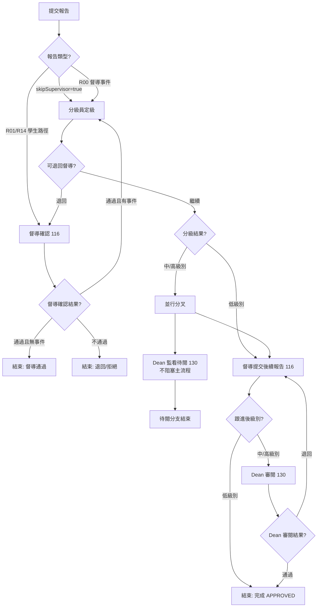

# 事件報告 / 活動報告

> 本文檔面向 Demo 執行人、UAT 測試人與業務培訓人員，目標是讓使用者**不依賴開發人員陪同**，也能完成報告提交與審核全流程。
>
> 本指南基於 `SLAS_PRO` / `SLAS_UI` 當前實現撰寫。
> 角色稱呼以 DB `SYSTEM_ROLE.NAME` 為權威名（見 `roles-menus-permissions-matrix.md`）。

---

## 1. 概念釐清（先讀）

本系統「報告」一詞涵蓋**三種不同事物**，請勿混淆：

| 名稱 | 本質 | reportType | 提交者 | 走 BPMN? |
|:--|:--|:--|:--|:--|
| 督導事件報告 | 事件/事故報告（R00） | `R00` | `Supervisor` | ✓ `incident_report_audit` |
| 翌日活動報告 | 活動結束後 1 日內提交 | `R01` | 活動組織者 | ✓ 同上（學生路徑） |
| 兩週活動報告 | 活動結束後 14 日內提交 | `R14` | 活動組織者 | ✓ 同上（學生路徑） |
| 活動調查問卷 | **參與者滿意度問卷**（評分/回饋），非審批報告 | — | 參與者 | ✗ |

> **重點**：
> - R00 / R01 / R14 共用同一張表 `incident_report`，以 `reportType` 區分，並共用同一條 BPMN `incident_report_audit`。
> - 前端 `views/organiser/SubmitEventReport/` 是**事件處理報告**（5 步精靈）；`views/organiser/SubmitActivityReport/` 實際是**活動調查問卷**（標題即「活動調查問卷」），與 R01/R14 無關，本文不展開其審批（它沒有審批流）。
> - 真正的 R01/R14 活動報告，入口在 `views/incident/ActivityReportList.vue`，審核在 `views/review/ActivityReportReview/`。

---

## 2. 模組概覽

### 2.1 業務目標

- **事件報告（R00）**：督導對活動中發生的事故/安全事件提交報告，由分級員定級並跟進。
- **活動報告（R01/R14）**：活動組織者在活動結束後依時限提交總結報告；若涉及事件，須經督導確認與分級。

### 2.2 觸發條件

- R00：督導在發現事件後主動提交。
- R01：活動結束後**次日**內提交；R14：活動結束後 **14 天**內提交。

### 2.3 結束狀態總覽（`IncidentReportStatusEnum`）

| 狀態 | 業務含義 | 是否可編輯 | 是否終態 |
|:--|:--|:-:|:-:|
| `DRAFT` | 草稿 | ✓ | |
| `SUBMITTED` | 已提交，待審核 | | |
| `PENDING_SV_CONF` | 待督導確認（學生報告路徑） | | |
| `PENDING_CLASSIFY` | 待分級員定級 | | |
| `PENDING_FOLLOW_UP` | 待督導提交後續報告 | ✓ | |
| `IN_REVIEW` | 審核中（待閱/通用） | | |
| `APPROVED` | 已完成 | | ✓ |
| `REJECTED` | 已拒絕（流程終止） | ✓ | ✓ |
| `RETURNED` | 已退回（可重新提交） | ✓ | ✓ |
| `ARCHIVED` | 已歸檔 | | ✓ |

### 2.4 與其他模組的關係

- 報告掛在某個活動（`activityId`）之下；R01/R14 是否出現在「活動報告管理」列表，先取當前使用者可見活動，再收窄為**已通過審批且進入正式活動生命週期**的活動：`activity.approval_status='APPROVED'` 且 `activity.status IN ('PUBLISHED','ONGOING','COMPLETED')`。是否可點擊提交仍再看活動結束日期與 R01/R14 時限。
- 中高級別事件會觸發 Dean / 單位主管的監看與審閱（並行待閱 + 主流程審閱）。

---

## 3. 角色與職責

BPMN `incident_report_audit` 的任務指派採 Flowable **候選組（`ACT_ID_GROUP`）**；候選組 ID 多數與 `SYSTEM_ROLE` ID 一致，但**並非全部**都是 `SYSTEM_ROLE`：

| 候選組 ID | 名稱 | 是否 `SYSTEM_ROLE` | 職責 |
|:-:|:--|:-:|:--|
| 114 | `Group Leader`（`sg_leader`；活動組織者） | ✓ | 提交 R01/R14 活動報告 |
| 116 | `Supervisor`（`supervisor`） | ✓ | 確認學生報告、提交後續（跟進）報告；亦可發起 R00 |
| 128 | `Incident Level Classifier`（`lv_classifier`） | ✓ | 對事件定級，可退回督導 |
| 130 | `Dean of Custodian Unit`（單位主管 / Custodian Unit Head） | ✗ | 中高級別事件的監看（待閱）與主流程審閱，可退回督導 |

> - **候選組 130 不在 12 個 `SYSTEM_ROLE` 之內**（見 `roles-menus-permissions-matrix.md`）；它是 Flowable `ACT_ID_GROUP` 專用指派群組（通知模板稱 "Custodian Unit Head"），與 `Dean of Students`（129）、`Dean`（149）皆為**不同實體**，切勿混淆。
> - 流程啟動權限：候選組 `116`（Supervisor）與 `114`（Group Leader）。

---

## 4. 流程圖（BPMN `incident_report_audit`）

---

## 5. 關鍵步驟詳述

- **核心端點**
  - 事件報告（`IncidentReportController.java`）：`POST /incident`（建立）、`PUT /incident/{id}`（更新草稿）、`GET /incident/{id}/with-review`（報告 + BPM 審核資訊）、`POST /incident/{id}/files`、`POST /incident/reminder/send/{id}`。
  - 活動報告（`ActivityReportController.java`）：`GET /incident/activity-report/page`（R01+R14 彙總分頁）、`/can-submit-next-day`、`/can-submit-fourteen-day`、`/next-day-status`、`/fourteen-day-status`。
- **服務實現**
  - `IncidentReportServiceImpl.createIncidentReport`：生成唯一 `irCode`、設提交者、初始 `status=DRAFT`，JSON 化 `activityTime` / `incidentNature` 等陣列欄位。
  - `ActivityReportServiceImpl.getActivityReportPage`：先透過 `ActivityApi.getReportableActivityIds(userId)` 取得可報告活動（使用者可見 + `APPROVED` + `PUBLISHED/ONGOING/COMPLETED`），再批次取出每個活動的 R01 與 R14，彙總成一行（含可否提交、時限）。
- **BPMN 分支條件**（`incident_report_audit.bpmn20.xml`）
  - `reportTypeGate`：`skipSupervisor==true` → 分級員；`reportType==R01||R14` → 督導確認；`reportType==R00` → 分級員。
  - `supervisorGate`：`confirmed && !hasIncident` → 結束；`confirmed && hasIncident` → 分級員；`!confirmed` → 退回/拒絕。
  - `classifierGate`：預設低級別 → 督導跟進；`incidentLevel==MEDIUM||HIGH` → 並行（Dean 待閱 + 督導跟進）。
  - `followUpGate`：低級別 → 完成；中/高 → Dean 審閱（`deanReviewTask`，退回返回督導跟進）。

---

## 6. 狀態與資料模型

### 6.1 報告類型常量（前端 `constants/incidentEnums.ts`）

`INCIDENT_REPORT_TYPE`：`R01`（翌日事件報告）、`R14`（兩週事件報告）。

### 6.2 關鍵欄位（表 `incident_report`）

`reportType`（R00/R01/R14）、`activityId`、`reporterId`、`status`、`irCode`、`title{,_en,_tc,_sc}`、`incidentNature`（JSON）、`activityTime`（JSON）、`processInstanceId`、`notifiedManagement`（危機升級旗標）、`summaryReport`。

### 6.3 前端入口

- 提交事件處理報告：`views/organiser/SubmitEventReport/index.vue`（5 步：資訊報告 → 級別分類 → 危機評估 → 後續行動 → 批註）。
- R01/R14 列表與提交入口：`views/incident/ActivityReportList.vue`（每活動兩欄：翌日/兩週報告狀態）。
- 審核：`views/review/ActivityReportReview/`（含篩選與待審清單）。
- 活動調查問卷：`views/organiser/SubmitActivityReport/index.vue`（評分/回饋，無審批；最新 UI 改為深色綠系問卷面板、步驟條與表單卡片，屬樣式優化，不改流程）。

### 6.4 活動報告列表顯示規則

- 列表只展示 `getReportableActivityIds` 命中的活動；草稿、待審批、退回、拒絕、取消等活動不再出現在 R01/R14 管理列表。
- 狀態顯示採 i18n key 正規化：前端會把 `PENDING_SV_CONF`、`pending-sv-conf`、`pendingSvConf` 等寫法統一轉成 `pending_sv_conf` 再查 `incident.activityReport.*` 翻譯，找不到翻譯時才回退顯示原始狀態碼。
- 活動狀態目前補齊了 `DRAFT`、`SUBMITTED`、`PENDING`、`NOT_SUBMITTED`、`ENROLLING`、`PUBLISHED`、`ONGOING`、`COMPLETED`、`CANCELLED`、`APPROVED`、`REJECTED`、`RETURNED` 等常見值的中英繁翻譯。
- R14 提交入口有前端前置檢查：必須先有 R01；若 R01 仍是 `PENDING` / 空，或 R01 已 `REJECTED`，會提示先完成翌日報告。

---

## 7. 端到端 Demo 指南

### 7.1 準備條件

- 一個已結束、審批已通過，且狀態為 `PUBLISHED` / `ONGOING` / `COMPLETED` 之一的活動（用於 R01/R14）。
- 帳號：活動組織者（`Group Leader`）、`Supervisor`、`Incident Level Classifier`、`Dean of Custodian Unit`。

### 7.2 主線 A — 活動報告 R01（無事件，最短路徑）

1. **組織者**進 `ActivityReportList`，對已結束且已通過審批的活動點「翌日報告」提交（`reportType=R01`，`hasIncident=false`）。
2. 流程進入督導確認（學生路徑）。
3. **Supervisor**確認「通過且無事件」→ 流程在「督導通過」結束。
   - 驗證點：報告狀態合理流轉至完成/督導通過；`activity-report/next-day-status` 反映結果。

### 7.3 主線 B — 含事件並定級（完整路徑）

1. 組織者提交 R01 並標記有事件（`hasIncident=true`）。
2. **Supervisor**確認通過且有事件 → 進入 `Incident Level Classifier`。
3. **分級員**定級為 `HIGH` → 觸發並行：`Dean of Custodian Unit` 收到監看待閱任務（不阻塞），主流程進入督導跟進。
   - 旁支：分級員可「退回督導」（`backToPrevious=true`）。
4. **Supervisor**提交後續（跟進）報告。
5. 因屬中/高級別 → 進入 **Dean 審閱**；Dean「通過」→ 流程 `APPROVED`；Dean「退回」→ 回到督導跟進重提。
   - 驗證點：狀態依序 `PENDING_SV_CONF → PENDING_CLASSIFY → PENDING_FOLLOW_UP → APPROVED`；`/incident/{id}/with-review` 可見各環節。

### 7.4 主線 C — 督導事件報告 R00

1. **Supervisor**直接發起 R00 → 跳過督導確認，直達分級員。
2. 後續與主線 B 相同（定級 → 跟進 →（中高）Dean 審閱）。

### 7.5 旁支 — 活動調查問卷

1. **參與者**進 `SubmitActivityReport`，選擇已完成活動，填基本資訊 → 活動評分 → 開放回饋 → 提交。
   - 驗證點：問卷提交成功，**不**進入任何審批流程。

---

## 8. 邊界與已知限制

- R01/R14 受時限約束：超過提交窗口（次日 / 14 天）未交，狀態可被置為 `REJECTED`。
- `RETURNED` 與 `REJECTED` 不同：前者可重新提交，後者為流程終止。
- 「活動調查問卷」常被誤認為活動報告；它是滿意度回饋，與 R01/R14 審批無關，請在 Demo 中明確區分。
- 中高級別事件的 Dean 待閱任務（`deanMonitorTask`）為並行不阻塞分支，與主流程的 Dean 審閱（`deanReviewTask`）是兩個不同任務。
- 最新後端收窄的是「活動報告管理列表」資料源；若測試直接手工呼叫建立 / 狀態查詢接口，仍應另外核對活動是否屬於可報告範圍。
