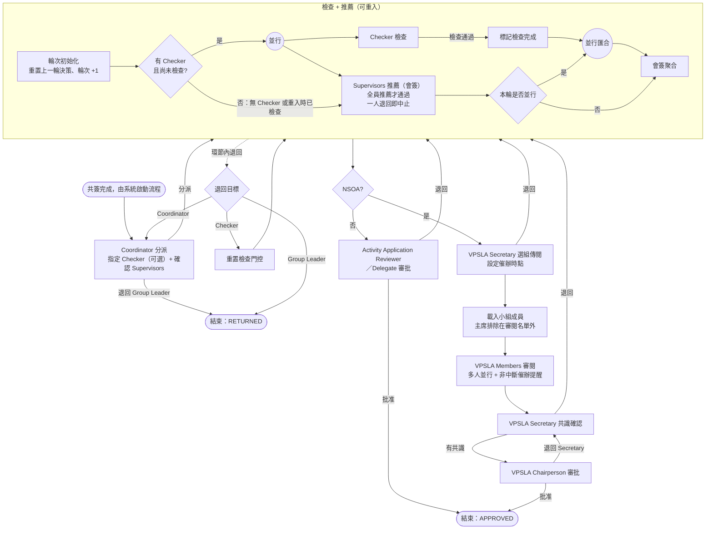

# 活動報告提交與審批流程

> 本文檔描述 SLAS 系統中「活動報告」（活動結束後的總結報告）提交與審批的完整業務流程，覆蓋 NSOA 與非 NSOA 兩種場景。
> 內容以 **2026-08 的實際實作（as-built）** 為準，逐檔比對程式碼與流程定義後撰寫，與 2026-07 的初版設計稿有出入之處已直接改寫，不另註記。
> 除流程節點名稱外，文中凡涉及角色稱呼，均以 `SYSTEM_ROLE.NAME` 為主（見 [roles-menus-permissions-matrix.md](roles-menus-permissions-matrix.md)）。
> 步驟化的操作指引見 [activity-report-submission-guide.md](activity-report-submission-guide.md)。

> **⚠️ 同名釐清。** 系統中有兩套「活動報告」：本文描述的是活動結束後的**總結報告**（流程 `activity_report_approval`）；另一套是事件回報性質的翌日 / 兩週報告（R01 / R14，流程 `incident_report_audit`），見 [activity-report-guide.md](activity-report-guide.md)。兩者的資料表、狀態與審批鏈完全獨立。

---

## 1. 流程概覽

### 1.1 業務目標

活動結束後，由 Group Leader 代表全體 OC（活動籌備委員會）提交活動總結報告，經全體 OC 共簽後進入審批：Coordinator 分派角色 → Checker 檢查（可選）→ 全體 Supervisor 推薦 →

- **NSOA 活動**：VPSLA Secretary 選組傳閱 → VPSLA Members 審閱 → VPSLA Secretary 共識確認 → VPSLA Chairperson 審批；
- **非 NSOA 活動**：跳過 VPSLA 各環節，由 Activity Application Reviewer 或其 Delegate 直接審批。

### 1.2 觸發條件與前置門檻

流程**不是由填寫報告觸發**，而是由「最後一位 OC 完成共簽」觸發。在此之前的門檻依序是：

| # | 門檻 | 不滿足時 |
|:--|:--|:--|
| 1 | 活動結束日期已過 | 不能建立報告 |
| 2 | 該活動尚無報告（一活動一報告） | 不能重複建立 |
| 3 | 操作者是該活動所屬**學生組織的組長**（Group Leader）**或該活動的建立人** | 不能建立 / 編輯 / 發起共簽 |
| 4 | §11 聲明已勾選 | 不能發起共簽 |
| 5 | OC 名單非空，且每位 OC 都有系統帳號（無帳號者系統嘗試自動建立） | 不能發起共簽 |
| 6 | 本輪快照名單內的 OC **全部**完成簽署 | 流程不啟動 |

> 門檻 3 有兩條並列通道（2026-08 調整）：**活動所屬學生組織的組長**，或**該活動的建立人**（`activity.creatorId`）。原先只認組長，導致自己籌辦活動的建立人在報告列表裡看不到該活動；現在兩者都能建立、編輯與發起共簽。文中其餘章節為行文簡潔仍以「Group Leader」代稱這一組人。

### 1.3 報告狀態總覽

| 狀態 | 業務含義 | Group Leader 後續操作 |
|:--|:--|:--|
| `DRAFT` | 草稿 | 編輯、發起共簽 |
| `PENDING_ENDORSEMENT` | 共簽中，內容與 OC 名單鎖定 | 撤回共簽（回 `DRAFT`） |
| `SUBMITTED` | 審批流程進行中 | 只能查看 |
| `RETURNED` | 已退回 Group Leader | 修改後**重新共簽**再提交 |
| `APPROVED` | 審批通過（終局） | — |

另有一個僅存在於「管理活動報告」列表的虛擬狀態 `NOT_STARTED`，表示該活動可以報告但尚未建立報告。

**流程內部各環節不改動主狀態**——報告在整個審批期間都是 `SUBMITTED`，當前所處環節由流程實例的待辦任務呈現（與活動發布審批一致）。

### 1.4 NSOA 與非 NSOA 路徑差異

| 環節 | NSOA | 非 NSOA |
|:--|:--|:--|
| Coordinator 分派 | ✓ | ✓ |
| Checker 檢查 | 可選 | 可選 |
| Supervisors 推薦（會簽） | ✓ | ✓ |
| VPSLA Secretary 選組傳閱 | ✓ | — |
| VPSLA Members 審閱 | ✓ | — |
| VPSLA Secretary 共識確認 | ✓ | — |
| VPSLA Chairperson 審批 | ✓ | — |
| Activity Application Reviewer / Delegate 審批 | — | ✓ |

分支由活動本身的 NSOA 屬性在流程啟動時決定，中途不會改變。

### 1.5 退回矩陣

| 發起環節 | 可選退回目標 | 實際去向 | 報告狀態 |
|:--|:--|:--|:--|
| Coordinator | **只有 Group Leader** | 流程結束 | `RETURNED` |
| Checker | Coordinator / Group Leader | 回 Coordinator 分派環節 / 流程結束 | `SUBMITTED` / `RETURNED` |
| Supervisor | Checker / Group Leader | 重建「檢查 + 推薦」並行結構 / 流程結束 | `SUBMITTED` / `RETURNED` |
| Activity Application Reviewer | 無選項 | 重跑 Supervisor 推薦輪次 | `SUBMITTED` |
| VPSLA Secretary（選組） | 無選項 | 重跑 Supervisor 推薦輪次 | `SUBMITTED` |
| VPSLA Secretary（共識） | 無選項 | 重跑 Supervisor 推薦輪次 | `SUBMITTED` |
| VPSLA Chairperson | 無選項 | 回 VPSLA Secretary 共識環節 | `SUBMITTED` |
| VPSLA Members | **無退回動作** | — | — |

兩個要點：

1. **只有「退回 Group Leader」會結束流程實例**並把報告轉 `RETURNED`；其餘退回都在同一個流程實例內部流轉，報告維持 `SUBMITTED`，Group Leader 不需要也不能介入。
2. **審批後段（Reviewer / VPSLA 選組 / VPSLA 共識）的退回一律回到 Supervisor 推薦環節**，而不是退回 Group Leader。重跑時如果 Checker 已完成檢查，不會再次拉起 Checker 任務，只重建 Supervisor 會簽。

### 1.6 Checker 與 Supervisor 的並行門控

- **Coordinator 指定了 Checker**：Checker 任務與 Supervisors 會簽任務**同時**建立，兩者同時出現在各自待辦。
- **Coordinator 未指定 Checker**：不建立 Checker 任務，直接進入 Supervisors 會簽。
- **Supervisor 必須等 Checker 完成才能提交**：這是**伺服器端強制校驗**，不是只有前端按鈕禁用——繞過介面直接呼叫也會被拒絕。前端在門控狀態查詢失敗時，一律按「未完成」處理（保持禁用），不預設放行。
- Supervisor 退回 Checker 時，門控旗標會被重置，並行結構重新建立。

### 1.7 會簽規則與輪次

- Supervisors 為**多實例會簽**：**全員推薦**才算通過；**任一位確認退回**立即中止本輪，其餘 Supervisor 的未辦任務一併取消。
- 每次進入「檢查 + 推薦」環節都會先做**輪次初始化**：把上一輪的聚合結果與各人單票重置為中性值、輪次號 +1。這保證重入後的新一輪不會被上一輪的殘留決策短路。
- 共簽同樣分輪次：`RETURNED` 之後重新提交會令共簽輪次 +1，並要求**全體 OC 重新簽署**——內容已變更，原簽署失效。

### 1.8 歷次流程實例的可追溯性

報告與流程實例是一對多。每次啟動都會登記一筆流程實例記錄（含共簽輪次、起訖時間、結果）。報告詳情頁的審批歷史，是把**歷次實例**的審批意見合併呈現，因此退回重提之後仍能往回翻閱首輪的意見與 Supervisor 推薦記錄。表單 §12「Supervisor 認可」區塊即由這批審計記錄渲染，不另存簽名。

---

## 2. 角色與職責

**本流程不新增系統角色**，全部複用既有角色。

| 角色（`SYSTEM_ROLE.NAME`） | 流程節點 | 指派方式 | 可做的動作 |
|:--|:--|:--|:--|
| `Group Leader`（`sg_leader`, 114） | 流程外 | 活動所屬學生組織的組長，**或該活動的建立人** | 建立 / 編輯報告、發起與撤回共簽 |
| OC 成員 | 流程外 | 活動成員中角色屬於 OC 者 | 簽署；末簽觸發流程啟動 |
| `Coordinator`（`coordinator`, 115） | `coordinatorTask` | 候選組 115 | 分派 / 退回 |
| `Activity Application Checker`（`activity_checker`, 142） | `checkerTask` | Coordinator 指定單人 | 檢查通過 / 退回 |
| `Supervisor`（`supervisor`, 116） | `supervisorsTask` | 該活動已存檔的督導**全量**，介面唯讀、Coordinator 只確認不增刪 | 推薦 / 確認退回 |
| `VPSLA Secretary`（`vp_secretary`, 146） | `vpSelectionTask`、`vpConsensusTask` | 候選組 146 | 選組傳閱、共識確認 / 退回 |
| VPSLA Members | `vpMembersTask` | 由所選 VPSLA 審批小組載入，**主席自動排除在審閱名單外** | 只有「已審閱」 |
| VPSLA Chairperson | `chairpersonTask` | 所選小組的主席 | 批准 / 退回 |
| `Activity Application Reviewer`（`act_app_reviewer`, 149）／`Delegate`（`delegate`, 150） | `reviewerTask` | 候選組 149 / 150，Delegate 經代理設定解析 | 批准 / 退回 |

**分派時的伺服器端校驗**：

- 被指定為 Checker 的人**必須持有角色 142**，否則拒絕分派；
- 被確認的 Supervisors **必須是該活動已存檔督導名單的子集**。前端下拉已帶出該名單全量並**設為唯讀**（2026-08 起 Coordinator 不能再摘掉其中任何一位），後端的子集校驗作為第二道防線保留；
- Supervisors 不得為空。

---

## 3. 流程圖

節點鍵對照（供對照系統待辦與日誌）：`coordinatorTask`、`checkerTask`、`supervisorsTask`、`reviewerTask`、`vpSelectionTask`、`vpMembersTask`、`vpConsensusTask`、`chairpersonTask`。

---

## 4. 步驟詳述

### ① Coordinator 分派（`coordinatorTask`）

- **誰**：候選組 `Coordinator`（115）。
- **動作**：
  - **分派** — 指定 Checker（可留空表示不需檢查）、確認 Supervisors 名單（該名單唯讀，等同該活動已存檔督導全量）。
  - **退回** — 唯一去向是 Group Leader，流程結束、報告轉 `RETURNED`。
- **校驗**：見 §2 的分派校驗三條。

### ② Checker 檢查（`checkerTask`，可選）

- **誰**：Coordinator 指定的那一位 `Activity Application Checker`（142）。
- **動作**：檢查通過（解除 Supervisor 的提交門控）／ 退回至 Coordinator 或 Group Leader。
- 未指定 Checker 時本節點不存在，門控直接視為已完成。

### ③ Supervisors 推薦（`supervisorsTask`，會簽）

- **誰**：Coordinator 確認的全體 Supervisor，多實例並行。
- **動作**：推薦 ／ 確認退回（退回 Checker 或 Group Leader）。
- **門控**：有 Checker 而尚未檢查完成時，提交被伺服器端拒絕。
- **聚合**：全員推薦 → 進入下一階段；任一人退回 → 立即中止本輪並依退回目標路由。

### ④ 非 NSOA：Reviewer 審批（`reviewerTask`）

- **誰**：候選組 `Activity Application Reviewer`（149）／`Delegate`（150）。
- **動作**：批准（流程結束、報告轉 `APPROVED`）／ 退回（重跑 Supervisor 推薦輪次）。

### ⑤ NSOA：VPSLA 選組傳閱（`vpSelectionTask`）

- **誰**：候選組 `VPSLA Secretary`（146）。
- **動作**：選定傳閱小組 + 設定催辦提醒時點（**兩者皆必填**）／ 退回（重跑 Supervisor 推薦輪次）。

### ⑥ NSOA：VPSLA Members 審閱（`vpMembersTask`）

- **誰**：所選小組的成員（**主席不列入審閱名單**），多實例並行。
- **動作**：只有「已審閱」，**沒有退回**。
- **催辦**：到達設定時點時，系統向尚未提交的成員發出提醒。這是**非中斷**提醒——不會自動完成任務、不視為無異議，流程持續等待全員提交。逾時語義待需求方確認（見 §8）。

### ⑦ NSOA：VPSLA 共識確認（`vpConsensusTask`）

- **誰**：候選組 `VPSLA Secretary`（146）。
- **動作**：確認有共識（送交主席）／ 退回（重跑 Supervisor 推薦輪次）。

### ⑧ NSOA：VPSLA Chairperson 審批（`chairpersonTask`）

- **誰**：所選小組的主席。
- **動作**：批准（流程結束、報告轉 `APPROVED`）／ 退回（回到 ⑦ 共識確認）。

### ⑨ 流程結束後的回寫

| 結束方式 | 報告狀態 | 附帶處理 |
|:--|:--|:--|
| 批准 | `APPROVED` | 清空退回原因 |
| 退回 Group Leader | `RETURNED` | 記錄退回原因；**共簽狀態一併重置**，重新提交須全體 OC 再簽一輪 |

兩種結束都會回寫該次流程實例的結果與結束時間，供 §1.8 的跨實例追溯使用。

---

## 5. 通知設計

待辦與通知中的環節名稱，統一採用需求文檔 2.1 節的官方步驟名，並提供三語翻譯：Role Assignment / Post-event Evaluation Report Submission Check / Post-event Evaluation Report Submission Recommendation / VPSLA Selection and Circulation Check / Post-event Evaluation Report Review / VPSLA Consensus Check / Post-event Evaluation Report Approval。

> 需求文檔的第一個步驟名 **Post-event Evaluation Report Submission** 對應流程的起始事件（共簽完成觸發），不是待辦任務，因此不會出現在待辦列表中，也未納入上述任務名翻譯。

| 觸發點 | 接收人 |
|:--|:--|
| 發起共簽 | 全體 OC 成員（含直達簽署頁的連結） |
| 全員簽署完成、流程啟動 | Group Leader + Coordinator |
| 各審批環節到達 | 對應角色（**Checker 與 Supervisors 同時**收到） |
| 退回（各來源） | 退回目標方（Group Leader / Coordinator / Checker / Supervisors / VPSLA Secretary） |
| 審批通過 | Group Leader + 全體 OC |
| VPSLA 催辦時點到達 | 尚未提交的 Members（僅提醒，不改變任務狀態） |

---

## 6. 權限與菜單

| 權限串 | 用途 |
|:--|:--|
| `activity:report:query` | 查看報告與列表 |
| `activity:report:create` | 建立草稿、取得預載資料 |
| `activity:report:update` | 儲存草稿 |
| `activity:report:submit` | 發起 / 撤回共簽、簽署 |
| `activity:report:approve` | 審批端所有動作 |

菜單「管理活動報告」（ID 6580）掛在組織者中心下，預設授予角色 114 `Group Leader`。

---

## 7. 與需求文檔 2.2 節的逐條對應

| 需求條目 | 實作落點 |
|:--|:--|
| 1 Group Leader 代表提交 | 建立 / 編輯 / 發起共簽三處均校驗操作者為活動所屬學生組織的組長或活動建立人（§1.2 門檻 3） |
| 2 全體 OC 共簽 | 分輪次的共簽快照，末簽在同一交易內原子啟動流程（§1.2、§1.7） |
| 3 Coordinator 角色分派 | `coordinatorTask`（§4①） |
| 4 Checker 可選 | 未指定 Checker 時不建立該任務，門控直接放行（§1.6） |
| 5 Checker / Supervisor 同時待辦 | 並行建立兩個任務（§1.6） |
| 6 Supervisor 需待 Checker 完成 | 伺服器端強制門控（§1.6） |
| 7 一名 Supervisor 即可確認退回 | 會簽短路，其餘任務一併取消（§1.7） |
| 8 全員推薦才通過 | 會簽聚合 + 每輪重置（§1.7） |
| 9 NSOA 走 VPSLA 四環節 | §4⑤–⑧ |
| 10 非 NSOA 由 Reviewer / Delegate 審批 | §4④，候選組 149 / 150 |
| 11 OC 名單預載 + 差異備註 | 預載自活動成員，逐行保留「是否預載」標記與差異備註欄 |
| 12 PDF 匯出 | **範圍外**，見 §8 |

---

## 8. 範圍外、待確認與已知限制

### 8.1 範圍外（明確不做）

- **PDF 匯出**（需求第 12 條）：長期需求，本期不實作。
- **VPSLA 環節的 AI 摘要與多輪共識循環**：活動發布審批有，報告流程需求未要求，結構預留可後加。

### 8.2 待需求方確認

1. **VPSLA Members 審閱逾時語義**：需求文檔未定義截止規則或「逾期視為無異議」。自動完成任務會直接改變審批結果，屬新增業務規則。確認前的做法是：僅在設定時點發催辦提醒，不自動完成，流程等待全員提交。
2. **§11 聲明的簡體中文措辭**：模板僅提供英文與繁體原文（實作時逐字沿用），簡體為新譯本。該聲明涉及學生紀律處分與法律責任，正式上線前須經需求方確認。

### 8.3 已知限制

- **VPSLA（NSOA）分支尚無完整實跑記錄**：截至 2026-08，測試環境已有多份報告走完非 NSOA 路徑並結案，但 VPSLA 選組、Members 審閱、共識、主席四個節點的歷史實例數為 0。§1.5 的退回矩陣中，「退回 Group Leader」與「Supervisor 退回 Checker」已有實跑記錄，**「Checker 退回 Coordinator」以及審批後段（Reviewer／VPSLA 選組／VPSLA 共識／Chairperson）的各條退回尚未被實例走過**。UAT 應優先覆蓋 NSOA 全鏈與這批未走過的退回路徑。
- **VPSLA Members 沒有退回動作**，只能標記「已審閱」。
- **Coordinator 的退回只有一個去向**（Group Leader），介面不提供其他選項。
