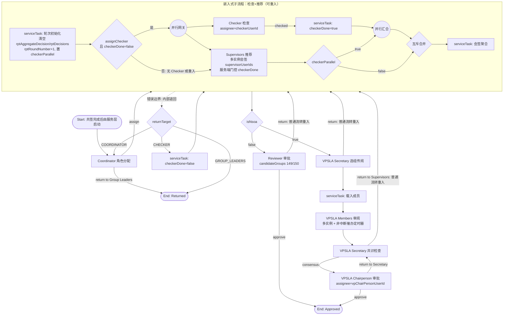

# 活动报告提交工作流设计方案 (Activity Report Submission)

**创建日期**: 2026-07-23
**项目**: SLAS (Student-Led Activities System)
**模块**: slas-module-activity + slas-module-bpm
**需求来源**: [docs/specs/markdown/activity-report-requirements.md](../specs/markdown/activity-report-requirements.md)

---

## 一、背景与目标

### 1.1 需求背景

活动结束后，Group Leader 须代表全体 OC（活动筹备委员会）成员提交《Activity Report》（活动报告），经 Coordinator 角色分配、Checker 检查（可选）、全体 Supervisor 推荐后：

- **NSOA 活动**：继续经 VPSLA Secretary 选组传阅 → VPSLA Members 审阅 → VPSLA Secretary 共识检查 → VPSLA Chairperson 审批；
- **Non-NSOA 活动**：跳过 VPSLA 各环节，由 Activity Application Reviewer / Delegate 直接审批。

### 1.2 现状与替换范围

代码库中存在**两个从未启用的旧报告流程概念**，本方案一并替换，不保留兼容别名：

1. **`activity_summary_approval`**（占位 BPMN，Supervisor → Vetting Panel 两级）：无业务实体表、无启动调用（`BpmBusinessIntegrationTemplate.startActivitySummaryProcess` 无任何调用方）、无前端入口（`summaryApi.ts` 无人引用），仅有 BPMN 定义及部署/通知/翻译接线。
2. **`activity_report_audit`**（幽灵流程 key）：无 BPMN 文件、无部署，但在通知链路中残留成套接线——`ActivityReportVariableBuilder`（PROCESS_KEY 硬编码该 key）、`BpmTaskNotificationAsyncService`、`BpmNotificationI18nHelper`、`BpmProcessCompletionNotificationService/ApiImpl`、`BpmTaskServiceImpl`、`BpmNotificationConfig`、`NotificationSampleService` 等均按该 key 分支。

**决策：两个旧概念全部删除，所有接线统一为新流程 key `activity_report_approval`；不做存量数据迁移，按新设计实现。** 完整替换清单见第九章。删除前须先在 DEV/UAT Flowable 引擎中查询确认 `activity_report_audit` 无部署定义与历史实例（`activity_summary_approval` 已确认仅有定义、无实例）。

### 1.3 复用基础（关键结论）

| 需求点 | 现有可复用实现 | 位置 / 说明 |
| --- | --- | --- |
| 八环节审批流结构 | `activity_publish` 流程已实现 Coordinator / Checker(可选) / Supervisors 会签 / VP Secretary 选组 / VP Members 投票 / 共识检查 / Chairperson 决定全套节点 | `slas-server/src/main/resources/processes/activity_publish.bpmn20.xml` |
| OC 全员共同签署 | 活动申请阶段已有 `activity_oc_endorsement` 表 + `activity.oc_endorse_status`（PENDING/PARTIAL/ALL_ENDORSED）状态机 | `sql/patch/0004_013_add_activity_publish_roles.sql` |
| “并行下发 + 门控提交”交互模式 | publish 流程 VP/IRG 并行分支：VP 成员任务并行创建，提交由 `irgCompleted` 变量门控。**注意：该门控现状仅有前端实现**——`vpMemberVote` 服务端无校验，且 `VpVoteForm.vue` 查询失败时默认放行。因此仅复用其交互与变量模式，**服务端任务级校验为本项目新实现**（见 4.2(2)） | BPMN `vpMembersVoteTask` 注释；`ActivityApprovalServiceImpl.vpMemberVote`；`VpVoteForm.vue` |
| NSOA 判定 | `ActivityDO.isNsoa` + `ActivityApprovalScenarioEnum`（A1–A4 = NSOA） | activity-api |
| OC 名单预载 | `activity_member`（roleType=OC）/ `activity_oc_member`，含无账号 SID 自动建号先例（`syncOcMembersFromActivityMembers`） | activity-biz |
| 出席记录 | `activity_attendance`（attendanceType=CHECK_IN/CHECK_OUT） | activity-biz |
| 财务预算 | `activity_budget`（budgetType=INCOME/EXPENSE，含预计金额） | activity-biz |
| Reviewer/Delegate | Activity Application Reviewer(149) / Delegate(150) 候选组 + `role_delegate_config` 代理配置 | 角色正式名称以 `sql/patch/0004_027_sync_role_menu_permissions.sql` 种子数据为准 |
| VPSLA 角色 | VPSLA Secretary(146) / VPSLA Member(147)，种子数据名称与需求文档角色名完全一致；Chairperson 是 VPSLA Member 之一（种子数据备注明确） | 同上 |
| 会签聚合 | `ActivitySupervisorAggregateDelegate` 粘性聚合决策模式（粘性仅在单轮内有效，重入轮次须重置，见 4.2(4)） | bpm-biz |

---

## 二、总体架构

```
前端 (SLAS_UI)
  ├─ 学生端：报告填写/编辑、OC 共签、状态跟踪
  └─ 审批端：各角色审批页（复用 bpm/task 待办框架）
        ↓ REST
slas-module-activity-biz
  ├─ ActivityReportController (/activity/report/**)
  ├─ ActivityReportService（表单 CRUD、预载、共签、提交）
  └─ dal: activity_report 及子表
        ↓ bpm-api（依赖倒置，接口定义在 bpm-api，实现在 activity-biz）
slas-module-bpm-biz
  ├─ activity_report_approval.bpmn20.xml（新流程，替换旧流程）
  ├─ Delegates（轮次初始化、聚合、门控标记、状态回写）
  └─ 通知（BpmNotificationConfig + 三语模板）
```

模块依赖遵循现有规则：BPM 保持业务无关，需要读取报告数据时通过 bpm-api 定义接口、activity-biz 提供实现（与 `ActivityPublishApprovalApi` 同模式）。

**Business Key 约定**：流程实例 businessKey = 纯数字 `reportId` 字符串（不带前缀、不带时间戳）。现有状态回写监听器 `ActivityBpmEventListener.parseEntityId` 仅解析纯数字 businessKey，旧 `startActivitySummaryProcess` 的 `activity_summary_{id}_{timestamp}` 格式与之不兼容，新启动方法不沿用该格式。流程变量中同时冗余 `reportId`，监听器优先取变量、businessKey 兜底。

---

## 三、数据库设计

所有标识符 ≤ 30 字符（Oracle 11g 限制），均继承 BaseDO 审计字段（creator/create_time/updater/update_time/deleted/tenant_id），主键 Snowflake `ASSIGN_ID`。

### 3.1 activity_report（报告主表）

| 列 | 类型 | 说明 |
| --- | --- | --- |
| ID | NUMBER(20) | PK |
| ACTIVITY_ID | NUMBER(20) | 关联 activity，一活动一份有效报告（UNIQUE + deleted 过滤） |
| STATUS | VARCHAR2(30) | 见 3.8 状态机 |
| ACTIVITY_NAME | VARCHAR2(500) | 表单§1，预载自 activity，可编辑 |
| ORGANISER_NAMES | VARCHAR2(1000) | 表单§2 |
| OBJECTIVES | CLOB | 表单§4 |
| SUMMARY | CLOB | 表单§5（内容/模式/参与数据概述） |
| OBSERVATIONS | CLOB | 表单§6（五个反思范畴） |
| RECOMMENDATIONS | CLOB | 表单§8 |
| TOTAL_INCOME_EST / TOTAL_INCOME_ACT | NUMBER(12,2) | 总收入（预计/实际），冗余汇总 |
| TOTAL_EXPENSE_EST / TOTAL_EXPENSE_ACT | NUMBER(12,2) | 总支出（预计/实际） |
| ATTENDANCE_FILE_IDS | VARCHAR2(1000) | 表单§9 附件（JSON 数组），出席数据另有快照接口 |
| MEDIA_CONSENT | NUMBER(1) | 表单§10 已取得相关人士同意声明 |
| ENDORSE_STATUS | VARCHAR2(20) | 当前轮共签状态 PENDING/PARTIAL/ALL_ENDORSED |
| ENDORSE_VERSION | NUMBER(4) | 当前共签轮次，发起共签时确定；退回重提交后 +1 |
| PROCESS_INSTANCE_ID | VARCHAR2(64) | **当前**流程实例；历史实例见 3.6 |
| SUBMITTER_USER_ID | NUMBER(20) | 提交的 Group Leader |
| SUBMIT_TIME | DATE | |
| RETURN_REASON | VARCHAR2(2000) | 最近一次退回原因（退回详情走 bpm_audit_log） |

表单§7 的 **Grand Total（總計）行不建列**：预计/实际两列分别按 Total Income − Total Expenditure（结余，可为负）由前端实时计算展示，与 Total Income/Total Expenditure 两行一并呈现（模板财务表共三行汇总）。

### 3.2 activity_report_oc_member（OC 名单快照，表单§3）

预载自 `activity_member`（roleType=OC），学生可增删改并备注差异（需求第 11 条）。

| 列 | 说明 |
| --- | --- |
| ID / REPORT_ID | PK / FK |
| USER_ID / STUDENT_ID / FULL_NAME / PROG_CODE | 成员信息（PROG_CODE 为课程编号，预载自 SSO enrichment 的用户 `progCode`，源 `BAN_STUDENT_DETAIL.PROGRAM`；`activity_member.department_code` 是部门/学院代码，不用作课程编号。SSO 无法解析时留空，由学生填写） |
| IS_ONSITE_LEADER / IS_ONSITE_OBSERVER | NUMBER(1)，表单在场角色两列 |
| PRELOADED | NUMBER(1)，1=系统预载行，0=学生新增行 |
| DISCREPANCY_REMARK | VARCHAR2(1000)，OC 变更差异备注 |
| SORT_ORDER | 显示顺序 |

本表是**报告展示名单**；每轮共签的**签署人集合**在发起共签时另行快照到 3.5 表，两者职责分离——发起共签后名单锁定（仅 DRAFT/RETURNED 状态可编辑），撤回共签方可再改，签署人集合不随名单编辑漂移。

### 3.3 activity_report_finance（财务收支行，表单§7）

| 列 | 说明 |
| --- | --- |
| ID / REPORT_ID | PK / FK |
| FINANCE_TYPE | INCOME / EXPENSE |
| ITEM_DESC | VARCHAR2(500)，项目描述 |
| AMOUNT_ESTIMATED | NUMBER(12,2)，预载自 activity_budget.amount |
| AMOUNT_ACTUAL | NUMBER(12,2)，学生填写 |
| BUDGET_ID | NUMBER(20)，可空，回链 activity_budget 行 |
| SORT_ORDER | |

### 3.4 activity_report_media（照片/视频，表单§10）

| 列 | 说明 |
| --- | --- |
| ID / REPORT_ID / FILE_ID | 关联 slas-module-file |
| MEDIA_TYPE | PHOTO / VIDEO |
| DESCRIPTION | VARCHAR2(500) |

`FileTypeEnum` 新增 `AUDIT_ACTIVITY_REPORT` 类型；现有常量 `AUDIT_ACTIVITY_SUMMARY_REPORT` 若确认无存量文件引用则一并删除（见第九章）。

### 3.5 activity_report_endorsement（OC 共签，表单§11）

结构参考 `activity_oc_endorsement`，并补充轮次与并发不变量：

| 列 | 说明 |
| --- | --- |
| ID / REPORT_ID / USER_ID / STUDENT_ID | 签署人（发起共签时从 3.2 表快照生成） |
| VERSION | 共签轮次，= 主表 ENDORSE_VERSION |
| ENDORSED | NUMBER(1) |
| ENDORSED_TIME | DATE |

**不变量与并发控制**：

1. **签署人快照**：`submit-endorsement` 时按 3.2 表当前名单生成本轮全部签署记录；此后名单锁定，本轮签署人集合固定，Group Leader 无法通过删改名单绕过"全体 OC 共签"。
2. **账号前置校验**：发起共签前，名单中每行必须解析到系统账号；无账号 SID 复用 `syncOcMembersFromActivityMembers` 的自动建号机制，建号失败则拒绝发起（错误码 `ACTIVITY_REPORT_OC_NO_ACCOUNT`），杜绝"永远无法签完"的死局。
3. **唯一约束**：`UK_ACT_RPT_ENDORSE (REPORT_ID, USER_ID, VERSION)`，防重复签署。
4. **末签原子性**：签署接口在同一事务内先 `SELECT ... FOR UPDATE` 锁定报告主表行，再写签署记录、统计未签数量；数量为 0 时在锁内完成 状态→SUBMITTED + 启动流程实例，保证并发签署下流程恰好启动一次。
5. 退回重提交时 ENDORSE_VERSION+1，旧轮记录保留作审计，新轮重新快照、全员重签。

### 3.6 activity_report_process（流程实例历史）

报告可能经历多次"退回 Group Leaders → 重提交"，每次重提交启动新流程实例。主表仅保存当前实例，历史实例在此表登记，保证退回前的审批意见与 Supervisor 推荐记录可完整追溯（现有 `BpmAuditApiImpl` 按单实例/精确 businessKey 查询，详情页据此表聚合多实例审计）。

| 列 | 说明 |
| --- | --- |
| ID / REPORT_ID | PK / FK |
| PROCESS_INSTANCE_ID | Flowable 实例 ID |
| ENDORSE_VERSION | 对应共签轮次 |
| START_TIME / END_TIME | |
| OUTCOME | RUNNING / RETURNED / APPROVED |

### 3.7 Supervisor 认可（表单§12）——不建表

纸质表单的 Supervisor 签名对应工作流"Submission Recommendation"环节的推荐动作本身，审计信息（who/when/comment）由现有 `bpm_audit_log` 承载。报告详情页从 3.6 表关联的全部流程实例审计记录渲染§12 区块（最终以批准实例为准，历史实例供追溯）。

### 3.8 报告状态机

```
DRAFT ──提交共签──> PENDING_ENDORSEMENT ──全员签署──> SUBMITTED(流程启动)
  ↑                        │撤回                          │
  └────────────────────────┘                             ├─ 审批中退回 Group Leaders ──> RETURNED ──修改后重新走共签──> PENDING_ENDORSEMENT
                                                          └─ 审批通过 ──> APPROVED
```

- RETURNED 后重新提交将 ENDORSE_VERSION+1 并要求全体 OC **重新共签**（内容已变更，原签署失效）。
- 流程内部各环节不改主状态，前端通过流程实例的当前任务展示所处环节（同 publish 流程做法）。
- 流程结束时状态回写依赖 businessKey=纯 reportId 约定（见第二章），由 `ActivityBpmEventListener` 新增 `activity_report_approval → ACTIVITY_REPORT` 分支处理。

---

## 四、BPMN 流程设计

新流程文件 `activity_report_approval.bpmn20.xml`，process id = `activity_report_approval`，替换删除 `activity_summary_approval.bpmn20.xml`。

### 4.1 流程图



### 4.2 核心设计点

**(1) OC 共签在流程外（服务层前置门）**

与 publish 流程的 `oc_endorse_status` 同模式：`submitForEndorsement` 快照签署人并通知全体 OC；最后一名 OC 签署时服务层在行锁事务内原子启动流程（见 3.5 不变量）。BPMN 不含共签节点，保持流程简洁。

**(2) Checker/Supervisor 并行门控（需求 5、6 条）**

- **有 Checker 且未检查**（首轮指定了 Checker，或 Supervisor 退回 Checker 后重入）：并行网关同时创建 Checker 任务和 Supervisors 多实例任务，两者同时出现在待办（需求 5）；两分支在并行汇合网关合流。
- **无 Checker 或重入时已检查**（assignChecker=false，或高层退回重入且 checkerDone=true）：不经过并行结构，直接创建 Supervisors 任务，经互斥合并汇入聚合节点。**并行汇合网关只在并行路径上出现**，两条路径各自独立出口、最终互斥合并，任何路径都不会在汇合网关上等待不存在的 token。
- Supervisors 任务节点带 `checkerParallel` 出口网关：本轮走了并行结构则汇入并行汇合，否则直入互斥合并。
- **提交门控是服务端强制校验**：Supervisor 推荐提交接口在完成 Flowable 任务前校验流程变量 `checkerDone == true`，不满足即抛 `ACTIVITY_REPORT_CHECKER_NOT_DONE`（无 Checker 路径由轮次初始化直接置 true）。前端按钮禁用仅是辅助体验；门控查询失败时前端**按未完成处理（禁用提交）**，不默认放行。publish 流程的 `irgCompleted` 门控现状为前端实现、后端无校验，本流程不复用该缺陷，服务端校验为新实现，并配套绕过前端直调接口的测试（见 10.2）。

**(3) 子流程重入与退回路由**

"检查+推荐"包为嵌入式子流程，退回分两类，路由机制不同：

- **子流程内部发起的退回**（Checker→Coordinator/Group Leaders，Supervisor→Checker/Group Leaders）：抛 BPMN Error，由**附着在子流程上的错误边界事件**捕获——Flowable 自动取消子流程内全部并行任务，再按 `returnTarget` 变量路由：COORDINATOR → Coordinator 任务；CHECKER → 重置 checkerDone=false 后重入子流程（重走并行结构）；GROUP_LEADERS → endEventReturned。
- **子流程之后环节发起的退回**（Reviewer 退回、VPSLA Selection 退回、共识检查退回 Supervisors）：此时子流程已结束，边界事件不存在也无任务可取消，退回是**普通 sequence flow 直接重入子流程**（BPMN 子流程支持多条入边）。重入时 checkerDone 保持 true，子流程内部网关自动走"仅 Supervisors"路径——高层退回只重建 Supervisor 任务，不会错误地再次拉起 Checker，与需求"退回上一环节 Supervisors"一致。

**(4) 推荐轮次初始化与会签聚合**

现有 `ActivitySupervisorAggregateDelegate` 的粘性语义（已有 RETURN/REJECT 则直接保留）只在单轮会签内正确；跨轮次残留会使重入后的新一轮立即短路。因此子流程入口固定放置**轮次初始化 serviceTask**：清空 `rptAggregateDecision`、`rptDecisions` 及各 Supervisor 单票变量，`rptRoundNumber` 自增，并按本轮是否走并行结构置 `checkerParallel`。新建 `activityReportSupervisorAggregateDelegate`（逻辑参考现有 delegate，粘性仅约束本轮，输出 `rptAggregateDecision`）。多实例配置照抄 publish：completionCondition 含 `rptAggregateDecision == 'RETURN'` 短路——一名 Supervisor 确认退回立即结束会签（需求 7）；全员推荐才算通过（需求 8）。

**(5) NSOA 分支与 VPSLA 环节**

- `isNsoa` 变量在流程启动时从 `ActivityDO.isNsoa` 注入；
- VPSLA 四环节结构参考 publish 的 VP 分支（选组→载入→多实例审阅→共识→主席），**不含 IRG 并行、不含 AI 总结、不含 3 轮循环**（需求未要求，按最小实现）；
- Members 审阅节点挂**非中断催办定时器**：Secretary 选组时设定提醒时点，到期向未提交成员发催办通知，**不自动完成任务、不默认视为无异议**——需求文档未定义超时语义，自动化处理须待需求方确认（见 11.3），确认前流程等待全员提交；
- Chairperson 退回 Secretary = 流转回共识检查任务；共识检查退回 Supervisors 与 Selection 退回均为普通流转重入子流程（见 (3)）。

**(6) Non-NSOA 审批**

`reviewerApprovalTask` 使用候选组 Activity Application Reviewer(149) / Delegate(150)——149 的种子数据正式名称即 "Activity Application Reviewer"，与需求文档角色名逐字一致；Delegate 经 `role_delegate_config` 代理机制解析。approve → 结束；return → 普通流转重入子流程（上一环节 Supervisors）。

**(7) 退回 Group Leaders 的语义**

与 publish 一致：流程实例以 `endEventReturned` 结束，报告状态置 RETURNED（businessKey=reportId 回写），实例登记入 3.6 历史表；Group Leader 修改后重新共签、启动新实例。不保留半途实例。

### 4.3 流程变量表

| 变量 | 类型 | 来源 | 用途 |
| --- | --- | --- | --- |
| reportId / activityId | Long | 启动参数 | 业务关联；reportId 同时作 businessKey |
| isNsoa | Boolean | ActivityDO | NSOA 分支 |
| assignChecker / checkerUserId | Boolean / Long | Coordinator 任务表单 | 可选检查步骤 |
| supervisorUserIds | List | 活动已批 Supervisor（activity_supervisor），Coordinator 可确认 | 会签集合 |
| checkerDone | Boolean | 无 Checker 时初始化置 true；Checker 完成后 serviceTask 置 true；退回 Checker 时重置 false | Supervisor 提交服务端门控 |
| checkerParallel | Boolean | 轮次初始化置位 | 本轮是否走并行结构（Supervisors 出口网关路由） |
| rptRoundNumber | Integer | 轮次初始化自增 | 推荐轮次标识 |
| rptAggregateDecision / rptDecisions | String / List | 聚合 delegate（粘性仅限本轮，轮次初始化清空） | RECOMMEND_ALL / RETURN 判定 |
| returnTarget | String | 退回动作表单 | COORDINATOR / CHECKER / GROUP_LEADERS |
| vpSecretaryRoleId=146, vpMemberUserIds, vpChairPersonUserId | — | 同 publish | VPSLA 环节 |
| vpReminderTime | Date | Secretary 选组表单 | Members 审阅催办提醒时点（非中断） |
| vpConsensus | Boolean | 共识检查表单 | 分支 |
| reviewerGroupIds | List | 149/150（经 role_delegate_config 解析） | Non-NSOA 审批候选组 |

---

## 五、后端 API 设计

Controller：`activity/controller/admin/report/ActivityReportController.java`，路径前缀 `/activity/report`。

### 5.1 学生端（Group Leader / OC）

| 方法 | 路径 | 说明 |
| --- | --- | --- |
| POST | /create | 创建草稿（校验：活动已结束、无进行中报告、操作者为该活动 Group Leader） |
| GET | /preload/{activityId} | 预载数据包：活动名称/主办方、OC 名单（activity_member + SSO enrichment 的 progCode 课程编号）、财务预计行（activity_budget）、出席统计 |
| PUT | /update | 保存草稿（仅 DRAFT/RETURNED 可编辑；PENDING_ENDORSEMENT 起名单与内容锁定） |
| GET | /get?id= | 报告详情（含子表、共签进度、跨实例流程审计） |
| POST | /submit-endorsement | 发起共签：校验全员账号（无账号先自动建号，失败拒绝）→ 快照签署人集合 → 状态→PENDING_ENDORSEMENT → 通知全体 OC |
| POST | /withdraw-endorsement | 共签期撤回：状态→DRAFT，作废本轮签署记录 |
| POST | /endorse | OC 成员签署。校验：本人在**本轮快照签署集合**内且未签（UK 兜底）。末签在行锁事务内原子完成状态变更与流程启动（见 3.5） |
| GET | /attendance/{activityId} | 出席记录快照（教大学生：SID/姓名/课程编号（SSO progCode）/签到签退；访客：姓名/角色/签到签退） |

### 5.2 审批端（走通用 BPM 待办 + 报告专用查询/操作）

| 方法 | 路径 | 说明 |
| --- | --- | --- |
| GET | /approval/detail?reportId= | 审批详情（报告全文 + 当前环节 + 按 3.6 表聚合的全实例历史审计） |
| POST | /approval/coordinator | 角色分配提交（checker 可选、确认 supervisors）或退回 |
| POST | /approval/checker | 检查通过 / 退回（returnTarget=COORDINATOR/GROUP_LEADERS） |
| POST | /approval/supervisor | 推荐 / 确认退回。**服务端强制校验 checkerDone==true**，否则拒绝（不依赖前端禁用） |
| POST | /approval/vp-secretary/select | VPSLA 选组传阅（含催办提醒时点） |
| POST | /approval/vp-member | Members 审阅意见提交 |
| POST | /approval/vp-secretary/consensus | 共识确认 / 退回 Supervisors |
| POST | /approval/chairperson | 批准 / 退回 Secretary |
| POST | /approval/reviewer | Non-NSOA 批准 / 退回 |

审批操作统一经 `BpmTaskService.approveTask/rejectTask` 完成任务并写入流程变量，模式与 `ActivityApprovalController` 一致。

### 5.3 错误码（activity 模块段位新增）

`ACTIVITY_REPORT_NOT_EXISTS`、`ACTIVITY_REPORT_ALREADY_EXISTS`、`ACTIVITY_NOT_ENDED`、`ACTIVITY_REPORT_STATUS_INVALID`、`ACTIVITY_REPORT_NOT_OC_MEMBER`、`ACTIVITY_REPORT_ALREADY_ENDORSED`、`ACTIVITY_REPORT_OC_NO_ACCOUNT`、`ACTIVITY_REPORT_CHECKER_NOT_DONE`、`ACTIVITY_REPORT_MEDIA_CONSENT_REQUIRED`（英式英语消息，前端以消息原文作 i18n key，三语翻译）。

---

## 六、前端设计（SLAS_UI）

### 6.1 页面与路由

| 页面 | 路径/位置 | 说明 |
| --- | --- | --- |
| 报告填写 | `src/views/organiser/ActivityReport/index.vue` | 12 节分区表单，**页面渲染顺序严格按模板 §1→§12**：§1–2 文本、§3 OC 可编辑表格（预载行标识 + 差异备注列）、§4–6 长文本、§7 收支动态表格（预计列只读预载、实际列填写，自动合计 Total Income / Total Expenditure / Grand Total 三行）、§8 长文本、§9 出席记录只读表格+附件、§10 媒体上传 + 同意勾选（必选）、§11 共签进度、§12 Supervisor 认可（审计渲染）。各节标题、表格列头与指导文案（§5 概述说明、§6 五个反思范畴、§7 收支示例与"可另开新行"、§8–§10 说明）按附录 B 三语对照表渲染 |
| 共签页 | 同目录 `EndorsementDialog.vue` | 声明全文（三语，EN/繁体逐字取自模板，见附录 B §11）+ 同意并签署；入口来自通知/待办 |
| 我的报告列表 | 组织者活动详情页新增 Report 页签 | 状态、退回原因、重新提交入口 |
| 审批表单 | `src/views/bpm/task/` 下按环节新增报告表单组件 | 复用 publish 审批组件骨架（退回目的地选择、会签进度、VPSLA 选组等） |

### 6.2 API 与规范

- 新建 `src/api/activities/reportApi.ts`（**删除**死文件 `summaryApi.ts`）；
- 所有 ID 字段一律 `string`（Snowflake 精度规则）；
- 三语文案：`activity.json` 新增 `report.*` 键，en/zh-CN/zh-hk 三份同步，英文用英式拼写（Organiser/Enrolment 等）；全部节标题、表格列头、指导文案与声明全文以**附录 B 三语对照表**为准——EN 与 zh-hk 逐字取自需求模板，zh-CN 为对应新译，开发时不得自行措辞；
- Supervisor 审批页在 `checkerDone=false` 时禁用提交按钮并显示"等待 Checker 完成检查"提示；**门控状态查询失败时按未完成处理（保持禁用）**，安全兜底始终是服务端校验。

---

## 七、通知设计

BPMN 各 userTask 显示名及待办/通知中的环节名称，统一采用需求文档 2.1 节的官方步骤名（Post-event Evaluation Report Submission / Role Assignment / Post-event Evaluation Report Submission Check / Post-event Evaluation Report Submission Recommendation / VPSLA Selection and Circulation Check / Post-event Evaluation Report Review / VPSLA Consensus Check / Post-event Evaluation Report Approval）作为翻译键源文，经 `BpmTaskNameTranslationService` 提供三语翻译。

沿用 BpmNotificationConfig + 三语模板机制。`BpmNotificationI18nHelper`、`BpmTaskNotificationAsyncService` 等处的 `activity_summary_approval` 与 `activity_report_audit` 两个旧 key 分支全部删除，统一替换为 `activity_report_approval → activity_report`；`ActivityReportVariableBuilder` 的 `PROCESS_KEY` 改为新 key，变量清单按本流程实际变量重写。

| 触发点 | 接收人 |
| --- | --- |
| 发起共签 | 全体 OC 成员 |
| 全员签署完成/流程启动 | Group Leader + Coordinator |
| 各审批环节到达 | 对应角色（Checker 与 Supervisors **同时**收到，天然满足需求 5） |
| 退回（各来源） | 退回目标方（Group Leader / Coordinator / Checker / Supervisors / Secretary） |
| 审批通过 | Group Leader + 全体 OC |
| VPSLA 审阅催办时点到达 | 未提交的 Members（仅提醒，不改变任务状态） |

每类通知三语模板（standing convention：notification 模板表 + i18n）。

---

## 八、权限与角色

**不新增系统角色**，全部复用（角色名称以 `0004_027_sync_role_menu_permissions.sql` 种子数据为准）：

| 环节 | 角色/解析方式 |
| --- | --- |
| 填写/共签 | 活动 Group Leader（studentGroupApi.getLeaderUserIds）/ OC 成员（activity_oc_member） |
| Coordinator | Activity Coordinator(140)，同 publish coordinator 候选组 |
| Checker | Coordinator 指定单人（checkerUserId），Activity Application Checker(142) 池内选择 |
| Supervisors | activity_supervisor 表（活动申请批准时已持久化） |
| VPSLA Secretary / Members / Chairperson | VPSLA Secretary(146) / VPSLA Member(147)（选组载入）/ vpChairPersonUserId，同 publish |
| Non-NSOA Reviewer / Delegate | Activity Application Reviewer(149) / Delegate(150) + role_delegate_config |

菜单权限：新增 `activity:report:query/create/update/submit/approve` 权限串，按 role_menu_permissions 矩阵挂到对应角色（需求方已有矩阵文档惯例）。

---

## 九、旧流程替换清理清单

替换目标：`activity_summary_approval` 与 `activity_report_audit` 两个旧概念全部删除，接线统一为 `activity_report_approval`，不保留兼容别名。

| # | 位置 | 动作 |
| --- | --- | --- |
| 0 | DEV/UAT Flowable 引擎 | 删除前查询确认 `activity_report_audit` 无部署与实例（`activity_summary_approval` 已确认仅有定义、无实例） |
| 1 | `processes/activity_summary_approval.bpmn20.xml` | 删除，新增 `activity_report_approval.bpmn20.xml` |
| 2 | `BpmProcessDeploymentInitializer` / `BpmManualDeploymentService` | EXPECTED_PROCESS_KEYS 与 ProcessConfigTemplate 替换为新 key |
| 3 | `BpmBusinessIntegrationTemplate.startActivitySummaryProcess` | 删除（无调用方），新增 `startActivityReportProcess`（businessKey=纯 reportId，见第二章） |
| 4 | `BpmBusinessDataConverter` / `BpmTaskConvert` / `BpmTaskController.inferBusinessTypeByKey` / `ActivityBpmEventListener.determineProcessTypeByKey` | 业务类型 ACTIVITY_SUMMARY → ACTIVITY_REPORT，key 映射替换为 activity_report_approval |
| 5 | `ActivityReportVariableBuilder` | PROCESS_KEY `activity_report_audit` → `activity_report_approval`，变量清单按新流程重写 |
| 6 | `BpmTaskNotificationAsyncService` | `activity_summary_approval` 与 `activity_report_audit` 两处旧分支删除，新增新 key 分支 |
| 7 | `BpmNotificationI18nHelper` / `BpmTaskNameTranslationService` / `BpmNotificationConfig` / `BpmProcessCompletionNotificationService` / `BpmProcessCompletionNotificationApiImpl` / `BpmTaskServiceImpl` | 两个旧 key 的 i18n 前缀、任务名翻译、完成通知、待办分支整套替换 |
| 8 | `FileTypeEnum` | 新增 `AUDIT_ACTIVITY_REPORT`；`AUDIT_ACTIVITY_SUMMARY_REPORT` 确认无存量文件引用后删除 |
| 9 | `NotificationSampleService`（样例页） | 两个旧 processKey 替换为新 key |
| 10 | 前端 `src/api/activities/summaryApi.ts` | 删除 |
| 11 | `script/shell/ActivitySummaryAuditServiceImpl_PATCH.java` | 删除（死的补丁残件） |
| 12 | 相关测试 `BpmTaskNotificationAsyncServiceTest` 等 | 随接线同步更新为新 key |

---

## 十、测试方案

### 10.1 单元测试（BaseDbUnitTest / BaseMockitoUnitTest）

- ActivityReportService：草稿 CRUD、预载正确性（OC/财务/出席）、状态机非法迁移拒绝、发起共签的账号校验与签署人快照、RETURNED 重提交签署作废重签（VERSION 递增）；
- **共签并发**：模拟两名 OC 同时提交末签，断言流程实例恰好启动一次、状态迁移一次（行锁 + UK 双保险）；
- 聚合 delegate：全员推荐 / 单人退回短路 / 粘性仅限本轮；
- **轮次初始化**：预置上一轮 rptAggregateDecision=RETURN 等残留变量，断言重入后被清空、新一轮不被短路；
- 门控校验：checkerDone=false 时 Supervisor 提交被拒；
- businessKey 回写：流程结束事件按纯数字 reportId 正确回写报告状态。

### 10.2 E2E（Playwright，DEV 环境，复用 test/ 既有账号与 API 驱动模式）

| 场景 | 覆盖 |
| --- | --- |
| NSOA 全链快乐路径 | 填写→共签→Coordinator→Checker→Supervisors→VPSLA 四环节→APPROVED（含状态回写断言） |
| Non-NSOA 快乐路径 | 跳过 VPSLA，Reviewer(149) 与 Delegate(150) 各验一次 |
| 无 Checker 路径 | Coordinator 不指定 Checker，Supervisor 直接可提交，**流程正常走到聚合与后续环节**（验证无并行汇合卡死） |
| 并行门控（服务端） | Checker 未完成时：UI 待办可见且按钮禁用；**绕过前端直调 /approval/supervisor 接口被服务端拒绝**；Checker 完成后接口放行 |
| 退回矩阵 | Checker→Coordinator、Checker→GL、Supervisor→Checker（验证 checkerDone 重置后并行结构重建）、Supervisor→GL、Selection→Supervisors、Consensus→Supervisors、Chairperson→Secretary、Reviewer→Supervisors，共 8 条；**高层退回后断言仅 Supervisor 任务重建、无 Checker 任务** |
| 重入变量清理 | Supervisor 退回→重提交→新一轮会签不被旧决策短路 |
| 共签 | 部分签署状态、撤回、退回后重签轮次、名单锁定（PENDING_ENDORSEMENT 下编辑接口被拒） |
| OC 差异备注 | 预载行删改 + 新增行 + 备注保存 |
| 跨实例审计 | 退回重提交后，详情页可见首轮实例的审批意见与 Supervisor 推荐记录 |
| 通知抽查 | 共签通知、Checker/Supervisor 同时收到待办、退回通知、催办提醒（三语抽一） |

### 10.3 验收基准

需求文档 2.2 节 12 条逐条对照（PDF 导出除外，见 11.2）。

---

## 十一、风险与决策记录

### 11.1 技术验证点（设计阶段先行 PoC）

1. **嵌入式子流程：错误边界退回 + 多入边重入 + 轮次初始化**（4.2(3)(4)）：用最小 BPMN 验证三件事——内部退回时并行任务被完整取消并按 returnTarget 路由；外部普通流转重入后仅创建 Supervisor 任务；轮次初始化对残留变量的清理（预计 1 天）。失败兜底方案：退回一律走 endEventReturned 终止实例、由服务层按 returnTarget 重启到指定环节。
2. **服务端任务级门控**：checkerDone 校验为新实现（publish 无先例可抄），确认 `BpmTaskService.approveTask` 前的业务校验注入点，并以绕过前端的接口测试守护（10.2）。

### 11.2 范围外（明确不做）

- PDF 导出（需求第 12 条，长期需求）；
- 存量旧流程实例迁移（两个旧 key 均无实例，不适用）；
- VPSLA 环节 AI 总结与多轮共识循环（publish 有、报告需求未要求；预留结构可后加）。

### 11.3 待需求方确认（不阻塞开发启动）

1. **VPSLA Members 审阅超时语义**：需求文档未定义 deadline 或"逾期默认无异议"规则，自动完成任务会直接改变审批结果，属新增业务规则，须经需求方确认。确认前按本设计实现：仅在设定时点发催办提醒，不自动完成任务，流程等待全员提交；确认采用自动化语义后，将催办定时器升级为中断定时器 + 超时 delegate（publish 已有同类实现可抄）。
2. **§11 声明的简体中文版本**：模板仅提供英文与繁体原文（附录 B 逐字收录，实现时不得改写），zh-CN 为新译文本；该声明涉及学生纪律处分与法律责任，正式上线前须经需求方确认简体措辞。确认前按附录 B 译文实现，不阻塞开发。

### 11.4 已决事项（无需再确认）

1. **Non-NSOA 审批角色**：角色 149 的种子数据正式名称即 "Activity Application Reviewer"（`0004_027_sync_role_menu_permissions.sql`），150 为其 Delegate，与需求文档 "Activity Application Reviewer or Delegate" 逐字对应，无歧义。按 149/150 + `role_delegate_config` 实现。
2. **PPTX 隐藏的 Registration 角色映射列**：判定为参考性内容，忽略。可见的 NSOA/Non-NSOA 两列已完整定义需求；本设计的实现模式复用 publish 流程（环节一一对应、角色完全相同），优于隐藏列暗示的注册流程类比。

---

## 附录 A：与需求文档 2.2 节的逐条对应

| 需求条目 | 设计落点 |
| --- | --- |
| 1 Group Leader 代表提交 | 5.1 create/submit 权限校验 |
| 2 全体 OC 共签 | 3.5 表（快照/轮次/原子性不变量）+ 4.2(1) 前置门 |
| 3 Coordinator 角色分配 | 4.1 Coordinator 节点 |
| 4 Checker 可选 | 子流程内 assignChecker 分流（无 Checker 走独立路径，4.2(2)） |
| 5 Checker/Supervisor 同时待办 | 4.2(2) 并行网关 |
| 6 Supervisor 待 Checker 完成 | checkerDone 服务端强制门控 |
| 7 一名 Supervisor 可确认退回 | 会签短路 completionCondition |
| 8 全员推荐才通过 | 聚合 delegate（轮次初始化保证每轮独立） |
| 9 NSOA 走 VPSLA 四环节 | 4.2(5) |
| 10 Non-NSOA Reviewer/Delegate 审批 | 4.2(6)，角色 149/150 |
| 11 OC 预载 + 差异备注 | 3.2 表 PRELOADED/DISCREPANCY_REMARK |
| 12 PDF 导出为长期需求 | 11.2 范围外 |

---

## 附录 B：表单三语文案对照表（i18n 权威来源）

`report.*` 三语键的唯一权威来源。**EN 与 zh-hk 列逐字取自需求模板**（`docs/specs/markdown/activity-report-requirements.md` 3.1–3.12 节），zh-CN 列为对应新译；开发时不得自行措辞。标注（系统新增）的条目为电子化所需、模板中无对应控件的文案。

模板标题 "Activity Report for Student-led New Student Orientation Activities 2025 / 2025年度學生主導迎新活動活動報告" 含年份与 NSOA 限定，不适用于 Non-NSOA 报告；系统页面标题使用通用文案（下表第一行）。

### B.1 页面标题与节标题

| 位置 | EN | zh-hk | zh-CN |
| --- | --- | --- | --- |
| 页面标题（系统新增） | Activity Report | 活動報告 | 活动报告 |
| §1 | Name of Activity | 活動名稱 | 活动名称 |
| §2 | Name of Organiser(s) | 主辦單位名稱 | 主办单位名称 |
| §3 | List of Organising Committee Members | 活動籌備委員會名單 | 活动筹备委员会名单 |
| §4 | Activity Objectives | 活動目標 | 活动目标 |
| §5 | Activity Summary | 活動總結 | 活动总结 |
| §6 | Observations and Evaluation | 觀察與評估 | 观察与评估 |
| §7 | Finance Report | 財務報告 | 财务报告 |
| §8 | Recommendations | 建議 | 建议 |
| §9 | Activity Attendance Record | 活動出席記錄 | 活动出席记录 |
| §10 | Activity Photos/ Videos | 活動照片/視頻 | 活动照片/视频 |
| §11 | Declaration by Organising Committee Members | 活動籌備委員會成員聲明 | 活动筹备委员会成员声明 |
| §12 | Endorsement by Activity Supervisor(s) | 活動指導的認可 | 活动指导的认可 |

### B.2 表格列头

| 位置 | EN | zh-hk | zh-CN |
| --- | --- | --- | --- |
| §3 列 1 | Full Name of Student | 學生英文全名 | 学生英文全名 |
| §3 列 2 | Student No. | 學生編號 | 学生编号 |
| §3 列 3 | Programme Code | 課程編號 | 课程编号 |
| §3 列 4 | On-site Leader? (Yes/No) | 在場角色：領導者（是/否） | 在场角色：领导者（是/否） |
| §3 列 5 | On-site Observer? (Yes/No) | 在場角色：觀察者（是/否） | 在场角色：观察者（是/否） |
| §3 差异备注列（系统新增） | Discrepancy Remark | 差異備註 | 差异备注 |
| §7 收入表头 | Income | 收入 | 收入 |
| §7 支出表头 | Expenditure | 支出 | 支出 |
| §7 金额列 | Estimated Amount (HK$) | 預計金額（港幣） | 预计金额（港币） |
| §7 金额列 | Actual Amount (HK$) | 實際金額（港幣） | 实际金额（港币） |
| §7 汇总行 | Total Income | 總收入 | 总收入 |
| §7 汇总行 | Total Expenditure | 總支出 | 总支出 |
| §7 汇总行 | Grand Total | 總計 | 总计 |
| §11 列 | SID | 學生編號 | 学生编号 |
| §11 列 | Name | 英文全名 | 英文全名 |
| §11 签署列（系统以共签时间呈现） | Signature | 簽署 | 签署 |
| §12 列 | Signature of Supervisor | 活動指導簽署 | 活动指导签署 |
| §12 列 | Name of Supervisor | 活動指導英文全名 | 活动指导英文全名 |
| §12 列 | Date (DD/MM/YYYY) | 日期 | 日期 |

### B.3 指导文案与声明全文

| 位置 | EN | zh-hk | zh-CN |
| --- | --- | --- | --- |
| §5 说明 | Please give an overview of the activity content, activity delivery mode and activity participation statistics. | 請概述活動內容、活動舉辦模式和學生參與活動數據。 | 请概述活动内容、活动举办模式和学生参与活动数据。 |
| §6 说明 | Please reflect on the achievements and/or effectiveness in the following areas: (a) activity objectives and learning, (b) student participation rate, experience and behaviours during the activity, (c) activity budget, (d) preventive/ contingency measures on health and safety, anti-harassment, anti-discrimination, diversity and inclusion, adverse weathers, and (e) teamwork. | 請反思以下範疇的成就及/或成效：(一) 活動目標及學習；(二) 學生參與率、學生活動體驗及行為；(三) 活動預算；(四) 就健康及安全、反騷擾、反歧視、多元化及共融、惡劣天氣方面的預防/應變措施；及(五) 團隊合作。 | 请反思以下范畴的成就及/或成效：(一) 活动目标及学习；(二) 学生参与率、学生活动体验及行为；(三) 活动预算；(四) 就健康及安全、反骚扰、反歧视、多元化及共融、恶劣天气方面的预防/应变措施；及(五) 团队合作。 |
| §7 说明 | Please provide a description of income and expenditure items, for example: Activity Participation Fees (HK$150 X 20 student organisers); Salary for Guest Speakers (HK$1,000/ hr X 1 hr). Please add more rows if necessary. | 請提供收入和支出項目的描述，例如：活動參加費（HK$150 X 20 名活動籌辦者）；嘉賓講者薪酬（HK$1,000/小時 X 1 小時）。如有需要，可另開新行。 | 请提供收入和支出项目的描述，例如：活动参加费（HK$150 X 20 名活动筹办者）；嘉宾讲者薪酬（HK$1,000/小时 X 1 小时）。如有需要，可另开新行。 |
| §8 说明 | Please suggest potential improvements for organising similar activities. | 請提出舉辦類似活動的潛在改進建議。 | 请提出举办类似活动的潜在改进建议。 |
| §9 说明 | Please enclose the list of organisers and participants approved by the Activity Supervisors with this report. For EdUHK students, please record their SIDs, full names in English, study programme codes, and check-in and check-out times. For approved external guests, please record their full names in English, their roles in the activity and check-in and check-out times. | 請隨本報告一併附上經活動指導審核的活動籌辦者及參與者清單。若參加者為香港教育大學的學生，請記錄他們的學生證號碼、英文全名、課程編號以及活動簽到、簽退記錄。若參加者為訪客，請記錄他們的英文全名、他們在活動中的角色以及活動簽到、簽退記錄。 | 请随本报告一并附上经活动指导审核的活动筹办者及参与者清单。若参加者为香港教育大学的学生，请记录他们的学生证号码、英文全名、课程编号以及活动签到、签退记录。若参加者为访客，请记录他们的英文全名、他们在活动中的角色以及活动签到、签退记录。 |
| §10 说明 | Please share the most memorable part of your activity with photo(s) or short video(s) and submit them together with the activity report. As photo(s)/ short video(s) submitted might be published on social media platform(s) or website(s), please seek consent from related individuals before submission. | 請以照片或短片形式分享活動中難忘的瞬間，並將其與活動報告一併提交。由於提交的照片/短片可能會在社群媒體平台或網站上發布，因此提交前請徵得相關人士的同意。 | 请以照片或短片形式分享活动中难忘的瞬间，并将其与活动报告一并提交。由于提交的照片/短片可能会在社交媒体平台或网站上发布，因此提交前请征得相关人士的同意。 |
| §10 同意勾选（系统新增，对应 MEDIA_CONSENT） | I confirm that consent has been obtained from the related individuals for the submitted photo(s)/ video(s). | 本人確認已就提交的照片/短片取得相關人士的同意。 | 本人确认已就提交的照片/短片取得相关人士的同意。 |
| §11 说明 | All Activity Organising Committee Members should sign this part. | 所有活動籌備委員會成員都應簽署此部分。 | 所有活动筹备委员会成员都应签署此部分。 |
| §11 声明全文（EN/zh-hk 逐字保留，zh-CN 译文待需求方确认，见 11.3） | I declare that the information provided in this report and all documents submitted are true, accurate, and complete to the best of my knowledge. I understand that if I wilfully give any false information or withhold any material information, I will render myself liable to student disciplinary actions and legal responsibilities. | 我聲明此報告中的資訊以及附件，在我所知範圍內是真實、準確和完整的。我明白如果我故意提供任何虛假資訊或隱瞞任何重大資訊，我或須承擔學生紀律處分和法律責任。 | 我声明此报告中的信息以及附件，在我所知范围内是真实、准确和完整的。我明白如果我故意提供任何虚假信息或隐瞒任何重大信息，我或须承担学生纪律处分和法律责任。 |
| §12 说明 | All Activity Supervisor(s) should sign this part. | 所有活動指導都應簽署此部分。 | 所有活动指导都应签署此部分。 |
