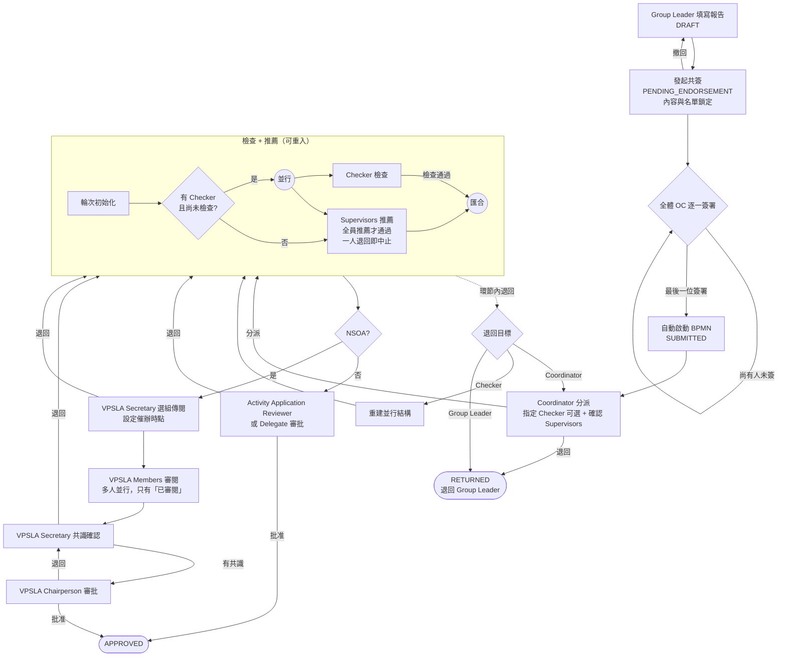

# 活動報告（活動總結報告）

> 本文檔面向 Demo 執行人、UAT 測試人與業務培訓人員，目標是讓使用者**不依賴開發人員陪同**，也能完整走完填報 → OC 共簽 → Coordinator 分派 → Checker / Supervisor → 最終審批。
>
> 本指南基於 `SLAS_PRO` / `SLAS_UI` 當前實現撰寫，流程鍵 `activity_report_approval`。
> 設計層面的節點條件、通知與需求對應見 [activity-report-submission-design.md](activity-report-submission-design.md)。
> 角色稱呼以 DB `SYSTEM_ROLE.NAME` 為權威名（見 [roles-menus-permissions-matrix.md](roles-menus-permissions-matrix.md)）。

> **⚠️ 先分清是哪一種「活動報告」。** 系統中同名的有兩套，入口、狀態、審批鏈完全不同：
>
> - **本文的活動報告**：活動結束後的**總結報告**（12 節表單：OC 名單、財務收支、出席、照片影片、聲明），存 `activity_report`，走 `activity_report_approval`。
> - **翌日 / 兩週活動報告（R01 / R14）**：事件回報性質，存 `incident_report`，走 `incident_report_audit`，見 [activity-report-guide.md](activity-report-guide.md)。
>
> Demo / UAT 前務必先確認測試對象是哪一套。

---

## 1. 模組概覽

### 1.1 業務目標

活動結束後，由 Group Leader 代表全體 OC（活動籌備委員會）填寫並提交活動總結報告，經全體 OC 共簽、Coordinator 分派角色、Checker 檢查（可選）、全體 Supervisor 推薦後，NSOA 活動再經 VPSLA 四環節、非 NSOA 活動由 Activity Application Reviewer 審批結案。

### 1.2 觸發條件

- 活動**結束日期已過**（`activityEndDate` 早於當下）才能建立報告；活動未結束時開啟頁面會提示活動尚未結束。
- 一個活動**只能有一份**報告，重複建立會被拒絕。
- 能建立與填寫的是該活動所屬**學生組織的組長**（Group Leader），**或該活動的建立人**（2026-08 起放寬，原先只認組長）。下文為行文簡潔一律稱「Group Leader」。

### 1.3 結束狀態總覽（`ActivityReportStatusEnum`）

| 狀態 | 業務含義 | Group Leader 後續操作 |
|:--|:--|:--|
| `NOT_STARTED` | **列表上的虛擬狀態**，表示這個活動可以報告但還沒建立報告 | 點進去即自動建立草稿 |
| `DRAFT` | 草稿，可自由編輯 | 存草稿 / 發起共簽 |
| `PENDING_ENDORSEMENT` | 等待全體 OC 共簽，**內容與名單鎖定** | 撤回共簽（回到 `DRAFT`）；OC 成員逐一簽署 |
| `SUBMITTED` | 共簽完成、審批流程進行中 | 只能查看與追蹤進度 |
| `RETURNED` | 被退回 | 修改後**重新發起一輪共簽**再提交 |
| `APPROVED` | 審批通過（終局） | — |

> `NOT_STARTED` 只出現在「管理活動報告」列表，資料庫裡沒有這個值。

### 1.4 與其他模組的關係

報告的三塊內容是**從別的模組預載**進來的，不是手工從零填寫：

| 報告章節 | 預載來源 |
|:--|:--|
| §3 OC 名單 | 活動成員（`activity_member`）中角色屬於 OC 的人，逐人補上課程編號（SSO `progCode`） |
| §7 財務收支 | 活動申請時的預算（`activity_budget`）的收入 / 支出行，作為「預計」欄；「實際」欄由填報人補 |
| §9 出席 | 出席簽到記錄 ∪ 已批准報名 ∪ 已批准（或已建號）嘉賓 |

預載值可以增刪改，改動請在該行的**差異備註**欄說明。

---

## 2. 角色與職責

| 角色（`SYSTEM_ROLE.NAME`） | 在流程中的位置 | 可做的動作 | 可退回到 |
|:--|:--|:--|:--|
| `Group Leader`（`sg_leader`, 114）**或活動建立人** | 流程外（發起人） | 建立/編輯報告、發起共簽、撤回共簽 | — |
| OC 成員（活動成員，非系統角色） | 流程外（共簽） | 簽署（Endorse）；最後一位簽署時自動啟動流程 | — |
| `Coordinator`（`coordinator`, 115） | `coordinatorTask`（候選組 115） | 分派（指定 Checker，確認 Supervisors）/ 退回 | **只能退回 Group Leader** |
| `Activity Application Checker`（`activity_checker`, 142） | `checkerTask`（指派給被選中的那一位） | 檢查通過 / 退回 | Coordinator、Group Leader |
| `Supervisor`（`supervisor`, 116） | `supervisorsTask`（多實例會簽） | 推薦 / 確認退回 | Checker、Group Leader |
| `VPSLA Secretary`（`vp_secretary`, 146） | `vpSelectionTask`、`vpConsensusTask`（候選組 146） | 選組傳閱（含催辦時點）、共識確認 / 退回 | 退回即重跑 Supervisor 輪次 |
| VPSLA Members | `vpMembersTask`（多實例，由 Secretary 選定） | **只有「已審閱」一個動作** | — |
| VPSLA Chairperson | `chairpersonTask` | 批准 / 退回 | 退回給 VPSLA Secretary（共識環節） |
| `Activity Application Reviewer`（`act_app_reviewer`, 149）／ `Delegate`（`delegate`, 150） | `reviewerTask`（候選組 149/150，非 NSOA 專用） | 批准 / 退回 | 退回即重跑 Supervisor 輪次 |

> **Checker 是可選的。** Coordinator 不指定 Checker 時，流程直接只建立 Supervisors 任務。
> **指派有校驗**：被選為 Checker 的人必須持有角色 142；Supervisors 名單前端已帶出該活動已存檔督導的**全量並設為唯讀**，Coordinator 只能確認、不能增刪（2026-08 起），後端仍保留「必須是已存檔督導子集」的校驗作為第二道防線。

---

## 3. 流程圖

> **退回的兩種去向要分清：**
>
> - 退到 **Group Leader**（`RETURNED`）＝流程實例結束，報告回到可編輯狀態，**必須重新走一輪全員共簽**才能再次提交。
> - 退到 **Coordinator / Checker / Supervisors** ＝流程實例還在跑，報告狀態維持 `SUBMITTED`，Group Leader 不需要（也不能）做任何事。
>
> Reviewer、VPSLA 選組、VPSLA 共識三處的「退回」，去向都是**重跑 Supervisor 推薦輪次**，不是退給 Group Leader。Chairperson 的退回則是退給 VPSLA Secretary。

---

## 4. 關鍵步驟詳述

### 4.1 建立與填寫（Group Leader）

入口：**組織者中心 → 管理活動報告**（`/organiser/ActivityReportManagement`）。列表把兩個來源合併去重：「我擔任組長的學生組織」名下的活動，以及「我建立的活動」；且**只列已結束的活動**（結束日期已過；沒有結束日期的一律不列），未結束的活動不會出現，報告入口按鈕也會被鎖住。狀態為 `NOT_STARTED` 的點擊後即自動建立草稿並帶入預載資料。

報告表單共 12 節，編號與紙本表格一致：

| # | 章節 | 說明 |
|:--|:--|:--|
| 01 | 活動名稱 | 預載活動標題 |
| 02 | 主辦單位 | 預載活動主辦單位（英 / 繁 / 簡三語一併帶出，依當前介面語言取值）；沒有則取學生組織名稱 |
| 03 | OC 名單 | 預載，可增刪改；手工新增的行**輸入學號即自動帶出英文姓名與課程編號**，不必手打；每行可勾選「現場負責人」「現場觀察員」，改動請填差異備註 |
| 04 | 活動目標 | 文字 |
| 05 | 執行總結 | 文字 |
| 06 | 觀察與檢討 | 文字 |
| 07 | 財務收支 | 收入 / 支出兩張表，預計欄預載自預算，實際欄自填；**四項合計由系統依明細行自動重算** |
| 08 | 建議事項 | 文字 |
| 09 | 出席 | 系統快照，可另外上傳出席附件 |
| 10 | 照片 / 影片 | 上傳，分 PHOTO / VIDEO |
| 11 | 聲明 | **必須勾選**，否則無法發起共簽 |
| 12 | Supervisor 認可 | 唯讀，顯示流程中的推薦結果 |

可編輯的狀態只有 `DRAFT` 與 `RETURNED`。

### 4.2 發起共簽與簽署（Group Leader + 全體 OC）

- Group Leader 按「提交共簽」→ 介面先擋一次 §11 聲明未勾選的情況，接著存檔草稿；後端再校驗聲明已勾選、OC 名單非空、**每位 OC 都有系統帳號**（沒有帳號的會嘗試自動建立；仍失敗則整單拒絕），然後快照本輪簽署人名單、報告轉 `PENDING_ENDORSEMENT`，並向全體 OC 發出站內通知（含直達簽署的連結）。
- `PENDING_ENDORSEMENT` 期間報告**內容與 OC 名單鎖定**，不可編輯。
- Group Leader 可「撤回共簽」，本輪簽署記錄作廢，報告回到 `DRAFT`。
- OC 成員逐一簽署；**最後一位簽署的瞬間**，系統在同一個交易內把報告轉 `SUBMITTED` 並啟動審批流程。
- 流程的發起人記為**提交報告的 Group Leader**，不是觸發末簽的那位 OC 成員。

### 4.3 審批環節（各審批角色）

所有審批角色都從**待辦**進入報告審批頁（`/bpm/activity-report-task`），頁面依當前任務顯示對應的操作區：

- **Coordinator**：選擇 Checker（可留空）、確認 Supervisors 名單（帶出該活動已存檔督導全量，**欄位唯讀、不能增刪**），送出分派；或退回 Group Leader。
- **Checker**：檢查通過，或退回（選擇退回 Coordinator 還是 Group Leader）。
- **Supervisor**：推薦，或確認退回（選擇退回 Checker 還是 Group Leader）。
  - ⚠️ **有 Checker 且 Checker 尚未完成時，Supervisor 的提交按鈕會被鎖住**，頁面上方顯示提示。這是後端強制的門檻，繞過前端直接呼叫介面同樣會被拒絕。
  - 會簽規則：**全員推薦**才算通過；**任一位確認退回**立即中止本輪會簽，其餘 Supervisor 的任務一併取消。
- **VPSLA Secretary（選組）**：選擇傳閱小組並設定催辦提醒時點，兩者皆為必填；或退回。
- **VPSLA Members**：只有「已審閱」一個動作，**沒有退回**。到了催辦時點，系統向尚未提交的成員發提醒，**但不會自動完成任務**，流程會一直等到全員提交。
- **VPSLA Secretary（共識）**：確認有共識送交主席，或退回。
- **VPSLA Chairperson**：批准（結案）或退回給 Secretary。
- **Activity Application Reviewer / Delegate**（非 NSOA）：批准（結案）或退回。

### 4.4 退回後重新提交

流程以「退回 Group Leader」結束時：報告狀態轉 `RETURNED`、記錄退回原因（頁面頂部紅色橫幅顯示），**且共簽狀態一併重置**。因此 Group Leader 修改完成後，必須**再次發起共簽、由全體 OC 重新簽署一輪**，才會啟動新的審批流程實例。歷次流程實例與其審批意見都保留，在報告詳情頁可以往回翻。

---

## 5. 狀態與資料模型

### 5.1 關鍵欄位（`activity_report`）

`activityId`、`status`、`activityName`、`organiserNames`、`objectives`、`summary`、`observations`、`recommendations`、四項財務合計（收入/支出 × 預計/實際）、`mediaConsent`（§11 聲明）、`endorseStatus`、`endorseVersion`（共簽輪次）、`processInstanceId`、`submitterUserId`、`submitTime`、`returnReason`。

子表：`activity_report_oc_member`（OC 名單快照，含 `preloaded` 與差異備註）、`activity_report_finance`（收支明細）、`activity_report_media`（照片影片）、`activity_report_endorsement`（分輪次的共簽記錄）、`activity_report_process`（歷次流程實例與結果）。

### 5.2 前端入口

| 頁面 | 路徑 | 使用者 |
|:--|:--|:--|
| 管理活動報告（列表） | `/organiser/ActivityReportManagement` | Group Leader |
| 活動報告（填寫 / 簽署） | `/organiser/ActivityReport?activityId=…` | Group Leader、OC 成員 |
| 活動報告審批 | 待辦點入 `/bpm/activity-report-task` | 各審批角色 |

### 5.3 權限與菜單

按鈕權限 `activity:report:query` / `create` / `update` / `submit` / `approve`；菜單「管理活動報告」（ID 6580）掛在組織者中心下，預設授予角色 114 `Group Leader`。

---

## 6. 端到端 Demo 指南

### 6.1 準備條件

通用條件：

1. 一個**已結束**（結束日期已過）的活動，且掛在測試帳號擔任組長的學生組織下，或由測試帳號本人建立——兩者都能進報告列表。
2. 該活動有 2 位以上 OC 成員（用來演示共簽），且都能登入。
3. 該活動已存檔至少 1 位 Supervisor。
4. 一個持有角色 142 `Activity Application Checker` 的帳號（演示可選 Checker 分支）。
5. `Coordinator`（115）帳號一個。
6. 非 NSOA 主線另需 `Activity Application Reviewer`（149）帳號；NSOA 主線另需 `VPSLA Secretary`（146）、VPSLA 成員與主席帳號。

### 6.1.1 DEV 環境現成資料（2026-09-04 實查）

下表是 DEV（dappl05）當下**真的可以直接拿來 Demo** 的資料，不必自己造。

**演示活動——全庫唯一同時具備 OC 成員與已存檔 Supervisor 的已結束活動：**

| 項目 | 值 |
|:--|:--|
| 活動編號 | `SLA-2526-00121` |
| 活動名稱 | Enrolment form testing |
| 活動 ID | `2085552777101631490` |
| 活動日期 | 2026-08-08 ~ 2026-08-09（已結束），狀態 `COMPLETED` |
| 是否 NSOA | 否 → 走**非 NSOA / Reviewer** 主線（6.2、6.3） |
| 建立人 = 報告填報人 | `S1138111`（CHAN Chin Ching，user id `2051932437251416065`） |
| OC 成員 | 1 位：CHAN Chin Ching（學號 11381112）——**與建立人是同一人** |
| 已存檔 Supervisor | 1 位：`hro-test-074`（Test Supervisor 1，user id 13，持角色 116） |
| 報告現況 | 已有草稿 `2095444726084345858`，`DRAFT` / 共簽 `PENDING` / 輪次 0，未啟動流程；財務、照片、共簽、流程四張子表都還是空的 |

**審批角色帳號**（各角色在 DEV 都只有一位持有人，不必挑）：

| 角色 | 帳號 | 姓名 | user id |
|:--|:--|:--|:--|
| `Coordinator`（115） | `hro-test-071` | Test Coordinator | 10 |
| `Activity Application Checker`（142） | `hro-test-073` | Test Checker | 12 |
| `Supervisor`（116，本活動已存檔的那位） | `hro-test-074` | Test Supervisor 1 | 13 |
| `Activity Application Reviewer`（149） | `hro-test-091` | Test Dean | 30 |
| `Delegate`（150） | `hro-test-092` | Test Delegate | 31 |
| `VPSLA Secretary`（146） | `hro-test-083` | Test VP Secretary | 22 |

**VPSLA 傳閱小組**（`activity_vp_group_member`，兩組可選）：

| 小組 ID | 成員 |
|:--|:--|
| `2051611753177513986` | Secretary `hro-test-083`、Chairperson `hro-test-089`、Members `hro-test-084` ~ `hro-test-088`（5 人） |
| `2052775263958790145` | Secretary `hro-test-083`、Chairperson `hro-test-089`、Members `hro-test-084`、`hro-test-085`（2 人） |

**DEV 上的三個實測限制，排 Demo 前先知道：**

- **Group Leader 入口在 DEV 走不通，只能用「活動建立人」這條路。** 判定組長的條件是 `student_group_member.ROLE_CODE ∈ (president, chairperson, leader)` 且 `STATUS='active'`。DEV 有 21 筆這樣的列，但這些組織名下**一個已結束的已核准活動都沒有**；反過來，所有可報告活動所屬的組織**都沒有組長**。所以 §4.1 列表的兩個來源裡，DEV 目前只有「我建立的活動」這一條會出資料。要演示組長入口，得先給某個有已結束活動的學生組織補一位組長。
  ⚠️ **UAT / PROD 的情況更嚴重——那兩個環境是一個組長都判不出來，見 §7。**
- **共簽只能演示單人。** `SLA-2526-00121` 只有 1 位 OC，而且就是填報人本人——按下「提交共簽」後，同一個帳號簽完那一筆即刻轉 `SUBMITTED`，看不到「等其他人簽」的中間態。要演示多人共簽，需先在活動成員裡補至少 1 位有系統帳號的 OC。
- **主線 C（NSOA）在 DEV 沒有可用活動。** DEV 上 `IS_NSOA=1` 的已結束活動（例如 `SLA-2526-0041` / `2052583866546831362`，OC 2 人）**一位已存檔 Supervisor 都沒有**，而 Coordinator 分派時 Supervisors 為空會被後端擋下，流程走不過第一關。要跑 6.4，必須先為某個 NSOA 活動存檔 Supervisor。

### 6.2 主線 A — 非 NSOA 最短路徑

> DEV 對照：填報人 `S1138111` → 活動 `SLA-2526-00121` → Coordinator `hro-test-071` → Supervisor `hro-test-074` → Reviewer `hro-test-091`。因該活動的報告草稿已存在，第 1 步進去看到的狀態是 `DRAFT` 而非 `NOT_STARTED`。

1. Group Leader 登入 → 管理活動報告 → 找到該活動（狀態 `NOT_STARTED`）→ 點入，確認 OC 名單、財務、出席三塊已自動帶出。
2. 補齊 04–08 文字欄與 §7 實際金額，上傳 §10 照片，**勾選 §11 聲明**，存草稿。
3. 按「提交共簽」→ 狀態轉 `PENDING_ENDORSEMENT`，表單變唯讀。
4. 逐一用各 OC 帳號登入 → 從站內通知進入 → 簽署。最後一位簽署後狀態轉 `SUBMITTED`。
5. Coordinator 登入 → 待辦 → **不指定 Checker**，確認 Supervisors（唯讀，核對帶出的督導無誤即可）→ 分派。
6. Supervisor 登入 → 待辦 → 推薦（多位 Supervisor 需全部推薦）。
7. Activity Application Reviewer 登入 → 待辦 → 批准 → 報告狀態 `APPROVED`。

### 6.3 主線 B — 含 Checker 的並行分支

在 6.2 第 5 步改為**指定 Checker**（DEV 選 `hro-test-073`），然後驗證：

- Checker 與 Supervisor **同時**出現在各自的待辦（並行）。
- 此時 Supervisor 進入審批頁，提交按鈕**被鎖住**並顯示提示。
- Checker 送出「檢查通過」後，Supervisor 的提交按鈕解鎖，可正常推薦。

### 6.4 主線 C — NSOA 全鏈

活動為 NSOA 時，第 7 步改走：VPSLA Secretary 選組傳閱（設定催辦時點）→ VPSLA Members 逐一「已審閱」→ VPSLA Secretary 共識確認 → VPSLA Chairperson 批准 → `APPROVED`。

> DEV 對照：Secretary `hro-test-083` → 傳閱小組選 `2052775263958790145`（只有 2 位 Members，簽起來最快）→ Members `hro-test-084`、`hro-test-085` → 回到 `hro-test-083` 做共識 → Chairperson `hro-test-089` 批准。
> ⚠️ 前提是**先找一個 NSOA 活動存檔 Supervisor**——見 6.1.1 第三條限制，DEV 現有的 NSOA 活動都缺 Supervisor，這條鏈目前起跑不了。

### 6.5 旁支 — 退回與重新提交

1. 在 Supervisor 環節選「退回 → Group Leader」。
2. 驗證：報告狀態轉 `RETURNED`，頁面頂部顯示退回原因，表單恢復可編輯。
3. **重點驗證**：修改後必須重新按「提交共簽」，並由**全體 OC 再簽一輪**，才會啟動新的流程實例——舊的簽署記錄不會被沿用。
4. 另可驗證流程內退回：Supervisor 選「退回 → Checker」，報告狀態維持 `SUBMITTED`，Checker 重新收到任務，Supervisor 任務同步重建。

---

## 7. 邊界與已知限制

- **PDF 匯出未實作**，屬長期需求，目前只能在系統內查看報告。
- **VPSLA（NSOA）分支尚未有完整實跑記錄。** 截至 2026-08，測試環境的歷史任務裡 `coordinatorTask` / `supervisorsTask` / `reviewerTask` / `checkerTask` 都有實例，但 VPSLA 選組、Members 審閱、共識、主席四個節點的實例數為 0——UAT 應優先覆蓋 6.4 與 6.5 兩節。2026-09-04 複查 DEV 的原因很直接：**沒有一個 NSOA 已結束活動存檔了 Supervisor**，流程卡在 Coordinator 分派，根本進不到 VPSLA 段（見 6.1.1）。
- **UAT / PROD 上「Group Leader 入口」形同不存在**（issue #380）。判定組長的查詢只認 `student_group_member.ROLE_CODE ∈ (president, chairperson, leader)`，而客戶的兩個環境這個欄位全是空的，**沒有任何一個人會被判為組長**。2026-09-04 四環境實查：

  | 環境 | `ROLE_CODE` 有值 | 全部列 |
  |:--|--:|--:|
  | DEV | 37（其中 21 筆命中組長判定） | 102 |
  | 146 | 234 | 723 |
  | **UAT** | **0** | 56（全 `ROLE='others'`） |
  | **PROD** | **0** | 520（全 `ROLE='others'`） |

  後果：PROD 有 511 個帳號持角色 114 `Group Leader`、58 個學生組織、111 個已結束活動**全部**掛在組織下，但這 511 人開啟「管理活動報告」只會看到**自己親手建立的**活動。
  成因：`ROLE_CODE` 只有「學生組織**註冊流程**存 ExCo 名單」這一條寫入路徑會寫，後台錄入 / 匯入成員只寫 `ROLE`。DEV 的資料是測試帳號走註冊流程造的；PROD 的 58 個組織全部由 SAO 職員後台錄入（`REGISTRATION_PROCESS_ID` 全為 NULL），從未走過註冊流程。因此修復不能只做一次性回填，得同時補寫入路徑。
- **Coordinator 在「活動沒有任何已存檔 Supervisor」時會走進死路**（低優先，PROD 當前不可達）：分派時 Supervisors 為空後端直接拒絕，而前端該欄位唯讀、只帶出已存檔督導，Coordinator 除了「退回 Group Leader」沒有別的出路，Group Leader 也無法事後補督導。2026-09-04 實查 PROD 的 111 個已結束活動**全部**都有已存檔督導，所以現階段觸發不到；DEV 則有不少活動缺督導（例如 6.1.1 提到的 NSOA 活動）。
- **DEV 的報告資料量極小。** 2026-09-04 實查：81 個已結束的已核准活動，但 `activity_report` 全庫只有 1 筆（`DRAFT`），共簽、流程實例子表皆為空。Demo 前請先照 6.1.1 核對資料是否還在。
- **VPSLA Members 沒有退回動作**，也不會因逾時被自動視為無異議；催辦時點只發提醒，流程會一直等到全員提交。這條逾時語義需求方尚未定義，待確認後才會調整。
- **Coordinator 的退回只有一個去向**（Group Leader），介面上不提供其他選項。
- **§11 聲明的簡體中文措辭待需求方確認**（涉及學生紀律處分與法律責任），目前為對照英文 / 繁體原文的譯本。
- 同名的「活動報告」有兩套，見本文開頭的提醒與 [activity-report-guide.md](activity-report-guide.md)。
