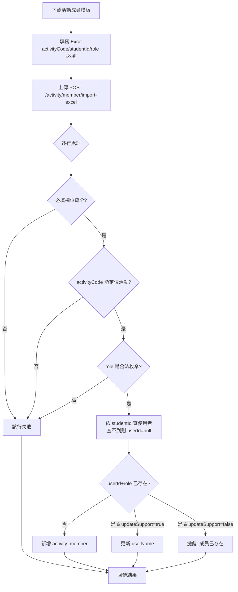
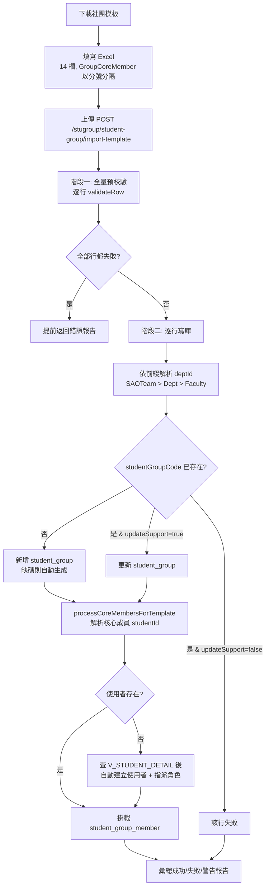

# 活動成員導入 / 社團組織導入

> 本文檔面向 Demo 執行人、UAT 測試人與業務培訓人員，目標是讓使用者**不依賴開發人員陪同**，也能完成 Excel 批次導入。
>
> 本指南基於 `SLAS_PRO` / `SLAS_UI` 當前實現撰寫。內含兩個獨立但相似的導入能力：
> 1. **活動成員導入**（`activity` 模組）— 把學生批次掛載到某個活動，賦予活動角色。
> 2. **社團 / 組織導入**（`stugroup` 模組）— 批次建立學生組織及其核心成員，並在缺帳號時**自動建立使用者**。
>
> 角色稱呼以 DB `SYSTEM_ROLE.NAME` 為權威名（見 `roles-menus-permissions-matrix.md`）。

---

## 1. 模組概覽

### 1.1 業務目標

| 導入類型 | 目標 | 寫入主表 |
|:--|:--|:--|
| 活動成員導入 | 將既有/外部學生批次加入某活動，並標記其在活動中的角色 | `activity_member` |
| 社團組織導入 | 批次建立/更新學生組織（SO/NSO）並掛載核心成員 | `student_group`（+ `student_group_member`） |
| 社團成員導入 | 對單一社團批次掛載成員 | `student_group_member` |

### 1.2 觸發條件

- 由具備管理權限的角色在後台「導入」入口上傳 Excel（`.xlsx` / `.xls` / `.csv`）。
- 兩類導入都支援 `updateSupport` 開關：`false` 遇到既有資料報錯/跳過，`true` 允許更新。

### 1.3 結束狀態總覽

導入是**即時批次操作**，沒有審批工作流。每次導入回傳一份結果：

| 結果 | 業務含義 | 後續操作 |
|:--|:--|:--|
| 成功（success） | 該行已新增或更新 | — |
| 失敗（failure） | 該行欄位缺失/格式錯誤/重複且未開更新 | 修正該行後重新上傳 |
| 警告（warning） | 該行已處理但有需注意的點（如自動補碼） | 視情況確認 |

> 社團導入採「**先全量預校驗，再逐行寫庫**」策略：單行出錯不會中斷整批，錯誤會被收集進結果報告，其餘行繼續處理。

### 1.4 與其他模組的關係

- 活動成員導入產生的 `activity_member`，是後續**活動報名 / 出席 / 報告**識別 OC 成員身份的基礎。
- 社團導入時自動建立的使用者帳號，預設掛 `Group Leader`（id=114）角色，使其能登入並建立活動草稿，銜接「活動發布審批」主線。

---

## 2. 角色與職責

| 操作 | 所需權限 / 角色（`SYSTEM_ROLE.NAME`） |
|:--|:--|
| 活動成員導入 | 權限碼 `activity:member:import`，或角色 `SuperAdmin - Dev`（1）/ `SAO Administrator`（120）/ `Supervisor`（116） |
| 社團組織導入 | 權限碼 `stugroup:student-group:manage` |
| 社團成員導入 | 權限碼 `stugroup:student-group:manage`，或角色 `SuperAdmin - Dev`（1）/ `SAO Administrator`（120）/ `Supervisor`（116） |
| 模板下載（活動成員） | 已登入即可 |

> 社團導入自動建立的使用者預設掛 `Group Leader`（`sg_leader`, 114）角色（見 §4.2）。以上角色名均以 DB `SYSTEM_ROLE.NAME` 為準（見 `roles-menus-permissions-matrix.md`）。

---

## 3. 流程圖

### 3.1 活動成員導入

### 3.2 社團組織導入

---

## 4. 關鍵步驟詳述

### 4.1 活動成員導入

- **端點**
  - 導入：`POST /activity/member/import-excel`，參數 `file`（MultipartFile）、`updateSupport`（預設 `false`）。
  - 模板下載：`GET /activity/member/get-import-template`。
  - 程式位置：`ActivityController.java`（約 767 行）→ `ActivityServiceImpl.importActivityMemberExcel`（約 3390–3454 行）。
- **逐行邏輯**
  1. `ExcelUploadValidator.validateExcelUpload(file)` 僅允許 Excel/CSV。
  2. `ExcelUtils.read(file, ActivityMemberImportVO.class)` 解析所有行。
  3. 校驗必填：`activityCode`、`studentId`、`role`。
  4. `activityMapper.selectActivityIdByCode(activityCode)` 定位活動，找不到該行失敗。
  5. `ActivityMemberRoleEnum.isValidCode(role)` 校驗角色合法性。
  6. 依 `studentId` 查使用者；**查不到不會建帳號**，`userId` 留空。
  7. 以 `userId + role`（或 `studentId + role`）去重；不存在則新增，存在且 `updateSupport=true` 僅更新 `userName`，否則該行視為重複錯誤。
- **業務規則**：活動成員導入是「掛載」性質，不負責建立登入帳號；若需要學生能登入，請走社團導入或由系統另行建號。

### 4.2 社團組織導入

- **端點**
  - 社團導入：`POST /stugroup/student-group/import-template`（`file`, `updateSupport=false`）；模板 `GET /stugroup/student-group/get-import-template`。
  - 社團成員導入：`POST /stugroup/member/import-excel`（`file`, `groupId`, `updateSupport=true`）；模板 `GET /stugroup/member/get-import-template`。
  - 程式位置：`StudentGroupController.java`（約 202 行）/ `MemberController.java`（約 168 行）→ `StudentGroupServiceImpl.importStudentGroupTemplateList`（約 2661–2875 行）。
- **兩階段策略**
  1. **預校驗**：逐行 `validateRow`，全量收集錯誤；若所有行皆失敗則提前返回。
  2. **寫庫**：依前綴優先序（`SAOTeamtPrefix` > `DeptPrefix` > `FacultyPrefix`）解析 `deptId`；以 `studentGroupCode` 判斷新增/更新；缺碼時用 `prefix + 學年` 自動生成唯一碼。
- **核心成員與自動建號**
  - `GroupCoreMember` 以分號分隔多個 `studentId`，第一個被設為 `leaderStudentId`。
  - `processCoreMembersForTemplate` 對每個 `studentId`：先查使用者（studentId → username）→ 查不到則在 `V_STUDENT_DETAIL` 核對學生身份 → **自動建立使用者**：
    - `username = studentId`、`email = {studentId}@s.eduhk.hk`；
    - 初始密碼取系統設定 `USER_INIT_PASSWORD_KEY`，未配置時退回為 `studentId`；
    - 指派角色（OC / 社團場景為 `Group Leader`，id=114）。
- **`NA` 與空值**：模板中 `NA`（不分大小寫）與空字串一律視為 null。

---

## 5. 模板欄位與枚舉

### 5.1 活動成員模板（`ActivityMemberImportVO`，6 欄）

| 欄位 | 必填 | 說明 |
|:--|:-:|:--|
| Activity Code | ✓ | 活動編碼，如 `SLA-2425-001` |
| Name of Activity | | 活動名稱（僅供參考） |
| SID（學號） | ✓ | 如 `11557034` |
| Full Name in English | | 英文姓名 |
| Full Name in Chinese | | 中文姓名 |
| Role in Activity | ✓ | 見下方角色枚舉的 code |

**活動成員角色枚舉 `ActivityMemberRoleEnum`**（填 code）：

| code | 含義 |
|:--|:--|
| `ROLE_OC_MEMBER` | OC 成員（組委會成員） |
| `ORGANIZER` | 活動組織成員 |
| `TREASURER` | 財務 |
| `ASSISTANT` | 協助員 |
| `VOLUNTEER` | 志願者 |

### 5.2 社團模板（`StudentGroupTemplateImportVO`，14 欄）

| 欄位 | 必填 | 說明 |
|:--|:-:|:--|
| GroupCat_EN | ✓ | `SO`（學生組織）或 `NSO`（非學生組織） |
| SOCode | 條件 | `GroupCat_EN=SO` 時必填，如 `C-0177` |
| NSOCode | 條件 | `GroupCat_EN=NSO` 時必填，如 `NSO-2526-0001` |
| SOCat_EN | | SO 子分類（DA / AS / SRA…） |
| GroupName_EN | ✓ | 英文組名 |
| GroupName_TC / GroupName_SC | | 繁/簡組名 |
| FacultyPrefix / DeptPrefix / SAOTeamtPrefix | | 部門前綴，用於解析 `deptId`（優先序 SAOTeam > Dept > Faculty） |
| GroupCoreMember | | 分號分隔的核心成員學號，第一個為 Leader |
| GroupSupervisor | | 指導老師/主管 |
| GroupRegPeriodFr / GroupRegPeriodTo | | 註冊期起訖（多種日期格式） |

### 5.3 社團成員模板（`MemberImportExcelVO`，3 欄）

| 欄位 | 必填 | 說明 |
|:--|:-:|:--|
| studentGroupCode | ✓ | 社團編碼，如 `C-0177` |
| studentId | ✓ | 成員學號 |
| role | ✓ | 見下方社團成員角色枚舉 |

**社團成員角色枚舉 `MemberRoleEnum`**：`PRESIDENT` / `TREASURER` / `MEMBER` / `LEADER`。

> **權限校驗**：非管理員導入社團成員時，所有行的 `studentGroupCode` 必須與目標社團一致；管理員導入則會自動修正為目標社團碼。

---

## 6. 端到端 Demo 指南

### 6.1 準備條件

- 一個具 `SAO Administrator` 或 `SuperAdmin - Dev` 的後台帳號。
- 活動成員導入：先有一個已存在的活動及其 `Activity Code`。
- 社團導入：準備幾個真實存在於 `V_STUDENT_DETAIL` 的學號（用於驗證自動建號）。

### 6.2 Demo A — 活動成員導入

1. 進入活動成員導入入口，點「下載模板」取得 `ActivityMemberImportVO` 範本。
2. 填入 1–2 行：`Activity Code` 用既有活動碼，`SID` 用真實學號，`Role in Activity` 填 `ROLE_OC_MEMBER`。
3. 上傳檔案（`updateSupport` 保持關閉）。
4. **驗證點**：
   - 回傳成功；該活動成員列表新增對應學生與角色。
   - 故意填一行錯誤 `Role`（如 `BOSS`），確認該行回報失敗、其餘行成功。
   - 重複上傳同一行，確認在 `updateSupport=false` 時報「成員已存在」。

### 6.3 Demo B — 社團組織導入（含自動建號）

1. 下載社團模板，填 1 行：`GroupCat_EN=SO`、`SOCode=C-9999`、`GroupName_EN=Demo Club`、`GroupCoreMember` 填 2 個真實學號（分號分隔）。
2. 上傳到 `POST /stugroup/student-group/import-template`。
3. **驗證點**：
   - `student_group` 新增一筆 `Demo Club`；第一個學號成為 Leader。
   - 對於原本沒有帳號的核心成員學號：系統自動建立使用者（`username=學號`、`email=學號@s.eduhk.hk`），並掛 `Group Leader` 角色。
   - 用該學號 + 初始密碼登入，確認可進入系統並看到「建立活動」入口。
4. 補充：把 `updateSupport` 開為 `true`，改 `GroupName_EN` 後重傳同一 `SOCode`，確認為「更新」而非報重複。

### 6.4 Demo C — 社團成員批次掛載

1. 對 Demo B 建立的社團，下載其成員模板（會預填社團碼）。
2. 填 2 行：一行 `role=MEMBER`、一行 `role=TREASURER`。
3. 上傳 `POST /stugroup/member/import-excel`（帶 `groupId`）。
4. **驗證點**：社團成員列表出現兩名成員與對應角色；回傳報告含每行成功/失敗統計。

---

## 7. 邊界與已知限制

- 活動成員導入**不建立登入帳號**；需要登入能力的學生請改用社團導入或另行建號。
- 自動建號的初始密碼取決於系統設定 `USER_INIT_PASSWORD_KEY`，Demo 前請先確認該值。
- 日期格式雖容錯多種寫法，仍建議統一用 `yyyy-MM-dd` 以避免歧義。
- 社團導入為逐行容錯，**部分成功**是正常結果；務必檢視回傳報告的失敗清單，而非只看整體是否 2xx。
