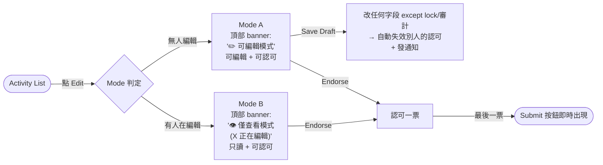
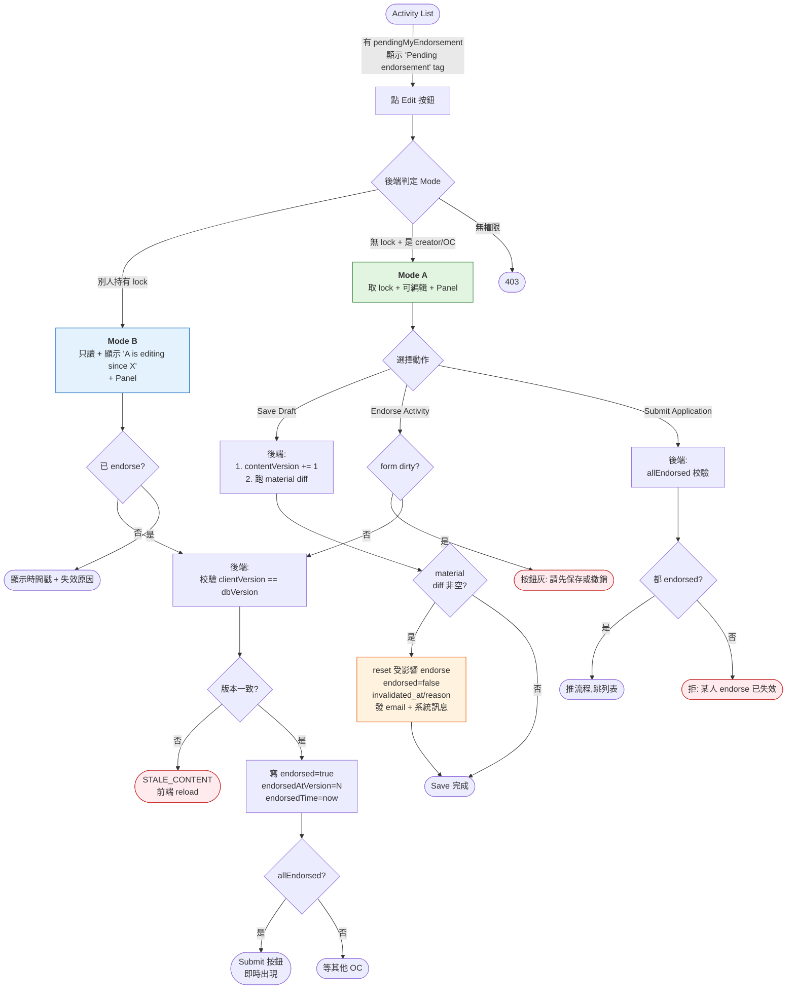
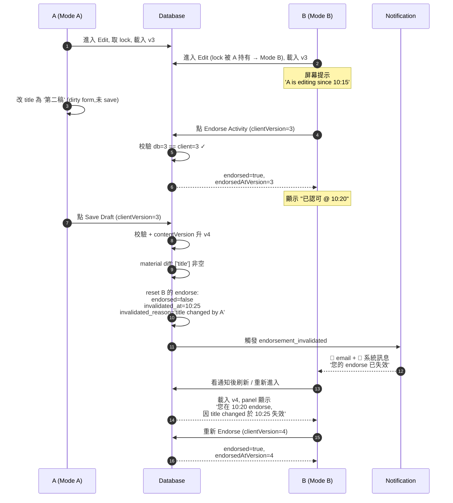
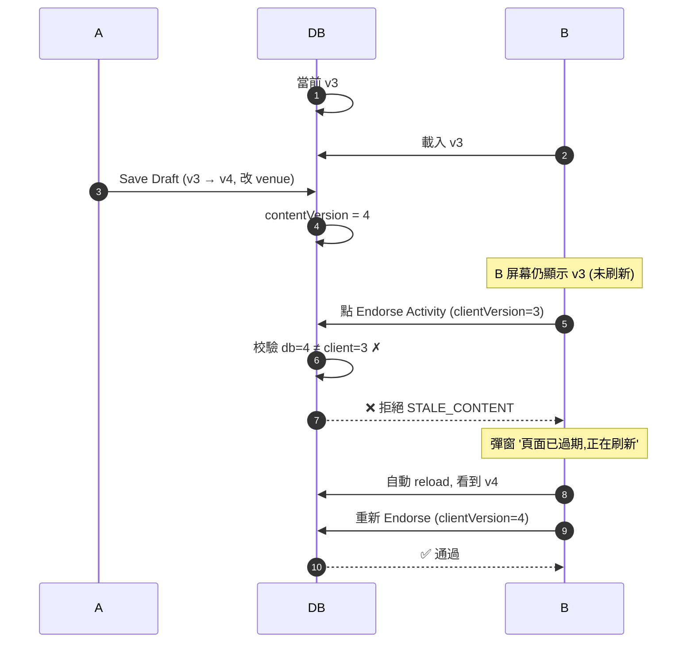

# OC Endorsement Material Fields 規格

> 本文檔面向產品、後端、前端，作為 OC 認可流程改造的 **唯一權威清單**。
>
> **核心策略（已敲定）**：採用「**默認所有字段都是 material**」 — 任何 ActivityDO 字段改動都會讓已 endorse 的 OC 自動失效，需重新認可。僅排除少數技術/會話狀態字段（lock 3 個 + 審計字段）。配合 `status=DRAFT` guard 避免活動離開 OC 階段後誤觸發。
>
> 配合 OC 認可流程改造（雙模式 + 拆按鈕 + contentVersion + 頂部 Mode banner）使用。
> 詳見 OC 流程設計：列表只保留 Edit 入口、`Mode A/B` 由後端判定、`Save Draft` 與 `Endorse Activity` 嚴格拆分、任何 material 字段變更觸發 reset。

---

## 0. 一頁速覽（給客戶 / 業務）

### 0.1 改動目標

| | 當前 | 改造後 |
|---|---|---|
| 列表入口 | Edit + Endorse 兩個按鈕（綠色） | 只有 Edit 按鈕 + "Pending endorsement" 提示 |
| 編輯頁按鈕 | "Save & Endorse" 組合按鈕 | "Save Draft" / "Endorse Activity" 兩個獨立按鈕 |
| 並發認可 | 別人在編輯時無法認可（鎖卡住） | 別人在編輯時仍可只讀並認可（Mode B） |
| **Mode 視覺提示** | 無明確標識，學生需從按鈕推測 | **頁面頂部明顯 banner**：「✏️ 可編輯模式」/「👁 僅查看模式（X 正在編輯）」 |
| 內容改動 vs 已認可 | 暫無系統性處理 | 改動 material 字段自動 reset + 通知所有受影響 OC |
| **Material 字段範圍** | 未實現（產品意圖） | **默認所有字段 material**（除 lock 3 字段 + 審計字段），加 `status=DRAFT` guard |
| 最後一個認可 | 要回列表再進來才看到 Submit | 點 Endorse 後 Submit 按鈕即時出現 |
| Dirty 表單 + Endorse | 無校驗，可能認可的不是屏幕版本 | dirty 時 Endorse 按鈕灰，強制先保存 |

### 0.2 客戶確認（僅 1 項待拍板）

> ✅ **已敲定**：字段範圍採「默認全部 material」簡化策略；改造 7 項方向；UI 頂部 Mode banner；Lazy migration。

| # | 待確認項 | 狀態 |
|---|---|---|
| 1 | **§7 通知文案** 三語翻譯（en / zh-CN / zh-hk）是否認可 | ☐ 認可  ☐ 需修改 |

> 字段歸類已採用簡化策略：所有 ActivityDO 字段預設 material，僅排除 lock 會話字段（3 個）+ BaseDO 審計字段（id/createTime/updateTime/creator/updater/deleted）。若實際使用後發現重新認可過於頻繁，再針對性挪到排除清單。

### 0.3 主流程一圖看懂

> 完整流程詳見 §1.3，本節為簡化版



---

## 1. 背景

### 1.1 為什麼需要這份清單

OC 認可改造後：
- **Save Draft** 與 **Endorse Activity** 兩個動作完全解耦
- A 改動內容後 Save Draft → 後端 diff 出本次改了哪些 **material fields**
- 若有 material 字段變更 → 自動 reset 所有 `endorsed=true` 的 OC（`endorsed=false`、寫入 `invalidated_at` / `invalidated_reason`）
- 同時發送 **郵件 + 系統訊息** 通知被失效的 OC 重新認可

非 material 字段（如備註、封面圖）的改動不觸發 reset，保留現有 endorsement。

### 1.2 一致性防禦的位置

```
事前  Mode B Panel 顯示 "A is editing since 10:15, may be invalidated"
事中  endorse 時校驗 clientVersion == dbVersion，不一致直接 STALE_CONTENT
事後  Save Draft 時 material diff → reset 受影響 endorse + 推送通知       ← 本文檔的清單
兜底  Submit 時驗 allEndorsed，reset 後數不齊直接拒
```

### 1.3 整體流程圖



**圖例**：
- 🟢 綠色 = Mode A（編輯態）
- 🔵 藍色 = Mode B（只讀認可態）
- 🟠 橙色 = reset 觸發（事後修復）
- 🔴 紅色 = 拒絕路徑（事中防禦）

---

## 2. Material 字段策略

### 2.1 採用「默認全部 material」

為簡化邏輯與長期維護，本次採用「**默認所有字段都是 material**」策略：

- 任何 ActivityDO 字段改動 → 觸發 reset（在 `status='DRAFT'` 前提下）
- 僅排除少數**技術/會話狀態字段**（OC 不可控、改動無業務意義或系統自動寫入）
- 未來若使用反饋「重認可過於頻繁」，再針對性挪到排除清單

**優點**：
- yaml 清單從 80+ 行縮為 10 行
- 新加 ActivityDO 字段時**默認就 material**，不需要每次更新清單
- 邏輯一致：「任何改動都需重新認可」對 OC 是清晰可預期的承諾
- 配合 `status=DRAFT` guard，系統流程字段、supervisor 階段字段不會誤觸發

### 2.2 排除清單（**唯一不觸發 reset 的字段**）

```yaml
strategy: all_fields_material_except_excluded

excluded_fields:
  # ============ 編輯鎖會話狀態（非內容改動，僅 lock 流轉）============
  - editingUserId
  - editingUserName
  - editingExpiresAt

  # ============ BaseDO 審計字段（系統維護，無業務意義）============
  - id
  - createTime
  - updateTime
  - creator
  - updater
  - deleted
  - tenantId          # 若使用多租戶基類

guards:
  - condition: "status == 'DRAFT'"
    description: |
      reset 僅在活動處於 DRAFT 狀態時觸發。
      離開 DRAFT 後（PENDING / APPROVED / REJECTED 等），即使有字段變更也不 reset
      （因為 OC 已沒機會 re-endorse，且 supervisor / 系統字段在後續流程才會變動）。
```

---

## 3. 排除字段的詳細說明

§2.2 的排除清單，為什麼這些字段不觸發 reset：

| 字段 | 為什麼排除 | 若不排除的風險 |
|---|---|---|
| `editingUserId` / `editingUserName` / `editingExpiresAt` | 編輯鎖會話狀態，每次別人取/放 lock 都會變 | **每次有人進編輯就會 reset 所有 endorse**，體驗災難 |
| `id` / `createTime` / `creator` | DB 自增 / 審計字段，創建後不變 | 不可能改動，排除是冗餘但保險 |
| `updateTime` / `updater` | 任何 update 自動會變 | **每次 Save 自身就會觸發 reset**（因為 updateTime 變了），形成無限循環 |
| `deleted` | MyBatis-Plus 邏輯刪除標記 | 改動意味著活動被刪，已脫離正常流程 |

### 3.1 為什麼系統流程 / supervisor 字段不排除？

系統流程字段（如 `status` / `approvalStatus` / `ocEndorseStatus` / `frozenTime`）和 supervisor 階段字段（如 `supvNotes` / `supvElatCategory` 等）**沒有出現在 §2.2 排除清單裡**，因為：

1. **`status=DRAFT` guard 已經攔下** — 活動一旦離開 DRAFT，整個 reset 邏輯就不跑
2. **在 DRAFT 階段這些字段本來就不會改動** — 改了 `status` 就離開 DRAFT 了；`supv*` 是 supervisor 在審批時才填的，活動已在 PENDING

所以邏輯上是安全的，技術上不需要單獨排除。

### 3.2 為什麼 `remark` / `coverImage` / `adverseWeather*` 等也算 material？

之前討論的 borderline 字段（adverseWeather / refundPolicy / organizingUnit / formExtData / coverImage / remark）按新策略**全部歸 material**：

- 客戶側的判斷：「先簡化邏輯，所有 OC 可見的內容改動都重新認可一次」
- 後期若 UAT 反饋「換封面也要重認可」太煩，可單獨把 `coverImage` 移到 §2.2 excluded_fields
- 微調成本極低（移動一行 + 重新部署）

---

## 4. ~~Borderline 字段~~ — 已不適用

> 本節原為 5 組 borderline 字段歸類表（adverseWeather / refundPolicy / organizingUnit / formExtData / coverImage）。
>
> 因 §2 改採「**默認所有字段都是 material**」策略，所有這些字段**默認觸發 reset**，無須再單獨歸類。
>
> 保留章節編號避免後續編號錯位。詳見 §3.2。

---

## 5. Diff 算法約定

```yaml
diff_rules:
  string:
    normalize: trim                # 前後空格不算變更
    case_sensitive: true
    null_eq_empty: true            # null 與 "" 視為同值（避免 405d18cf 那種誤觸發）

  number:
    integer: equals
    bigDecimal: compareTo          # 不用 equals（防 scale 差異，如 100 vs 100.00）

  datetime:
    normalize_timezone: UTC
    granularity: minute            # 秒級抖動忽略

  boolean:
    null_equals_false: true        # null 與 false 視為同值

  set:
    order_insensitive: true        # 集合比較不看順序
```

---

## 6. Reset 觸發規則

```
觸發點：Save Draft 完成持久化、寫 contentVersion += 1 之後

算法：
  1. 取 oldActivity（DB 持久化前的快照）vs newActivity（payload）

  2. ★ Guard: 若 newActivity.status != 'DRAFT' 則直接返回，跳過後續 diff 與 reset
     （避免活動進入審批後 supervisor / 系統字段變更誤觸發；
      在 DRAFT 階段這些字段也不應該被改動）

  3. 對 ActivityDO 所有字段跑 diff（按 §5 diff_rules）
     - 排除 §2.2 excluded_fields 清單（lock 3 個 + BaseDO 審計字段）
     - 不在排除清單的字段一律參與 diff

  4. changedFields := 集合（任何 diff 為 true 的字段名）

  5. 若 changedFields 非空：
     SELECT * FROM activity_oc_endorsement
       WHERE activity_id = :id
         AND endorsed = true
         AND (endorsed_at_version IS NULL OR endorsed_at_version < :newContentVersion)
     對每行：
       UPDATE SET
         endorsed = false,
         invalidated_at = NOW(),
         invalidated_reason = 'Fields changed: ' || join(changedFields, ', ') ||
                              ' at ' || NOW() || ' by user ' || currentUserId

  6. 對失效列表發通知（見 §7）
```

### 6.1 Lazy migration 處理

老活動的 `endorsed_at_version IS NULL`：視為 **古早 endorse**，被本次 reset 涵蓋。

老活動的 `content_version IS NULL`：
- **對前端暴露為 0**（pre-versioning era）— `getEndorsementStatus` 回傳 contentVersion=0；endorse 寫入 endorsedAtVersion=0
- **第一次 Save Draft 寫入 1**（不是維持 1）— 後續每次 Save +1

⚠️ **為什麼不能對外當作 1**：如果 NULL 對外暴露 1、第一次 Save 也寫 1，會出現「pre-save 視圖」的 race window：
- t1: B 載入 panel → 拿 clientContentVersion=1
- t2: A 改 material + Save → DB 1（NULL→1）
- t3: B 提交 endorse with clientVersion=1 → 後端 dbVersion=1 → **校驗誤通過**
- B 認可的是 A 改前的內容，但版本號巧合一致 → STALE_CONTENT 失守

採 NULL→0 對外、Save→1 寫入後，t3 的 clientVersion=0 vs dbVersion=1 不匹配 → STALE_CONTENT 拒 → B reload → 重 endorse 正確版本。

### 6.2 並發場景時序示意

**場景**：A 在編輯（持 lock），B 進來只讀並 endorse，A 後續保存時觸發 reset。



**另一場景**：B 看舊版本，A 已搶先 save，B endorse 直接被拒。



**意義**：兩個場景證明任一單層失效仍能兜底：
- 場景 1：事中防禦放行（版本一致），靠事後修復（reset + 通知）保證最終一致
- 場景 2：事中防禦攔下，B 根本沒寫入錯誤版本的 endorse

---

## 7. 通知規則（已敲定：雙通道）

```yaml
notification:
  channels:
    - email
    - system_message
  trigger: endorsement_invalidated
  recipients: 被失效的 OC（每人各一條）
  template:
    subject: "Your endorsement on [{activityCode}] {title} has been invalidated"
    body: |
      Dear {ocName},

      You endorsed activity "{title}" on {endorsedTime}.
      The activity has been modified by {modifierName} on {invalidatedAt}.

      Changed material fields:
        {changedFieldsList}

      Please review the latest content and re-endorse if you still agree.

      Open activity: {deepLink}
```

---

## 8. 數據庫變更

```sql
ALTER TABLE activity
  ADD COLUMN content_version INTEGER NULL
  COMMENT '內容版本號；首次 Save Draft 時由 NULL 升為 1，之後每次 Save +1';

ALTER TABLE activity_oc_endorsement
  ADD COLUMN endorsed_at_version INTEGER NULL
  COMMENT 'endorse 時的 activity.content_version；NULL = 老數據',

  ADD COLUMN invalidated_at DATETIME NULL
  COMMENT '被失效的時間；endorsed=false + 此欄非空 = 曾 endorse 但失效',

  ADD COLUMN invalidated_reason VARCHAR(500) NULL
  COMMENT '失效原因，例如 "Material fields changed: title, venue at 2026-05-30 10:32 by user A"';

-- 不需要新 index（按 activity_id 反查已有現成 index）
-- 不需要寫一次性遷移腳本（Lazy migration: 代碼裡 null 兜底）
```

---

## 9. 與其他模組的關係

| 模組 | 影響 |
|---|---|
| **OC Endorsement 流程**（本文核心） | Save Draft 觸發 reset；Endorse 校驗 contentVersion |
| **編輯鎖 (`editingUserId`)** | 不變；Lock 與 Endorse 互不影響（Endorse 永遠 lock-free） |
| **Material-change diff 顯示**（[4388b457c](../SLAS_PRO/commit/4388b457c)） | 沿用本清單作為 diff 的字段子集，顯示給 OC 看 |
| **活動審批流程** | 不變；Submit 仍要 allEndorsed |
| **通知系統** | 新增 `endorsement_invalidated` 觸發點，走郵件 + 系統訊息雙通道 |

---

## 10. 開發核對清單

實施前產品需確認：
- [ ] §7 通知文案翻譯（en / zh-CN / zh-hk 三語）— **唯一未拍板項**

後端：
- [ ] 8.1 DB 變更（4 個字段）
- [ ] `MaterialDiffer` 工具類 + 單元測試
  - 默認所有字段參與 diff，排除 §2.2 excluded_fields
  - 覆蓋每條 diff_rule（string trim、bigDecimal compareTo、datetime UTC+minute、boolean null=false、set order-insensitive）
- [ ] `ActivityServiceImpl.saveDraft` 接 diff + reset（含 `status=DRAFT` guard）
- [ ] `ActivityOcEndorsementServiceImpl.endorse` 接 contentVersion 校驗
- [ ] `NotificationService.notifyEndorsementInvalidated` 雙通道實現

前端：
- [ ] `ActivityList`：刪 endorse 按鈕 + 加 pending tag
- [ ] `StepPreview` / `OcEndorsementPanel`：
  - Mode A/B 視圖 + dirty form gate
  - **頂部 Mode 標識 banner**：
    - Mode A 顯示「✏️ 可編輯模式（您持有編輯鎖，30 分鐘內獨佔）」
    - Mode B 顯示「👁 僅查看模式（{X} 正在編輯，您可以查看或認可活動）」
- [ ] `useCreateActivity`：刪 `saveAndEndorse`、加 `endorseOnly(activityId, clientVersion)`
- [ ] STALE_CONTENT 錯誤處理（彈窗 + reload）
- [ ] 顯示 `invalidatedReason`（panel 上）

---

## 11. 客戶簽收（Sign-off）

請在以下方框內勾選 / 簽署後返回，作為開發啟動依據：

### 11.1 字段策略確認

| # | 確認項 | 狀態 |
|---|---|---|
| 1 | 採用「默認全部字段 material（除 lock + 審計字段）」策略 | ✅ 已確認 |
| 2 | `status=DRAFT` guard | ✅ 已確認 |
| 3 | §7 通知文案三語翻譯是否認可 | ☐ 認可  ☐ 需修改 |

### 11.2 改造方向確認

| # | 改造項 | 接受 |
|---|---|---|
| 1 | 列表移除獨立 Endorse 按鈕，全員走 Edit 入口 | ☐ |
| 2 | 編輯頁 Save Draft / Endorse Activity 拆為獨立按鈕 | ☐ |
| 3 | 引入 Mode A / Mode B 雙模式，並發認可不被鎖卡住 | ☐ |
| 4 | **頂部 Mode 標識 banner**（可編輯模式 / 僅查看模式 明確標示） | ☐ |
| 5 | 改任何字段（除 lock + 審計）自動 reset 已認可 + 雙通道通知 | ☐ |
| 6 | 最後一票 endorse 後 Submit 即時出現（無須回列表） | ☐ |
| 7 | dirty 表單下 Endorse 按鈕灰，強制先保存 | ☐ |
| 8 | 舊活動採 Lazy migration（首次 save 時隱式遷移，不寫腳本） | ☐ |

### 11.3 簽收

| | 姓名 | 角色 | 簽署日期 |
|---|---|---|---|
| 客戶代表 | | | |
| 產品負責人 | | | |
| 開發負責人 | | | |

> 簽收後本文檔的版本（含表格勾選結果）即為開發實施依據；任何後續變更請新建變更請求單。
