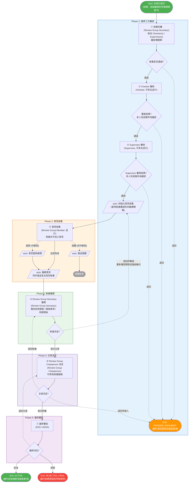
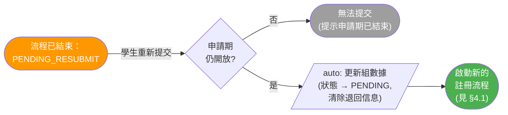
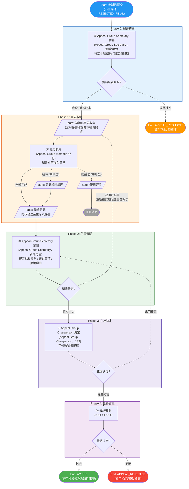

# 學生組織註冊與申訴流程（修訂版草案）

> **狀態：草案，待甲方確認。本文件描述的是修訂後的目標流程，系統尚未實作。**
>
> 現行已上線系統的描述，請參閱 [SLAS-Docs / student-org-workflow-flowcharts.md](https://github.com/OneStar-Projects/SLAS-Docs/blob/main/student-org-workflow-flowcharts.md)。待 §0 各項確認、且開發完成後，本文件方會取代該份文檔。
>
> **依據**：《SO Registration Workflow 20260912》批註稿（同目錄）
> **日期**：2026-09-27

---

## 0. 待確認問題

依據 2026-09-27 內部會議（[會議紀要-20260927.md](./會議紀要-20260927.md)）重新整理，按**註冊流程**與**申訴流程**分列，每個流程分兩部分：

- **已澄清**：批註稿已明確，或內部會議已對批註取得一致解讀，本文件按此描述；
- **待甲方確認**：須與甲方逐項確認。「本文件現行假設」一欄為正文目前的寫法，**若甲方選擇其他方案，本文件需相應修訂**。

編號沿用 A1–A14（正文引用不變），新增 A15–A17；原 Q1–Q6 見 [clarifications-zh-hk.md](./clarifications-zh-hk.md)。兩個流程都涉及的問題，在各自流程中分別列出，以便逐項確認。

### 0.1 註冊流程

#### 已澄清

| 編號 | 內容 | 影響章節 |
|:--|:--|:--|
| A11 | 系統現有 **Supervisor** 取代原角色 132（Academic Checker）的註冊審核職責；不是將 132 改名，須同步調整指派、任務權限及通知對象 | §2.1、§2.3 |
| A15（權限） | **134 Registration Approver Delegate** 為終審代辦人，決定權與 Registration Approver（124）相同，僅在終審待辦時處理；批註中其中文名與 Approver 相同，係文件簡稱所致（名稱見下表 A15） | §2.1、§5.1 ⑦ |
| — | **138 = Review Group Chairperson**（原 Summary Reviewer）。為避免中英別名歧義，全文統一以系統英文角色名稱表述 | §2.1 |
| A4（操作位置） | Review Group Secretary（122）在處理環節設定本輪傳閱期（待辦有效期），並可在同一環節填寫自己的意見後流轉至下一環節 | §5.1 ①④、§9.4 |
| — | 意見收集設兩條計時分支：**提醒型**（到期前催辦，主任務繼續）；**中斷型**（到期自動中斷未完成待辦，流程繼續推進） | §4.1、§5.1 ④ |
| A16 | 意見彙總後，彙總資料寫入系統，主席與秘書**均可查閱**；但待辦**依次產生**——先派 ⑤ 秘書審閱，秘書提交後才派 ⑥ 主席決定，不會同時向兩人派發待辦。正文「同步發送至主席及秘書」指資料同步可見 | §4.1、§5.1 ④⑤⑥ |
| A14（管理對象） | 「評審員管理」管理的是已指派的 **Checker／Supervisor**，不是 Review Group Member 名單 | §10 |

#### 待甲方確認

| 編號 | 問題 | 本文件現行假設 | 影響章節 |
|:--|:--|:--|:--|
| A10-1 | **Checker 數量**：原設 Admin Checker（136）、Academic Checker（132）各一名，現統一為 Checker。Checker 仍為單一名，還是可選多名並行？ | 可選多名並行 | §2.3、§9.3 |
| A10-2 | **Supervisor 數量**：批註以複數表述，推斷可選多名並行，請確認 | 可選多名並行 | §2.3、§9.3 |
| A10-3 | **多人通過規則**：Checker／Supervisor 多名並行時，是 (a) 全員同意才通過、任一人退回即退回，還是 (b) 收齊全部意見後再判定（意見衝突時如何處理）？節點形成結果後，其餘未完成任務是否取消？Checker 與 Supervisor 是否採用同一規則？ | 不預設；流程圖只畫「節點通過／節點退回」 | §2.3、§4.1、§5.1 ②③、§9.3 |
| A15 | **Delegate 名稱**：134 的中文名稱應如何表述？批註中的「功能別名」具體指甚麼（系統顯示名稱、菜單名稱，還是僅為文件稱謂）？ | 統一使用英文角色名稱 Registration Approver Delegate | §2.1 |
| A13 | **重啟輪次**：秘書退回 Review Group Member 重新評議時須重新設定期限——(1) 是否限制重啟輪次？(2) 新一輪期限預設帶入上一輪天數，還是恢復系統預設值？ | 不設輪次上限；帶入上一輪天數供秘書調整；向本案全體成員重新派發，歷次意見按輪次保留 | §5.1 ⑤、§9.4 |
| A4 | **傳閱期預設值及上下限**：預設傳閱 14 天、到期前 3 天提醒是否合適？秘書調整時是否設上下限（建議 7–30 天）？ | 14 天／3 天，秘書可逐案調整 | §9.4 |
| A9 | **首輪傳閱期設定時點**：在 ① 秘書初審時一併設定，還是在意見收集開始前另設環節？ | 併入 ① 秘書初審；期限從實際初始化意見收集時起算 | §5.1 ①、§9.4 |
| A17 | **Review Group 審批有效期**：預設值如何設定？是否同時約束成員意見、秘書審閱及主席決定？到期時未完成案件如何處理（暫停／延期／改派）？是否與 Appeal Group 共用見 §0.2 A17 | 由 SAO Admin 設定起訖時間；適用範圍及到期處理不預設 | §9.2 |
| A1 | 「秘書審閱」由 122、「主席決定」由 138 負責，不新增註冊側角色（Q1） | 同左 | §2.1、§4.1 |
| A7 | 主席除「提交終審」「退回秘書」外，是否仍保留「退回申請人」（→ `PENDING_RESUBMIT`，顯示已確認的退回原因及跟進事項）？ | 保留（批註保留了該結束節點） | §4.1、§5.1 ⑥ |
| A6 | **拒絕理由**：秘書擬稿 → 主席修改確認 → 終審人採用；若未擬定拒絕理由而終審人決定拒絕，由終審人必填理由，空白不得提交（Q6） | 同左 | §4.1、§5.1、§9.5 |
| A5 | **批量操作**：批註的「批量發送」，內部會議理解為終審「批量批准」；批量拒絕因每案須有獨立理由，並不合理。請確認其含義及單次上限（Q5） | 彙總後自動發送，不設人工批量發送；批量審批只開放「批准」 | §9.7 |
| A14 | 評審員管理的允許角色：Review Group Secretary（122）限其負責的案件；Registration Approver Delegate（134）保留現有授權範圍 | 同左 | §10 |

### 0.2 申訴流程

#### 已澄清

| 編號 | 內容 | 影響章節 |
|:--|:--|:--|
| A2 | 角色 **139** 擔任 Appeal Group Chairperson，沿用 `sg_app_summary_reviewer`；**新增 Appeal Group Secretary**（ID 待分配，CODE 待確認），承接初審及擬稿職責 | §2.2 |
| A3 | 新增 ① **Appeal Group Secretary 初審**：檢查資料、指定本案 Appeal Group Member、設定傳閱期；秘書亦可加入自己的意見，並在 ③ 擬定批核條款／跟進事項／拒絕理由 | §4.3、§5.2 |
| — | 意見收集的提醒型／中斷型計時分支，與註冊相同 | §4.3、§5.2 ② |
| A16 | 彙總資料主席、秘書均可查閱，待辦依次產生（先 ③ 秘書審閱，後 ④ 主席決定），與註冊相同 | §4.3、§5.2 |
| — | 申訴終審僅保留批准／拒絕，**不設退回主席**（截圖 06 的「退回主席」僅適用於註冊，截圖 10 未提出申訴對應路線）；申訴主席亦不可退回申請人 | §4.3、§5.2 ④⑤ |
| A15（權限） | **135 Appeal Approver Delegate** 決定權與 Appeal Approver（126）相同，僅在終審待辦時處理 | §2.2 |
| A14（範圍） | 評審員管理不涵蓋申訴；申訴成員由 Appeal Group Secretary 在初審時指定 | §10.2 |

#### 待甲方確認

| 編號 | 問題 | 本文件現行假設 | 影響章節 |
|:--|:--|:--|:--|
| A12-1 | **成員指定方式**：Appeal Group Secretary 指定本案成員時，是 (a) 從系統用戶中逐案挑選（或隨機抽選），還是 (b) 預先建立 Appeal Group 名單，秘書從名單中挑選？ | (b) 從預建名單逐案挑選 | §5.2 ①、§9.2 |
| A17 | **審批有效期**：Appeal Group 與 Review Group 共用一個預設有效期，還是各自獨立定義？ | 未預設；我方建議各自獨立定義 | §9.2 |
| A13 | **重啟輪次**：輪次限制及新一輪期限預設（同 §0.1 A13）；重啟時向本案指定的全體 Appeal Group Member 重新派發 | 同 §0.1 A13 | §5.2 ③、§9.4 |
| A15 | **Delegate 名稱**：135 的中文名稱及「功能別名」含義（同 §0.1 A15） | 統一使用英文角色名稱 Appeal Approver Delegate | §2.2 |
| A12-2 | **其他申訴角色名稱**：除 139 及新增 Secretary 外，Appeal Group Member 等英文名稱屬我方提議（截圖 02 只寫「Please update」）；資料庫 NAME 是否同步修改？ | 採用 §2.2 名稱；126 保持現有 NAME | §2.2 |
| A8 | `APPEAL_RESUBMIT` 僅保留一個用途——初審時資料不全退回補件；原「摘要退回」「終審退回」兩個出口已刪除 | 同左 | §1.2、§4.3、§4.4 |
| A4 | 傳閱期預設值及上下限（同 §0.1 A4） | 同註冊 | §9.4 |
| A6 | 拒絕理由機制同註冊；申訴沒有退回主席路線，終審改判拒絕時由終審人必填理由 | 同左 | §5.2 ⑤、§9.5 |
| A5 | 批量批准是否同樣適用於申訴終審？ | 適用，只開放「批准」 | §9.7 |

### 0.3 甲方確認會議議程對照

內部會議指定須優先與甲方確認以下六項；其餘各項如時間允許一併確認，無異議則按本文件現行假設實作。

| 會議紀要待辦 | 對應編號 |
|:--|:--|
| Checker 與 Supervisor 的數量及多選並行規則 | §0.1 A10-1、A10-2 |
| Delegate 角色中文名與功能別名的含義 | §0.1／§0.2 A15 |
| 申訴小組秘書指定成員的具體方式 | §0.2 A12-1 |
| 多人審批通過的判定規則 | §0.1 A10-3 |
| 重啟輪次的時間重置與限制 | §0.1／§0.2 A13 |
| 審批有效期的獨立設置規則 | §0.1／§0.2 A17 |

---

## 1. 流程概覽

### 1.1 業務目標

- **註冊流程**：對學生組織提交的註冊申請進行多層審批，通過後組別轉為正式狀態。
- **申訴流程**：對被終局拒絕的學生組織提供再次評審的機會。

### 1.2 兩個流程的關係

```
申請期開放 → [新申請 / 重新提交] → 註冊流程 → 批准 → ACTIVE
                                            → 退回 → PENDING_RESUBMIT（可修改後重新提交註冊）
                                            → 拒絕 → REJECTED_FINAL（只能進入申訴流程）

REJECTED_FINAL → 申訴流程 → 批准 → ACTIVE
                          → 資料不全退回 → APPEAL_RESUBMIT（補件後重新提交申訴）
                          → 拒絕 → APPEAL_REJECTED（終局）
```

### 1.3 結束狀態總覽

| 狀態 | 業務含義 | 頁面須顯示 | 學生後續操作 |
|:-----|:--------|:----------|:-----------|
| `ACTIVE` | 註冊／申訴通過，組別正式生效 | 批核條款及跟進事項 | — |
| `PENDING_RESUBMIT` | 註冊被退回 | 已確認的退回原因及跟進事項 | 修改後重新提交註冊 |
| `REJECTED_FINAL` | 註冊被終局拒絕 | 拒絕原因及申訴程序 | 只能發起申訴 |
| `APPEAL_RESUBMIT` | 申訴資料不全，須補件 | 須補交的項目 | 補件後重新提交申訴 |
| `APPEAL_REJECTED` | 申訴被終局拒絕 | 拒絕原因 | 無後續操作 |

### 1.4 與現行流程的主要差異

| 項目 | 現行 | 修訂後 |
|:--|:--|:--|
| 註冊人工步驟數 | 10 步（含拒絕傳閱子流程 4 步） | **7 步** |
| 拒絕後處理 | 秘書起草 → 全體評審員逐一確認 → 主席審核 → 秘書定稿（可再耗 2–3 週） | **取消**，終審拒絕即結束 |
| 摘要階段 | 1 步（摘要審核） | **2 步**（秘書審閱 + 主席決定） |
| 退回機制 | 只能結束流程重來 | 新增 **3 條流程內退回路線**，無須整案重來 |
| 註冊終審選項 | 批准／拒絕／退回 | **批准／拒絕／退回主席**（取消退回申請人） |
| 申訴終審選項 | 批准／拒絕／退回 | **批准／拒絕**（跟進事項改由 Supervisor 後續跟進） |
| 申請期 | 無限制，隨時可交 | **按組織類別設定開啟／結束** |
| 小組審批有效期 | 依角色派發，未設本次要求的審批時限 | 設定小組可執行審批的起訖時間；與成員名單及單輪傳閱期分開管理（§9.2） |
| 前置審核人員 | Admin Checker、Academic Checker 各 1 名 | Checker 可選多人；現有 Supervisor 取代角色 132，亦可選多人；多人完成條件待確認 |

---

## 2. 角色與職責

本文件統一使用下表英文角色名稱，不另設中文功能別名。初審、審閱、決定等中文文字僅描述操作。

### 2.1 註冊流程系統角色

| ID | CODE | 英文角色名稱（目標） | 職責 |
|----:|:--|:--|:--|
| 122 | `sg_reg_secretary` | Review Group Secretary | 初審；指派 Checker(s) 與 Supervisor(s)；確認傳閱期；可加入自己的意見；審閱彙總意見並擬定批核條款／跟進事項／拒絕理由；可退回評審員重啟意見收集輪次 |
| 123 | `sg_reg_reviewer` | Review Group Member | 提供註冊意見（並行多人） |
| 124 | `sg_reg_approver` | Registration Approver | 最終批准／拒絕；可退回主席 |
| 現有 Supervisor | 沿用既有 Supervisor CODE | Supervisor | 由秘書指派，**可多名並行**；退回與拒絕時收到通知 |
| 134 | `sg_reg_approver_secretary` | Registration Approver Delegate | 替代終審人，與 Registration Approver 享有相同決定權 |
| 136 | `sg_reg_checker_administrative` | Checker | 由秘書指派，**可多名並行**；退回與拒絕時收到通知 |
| 138 | `sg_reg_summary_reviewer` | Review Group Chairperson | 審閱秘書擬稿，可修改批核條款／跟進事項／拒絕理由；決定提交終審、退回秘書或退回申請人 |

> **沿用系統現有 Supervisor，取代原角色 132（`sg_reg_checker_academic`）在本流程的職責，不將 132 改名，也不新增同名角色。** 秘書選人、任務指派、審批權限、待辦及通知均須改用現有 Supervisor 及本案實際指派名單；僅持有原角色 132 不再構成修訂流程的審批資格。原角色的全局停用／刪除及在途案件遷移，須另行核對影響。
>
> 現有 Supervisor 的具體 ID／CODE 在實作前核對，不得填作 132／`sg_reg_checker_academic`。134、136 的名稱調整保留其 CODE；122、123、138 僅使用文中功能別名並保留現有 NAME，124 亦不改名（A11）。

### 2.2 申訴流程系統角色

| ID | CODE | 英文角色名稱（目標） | 職責 |
|----:|:--|:--|:--|
| 125 | `sg_app_reviewer` | Appeal Group Member | 提供申訴意見（並行多人） |
| 126 | `sg_app_approver` | Appeal Approver | 最終批准／拒絕，沒有退回選項 |
| 135 | `sg_app_approver_secretary` | Appeal Approver Delegate | 替代終審人，與 Appeal Approver 享有相同決定權 |
| 139 | `sg_app_summary_reviewer` | Appeal Group Chairperson | 沿用現有角色。審閱秘書擬稿，可修改；決定提交終審或退回秘書 |
| **待分配** | 待確認 | Appeal Group Secretary | **新增角色**。初審；指定 Appeal Group Member；設定傳閱期；可加入意見；擬定批核條款／跟進事項／拒絕理由；可退回評審員重啟輪次 |

> **Appeal Group Chairperson 合併至現有角色 139，沿用 `sg_app_summary_reviewer`，不新增 Chairperson 角色，也不與註冊角色 138 合併。Appeal Group Secretary 為獨立新增角色，ID 待分配、CODE 待確認。** 初審、附加意見及秘書審閱任務須指派給新增 Secretary；139 負責主席決定，不再列為 Secretary。其他申訴功能名稱及資料庫 NAME 調整仍按 A12 確認，126 保持現有 NAME。

> **流程外參與者**
> - **Group Leader（學生）**：提交註冊申請；在 `PENDING_RESUBMIT` 時重新提交；在 `REJECTED_FINAL` 時發起申訴；在 `APPEAL_RESUBMIT` 時補件後重新提交申訴。
> - **SAO Admin**：設定各組織類別的申請期；設定審議小組審批有效期；上訴小組的適用規則見 §9.2。

### 2.3 多人並行 / 候選組規則

| 任務 | 規則 |
|:----|:----|
| Checker 審核（註冊 ②） | 可指派多名 Checker；節點形成通過／退回結果的條件仍待確認（A10） |
| Supervisor 審核（註冊 ③） | 可從現有 Supervisor 指派多人；多人完成條件同樣待確認（A10） |
| 意見收集（註冊 ④ / 申訴 ②） | 小組成員並行提交意見；秘書亦可加入自己的意見；達到截止時間時系統自動將未提交者標記為逾期 |
| 最終審批 | Approver 與 Approver Delegate 享有相同決定權，任一者可作出決定 |
| 小組審批資格 | 成員名單決定參與人員；審批有效期決定可執行審批的時間範圍，不能只在派單時檢查（§9.2） |

---

## 3. 圖例

### 3.1 節點形狀

| 形狀 | Mermaid 語法 | 含義 |
|:-----|:-------------|:-----|
| 矩形 | `["Name"]` | **人工任務** — 需要審批人手動操作 |
| 平行四邊形 | `[/"auto: Name"/]` | **系統任務** — 自動執行，無需用戶操作 |
| 菱形 | `{Question?}` | **判斷網關** — 根據條件分流，文字以問號結尾 |
| 圓角 | `(["Name"])` | **流程起點／終點** |

### 3.2 連線類型

| 樣式 | Mermaid 語法 | 含義 |
|:-----|:-------------|:-----|
| 實線箭頭 | `-->` | 正向順序流（happy path） |
| 虛線箭頭 | `-.->` | 計時器觸發（超時／提醒）、**流程內退回循環**、結束流程的退回 |

### 3.3 步驟編號

| 流程 | 編號 | 步驟 | 角色 |
|:-----|:----:|:-----|:-----|
| 註冊 | ① | 秘書初審 | Review Group Secretary |
|  | ② | Checker 審核 | Checker（可多名並行） |
|  | ③ | Supervisor 審核 | Supervisor（可多名並行） |
|  | ④ | 意見收集 | Review Group Member（並行）＋ 秘書 |
|  | ⑤ | Review Group Secretary 審閱 | Review Group Secretary |
|  | ⑥ | Review Group Chairperson 決定 | Review Group Chairperson |
|  | ⑦ | 最終審批 | DSA／ADSA |
| 申訴 | ① | Appeal Group Secretary 初審 | Appeal Group Secretary |
|  | ② | 意見收集 | Appeal Group Member（並行）＋ 秘書 |
|  | ③ | Appeal Group Secretary 審閱 | Appeal Group Secretary |
|  | ④ | Appeal Group Chairperson 決定 | Appeal Group Chairperson |
|  | ⑤ | 最終審批 | DSA／ADSA |

---

## 4. 流程圖

### 4.1 註冊主流程

> ②、③ 的連線表示節點形成通過／退回結果後的去向；多人如何形成結果仍待 A10 確認，圖中不預設全體通過或任一人退回即完成節點。



> **三條流程內退回路線**（虛線）：⑤ 秘書可退回評審員重啟意見收集；⑥ 主席可退回秘書；⑦ 終審人可退回主席。這三條都**不會結束流程**，案件仍在系統內，無須學生重新提交。
>
> **原有的「拒絕傳閱子流程」（秘書起草 → 全體評審員確認 → 主席審核 → 秘書定稿）已整個刪除。** 拒絕理由改由秘書在 ⑤ 擬稿、主席在 ⑥ 修改確認，終審人在 ⑦ 採用已確認理由；若沒有理由而決定拒絕，由終審人填寫必填理由（A6／Q6，見 §9.5）。

### 4.2 註冊重新提交

當狀態為 `PENDING_RESUBMIT` 時，學生可修正申請並重新提交。此操作**啟動全新的註冊流程實例**——原流程已結束，沒有流程內回跳。



> **新增限制**：重新提交同樣受申請期約束。若該組織類別的申請期已結束，學生無法重新提交，須待下一個申請期。

### 4.3 申訴主流程



> **申訴終審沒有「退回」選項，包括退回主席。** 原因：批核條款中的跟進事項可由 Supervisor 在組別成立後持續跟進，無須為此把整個申訴案退回學生。
>
> 申訴主席亦**沒有「退回申請人」**——申訴是最後一道程序，主席只能提交終審或退回秘書。

### 4.4 申訴補件後重新提交


---

## 5. 步驟詳述

### 5.1 註冊流程步驟

#### ① 秘書初審

- **執行人**：Review Group Secretary（122）
- **動作**：
  1. 初次審核註冊申請
  2. 通過時**指派一名或多名 Checker**（內容核實）與**一名或多名 Supervisor**（內容審核）
  3. **確認傳閱期**（系統預設 14 天，提醒提前 3 天；秘書可調整）
- **結果**：
  - 通過 → 進入 ② Checker 審核
  - 退回 → 流程結束（`PENDING_RESUBMIT`）

#### ② Checker 審核（Registration Checker Review）

- **執行人**：由秘書在 ① 指派的所有 Checker，並行審核
- **動作**：內容核實
- **結果**：
  - **節點判定通過（多人完成條件待確認）** → 進入 ③ Supervisor 審核
  - **節點判定退回（多人退回條件待確認）** → 流程結束（`PENDING_RESUBMIT`），其餘 Checker 的任務處理待確認

#### ③ Supervisor 審核（Registration Supervisor Review）

- **執行人**：由秘書在 ① 指派的所有 Supervisor，並行審核
- **動作**：內容審核
- **結果**：
  - **節點判定通過（多人完成條件待確認）** → 進入 Phase 2 意見收集
  - **節點判定退回（多人退回條件待確認）** → 流程結束（`PENDING_RESUBMIT`）

> Phase 1 任一節點形成退回結果後均結束於 `PENDING_RESUBMIT`，學生修改後重新提交（須申請期仍開放）。

#### ④ 意見收集（並行）

- **執行人**：審議小組名單內的所有成員（123）並行，審批受 §9.2 的有效期規則約束；**Review Group Secretary 亦可加入自己的意見**
- **動作**：每位提交意見
- **計時器規則**：
  - **提醒**（非中斷型）：到達提醒時間，系統通知尚未提交者，主任務繼續運行
  - **超時**（中斷型）：到達截止時間，系統取消未完成任務，未提交者標記為逾期，流程繼續
- **彙總後**：系統**同步發送**彙總意見至 Review Group Chairperson 及秘書
- **結果**：進入 ⑤

> 若本輪由 ⑤ 退回重啟，秘書須重新確認期限，再初始化**新一輪**意見收集並向本案全體小組成員派發；歷次意見保留並按輪次顯示，詳見 §9.4（A13）。

#### ⑤ Review Group Secretary 審閱（Review Group Secretary Review）

- **執行人**：Review Group Secretary（122）
- **動作**：審閱彙總意見，並**擬定以下內容**：
  - 建議的**批核條款**（approval conditions）
  - 建議的**跟進事項**（follow-up actions）
  - 若傾向拒絕，擬定**建議拒絕理由**
- **結果**：
  - **提交主席** → 進入 ⑥
  - **退回評審員** → 重新確認本輪傳閱期限、小組審批有效期及本案名單，再初始化並回到 ④，**重啟一輪意見收集**（須填寫退回說明，詳見 §9.4）

#### ⑥ Review Group Chairperson 決定（Review Group Chairperson Decision）

- **執行人**：Review Group Chairperson（138）
- **動作**：審閱秘書擬稿，**可修改**批核條款、跟進事項與拒絕理由
- **結果**：
  - **提交終審** → 進入 ⑦
  - **退回秘書** → 回到 ⑤（流程內，案件不結束）
  - **退回申請人** → 流程結束（`PENDING_RESUBMIT`），頁面顯示主席確認的退回原因及跟進事項

#### ⑦ 最終審批

- **執行人**：DSA／ADSA（124 或 134）
- **動作**：作出決定。批核條款、跟進事項及已確認的拒絕理由直接採用；若未擬定拒絕理由而決定拒絕，終審人須自行填寫，空白不得提交（§9.5）
- **結果**：
  - **批准** → 流程結束（`ACTIVE`），頁面顯示批核條款及跟進事項
  - **拒絕** → 流程結束（`REJECTED_FINAL`），頁面顯示拒絕原因及申訴程序
  - **退回主席** → 回到 ⑥（流程內，案件不結束）

> **流程結束後的動作**：秘書可在案件詳情頁**上載收妥的投票記錄或同等文件**（見 §9.6）。此動作不屬於審批流程節點。

### 5.2 申訴流程步驟

#### ① Appeal Group Secretary 初審

- **執行人**：Appeal Group Secretary（新增角色，ID 待分配）
- **動作**：
  1. 檢查申訴資料是否齊全
  2. **從 Appeal Group 名單指定本案成員**；審批有效期的適用規則見 §9.2
  3. **設定傳閱期**（預設同註冊流程）
- **結果**：
  - 齊全 → 進入 ② 意見收集
  - **退回補件** → 流程結束（`APPEAL_RESUBMIT`），頁面列明須補交的項目

#### ② 意見收集（並行）

- **執行人**：① 指定的 Appeal Group Member（125）並行；**Appeal Group Secretary 亦可加入意見**
- **計時器規則**：與註冊 ④ 相同
- **彙總後**：同步發送至 Appeal Group Chairperson 及秘書
- **結果**：進入 ③

#### ③ Appeal Group Secretary 審閱（Appeal Group Secretary Review）

- **執行人**：Appeal Group Secretary（新增角色，ID 待分配）
- **動作**：擬定批核條款、跟進事項、建議拒絕理由
- **結果**：
  - **提交主席** → 進入 ④
  - **退回評審員** → 重新確認本輪傳閱期限、小組審批有效期及本案名單，再初始化並回到 ②，重啟一輪意見收集（§9.4）

#### ④ Appeal Group Chairperson 決定（Appeal Group Chairperson Decision）

- **執行人**：Appeal Group Chairperson（139）
- **動作**：審閱並可修改秘書擬稿
- **結果**：
  - **提交終審** → 進入 ⑤
  - **退回秘書** → 回到 ③

#### ⑤ 最終審批

- **執行人**：DSA／ADSA（126 或 135）
- **動作**：採用已確認理由；若未擬定理由而決定拒絕，須自行填寫，空白不得提交（§9.5）。沒有退回主席選項。
- **結果**：
  - **批准** → 流程結束（`ACTIVE`），顯示批核條款及跟進事項
  - **拒絕** → 流程結束（`APPEAL_REJECTED`，終局），顯示拒絕原因

---

## 6. 結果對照表

### 6.1 註冊結果對照

| 決策點 | 決定 | 最終狀態 | 頁面顯示 | 學生後續可進行 |
|:--|:--|:--|:--|:--|
| ① 秘書初審 | 退回 | `PENDING_RESUBMIT` | 退回原因 | 重新提交註冊 |
| ② Checker 審核 | 節點判定退回（多人條件待確認） | `PENDING_RESUBMIT` | 退回原因 | 重新提交註冊 |
| ③ Supervisor 審核 | 節點判定退回（多人條件待確認） | `PENDING_RESUBMIT` | 退回原因 | 重新提交註冊 |
| ⑤ 秘書審閱 | 退回評審員 | （流程內，不結束） | — | — |
| ⑥ 主席決定 | 退回秘書 | （流程內，不結束） | — | — |
| ⑥ 主席決定 | 退回申請人 | `PENDING_RESUBMIT` | 已確認的退回原因及跟進事項 | 重新提交註冊 |
| ⑦ 最終審批 | 批准 | `ACTIVE` | 批核條款及跟進事項 | — |
| ⑦ 最終審批 | 拒絕 | `REJECTED_FINAL` | 拒絕原因及申訴程序 | 只能發起申訴 |
| ⑦ 最終審批 | 退回主席 | （流程內，不結束） | — | — |

### 6.2 申訴結果對照

| 決策點 | 決定 | 最終狀態 | 頁面顯示 | 學生後續可進行 |
|:--|:--|:--|:--|:--|
| ① 秘書初審 | 退回補件 | `APPEAL_RESUBMIT` | 須補交項目 | 補件後重新提交申訴 |
| ③ 秘書審閱 | 退回評審員 | （流程內，不結束） | — | — |
| ④ 主席決定 | 退回秘書 | （流程內，不結束） | — | — |
| ⑤ 最終審批 | 批准 | `ACTIVE` | 批核條款及跟進事項 | — |
| ⑤ 最終審批 | 拒絕 | `APPEAL_REJECTED` | 拒絕原因 | 無後續操作（終局） |

---

## 7. 場景示例

### 場景 1：註冊一次通過

```
（前置：該組織類別申請期開放中）
① 秘書初審（通過，指派 2 名 Checker、1 名 Supervisor，傳閱期 14 天）
→ ② Checker 節點判定通過（多人完成條件待確認）→ ③ Supervisor 通過
→ ④ 小組成員全員提交意見（秘書亦補充一條）
→ ⑤ 秘書審閱（擬批核條款：須於 3 個月內提交周年大會記錄；提交主席）
→ ⑥ 主席決定（微調條款措辭；提交終審）
→ ⑦ DSA 批准 → ACTIVE ✅
（結果頁顯示批核條款及跟進事項；秘書其後上載投票記錄）
```

### 場景 2：早期退回

```
① 秘書初審（通過）→ ② Checker 甲提出退回（章程缺頁）
→ 是否立即退回、是否等待 Checker 乙及剩餘任務如何處理，均待 A10 確認
→ 僅在節點判定退回後進入 PENDING_RESUBMIT
（學生補齊章程後重新提交，啟動新流程）
```

### 場景 3：意見不足，秘書退回重啟一輪

```
① → ② → ③ → ④ 第 1 輪意見收集（3 人提交，2 人逾期）
→ ⑤ 秘書退回評審員，說明須補充的角度，重新確認傳閱期限、小組審批有效期及本案名單
→ 初始化第 2 輪並向本案全體小組成員派發 → ④ 第 2 輪意見收集（全員重新提交）
→ ⑤ 秘書審閱（提交主席）→ ⑥ 主席決定 → ⑦ 批准 → ACTIVE ✅
（兩輪意見均保留，可按輪次查閱）
```

### 場景 4：主席與終審人互相退回

```
① → ② → ③ → ④ → ⑤ 秘書審閱（提交主席）
→ ⑥ 主席退回秘書（要求補充財務條款）
→ ⑤ 秘書修訂後再提交 → ⑥ 主席提交終審
→ ⑦ DSA 退回主席（認為條款過寬）
→ ⑥ 主席收緊條款後再提交 → ⑦ DSA 批准 → ACTIVE ✅
（全程未結束流程，學生無須重新提交）
```

### 場景 5：註冊終局拒絕

```
① → ② → ③ → ④ → ⑤ 秘書審閱（擬拒絕理由：與現有組織宗旨重疊）
→ ⑥ 主席確認理由，提交終審
→ ⑦ DSA 拒絕 → REJECTED_FINAL
（結果頁顯示拒絕原因及申訴程序；學生可發起申訴）
```

### 場景 6：申訴資料不全

```
（前置：REJECTED_FINAL）
① Appeal Group Secretary 初審 → 資料不全，退回補件 → APPEAL_RESUBMIT
（學生補交佐證文件後重新提交申訴）
```

### 場景 7：申訴有條件通過

```
（前置：REJECTED_FINAL）
① 秘書初審（齊全，指定 5 名成員，傳閱期 14 天）
→ ② 意見收集 → ③ 秘書審閱（擬批核條款：須調整組織宗旨表述）
→ ④ 主席決定（提交終審）→ ⑤ DSA 批准 → ACTIVE ✅
（跟進事項由 Supervisor 在組別成立後持續跟進，無須退回學生）
```


### 場景 8：主席建議批准，終審改判拒絕（A6，待確認）

秘書擬定批核條款，主席建議批准，未擬定拒絕理由。DSA／ADSA 在終審選擇拒絕時，須填寫本案拒絕理由；未填或只有空白時不能提交。填寫後直接完成拒絕，註冊進入 `REJECTED_FINAL`，申訴進入 `APPEAL_REJECTED`。系統保留主席原建議與終審決定，結果頁顯示終審人填寫的理由，無須為補理由退回主席。

---

## 8. 註冊與申訴關鍵差異對比

| 維度 | 註冊 | 申訴 |
|:--|:--|:--|
| **進入前置條件** | 新申請或 `PENDING_RESUBMIT`，且申請期開放 | `REJECTED_FINAL` 或 `APPEAL_RESUBMIT` |
| **申請期限制** | 有（按組織類別） | 無 |
| **前置審核閘** | 3 步（秘書初審 → Checker → Supervisor） | 1 步（秘書初審） |
| **小組成員來源** | 角色 123 對應的小組名單，審批須符合小組審批有效期 | 由秘書從 Appeal Group 名單逐案指定；審批有效期規則待確認 |
| **傳閱期設定** | 秘書在初審時確認 | 秘書在初審時設定 |
| **秘書審閱** | Review Group Secretary（122） | Appeal Group Secretary（新增角色，ID 待分配） |
| **主席決定** | Review Group Chairperson（138） | Appeal Group Chairperson（139） |
| **主席可退回申請人** | ✅ 可（→ `PENDING_RESUBMIT`） | ❌ 不可 |
| **最終審批人** | DSA／ADSA（124／134） | DSA／ADSA（126／135） |
| **終審選項** | 批准／拒絕／退回主席 | 批准／拒絕 |
| **最終拒絕結果** | `REJECTED_FINAL`（可申訴） | `APPEAL_REJECTED`（終局） |
| **流程內退回路線** | 3 條（⑤→④、⑥→⑤、⑦→⑥） | 2 條（③→②、④→③） |
| **拒絕傳閱子流程** | ❌ 已刪除 | 從無 |

---

## 9. 新增功能規格

以下功能為本次修訂新增，現行系統並無對應實作。

### 9.1 按組織類別設定申請期

| 項目 | 說明 |
|:--|:--|
| 操作角色 | SAO Admin |
| 設定內容 | 每個組織類別（Group Type）可設定「開始日期」與「結束日期」 |
| 系統行為 | 申請期外，該類別的組織**無法提交**新申請，亦**無法重新提交**被退回的申請 |
| 提示 | 學生嘗試提交時，顯示「本類別申請期已於 YYYY-MM-DD 結束」 |
| 待確認 | 是否支援一個類別設定多個申請期（例如上／下學期各一次） |

### 9.2 審議小組／上訴小組審批有效期

**Review Group 的有效期指審批有效期，即該小組獲准處理審批工作的開始及結束時間。** 成員名單回答「由誰審批」，審批有效期回答「可在甚麼時間審批」。不能僅實作為成員任期或派單時的名單篩選。

| 項目 | 說明 |
|:--|:--|
| 操作角色 | SAO Admin |
| 設定內容 | 小組審批開始時間及結束時間；成員名單獨立維護，不以成員加入／離開日期替代審批有效期 |
| 生效前 | 小組尚未進入可審批期間；能否預先選人或建立待辦須確認，預先準備不代表可提前審批 |
| 有效期內 | 小組可在指定期間處理所負責的審批；人員仍須符合角色及本案指派要求 |
| 有效期結束 | 小組審批期限已到；不能預設已派發任務可繼續辦理。未完成任務、延期及改派規則須確認後實作 |
| 校驗位置 | 派發、開啟審批操作及提交結果時均須考慮有效期，避免僅在派單時檢查而忽略提交時已到期 |
| 與申請期的區別 | §9.1 控制學生何時可提交申請；本節控制小組何時可審批，兩者可有不同起訖時間 |
| 與傳閱期的區別 | §9.4 是每輪意見收集期限；重啟傳閱不代表自動延長小組審批有效期 |
| 適用範圍待確認 | 是否同時約束成員提供意見、秘書審閱及主席決定；Appeal Group 是否採用相同規則，須明確確認 |
| 到期處理待確認 | 未完成案件應暫停、由 SAO Admin 延期，還是交由其他獲授權小組接續；不能擅自設定自動通過、拒絕或取消 |
| 時間邊界待確認 | 按日期還是精確時間設定、結束時間是否包含當日，以及傳閱截止時間超出審批有效期時應阻止設定還是要求先延期 |

例如，審批有效期至 10 月 31 日，而一輪傳閱預計於 11 月 5 日結束，不能僅因任務在 10 月內派發就認定 11 月仍可提交。須先確認期限衝突的處理方式；既有意見如何保留及未完成案件如何接續，也須納入到期處理規則。

### 9.3 多名 Checker 與 Supervisor

| 項目 | 說明 |
|:--|:--|
| 指派時機 | 秘書初審（註冊 ①） |
| 數量 | 各可指派一名或多名 |
| 完成條件（待確認） | 全體通過、任一人完成，或達到指定人數／比例才完成？Checker 與 Supervisor 是否採用相同條件？批註未指定，本文不選定方案 |
| 退回行為（待確認） | 任一人提出退回是否立即結束節點，還是收齊意見後判定？通過與退回意見衝突時如何處理？ |
| 剩餘任務（待確認） | 節點形成結果後未完成任務是否取消、已提交意見如何保留，以及更換人員對完成條件的影響，須一併確認 |
| 後續更換 | 可透過「評審員管理」工具更換（見 §10） |

### 9.4 傳閱期人工確認

| 項目 | 說明 |
|:--|:--|
| 預設值 | 傳閱 14 天；到期前 3 天發送提醒 |
| 首輪確認（A9） | 暫在秘書初審逐案確認；批註標在初始化意見收集旁，此合併時點待確認 |
| 起算 | 每輪實際初始化意見收集時起算，不能從秘書初審時間起算 |
| 重啟確認（A13） | 秘書在「退回評審員」操作中填寫原因，重新確認本輪傳閱期與提醒時間；帶入上一輪天數供調整，不沿用已過期的截止日期 |
| 重啟對象（A13） | 註冊向本案全體 Review Group Member 派發；申訴向本案指定的全體 Appeal Group 成員派發。已提交者亦須重新提交，不只重派逾期者；重啟須符合 §9.2 的審批有效期規則 |
| 重啟校驗 | 重啟前確認本案名單及小組審批有效期；若已到期或本輪期限超出有效期，按 §9.2 待確認的延期／接續規則處理，不能藉重啟自動延長審批權限 |
| 輪次隔離 | 初始化新輪次及新期限，保留歷次意見；只用本輪意見判斷完成及產生本輪彙總 |
| 約束 | 提醒天數必須小於傳閱天數 |
| 待確認 | 是否設上下限（建議：傳閱期 7–30 天） |

### 9.5 批核條款、跟進事項與拒絕理由

| 項目 | 說明 |
|:--|:--|
| 錄入 | 秘書在「秘書審閱」擬定 |
| 修改 | 主席在「主席決定」可修改 |
| 採用 | 終審人直接採用批核條款、跟進事項及已確認的拒絕理由，不再編輯 |
| 拒絕理由例外（A6／Q6） | 若秘書／主席原建議批准而未擬定拒絕理由，終審人改判拒絕時須自行填寫理由；適用於註冊及申訴的 Approver／Delegate，不新增退回節點 |
| 提交校驗 | 任何終審拒絕均須有非空白理由；沒有理由不得完成拒絕。前端及後端均須校驗 |
| 留痕 | 保留秘書／主席原建議，以及終審人填寫的理由、操作者及決定時間；結果頁顯示最終拒絕理由 |
| 顯示 | `ACTIVE` 結果頁顯示批核條款及跟進事項；`PENDING_RESUBMIT` 顯示退回原因及跟進事項 |
| 語言 | 須支援繁體中文、簡體中文、英文三語顯示 |

### 9.6 投票記錄上載

| 項目 | 說明 |
|:--|:--|
| 操作角色 | Review Group Secretary／Appeal Group Secretary |
| 時機 | **流程結束後**，於案件詳情頁上載 |
| 內容 | 收妥的投票記錄或同等文件 |
| 性質 | 存檔用途，不影響流程狀態 |

### 9.7 批量操作

| 項目 | 說明 |
|:--|:--|
| 發送方式（A5／Q5） | 每案彙總後自動同步發送至主席及秘書，不設人工暫存或批量發送節點；若甲方要求人工批量發送，須另行確認待發送環節並修訂流程圖 |
| 批量審批 | 終審人可在列表頁勾選多個案件，**一次過批准** |
| 限制 | **不開放批量拒絕**——每個被拒案件須有其獨立理由 |
| 待確認 | 單次批量處理的上限數量 |

### 9.8 結果頁顯示內容

| 狀態 | 須顯示 |
|:--|:--|
| `ACTIVE` | 批核條款、跟進事項 |
| `PENDING_RESUBMIT` | 已確認的退回原因、跟進事項、重新提交入口（申請期內） |
| `REJECTED_FINAL` | 拒絕原因、**申訴程序說明**、發起申訴入口 |
| `APPEAL_RESUBMIT` | 須補交的項目、重新提交入口 |
| `APPEAL_REJECTED` | 拒絕原因 |

---

## 10. 評審員管理（管理工具）

當秘書在初審中指派的 Checker 或 Supervisor 因人員變動、休假等原因需要更換時，可透過此工具替換。

### 10.1 入口

| 項目 | 值 |
|:--|:--|
| 菜單位置 | 管理中心 → 評審員管理 |
| 管理對象 | 註冊案件中已指派的 Checker 或 Supervisor；不包含 Review Group Member 或 Appeal Group Member |
| 允許角色（A14，待確認） | Review Group Secretary（122，限其負責的案件）及 Registration Approver Delegate（134，保留現有授權範圍） |

### 10.2 約束

- 僅作用於**運行中**的註冊流程，且當前停留在 Checker 審核或 Supervisor 審核步驟。
- 支援**多名** Checker／Supervisor 的增刪替換（配合 §9.3）。
- 每次操作必須至少變更一名評審員。
- 變更原因為必填項，用於審計。
- 122 的菜單及 API 權限均須校驗案件責任範圍，不因持有秘書角色便能更換所有案件的評審員。
- 申訴流程的小組成員由秘書在初審時指定，不在此功能範圍內。

---

## 11. 角色與審批節點對照表

### 11.1 註冊流程

| 角色 ID | 英文角色名稱 | 審批節點 | 工作職能 | 下一個環節 |
|:--:|:--|:--|:--|:--|
| — | Group Leader | 發起申請 | 提交註冊申請（須申請期開放） | ① 秘書初審 |
| 122 | Review Group Secretary | ① 秘書初審 | 初審；指派 Checker(s)／Supervisor(s)；確認傳閱期 | 通過 → ②；退回 → `PENDING_RESUBMIT` |
| 136 | Checker | ② Checker 審核（多實例） | 內容核實；多人完成條件待確認 | 節點通過 → ③；節點退回 → `PENDING_RESUBMIT` |
| 現有 Supervisor | Supervisor | ③ Supervisor 審核（多實例） | 內容審核；多人完成條件待確認 | 節點通過 → ④；節點退回 → `PENDING_RESUBMIT` |
| 123 | Review Group Member | ④ 意見收集（多實例） | 並行提交意見 | 全員提交或逾期 → ⑤ |
| 122 | Review Group Secretary | ④ 意見收集（附加） | 秘書可加入自己的意見 | 同上 |
| 122 | Review Group Secretary | ⑤ 秘書審閱 | 擬定批核條款／跟進事項／拒絕理由 | 提交 → ⑥；退回評審員 → ④（新一輪） |
| 138 | Review Group Chairperson | ⑥ 主席決定 | 審閱並可修改秘書擬稿 | 提交 → ⑦；退回秘書 → ⑤；退回申請人 → `PENDING_RESUBMIT` |
| 124 | Registration Approver | ⑦ 最終審批 | 最終批准／拒絕 | 批准 → `ACTIVE`；拒絕 → `REJECTED_FINAL`；退回主席 → ⑥ |
| 134 | Registration Approver Delegate | ⑦ 最終審批（備選） | 替代終審人，相同決定權 | 同 ⑦ |

### 11.2 申訴流程

| 角色 ID | 英文角色名稱 | 審批節點 | 工作職能 | 下一個環節 |
|:--:|:--|:--|:--|:--|
| — | Group Leader | 發起申訴 | 提交申訴（前置：`REJECTED_FINAL` 或 `APPEAL_RESUBMIT`） | ① 秘書初審 |
| 待分配 | Appeal Group Secretary | ① 秘書初審 | 檢查資料；指定小組成員；設定傳閱期 | 齊全 → ②；退回補件 → `APPEAL_RESUBMIT` |
| 125 | Appeal Group Member | ② 意見收集（多實例） | 並行提交申訴意見 | 全員提交或逾期 → ③ |
| 待分配 | Appeal Group Secretary | ② 意見收集（附加） | 秘書可加入自己的意見 | 同上 |
| 待分配 | Appeal Group Secretary | ③ 秘書審閱 | 擬定批核條款／跟進事項／拒絕理由 | 提交 → ④；退回評審員 → ②（新一輪） |
| 139 | Appeal Group Chairperson | ④ 主席決定 | 審閱並可修改秘書擬稿 | 提交 → ⑤；退回秘書 → ③ |
| 126 | Appeal Approver | ⑤ 最終審批 | 最終批准／拒絕 | 批准 → `ACTIVE`；拒絕 → `APPEAL_REJECTED` |
| 135 | Appeal Approver Delegate | ⑤ 最終審批（備選） | 替代終審人，相同決定權 | 同 ⑤ |

> **多實例說明**：標「多實例」的節點，實際並行人數依配置或指派而定。

---

## 12. 交付階段對照

| 階段 | 本文件涵蓋範圍 | 前置條件 |
|:--|:--|:--|
| **第一階段** | §2 功能別名及限定的資料庫改名、現有 Supervisor 取代角色 132 的指派／權限／通知調整、§3.3 步驟名稱、三語文案 | 確認 A1、A11、A12；申訴資料庫改名須另行確認 |
| **第二階段** | 刪除拒絕傳閱子流程、註冊終審取消「退回學生」、申訴取消兩個退回出口（§1.4、§4.1、§4.3） | 確認 A6、A8 |
| **第三階段** | §4 全部流程重構（新增 Appeal Group Secretary、139 承接 Appeal Group Chairperson 職責、秘書／主席拆分、註冊三條及申訴兩條退回路線）、§9 全部新增功能 | 確認 A1–A17 |

**上線協調**：修改流程後系統會產生新版本的流程定義，但已在審批中的案件仍依舊流程走完。建議揀選在審案件較少的時段切換，或由甲方指定一個收件截止日。
