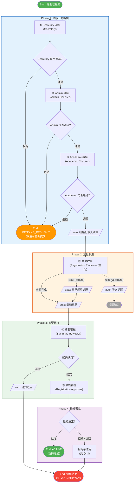
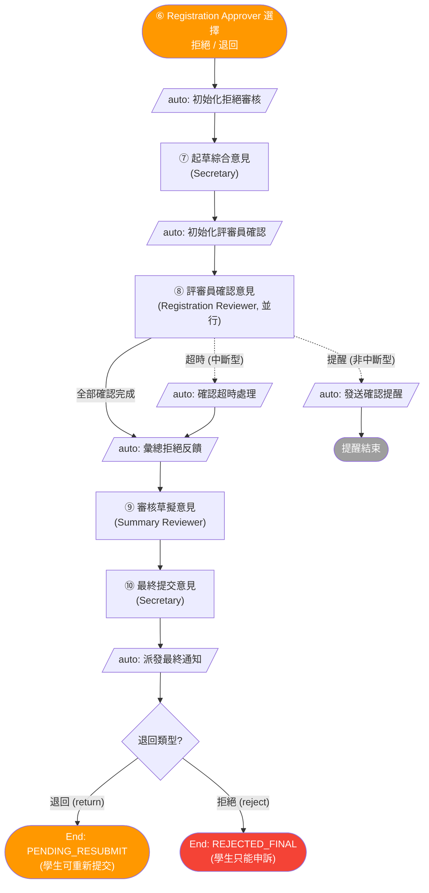
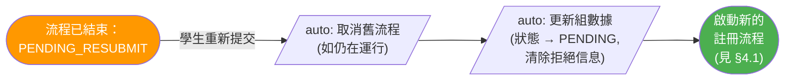
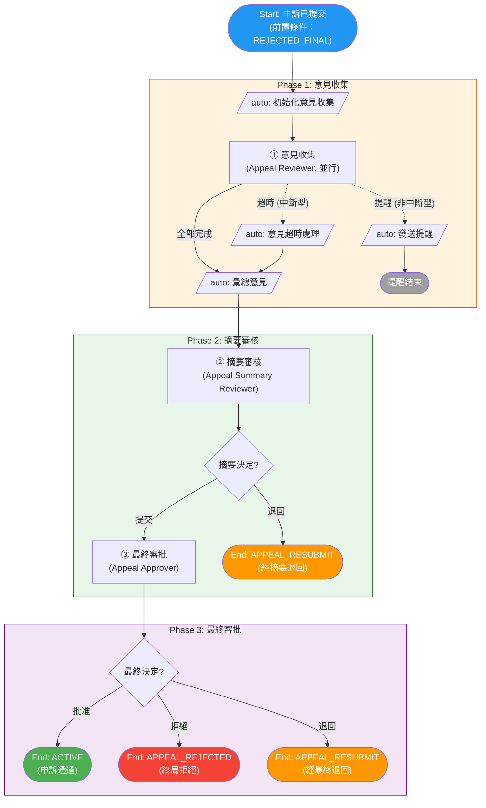
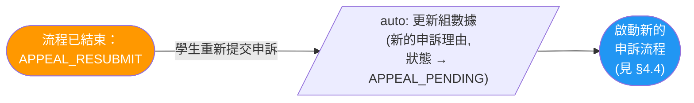
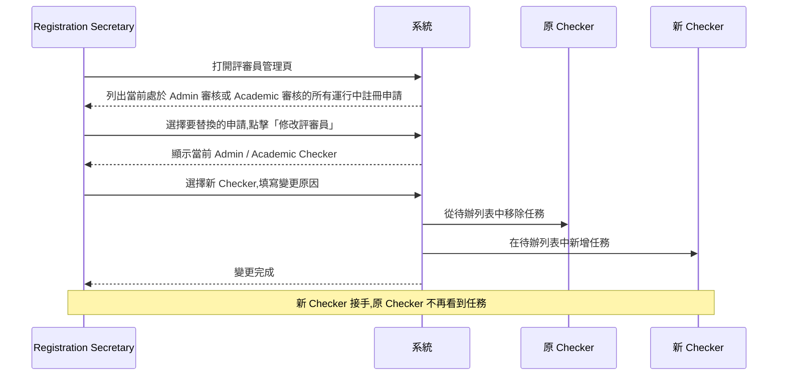

# 學生組織註冊與申訴流程

> 本文檔描述 SLAS 系統中學生組織的註冊審批與申訴審批兩個業務流程。

---

## 1. 流程概覽

### 1.1 業務目標

- **註冊流程**：對學生組織提交的註冊申請進行多層審批,通過後組別轉為正式狀態。
- **申訴流程**：對被終局拒絕的學生組織提供再次評審的機會。

### 1.2 兩個流程的關係

```
[新申請 / 重新提交] → 註冊流程 → 通過? → ACTIVE
                                  → 退回 → PENDING_RESUBMIT(可重新提交,回到註冊流程)
                                  → 終局拒絕 → REJECTED_FINAL(只能進入申訴流程)

REJECTED_FINAL → 申訴流程 → 通過? → ACTIVE
                          → 退回 → APPEAL_RESUBMIT(可重新提交申訴)
                          → 拒絕 → APPEAL_REJECTED(終局)
```

### 1.3 結束狀態總覽

| 狀態 | 業務含義 | 學生後續操作 |
|:-----|:--------|:-----------|
| `ACTIVE` | 註冊／申訴通過,組別正式生效 | — |
| `PENDING_RESUBMIT` | 註冊被退回 | 修改後重新提交註冊 |
| `REJECTED_FINAL` | 註冊被終局拒絕 | 只能發起申訴 |
| `APPEAL_RESUBMIT` | 申訴被退回（含「有條件批准」） | 修改後重新提交申訴 |
| `APPEAL_REJECTED` | 申訴被終局拒絕 | 無後續操作 |

---

## 2. 角色與職責

### 2.1 註冊流程系統角色

下表為註冊流程涉及的系統定義角色（`SYSTEM_ROLE.NAME`）：

| 系統角色名稱 | 職責 |
|:------------|:-----|
| Student Group Registration Secretary | 初審；指派 Administrative Checker 與 Academic Checker；起草拒絕／退回意見；最終提交確認意見 |
| Student Group Registration Administrative Checker | 行政審核（由 Registration Secretary 在初審時指派）；摘要退回與最終拒絕／退回時收到通知 |
| Student Group Registration Academic Checker | 學術審核（由 Registration Secretary 在初審時指派）；摘要退回與最終拒絕／退回時收到通知 |
| Student Group Registration Reviewer | 提供註冊意見；對起草的拒絕／退回意見並行確認 |
| Student Group Registration Summary Reviewer | 審核已收集的註冊意見；對起草的拒絕／退回意見作審核評論 |
| Student Group Registration Approver | 最終批准／拒絕／退回決定 |
| Student Group Registration Approver Secretary | 替代終審人,與 Registration Approver 享有相同決定權 |

### 2.2 申訴流程系統角色

下表為申訴流程涉及的系統定義角色（`SYSTEM_ROLE.NAME`）：

| 系統角色名稱 | 職責 |
|:------------|:-----|
| Student Group Appeal Reviewer | 提供申訴意見（並行多人） |
| Student Group Appeal Summary Reviewer | 審核已收集的申訴意見；可提交至最終,或退回（結束流程） |
| Student Group Appeal Approver | 最終批准／拒絕／退回（有條件批准）決定 |
| Student Group Appeal Approver Secretary | 替代終審人,與 Appeal Approver 享有相同決定權 |

> **流程外參與者**：Appeal Initiator（學生）—— 發起申訴；在 `APPEAL_RESUBMIT` 狀態時重新提交申訴。
>
> **本文簡稱規則**：為保持流程圖與步驟詳述的可讀性,後續章節省略 `Student Group` 前綴,並在不致歧義的單流程上下文中進一步簡化（例如 `Student Group Registration Secretary` 簡作 `Secretary`；`Student Group Registration Administrative Checker` 簡作 `Admin Checker`；`Student Group Registration Academic Checker` 簡作 `Academic Checker`；`Student Group Registration Reviewer` 簡作 `Registration Reviewer`,以區別於 `Appeal Reviewer`；`Student Group Registration Approver` 簡作 `Registration Approver`,以區別於 `Appeal Approver`）。

### 2.3 多人並行 / 候選組規則

| 任務 | 規則 |
|:----|:----|
| 意見收集（註冊 ④ / 申訴 ①） | 評審組成員並行提交意見;達到截止時間時系統自動將未提交意見標記為超時 |
| 拒絕／退回意見確認（註冊 ⑧） | 評審組成員並行確認;達到截止時間時系統自動將未提交意見視為通過 |
| 最終審批 | Registration Approver 與 Registration Approver Secretary（申訴流程：Appeal Approver 與 Appeal Approver Secretary）享有相同決定權,任一者可作出決定 |

---

## 3. 圖例

本節定義流程圖統一規範,兩份審批流程文檔共用。

### 3.1 節點形狀

| 形狀 | Mermaid 語法 | 含義 |
|:-----|:-------------|:-----|
| 矩形 | `["Name"]` | **人工任務** — 需要審批人手動操作 |
| 平行四邊形 | `[/"auto: Name"/]` | **系統任務** — 自動執行,無需用戶操作 |
| 菱形 | `{Question?}` | **判斷網關** — 根據條件分流,文字以問號結尾 |
| 圓角 | `(["Name"])` | **流程起點／終點** 或 並行 Fork/Join |

### 3.2 連線類型

| 樣式 | Mermaid 語法 | 含義 |
|:-----|:-------------|:-----|
| 實線箭頭 | `-->` | 正向順序流（happy path） |
| 虛線箭頭 | `-.->` | 計時器觸發（超時／提醒）、退回循環、跨分支依賴 |

### 3.3 節點標籤格式

| 類型 | 格式 | 範例 |
|:-----|:-----|:-----|
| 人工任務 | `<編號> <步驟名><br/>(角色名)` | `① Secretary 初審<br/>(Secretary)` |
| 系統任務 | `auto: <行為描述>` | `auto: 彙總意見` |
| 判斷網關 | 以問號結尾的問句 | `{Secretary 是否通過?}` |
| 結束點 | `End: <狀態><br/>(<業務含義>)` | `End: ACTIVE<br/>(註冊通過)` |

### 3.4 步驟編號

帶圈數字（①、②、…）標註單個流程內人工任務的執行順序。系統任務不參與編號。

| 流程 | 編號 | 步驟 | 角色 |
|:-----|:----:|:-----|:-----|
| 註冊 | ① | Secretary 初審 | Secretary |
|  | ② | Admin 審核 | Admin Checker |
|  | ③ | Academic 審核 | Academic Checker |
|  | ④ | 意見收集 | Registration Reviewer（並行） |
|  | ⑤ | 摘要審核 | Registration Summary Reviewer |
|  | ⑥ | 最終審批 | Registration Approver |
| 註冊<br/>（拒絕子流程） | ⑦ | 起草綜合意見 | Secretary |
|  | ⑧ | 評審員確認意見 | Registration Reviewer（並行） |
|  | ⑨ | 審核草擬意見 | Registration Summary Reviewer |
|  | ⑩ | 最終提交意見 | Secretary |
| 申訴 | ① | 意見收集 | Appeal Reviewer（並行） |
|  | ② | 摘要審核 | Appeal Summary Reviewer |
|  | ③ | 最終審批 | Appeal Approver |

---

## 4. 流程圖

### 4.1 註冊主流程



> **Phase 2** 中的虛線箭頭代表計時器事件：`超時` 為中斷型（取消並行任務並將未提交意見標記為 `TIMEOUT`）;`提醒` 為非中斷型（僅通知待提交評審員,主流程繼續）。
>
> `End: 流程結束` 節點的最終狀態取決於觸發原因（摘要退回 / 最終拒絕 / 最終退回）——見 [§6.1 註冊結果對照](#61-註冊結果對照)。

### 4.2 註冊拒絕／退回子流程

當 Registration Approver（⑥）選擇 **拒絕** 或 **退回** 時,流程進入此子流程,用以起草、傳閱並定稿一份綜合意見。兩條分支共享同一子流程,最終業務狀態由結束時的「退回類型」決定。



### 4.3 註冊重新提交

當狀態為 `PENDING_RESUBMIT` 時,學生可修正申請並重新提交。此操作 **啟動全新的註冊流程實例**——原流程已結束,沒有流程內回跳。



### 4.4 申訴主流程



> 申訴流程的「退回」業務上等同於「有條件批准」——學生需根據意見修改後重新提交申訴,而非直接通過。

### 4.5 申訴重新提交

當狀態為 `APPEAL_RESUBMIT` 時,學生可修改並重新提交。此操作 **啟動全新的申訴流程實例**——原實例已結束。



---

## 5. 步驟詳述

按 ①–⑩（註冊）與 ①–③（申訴）順序列出所有人工任務及相關業務規則。

### 5.1 註冊主流程步驟

#### 5.1.1 Phase 1：順序三方審核

##### ① Secretary 初審

- **執行人**：Secretary
- **動作**：初次審核註冊申請;在通過時指派 Admin Checker 與 Academic Checker（後續可在「評審員管理」工具中替換,見 §9）
- **結果**：
  - 通過 → 進入 ② Admin 審核
  - 拒絕 → 流程結束（`PENDING_RESUBMIT`）

##### ② Admin 審核

- **執行人**：由 Secretary 在 ① 中指派的 Admin Checker
- **動作**：行政審核
- **結果**：
  - 通過 → 進入 ③ Academic 審核
  - 拒絕 → 流程結束（`PENDING_RESUBMIT`）

##### ③ Academic 審核

- **執行人**：由 Secretary 在 ① 中指派的 Academic Checker
- **動作**：學術審核
- **結果**：
  - 通過 → 進入 Phase 2 意見收集
  - 拒絕 → 流程結束（`PENDING_RESUBMIT`）

> Phase 1 任一步拒絕均直接結束於 `PENDING_RESUBMIT`,不進入拒絕子流程。

#### 5.1.2 Phase 2：意見收集

##### ④ 意見收集（並行）

- **執行人**：所有 Registration Reviewer 成員並行
- **動作**：每位評審員提交意見
- **計時器規則**：
  - **提醒**（非中斷型）：到達提醒時間時,系統通知尚未提交的評審員,主任務繼續運行
  - **超時**（中斷型）：到達截止時間時,系統取消並行任務,將未提交的意見標記為 `TIMEOUT`,流程繼續到「auto: 彙總意見」
- **結果**：全部完成（或超時觸發後）→ 進入 Phase 3

#### 5.1.3 Phase 3：摘要審核

##### ⑤ 摘要審核

- **執行人**：Registration Summary Reviewer
- **動作**：審核已彙總的意見,二選一
- **結果**：
  - **提交** → 進入 ⑥ 最終審批
  - **退回** → 系統自動通知 Admin Checker 與 Academic Checker, 流程結束（`PENDING_RESUBMIT`）

#### 5.1.4 Phase 4：最終審批

##### ⑥ 最終審批

- **執行人**：Registration Approver（或 Registration Approver Secretary）
- **動作**：作出 `批准` / `拒絕` / `退回` 決定
- **結果**：
  - **批准** → 流程結束（`ACTIVE`）
  - **拒絕** 或 **退回** → 進入拒絕子流程（見 §5.2）

### 5.2 註冊拒絕／退回子流程步驟

子流程的最終狀態取決於 Registration Approver 在 ⑥ 中選的是「拒絕」還是「退回」：

| Registration Approver 選擇 | 最終狀態 |
|:------------------|:--------|
| 退回（return） | `PENDING_RESUBMIT` |
| 拒絕（reject） | `REJECTED_FINAL` |

##### ⑦ 起草綜合意見

- **執行人**：Secretary
- **動作**：保存第一版綜合意見;設定兩個傳閱參數（傳閱天數與「截止前提醒」天數,後者必須小於前者）
- **結果**：進入「auto: 初始化評審員確認」, 系統據此計算確認截止時間與提醒時間,並進入 ⑧

##### ⑧ 評審員確認意見（並行）

- **執行人**：所有 Registration Reviewer 成員並行
- **動作**：每位提交確認反饋,選擇 `APPROVE` / `SUGGEST` / `NO_COMMENT`
- **計時器規則**：
  - **提醒**（非中斷型）：到達提醒時間時,僅通知待提交評審員
  - **超時**（中斷型）：到達截止時間時,系統將未提交的反饋自動視為 `APPROVE` 並標記為超時
- **結果**：全部確認完成（或超時觸發後）→ 進入「auto: 彙總拒絕反饋」, 再進入 ⑨

##### ⑨ 審核草擬意見

- **執行人**：Registration Summary Reviewer
- **動作**：對草擬意見作單次審核評論
- **結果**：進入 ⑩

##### ⑩ 最終提交意見

- **執行人**：Secretary
- **動作**：可修改最終意見,確認並持久化
- **結果**：系統自動派發最終通知（行動方:申請人、協作者、Admin Checker、Academic Checker;知會方:Registration Approver、Registration Approver Secretary、Registration Summary Reviewer、Registration Secretary、Registration Reviewer）, 流程結束（依退回類型解析為 `PENDING_RESUBMIT` 或 `REJECTED_FINAL`）

### 5.3 申訴流程步驟

##### ① 意見收集（並行）

- **執行人**：所有 Appeal Reviewer 成員並行
- **動作**：每位評審員提交申訴意見
- **計時器規則**：與註冊 ④ 相同（提醒 + 超時）
- **結果**：全部完成（或超時觸發後）→ 進入 ②

##### ② 摘要審核

- **執行人**：Appeal Summary Reviewer
- **動作**：審核已彙總的意見,二選一
- **結果**：
  - **提交** → 進入 ③ 最終審批
  - **退回** → 流程結束（`APPEAL_RESUBMIT`,學生可重新提交申訴）

##### ③ 最終審批

- **執行人**：Appeal Approver（或 Appeal Approver Secretary）
- **動作**：作出 `批准` / `拒絕` / `退回` 決定
- **結果**：
  - **批准** → 流程結束（`ACTIVE`）
  - **拒絕** → 流程結束（`APPEAL_REJECTED`,終局）
  - **退回** → 流程結束（`APPEAL_RESUBMIT`,業務上等同「有條件批准」）

> 申訴流程沒有拒絕子流程;退回／拒絕直接結束流程。重新提交永遠啟動新的流程實例,不在原實例內回跳。

---

## 6. 結果對照表

### 6.1 註冊結果對照

| 拒絕點 | 決定 | 最終狀態 | 學生後續可進行 |
|:-------|:-----|:--------|:--------------|
| ① Secretary | 拒絕 | `PENDING_RESUBMIT` | 重新提交註冊 |
| ② Admin Checker | 拒絕 | `PENDING_RESUBMIT` | 重新提交註冊 |
| ③ Academic Checker | 拒絕 | `PENDING_RESUBMIT` | 重新提交註冊 |
| ⑤ Registration Summary Reviewer | 退回 | `PENDING_RESUBMIT` | 重新提交註冊 |
| ⑥ Registration Approver | 批准 | `ACTIVE` | — |
| ⑥ Registration Approver | 拒絕（經拒絕子流程） | `REJECTED_FINAL` | 只能發起申訴 |
| ⑥ Registration Approver | 退回（經拒絕子流程） | `PENDING_RESUBMIT` | 重新提交註冊 |

### 6.2 申訴結果對照

| 決策點 | 決定 | 最終狀態 | 學生後續可進行 |
|:-------|:-----|:--------|:--------------|
| ② Appeal Summary Reviewer | 提交 | （進入 ③ 最終審批） | — |
| ② Appeal Summary Reviewer | 退回 | `APPEAL_RESUBMIT` | 重新提交申訴 |
| ③ Appeal Approver | 批准 | `ACTIVE` | — |
| ③ Appeal Approver | 拒絕 | `APPEAL_REJECTED` | 無後續操作（終局） |
| ③ Appeal Approver | 退回（有條件批准） | `APPEAL_RESUBMIT` | 重新提交申訴 |

---

## 7. 場景示例

### 7.1 註冊典型場景

#### 場景 1：一次通過

```
① Secretary(通過,指派 Admin Checker / Academic Checker) → ② Admin Checker(通過) → ③ Academic Checker(通過)
→ ④ Registration Reviewer 全員提交意見 → ⑤ Registration Summary Reviewer(提交)
→ ⑥ Registration Approver(批准) → ACTIVE ✅
```

#### 場景 2：早期被退回（任一 Phase 1 步驟拒絕）

```
① Secretary(通過) → ② Admin Checker(拒絕) → PENDING_RESUBMIT
（學生修改後重新提交,啟動新流程）
```

#### 場景 3：摘要退回

```
① → ② → ③ → ④ → ⑤ Registration Summary Reviewer(退回) → 通知 Admin Checker / Academic Checker → PENDING_RESUBMIT
（學生修改後重新提交）
```

#### 場景 4：終局拒絕（走完拒絕子流程）

```
① → ② → ③ → ④ → ⑤(提交) → ⑥ Registration Approver(拒絕)
→ 拒絕子流程: ⑦ Secretary 起草 → ⑧ Registration Reviewer 確認 → ⑨ Registration Summary Reviewer 審核 → ⑩ Secretary 最終提交
→ REJECTED_FINAL
（學生只能發起申訴）
```

### 7.2 申訴典型場景

#### 場景 5：申訴一次通過

```
（前置: REJECTED_FINAL）
① 意見收集 → ② Appeal Summary Reviewer(提交) → ③ Appeal Approver(批准) → ACTIVE ✅
```

#### 場景 6：申訴被摘要退回

```
① 意見收集 → ② Appeal Summary Reviewer(退回) → APPEAL_RESUBMIT
（學生修改後重新提交申訴）
```

#### 場景 7：申訴有條件批准

```
① 意見收集 → ② Appeal Summary Reviewer(提交) → ③ Appeal Approver(退回) → APPEAL_RESUBMIT
（學生根據意見修改後重新提交申訴）
```

---

## 8. 註冊與申訴關鍵差異對比

| 維度 | 註冊 | 申訴 |
|:-----|:-----|:-----|
| **進入前置條件** | 新申請或 `PENDING_RESUBMIT` 狀態 | `REJECTED_FINAL`（首次申訴）或 `APPEAL_RESUBMIT`（重新提交申訴） |
| **前置審核閘** | 3 步順序審核（Secretary → Admin Checker → Academic Checker） | 無——直接進入意見收集 |
| **意見評審組** | Registration Reviewer | Appeal Reviewer |
| **摘要評審員** | Registration Summary Reviewer | Appeal Summary Reviewer |
| **最終審批人** | Registration Approver | Appeal Approver |
| **摘要退回行為** | 進入 `PENDING_RESUBMIT`,通知 Admin/Academic Checker | 直接結束流程,進入 `APPEAL_RESUBMIT` |
| **拒絕子流程** | 有（⑦ Secretary 起草 → ⑧ Registration Reviewer 確認 → ⑨ Registration Summary Reviewer 審核 → ⑩ Secretary 最終提交） | 無 |
| **早期拒絕結果** | `PENDING_RESUBMIT`（任一 Phase 1 步驟拒絕） | 不適用（無早期審核階段） |
| **最終拒絕結果** | `REJECTED_FINAL`（經拒絕子流程） | `APPEAL_REJECTED`（終局,無後續） |
| **「退回」的業務含義** | 學生需重新提交註冊 | 「有條件批准」——學生需根據意見修改後重新提交申訴 |
| **重新提交方式** | 啟動全新註冊流程實例 | 啟動全新申訴流程實例 |
| **計時器事件** | 意見收集 + 拒絕確認（兩者均有提醒 + 超時） | 僅意見收集（提醒 + 超時） |

---

## 9. 評審員管理（管理工具）

當 Secretary 在 ① 初審中指派的 Admin Checker 或 Academic Checker 因人員變動、休假等原因需要更換時,可通過此管理工具替換。替換後,新 Checker 在待辦列表中接手任務,原 Checker 不再看到。

### 9.1 入口

| 項目 | 值 |
|:-----|:---|
| 菜單位置 | 管理中心 → 評審員管理 |
| 允許角色 | Registration Approver Secretary |

### 9.2 工作流程



### 9.3 約束

- 僅作用於 **運行中** 的註冊流程,且當前停留在 Admin 審核或 Academic 審核步驟。
- 每次操作必須至少更換 Admin 或 Academic 評審員之一。
- 變更原因為必填項,用於審計。
- 申訴流程不使用指派 Checker 機制,故不在此功能範圍內。
