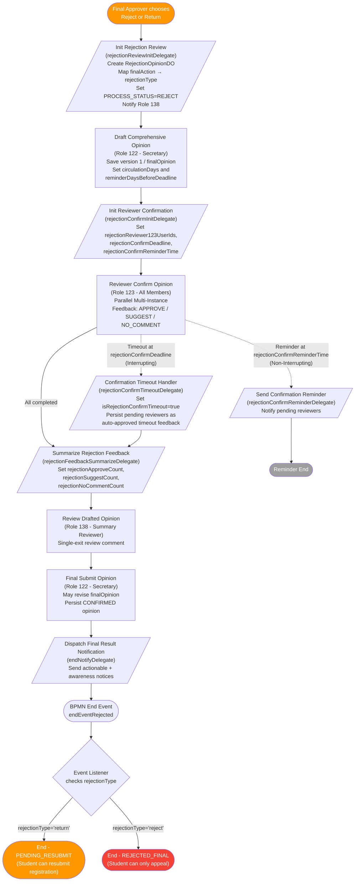
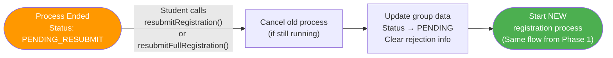
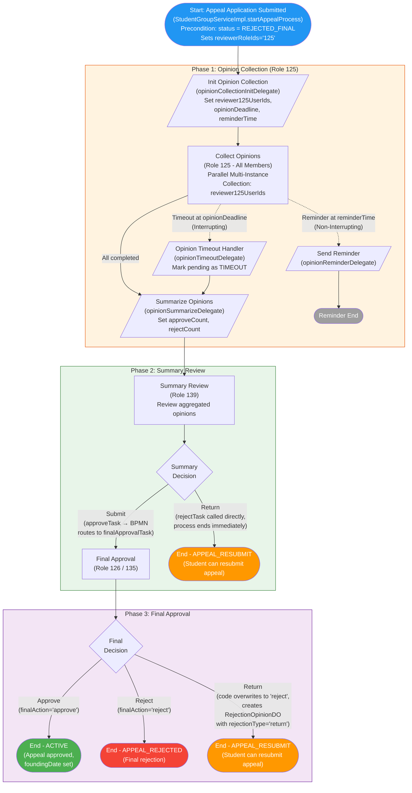
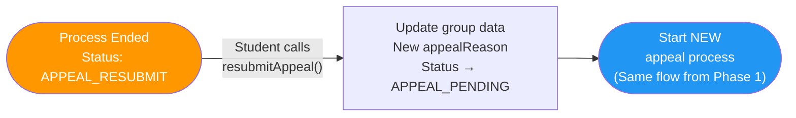
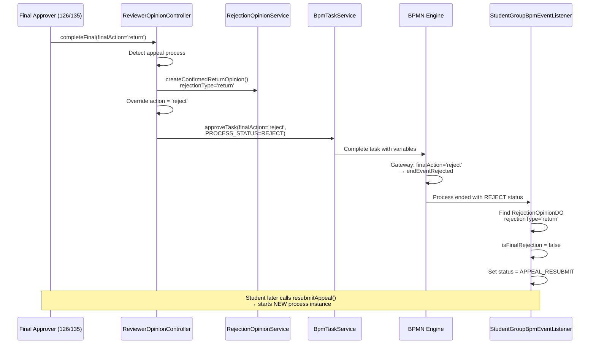

# Student Organisation Registration & Appeal Workflow Flowcharts

> **Note**: This document reflects the **actual runtime behaviour** as determined from both the BPMN definitions and the Java source code (delegates, controllers, event listeners). Where the code diverges from the BPMN design, the actual code behaviour is documented and annotated.

---

## 1. Student Organisation Registration Process (`student_org_registration`)

### 1.1 Main Flow

```mermaid
flowchart TD
    Start(["Start: Registration Application Submitted<br>(StudentGroupServiceImpl.startRegistrationProcess)"])
    Start --> SecretaryCheck

    subgraph Phase1["Phase 1: Sequential Triple Review"]
        SecretaryCheck["Secretary Check<br>(Role 122)<br>Initial Review"]
        SecretaryCheck --> SecretaryGate{Secretary<br>Decision}
        SecretaryGate -->|"approved=true"| AdminCheck
        SecretaryGate -->|"approved=false<br>(rejectTask)"| EndResubmit1

        AdminCheck["Admin Check<br>(Role 136)<br>Administrative Review"]
        AdminCheck --> AdminGate{Admin<br>Decision}
        AdminGate -->|"approved=true"| AcademicCheck
        AdminGate -->|"approved=false<br>(rejectTask)"| EndResubmit1

        AcademicCheck["Academic Check<br>(Role 132)<br>Academic Review"]
        AcademicCheck --> AcademicGate{Academic<br>Decision}
        AcademicGate -->|"approved=true"| InitOpinion
        AcademicGate -->|"approved=false<br>(rejectTask)"| EndResubmit1

        EndResubmit1(["End - PENDING_RESUBMIT<br>(Student can resubmit registration)"])
    end

    subgraph Phase2["Phase 2: Opinion Collection (Role 123)"]
        InitOpinion[/"Init Opinion Collection<br>(opinionCollectionInitDelegate)<br>Set reviewer123UserIds,<br>opinionDeadline, reminderTime"/]
        InitOpinion --> CollectOpinions

        CollectOpinions["Collect Opinions<br>(Role 123 - All Members)<br>Parallel Multi-Instance<br>Collection: reviewer123UserIds"]

        CollectOpinions -->|"All completed<br>(nrOfCompletedInstances == nrOfInstances)"| SummarizeOpinions
        CollectOpinions -.->|"Timeout at opinionDeadline<br>(Interrupting)"| TimeoutHandler
        CollectOpinions -.->|"Reminder at reminderTime<br>(Non-Interrupting)"| SendReminder

        TimeoutHandler[/"Opinion Timeout Handler<br>(opinionTimeoutDelegate)<br>Mark pending as TIMEOUT<br>Set isTimeout=true"/]
        TimeoutHandler --> SummarizeOpinions

        SendReminder[/"Send Reminder<br>(opinionReminderDelegate)<br>Notify pending reviewers"/]
        SendReminder --> ReminderEnd([Reminder End])
    end

    subgraph Phase3["Phase 3: Summary Review"]
        SummarizeOpinions[/"Summarize Opinions<br>(opinionSummarizeDelegate)<br>Set approveCount, rejectCount,<br>completedOpinions, pendingOpinions"/]
        SummarizeOpinions --> SummaryReview

        SummaryReview["Summary Review<br>(Role 138)<br>Review aggregated opinions"]
        SummaryReview --> SummaryGate{Summary<br>Decision}
        SummaryGate -->|"summaryAction='submit'<br>(approveTask)"| FinalApproval
        SummaryGate -->|"summaryAction='return'<br>(approveTask, taskStatus=RETURN)"| NotifyReturn
    end

    subgraph Phase4["Phase 4: Final Approval"]
        FinalApproval["Final Approval<br>(Role 124 / 134)"]
        FinalApproval --> FinalGate{Final<br>Decision}
        FinalGate -->|"finalAction='approve'<br>(approveTask)"| EndApproved
        FinalGate -->|"finalAction='reject' or 'return'<br>(approveTask)"| RejectionSubProcess
    end

    NotifyReturn[/"Notify Return<br>(summaryReturnNotifyDelegate)<br>Notify Roles 136, 132"/]
    NotifyReturn --> EndRejected

    RejectionSubProcess["Enter Rejection Review<br>Sub-Process<br>(See Section 1.2)"]

    EndApproved(["End - ACTIVE<br>(Registration approved,<br>foundingDate set)"])
    EndRejected(["End - Process Ended<br>(See Status Outcome Table)"])

    style Start fill:#4CAF50,color:#fff
    style EndApproved fill:#4CAF50,color:#fff
    style EndRejected fill:#f44336,color:#fff
    style EndResubmit1 fill:#FF9800,color:#fff
    style ReminderEnd fill:#9E9E9E,color:#fff
    style Phase1 fill:#E3F2FD,stroke:#1565C0
    style Phase2 fill:#FFF3E0,stroke:#E65100
    style Phase3 fill:#E8F5E9,stroke:#2E7D32
    style Phase4 fill:#F3E5F5,stroke:#6A1B9A
```



### 1.2 Rejection/Return Review Sub-Process

When the Final Approver (Role 124/134) chooses **reject** or **return**, the BPMN condition `${finalAction == 'reject' || finalAction == 'return'}` routes to `initRejectionReviewTask`. `RejectionReviewInitDelegate` creates the `RejectionOpinionDO`, maps `finalAction` to `rejectionType`, sets `PROCESS_STATUS=REJECT`, and sends a start notification to Role 138.

The BPMN then runs one shared opinion-finalisation sub-flow. Both branches end at the same `endEventRejected`. The final business status is resolved afterward by `StudentGroupBpmEventListener.handleRejection()`:
- `rejectionType='reject'` → `REJECTED_FINAL` (student can only appeal)
- `rejectionType='return'` → `PENDING_RESUBMIT` (student can resubmit)



- `RejectionOpinionService.submitDraft()` enforces `reminderDaysBeforeDeadline < circulationDays`, stores the draft as version 1, and writes the circulation settings back to Flowable runtime variables.
- `rejectionConfirmTimeoutDelegate` marks the BPMN path as timed out, but `RejectionOpinionService.markTimeoutFeedbacks()` persists missing Role 123 responses as `feedbackType='APPROVE'` with `isTimeout=true`.
- `endNotifyDelegate` sends the final result to two audiences: an actionable group (applicant, collaborator, Roles 136 and 132) and an awareness group (Roles 124, 134, 138, 122, and 123).

### 1.3 Registration Resubmission Flow

When status is `PENDING_RESUBMIT`, the student can correct and resubmit. This starts a **brand-new** process instance (the previous one has already ended).



### 1.4 Registration Status Outcome Table

| Rejection Point | Code Path | rejectionType | Final Status | Student Can |
|----------------|-----------|---------------|-------------|-------------|
| Secretary (122) rejects | `rejectTask()` → Event Listener | No RejectionOpinionDO; default for registration = not final | **PENDING_RESUBMIT** | Resubmit registration |
| Admin (136) rejects | `rejectTask()` → Event Listener | No RejectionOpinionDO; default for registration = not final | **PENDING_RESUBMIT** | Resubmit registration |
| Academic (132) rejects | `rejectTask()` → Event Listener | No RejectionOpinionDO; default for registration = not final | **PENDING_RESUBMIT** | Resubmit registration |
| Summary (138) returns | `completeSummary()` sets `summaryAction='return'` and `PROCESS_STATUS=RETURN` → BPMN `notifyReturnTask` → `endEventRejected` → Event Listener | No RejectionOpinionDO | **PENDING_RESUBMIT** | Resubmit registration |
| Final (124/134) approves | `approveTask()` → endEventApproved | N/A | **ACTIVE** | - |
| Final (124/134) rejects | Rejection sub-process (`122 draft → 123 confirm → 138 review → 122 final submit`) → `endNotifyTask` → `endEventRejected` → Event Listener | `reject` | **REJECTED_FINAL** | Appeal only |
| Final (124/134) returns | Same rejection sub-process → `endNotifyTask` → `endEventRejected` → Event Listener | `return` | **PENDING_RESUBMIT** | Resubmit registration |

> **Code Reference**: `StudentGroupBpmEventListener.handleRejection()` decides whether a registration outcome is final. When no `RejectionOpinionDO` exists, registration defaults to resubmittable. When a `RejectionOpinionDO` exists, `rejectionType` controls `REJECTED_FINAL` vs `PENDING_RESUBMIT`. `resolveRejectionReason()` prefers `RejectionOpinionDO.finalOpinion`, then process and task variables.

### 1.5 Role Summary (Registration)

| Role ID | Role Name | Responsibilities |
|---------|-----------|-----------------|
| 122 | Secretary | Initial review; draft the rejection/return opinion; submit the final confirmed opinion |
| 136 | Admin Checker | Administrative review; notified on summary return and final rejection/return result |
| 132 | Academic Checker | Academic review; notified on summary return and final rejection/return result |
| 123 | Reviewer Group | Provide registration opinions; confirm the drafted rejection/return opinion in parallel |
| 138 | Summary Reviewer | Review collected registration opinions; review the drafted rejection/return opinion and leave a review comment |
| 124 | Final Approver | Final approval / rejection / return decision |
| 134 | Final Approver Secretary | Alternative final approver; can make the same final decision as Role 124 |

### 1.6 Reviewer (Checker) Reassignment

After the Secretary (Role 122) submits the registration and designates the Admin Checker (Role 136) and Academic Checker (Role 132) via process variables (`admin_checker_{userId}`, `academic_checker_{userId}`), the designated checkers may need to be changed due to personnel changes, leave, or other operational reasons.

**Problem**: Once the Secretary completes the `secretaryCheckTask` and the process advances to `adminCheckTask` / `academicCheckTask`, the original task form is no longer accessible. The checker designation is stored as Flowable process variables, so simply reassigning the task is not sufficient — the process variables must also be updated.

**Solution**: A dedicated **Reviewer Management** page is provided under the Management Centre (管理中心), accessible only to the Registration Secretary (Role 134).

#### Entry Point

| Item | Value |
|------|-------|
| Menu location | Management Centre → Reviewer Management |
| URL path | `/admin/ReviewerManagement` |
| Permission | `stugroup:reviewer-management:manage` |
| Allowed role | 134 (`sg_reg_approver_secretary`) |

#### How It Works

```mermaid
sequenceDiagram
    participant Secretary as Secretary (Role 134)
    participant UI as Reviewer Management Page
    participant API as ReviewerManagementController
    participant Service as ReviewerManagementServiceImpl
    participant Flowable as Flowable Runtime

    Secretary->>UI: Open Reviewer Management page
    UI->>API: GET /stugroup/reviewer-management/page
    API->>Service: Query running registration instances<br>at adminCheckTask or academicCheckTask
    Service-->>UI: List with current checker names

    Secretary->>UI: Click "Modify Reviewer" on a row
    UI->>API: GET /stugroup/reviewer-management/detail
    API-->>UI: Current admin & academic checker info

    Secretary->>UI: Select new checker(s) via SsoUserSelector<br>(Admin: roleId=136, Academic: roleId=132)<br>Enter change reason
    UI->>API: PUT /stugroup/reviewer-management/update
    API->>Service: updateReviewer(processInstanceId,<br>newAdminReviewerId, newAcademicReviewerId, reason)

    Service->>Flowable: Remove old variable<br>admin_checker_{oldUserId} = true
    Service->>Flowable: Set new variable<br>admin_checker_{newUserId} = true
    Service->>Flowable: Remove old variable<br>academic_checker_{oldUserId} = true
    Service->>Flowable: Set new variable<br>academic_checker_{newUserId} = true
    Flowable-->>Service: Variables updated

    Note over Service,Flowable: The new checker now sees the task<br>in their to-do list; the old checker no longer does.
```

#### Constraints

- Only affects **running** registration process instances (`student_org_registration`) currently at the `adminCheckTask` or `academicCheckTask` node.
- At least one of the two checkers (admin or academic) must be changed per operation.
- A change reason is mandatory for audit purposes.
- The appeal process (`student_org_appeal`) does not use designated checkers and is therefore excluded from this feature.

---

## 2. Student Organisation Appeal Process (`student_org_appeal`)

### 2.1 Actual Code Flow

> **Important**: The BPMN defines a `studentResubmitTask` with a loop back to `summaryReviewTask` for the "return" path. However, **this path is unreachable in the current code**. The controller (`ReviewerOpinionController.completeFinal()`, line 131-148) overwrites `finalAction='return'` to `'reject'` for appeal processes, so the BPMN condition `${finalAction == 'return'}` never matches. Instead, "return" is handled post-process via the Event Listener + a new process instance.
>
> The BPMN also has no gateway at the summary review node, but the code (`completeSummary()`, line 89-103) handles "return" at this stage by calling `rejectTask()` directly, bypassing BPMN routing.



### 2.2 Appeal Resubmission Flow

When status is `APPEAL_RESUBMIT`, the student can revise and resubmit. This starts a **brand-new** process instance (the previous one has ended). The in-BPMN `studentResubmitTask` loop is unused.



### 2.3 Appeal "Return" Mechanism Detail

The appeal "return" (conditional approval) works differently from registration:



### 2.4 Appeal Status Outcome Table

| Decision Point | Code Path | Mechanism | Final Status | Student Can |
|---------------|-----------|-----------|-------------|-------------|
| Summary (139) submits | `approveTask()` → BPMN routes to finalApprovalTask | Normal BPMN flow | *(continues to final approval)* | - |
| Summary (139) returns | `rejectTask()` called directly (bypasses BPMN gateway) | RejectionOpinionDO(type='return') | **APPEAL_RESUBMIT** | Resubmit appeal |
| Final (126/135) approves | `approveTask(finalAction='approve')` → endEventApproved | Normal BPMN flow | **ACTIVE** | - |
| Final (126/135) rejects | `approveTask(finalAction='reject', PROCESS_STATUS=REJECT)` → endEventRejected | No RejectionOpinionDO; default for appeal = final | **APPEAL_REJECTED** | No further action |
| Final (126/135) returns | `approveTask(finalAction='reject')` + RejectionOpinionDO(type='return') → endEventRejected | Code overwrites 'return' → 'reject'; Event Listener checks rejectionType | **APPEAL_RESUBMIT** | Resubmit appeal |

> **Code Reference**: The `finalAction` override logic is in [ReviewerOpinionController.java](slas-module-stugroup/slas-module-stugroup-biz/src/main/java/hk/eduhk/sao/slas/module/stugroup/controller/admin/opinion/ReviewerOpinionController.java#L131-L148) `completeFinal()`. The status determination is in [StudentGroupBpmEventListener.java](slas-module-stugroup/slas-module-stugroup-biz/src/main/java/hk/eduhk/sao/slas/module/stugroup/service/bpm/StudentGroupBpmEventListener.java#L87) where `isFinalRejection = !isRegistration` (defaults to `true` for appeal).

### 2.5 Role Summary (Appeal)

| Role ID | Role Name | Responsibilities |
|---------|-----------|-----------------|
| 125 | Appeal Reviewer Group | Provide opinions on appeal (parallel multi-instance) |
| 139 | Appeal Summary Reviewer | Review collected opinions; can submit to final or return (end process) |
| 126 | Appeal Final Approver | Final approval / rejection / return (conditional approval) decision |
| 135 | Appeal Final Approver Secretary | Alternative final approver; can make the same final decision as Role 126 |
| - | Appeal Initiator (Student) | Resubmit appeal via `resubmitAppeal()` (out-of-process) |

---

## 3. Key Differences Between Registration and Appeal

| Aspect | Registration | Appeal |
|--------|-------------|--------|
| **Entry precondition** | New registration or `PENDING_RESUBMIT` status | `REJECTED_FINAL` status (first appeal) or `APPEAL_RESUBMIT` (resubmit) |
| **Pre-review gates** | 3 sequential reviews (Secretary 122 → Admin 136 → Academic 132) | None - goes directly to opinion collection |
| **Opinion reviewer role** | Role 123 | Role 125 |
| **Summary reviewer role** | Role 138 | Role 139 |
| **Final approver roles** | Role 124 / 134 | Role 126 / 135 |
| **Summary review options** | Submit or Return (via BPMN gateway) | Submit or Return (Return calls `rejectTask()` directly, no BPMN gateway) |
| **Rejection sub-process** | Secretary draft (122) → reviewer confirm (123, parallel) → summary review comment (138) → secretary final submit (122) | Not applicable |
| **Early-stage rejection result** | `PENDING_RESUBMIT` (default for registration) | N/A (no early review stages) |
| **Final rejection result** | `REJECTED_FINAL` (via rejection sub-process with `rejectionType='reject'`) | `APPEAL_REJECTED` (default for appeal) |
| **Return/resubmit mechanism** | Rejection sub-process with `rejectionType='return'` → `PENDING_RESUBMIT` → student calls `resubmitRegistration()` | Code overwrites `finalAction` to `'reject'` + `RejectionOpinionDO(type='return')` → `APPEAL_RESUBMIT` → student calls `resubmitAppeal()` |
| **Resubmission approach** | **New process instance** (`startRegistrationProcess()`) | **New process instance** (`startProcess("student_org_appeal")`) |
| **BPMN resubmit loop** | Not defined in BPMN | Defined in BPMN (`studentResubmitTask` → `summaryReviewTask`) but **unreachable in code** |
| **Timer events** | Opinion collection + rejection confirmation (both have reminder + timeout) | Opinion collection only (reminder + timeout) |

## 4. BPMN vs Code Discrepancies

| Item | BPMN Definition | Actual Code Behaviour | Location |
|------|----------------|----------------------|----------|
| Appeal `studentResubmitTask` | `finalAction='return'` → `appealReturnStatusDelegate` → `studentResubmitTask` → loops back to `summaryReviewTask` | **Unreachable**: code overwrites `finalAction` to `'reject'`, so condition `${finalAction == 'return'}` never matches. Resubmission handled outside process via `resubmitAppeal()`. | [ReviewerOpinionController.java:131-148](slas-module-stugroup/slas-module-stugroup-biz/src/main/java/hk/eduhk/sao/slas/module/stugroup/controller/admin/opinion/ReviewerOpinionController.java#L131-L148) |
| Appeal `appealReturnStatusDelegate` | Sets group status to `APPEAL_RESUBMIT` and resolves `appealStudentUserId` | **Never executed**. Status update happens in `StudentGroupBpmEventListener.handleRejection()` instead. | [AppealReturnStatusDelegate.java](slas-module-stugroup/slas-module-stugroup-biz/src/main/java/hk/eduhk/sao/slas/module/stugroup/service/task/AppealReturnStatusDelegate.java) |
| Appeal summary review gateway | No gateway in BPMN (direct sequence flow to `finalApprovalTask`) | Code allows "return" at summary review stage by calling `rejectTask()` directly, which ends the process immediately. | [ReviewerOpinionController.java:89-103](slas-module-stugroup/slas-module-stugroup-biz/src/main/java/hk/eduhk/sao/slas/module/stugroup/controller/admin/opinion/ReviewerOpinionController.java#L89-L103) |

## 5. Process Variable Reference

### 5.1 Variables Set at Process Start

**Registration** (`startRegistrationProcess()`):
| Variable | Value | Purpose |
|----------|-------|---------|
| `groupId` | Student group ID | Identify the group throughout the process |
| `groupName` | `groupNameEn` | Display name in notifications |
| `processType` | `"registration"` | Distinguish from appeal |
| `organisingUnitTypeCode` | Group organising-unit type code | Carry registration context into workflow and notifications |
| `registrationType` | Registration type such as `new` / `renewing` | Carry registration context into workflow and reviewer-management filters |
| `reviewerRoleIds` | `"123"` | Role for opinion collection |
| `reviewerUserIdsVarName` | `"reviewer123UserIds"` | Variable name for reviewer ID list |
| `notifyRoleIds` | `"136,132"` | Roles to notify on return |

`startRegistrationProcess()` no longer seeds `admin_checker_{userId}` or `academic_checker_{userId}` for every checker. The Secretary writes only the selected checker flags when completing `secretaryCheckTask`, and Reviewer Management can replace those flags later.

**Appeal** (`startAppealProcess()`):
| Variable | Value | Purpose |
|----------|-------|---------|
| `groupId` | Student group ID | Identify the group |
| `groupName` | `groupNameEn` | Display name |
| `appealReason` | Student's appeal text | Appeal justification |
| `originalProcessInstanceId` | Registration process ID | Link to original registration |
| `processType` | `"appeal"` | Distinguish from registration |
| `reviewerRoleIds` | `"125"` | Role for opinion collection |
| `reviewerUserIdsVarName` | `"reviewer125UserIds"` | Variable name for reviewer ID list |
| `appealStudentUserId` | Current user ID | For BPMN `studentResubmitTask` assignee (unused in practice) |

### 5.2 Variables Set by Delegates

| Variable | Set By | Purpose |
|----------|--------|---------|
| `reviewer123UserIds` / `reviewer125UserIds` | `opinionCollectionInitDelegate` | List of reviewer user IDs for multi-instance |
| `totalReviewers` | `opinionCollectionInitDelegate` | Count of reviewers |
| `opinionDeadline` | `opinionCollectionInitDelegate` | ISO-8601 deadline for opinion collection |
| `reminderTime` | `opinionCollectionInitDelegate` | ISO-8601 time for reminder trigger |
| `isTimeout` | `opinionTimeoutDelegate` / `opinionSummarizeDelegate` | Whether the opinion deadline was exceeded |
| `pendingReviewerNames` | `opinionTimeoutDelegate` / `opinionSummarizeDelegate` | Names of reviewers who did not submit |
| `completedOpinions` | `opinionSummarizeDelegate` | Count of completed opinions |
| `pendingOpinions` | `opinionSummarizeDelegate` | Count of pending/timed-out opinions |
| `approveCount` | `opinionSummarizeDelegate` | Count of "approve" votes |
| `rejectCount` | `opinionSummarizeDelegate` | Count of "reject" votes |
| `rejectionType` | `rejectionReviewInitDelegate` | `"reject"` or `"return"` - determines final status |
| `rejectionOpinionId` | `rejectionReviewInitDelegate` | ID of the RejectionOpinionDO record |
| `rejectionReviewer123UserIds` | `rejectionConfirmInitDelegate` | List of role 123 user IDs for confirmation |
| `rejectionConfirmDeadline` | `rejectionConfirmInitDelegate` | ISO-8601 deadline for confirmation |
| `rejectionConfirmReminderTime` | `rejectionConfirmInitDelegate` | ISO-8601 time for confirmation reminder |
| `rejectionTimeoutReviewerNames` | `rejectionConfirmTimeoutDelegate` | Names of Role 123 reviewers who missed the confirmation deadline |
| `isRejectionConfirmTimeout` | `rejectionConfirmTimeoutDelegate` | Whether the rejection-confirmation branch timed out |
| `rejectionApproveCount` | `rejectionFeedbackSummarizeDelegate` | Count of confirmation feedbacks with `APPROVE` |
| `rejectionSuggestCount` | `rejectionFeedbackSummarizeDelegate` | Count of confirmation feedbacks with `SUGGEST` |
| `rejectionNoCommentCount` | `rejectionFeedbackSummarizeDelegate` | Count of confirmation feedbacks with `NO_COMMENT` |
| `rejectionHasSuggestions` | `rejectionFeedbackSummarizeDelegate` | Whether any reviewer submitted `SUGGEST` feedback |
| `rejectionTotalReviewers` | `rejectionFeedbackSummarizeDelegate` | Total number of stored confirmation feedback records |

The Secretary's draft submission also writes `circulationDays` and `reminderDaysBeforeDeadline` into Flowable runtime variables. `rejectionConfirmInitDelegate` reads those values before it calculates `rejectionConfirmDeadline` and `rejectionConfirmReminderTime`.

### 5.3 Variables Set by Controller Actions

| Variable | Set By | Value | BPMN Gateway Condition |
|----------|--------|-------|----------------------|
| `approved` | `BpmTaskService.approveTask()` / `rejectTask()` | `true` / `false` | `${approved == true}` / `${approved == false}` |
| `summaryAction` | `ReviewerOpinionController.completeSummary()` | `"submit"` / `"return"` | `${summaryAction == 'submit'}` / `${summaryAction == 'return'}` |
| `summaryComment` | `ReviewerOpinionController.completeSummary()` | Free-text summary reviewer comment | Not used by a gateway; exposed to the final approver |
| `finalAction` | `ReviewerOpinionController.completeFinal()` | `"approve"` / `"reject"` / `"return"` (appeal: overwritten to `"reject"`) | `${finalAction == 'approve'}` / `${finalAction == 'reject' \|\| finalAction == 'return'}` |
| `rejectionReason` | `ReviewerOpinionController.completeSummary()` / `ReviewerOpinionController.completeFinal()` | Free-text return / reject reason | Not used by a gateway; used as a fallback rejection reason |
| `PROCESS_STATUS` | `rejectionReviewInitDelegate` / `ReviewerOpinionController.completeSummary()` / `ReviewerOpinionController.completeFinal()` / `RejectionOpinionService.finalConfirm()` | `RETURN` or `REJECT` | Not used by a gateway; forces correct completion-event classification |

