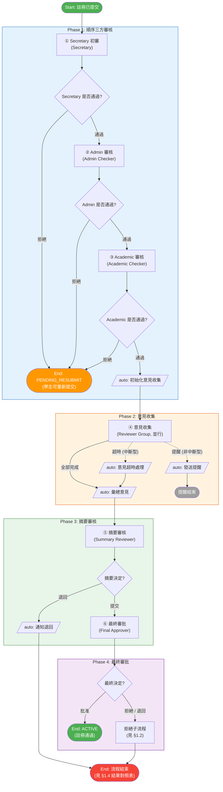
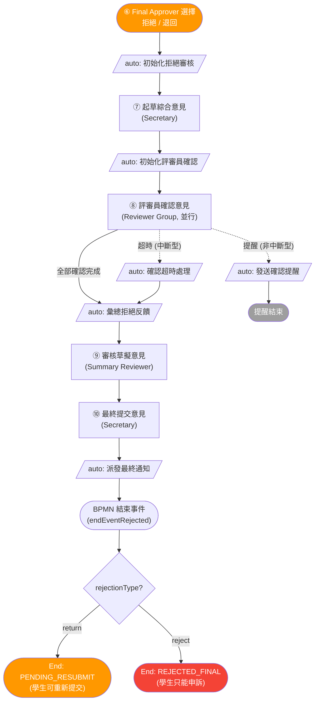
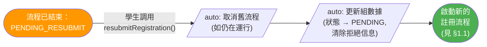
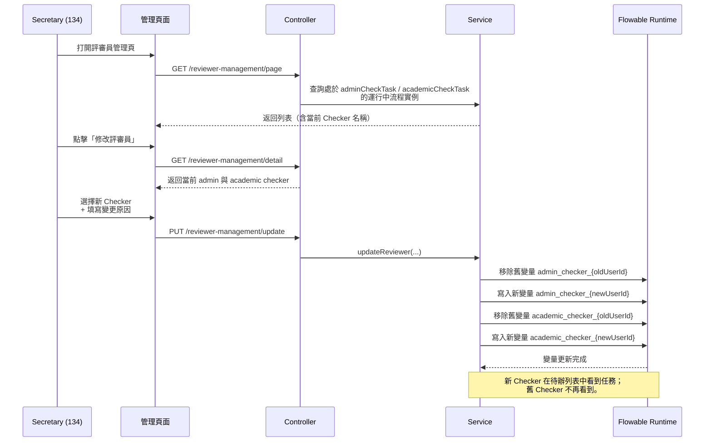
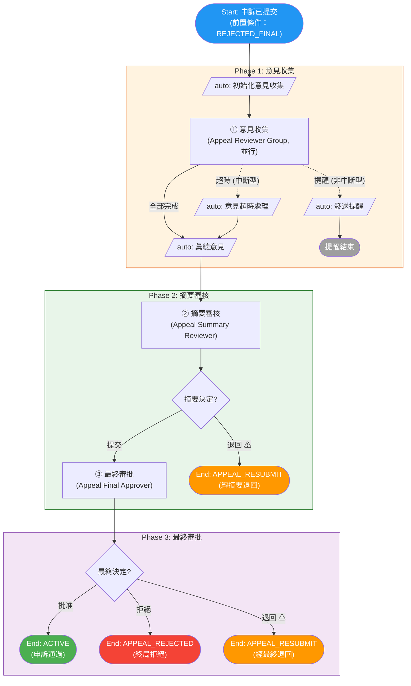
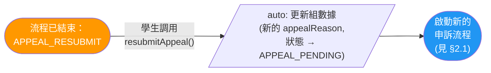
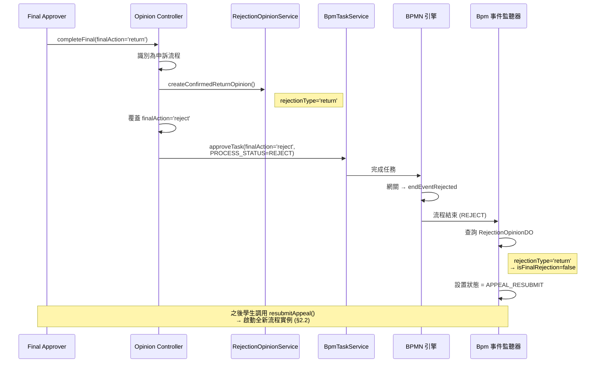

# 學生組織註冊與申訴流程圖

> **說明**：本文檔反映 **實際運行時行為**，依據 BPMN 定義與 Java 源碼（delegates、controllers、event listeners）共同確定。代碼與 BPMN 設計存在差異之處，以實際代碼行為為準並加以標註。

---

## 圖例與閱讀指南

本文檔所有流程圖遵循以下統一規範。

### 節點形狀

| 形狀 | Mermaid 語法 | 含義 |
|:-----|:-------------|:-----|
| 矩形 | `["Name"]` | **人工任務** — 需要用戶（評審員、秘書等）操作 |
| 平行四邊形 | `[/"auto: Name"/]` | **系統任務** — Service Task / Delegate，自動執行 |
| 菱形 | `{Question?}` | **判斷網關** — 根據變量分流，文字以問號結尾 |
| 圓角 | `(["Name"])` | **流程起點/終點** 或 並行 Fork/Join |

### 連線類型

| 樣式 | Mermaid 語法 | 含義 |
|:-----|:-------------|:-----|
| 實線箭頭 | `-->` | 正向順序流（happy path） |
| 虛線箭頭 | `-.->` | 計時器觸發（超時 / 提醒）、退回循環、跨分支依賴 |

### 節點標籤格式

| 類型 | 格式 | 範例 |
|:-----|:-----|:-----|
| 人工任務 | `<編號> <步驟名> (角色名)` | `① Secretary 初審 (Secretary)` |
| 系統任務 | `auto: <行為描述>` | `auto: 彙總意見` |
| 判斷網關 | 以問號結尾的問句 | `{Secretary 是否通過?}` |
| 結束點 | `End: <狀態碼> (<業務含義>)` | `End: ACTIVE (註冊通過)` |

> 流程圖**刻意省略**角色 ID、Delegate 類名、流程變量名等實現細節，以保持可讀性。完整實現信息見 [§1.5 / §2.5 角色匯總](#15-角色匯總註冊)、[§5 流程變量參考](#5-流程變量參考)，以及每張圖周圍的散文說明。

### 步驟編號

帶圈數字（①、②、…）標註單個流程內人工任務的執行順序，系統任務不參與編號。

- **註冊**（§1.1 主流程 + §1.2 拒絕子流程）：① – ⑩
- **申訴**（§2.1）：① – ③（申訴為獨立流程，編號重新開始）

| 流程 | 編號 | 步驟 | 角色 |
|:-----|:----:|:-----|:-----|
| 註冊 | ① | Secretary 初審 | Secretary (122) |
|  | ② | Admin 審核 | Admin Checker (136) |
|  | ③ | Academic 審核 | Academic Checker (132) |
|  | ④ | 意見收集 | Reviewer Group (123, 並行) |
|  | ⑤ | 摘要審核 | Summary Reviewer (138) |
|  | ⑥ | 最終審批 | Final Approver (124 / 134) |
| 註冊 （拒絕） | ⑦ | 起草綜合意見 | Secretary (122) |
|  | ⑧ | 評審員確認意見 | Reviewer Group (123, 並行) |
|  | ⑨ | 審核草擬意見 | Summary Reviewer (138) |
|  | ⑩ | 最終提交意見 | Secretary (122) |
| 申訴 | ① | 意見收集 | Appeal Reviewer Group (125, 並行) |
|  | ② | 摘要審核 | Appeal Summary Reviewer (139) |
|  | ③ | 最終審批 | Appeal Final Approver (126 / 135) |

---

## 1. 學生組織註冊流程（`student_org_registration`）

### 1.1 主流程

> **Phase 2** 中的虛線箭頭代表計時器事件：`超時` 為中斷型（取消並行任務並將未提交意見標記為 `TIMEOUT`），`提醒` 為非中斷型（僅通知待提交評審員，主流程繼續）。實現詳見 [§1.7.2 Phase 2 計時器行為](#172-phase-2-意見收集計時器行為)。
>
> `End: 流程結束` 節點的最終解析取決於觸發原因（摘要退回 / 最終拒絕 / 最終退回）——見 [§1.4 註冊結果對照表](#14-註冊結果對照表)。

### 1.2 拒絕／退回審核子流程

當 Final Approver（⑥）選擇 **拒絕** 或 **退回** 時，流程進入此子流程，用以起草、傳閱並定稿一份綜合意見。兩條分支共享同一子流程並在同一 BPMN 結束事件處結束；最終業務狀態由事件監聽器在流程結束後解析——見 [§1.4](#14-註冊結果對照表)。

#### 1.2.1 子流程步驟詳述

- **auto: 初始化拒絕審核**（`rejectionReviewInitDelegate`）— 創建 `RejectionOpinionDO`，將 `finalAction` 映射為 `rejectionType`（`'reject'` 或 `'return'`），設置 `PROCESS_STATUS=REJECT`，並通知 Summary Reviewer（Role 138）。
- **⑦ 起草綜合意見**（Secretary，Role 122）— 保存意見 version 1，設定兩個傳閱參數：`circulationDays` 與 `reminderDaysBeforeDeadline`。`RejectionOpinionService.submitDraft()` 強制 `reminderDaysBeforeDeadline < circulationDays`，並將兩者寫入 Flowable 運行時變量。
- **auto: 初始化評審員確認**（`rejectionConfirmInitDelegate`）— 讀取傳閱參數，計算 `rejectionConfirmDeadline` 與 `rejectionConfirmReminderTime`，並解析確認人列表（`rejectionReviewer123UserIds`，role 123）。
- **⑧ 評審員確認意見**（Reviewer Group，Role 123，並行多實例）— 每位評審員提交反饋 `APPROVE` / `SUGGEST` / `NO_COMMENT`。
- **auto: 確認超時處理**（`rejectionConfirmTimeoutDelegate`）— 將 BPMN 路徑標記為超時（`isRejectionConfirmTimeout=true`）。`RejectionOpinionService.markTimeoutFeedbacks()` 將未提交的 role 123 反饋持久化為 `feedbackType='APPROVE'` 且 `isTimeout=true`。
- **auto: 發送確認提醒**（`rejectionConfirmReminderDelegate`）— 非中斷型；只通知待提交評審員，不影響主路徑。
- **auto: 彙總拒絕反饋**（`rejectionFeedbackSummarizeDelegate`）— 產生 `rejectionApproveCount`、`rejectionSuggestCount`、`rejectionNoCommentCount` 與 `rejectionHasSuggestions`。
- **⑨ 審核草擬意見**（Summary Reviewer，Role 138）— 對草擬意見作單次審核評論。
- **⑩ 最終提交意見**（Secretary，Role 122）— 可修改 `finalOpinion`，持久化 CONFIRMED 意見。
- **auto: 派發最終通知**（`endNotifyDelegate`）— 將結果發送給兩類受眾：
  - 行動方：申請人、協作者、Roles 136 與 132。
  - 知會方：Roles 124、134、138、122 與 123。
- **rejectionType 網關** — 由 BPMN 之外的 `StudentGroupBpmEventListener.handleRejection()` 處理：
  - `rejectionType='return'` → 狀態 `PENDING_RESUBMIT`（學生可重新提交，見 §1.3）。
  - `rejectionType='reject'` → 狀態 `REJECTED_FINAL`（學生只能申訴，見 §2）。

### 1.3 註冊重新提交流程

當狀態為 `PENDING_RESUBMIT` 時，學生可修正申請並重新提交。此操作 **啟動全新流程實例**——原實例已結束，沒有進程內回跳。

### 1.4 註冊結果對照表

| 拒絕點 | 代碼路徑 | rejectionType | 最終狀態 | 學生可以 |
|:-------|:---------|:--------------|:---------|:---------|
| Secretary (122) 拒絕 | `rejectTask()` → 事件監聽器 | 無 RejectionOpinionDO；註冊默認為非終局 | **PENDING_RESUBMIT** | 重新提交註冊 |
| Admin (136) 拒絕 | `rejectTask()` → 事件監聽器 | 無 RejectionOpinionDO；註冊默認為非終局 | **PENDING_RESUBMIT** | 重新提交註冊 |
| Academic (132) 拒絕 | `rejectTask()` → 事件監聽器 | 無 RejectionOpinionDO；註冊默認為非終局 | **PENDING_RESUBMIT** | 重新提交註冊 |
| Summary (138) 退回 | `completeSummary()` 設置 `summaryAction='return'` 與 `PROCESS_STATUS=RETURN` → BPMN `notifyReturnTask` → `endEventRejected` → 事件監聽器 | 無 RejectionOpinionDO | **PENDING_RESUBMIT** | 重新提交註冊 |
| Final (124/134) 批准 | `approveTask()` → endEventApproved | N/A | **ACTIVE** | — |
| Final (124/134) 拒絕 | 拒絕子流程（`122 起草 → 123 確認 → 138 審核 → 122 最終提交`）→ `endNotifyTask` → `endEventRejected` → 事件監聽器 | `reject` | **REJECTED_FINAL** | 只能申訴 |
| Final (124/134) 退回 | 同一拒絕子流程 → `endNotifyTask` → `endEventRejected` → 事件監聽器 | `return` | **PENDING_RESUBMIT** | 重新提交註冊 |

> **代碼參考**：`StudentGroupBpmEventListener.handleRejection()` 決定註冊結果是否為終局。當不存在 `RejectionOpinionDO` 時，註冊默認可重新提交；當存在 `RejectionOpinionDO` 時，由 `rejectionType` 控制是 `REJECTED_FINAL` 還是 `PENDING_RESUBMIT`。`resolveRejectionReason()` 優先取 `RejectionOpinionDO.finalOpinion`，其次取流程及任務變量。

### 1.5 角色匯總（註冊）

| 角色 ID | 角色名稱 | 職責 |
|:-------:|:---------|:-----|
| 122 | Secretary | 初審；起草拒絕／退回意見；最終提交確認意見 |
| 136 | Admin Checker | 行政審核；摘要退回與最終拒絕／退回結果均收到通知 |
| 132 | Academic Checker | 學術審核；摘要退回與最終拒絕／退回結果均收到通知 |
| 123 | Reviewer Group | 提供註冊意見；對起草的拒絕／退回意見並行確認 |
| 138 | Summary Reviewer | 審核已收集的註冊意見；對起草的拒絕／退回意見作審核評論 |
| 124 | Final Approver | 最終批准／拒絕／退回決定 |
| 134 | Final Approver Secretary | 替代終審人；與 Role 124 享有相同決定權 |

### 1.6 評審員（Checker）重新分配

當 Secretary（Role 122）提交註冊並通過流程變量（`admin_checker_{userId}`、`academic_checker_{userId}`）指定 Admin Checker（Role 136）與 Academic Checker（Role 132）後，由於人員變動、休假或其他運維原因，可能需要更換已指定的 Checker。

**問題**：當 Secretary 完成 `secretaryCheckTask` 且流程已推進到 `adminCheckTask` / `academicCheckTask` 時，原始任務表單不再可訪問。Checker 指定信息儲存於 Flowable 流程變量中，因此單純重新分配任務無法生效——必須同步更新流程變量。

**解決方案**：在管理中心提供專屬的 **評審員管理（Reviewer Management）** 頁面，僅 Registration Secretary（Role 134）可訪問。

#### 入口

| 項目 | 值 |
|:-----|:---|
| 菜單位置 | 管理中心 → 評審員管理 |
| URL 路徑 | `/admin/ReviewerManagement` |
| 權限 | `stugroup:reviewer-management:manage` |
| 允許角色 | 134（`sg_reg_approver_secretary`） |

#### 工作原理

#### 約束

- 僅作用於 **運行中** 的註冊流程實例（`student_org_registration`），且當前停留在 `adminCheckTask` 或 `academicCheckTask` 節點。
- 每次操作必須至少更換 admin 或 academic 之一。
- 變更原因為必填項，用於審計。
- 申訴流程（`student_org_appeal`）不使用指定 Checker 機制，故不在此功能範圍內。

### 1.7 主流程步驟詳述

本節集中陳述刻意從 §1.1 流程圖中省略的實現細節，以保持圖的可讀性。每條目均按以下格式：執行人、輸入／輸出、任何非顯然的行為。

#### 1.7.1 Phase 1 順序三方審核

- **① Secretary 初審**（Secretary，Role 122）— 初次審核。Secretary 在完成任務時，會通過寫入流程變量 `admin_checker_{userId}` 與 `academic_checker_{userId}` 來指定 Admin Checker（Role 136）與 Academic Checker（Role 132）。後續可通過評審員管理功能替換（見 §1.6）。
- **② Admin 審核**（Admin Checker，Role 136）— 行政審核。受理人從 ① 設定的 `admin_checker_{userId}` 變量解析。
- **③ Academic 審核**（Academic Checker，Role 132）— 學術審核。受理人從 ① 設定的 `academic_checker_{userId}` 變量解析。
- **①／②／③ 任一處被拒** — 控制器調用 `rejectTask()`，不創建 `RejectionOpinionDO`。`StudentGroupBpmEventListener.handleRejection()` 將註冊結果默認為非終局，故狀態為 `PENDING_RESUBMIT`（見 §1.4）。

#### 1.7.2 Phase 2 意見收集計時器行為

Phase 2 在並行多實例 `意見收集` 任務上掛載兩個計時器邊界事件，行為完全不同：

| 計時器 | BPMN 類型 | 觸發時的效果 |
|:-------|:----------|:-------------|
| `Reminder`（於 `reminderTime`） | **非中斷型** | 執行 `opinionReminderDelegate`（通知待提交評審員）。主多實例任務繼續運行。重新配置後可多次觸發。 |
| `Timeout`（於 `opinionDeadline`） | **中斷型** | 取消多實例任務。執行 `opinionTimeoutDelegate`，將待提交意見標記為 `TIMEOUT` 並設置 `isTimeout=true`。流程繼續到 `彙總意見`。 |

本階段的系統任務：

- **auto: 初始化意見收集**（`opinionCollectionInitDelegate`）— 解析評審員列表（`reviewer123UserIds`），計算 `opinionDeadline` 與 `reminderTime`。
- **auto: 發送提醒**（`opinionReminderDelegate`）— 非中斷型提醒，只發送通知。
- **auto: 意見超時處理**（`opinionTimeoutDelegate`）— 將未提交評審員持久化為 TIMEOUT 並推進到彙總。
- **auto: 彙總意見**（`opinionSummarizeDelegate`）— 為 Summary Reviewer 產生 `approveCount`、`rejectCount`、`completedOpinions`、`pendingOpinions`。

#### 1.7.3 Phase 3 摘要審核

- **⑤ 摘要審核**（Summary Reviewer，Role 138）— 審核彙總意見並二選一操作：
  - **提交** → 控制器調用 `approveTask()` 並設置 `summaryAction='submit'`；BPMN 路由到 `finalApprovalTask`。
  - **退回** → 控制器調用 `approveTask()` 並設置 `summaryAction='return'`、`taskStatus=RETURN`；BPMN 路由到 `notifyReturnTask`。結果為 `PENDING_RESUBMIT`（此處不創建 `RejectionOpinionDO`）。
- **auto: 通知退回**（`summaryReturnNotifyDelegate`）— 通知 Role 136 與 Role 132，告知申請被 Summary Reviewer 退回。

#### 1.7.4 Phase 4 最終審批

- **⑥ 最終審批**（Final Approver / Final Approver Secretary，Role 124 / 134）— 產生 `finalAction='approve' | 'reject' | 'return'`。
  - `approve` → BPMN 路由到 `endEventApproved`，狀態變為 `ACTIVE`。
  - `reject` 或 `return` → 進入拒絕子流程（§1.2）。子流程內由 `rejectionType` 決定走向（'reject' → `REJECTED_FINAL`；'return' → `PENDING_RESUBMIT`）。

> 各 Delegate 產生的完整變量集合見 [§5 流程變量參考](#5-流程變量參考)。

---

## 2. 學生組織申訴流程（`student_org_appeal`）

### 2.1 實際代碼流程

> **重要**：`student_org_appeal` 的 BPMN 定義中包含一個 `studentResubmitTask`，「退回」路徑會回跳到 `summaryReviewTask`，但 **此循環在當前代碼中不可達**。下文 [§2.1.1](#211-bpmn-與代碼的偏離) 詳述兩處 BPMN 與代碼的差異。流程圖反映的是實際運行時行為，而非 BPMN 設計。

> ⚠ 標記運行時路徑與 BPMN 模型存在偏離的邊。詳見 [§2.1.1](#211-bpmn-與代碼的偏離) 與 [§4 BPMN 與代碼的差異](#4-bpmn-與代碼的差異)。

#### 2.1.1 BPMN 與代碼的偏離

上圖中兩條 ⚠ 邊隱藏了非顯然的行為。BPMN 模型與運行時在這兩處不一致：

**1. 摘要的「退回」繞過 BPMN 網關。**
BPMN 在 `summaryReviewTask` 處沒有網關——唯一建模出口直接指向 `finalApprovalTask`。但 [`ReviewerOpinionController.completeSummary()`](slas-module-stugroup/slas-module-stugroup-biz/src/main/java/hk/eduhk/sao/slas/module/stugroup/controller/admin/opinion/ReviewerOpinionController.java#L89-L103) 在此階段以「退回」決定為由直接調用 `rejectTask()`，立即結束流程。Secretary 選擇退回時，BPMN 通往 `finalApprovalTask` 的順序流永不會被走過。

**2. 最終的「退回」在 BPMN 看到之前已被改寫為「拒絕」。**
BPMN 顯式建模了 `studentResubmitTask`，條件 `${finalAction == 'return'}` 回跳到 `summaryReviewTask`。但 [`ReviewerOpinionController.completeFinal()`](slas-module-stugroup/slas-module-stugroup-biz/src/main/java/hk/eduhk/sao/slas/module/stugroup/controller/admin/opinion/ReviewerOpinionController.java#L131-L148) 對申訴流程把 `finalAction='return'` 覆蓋為 `'reject'`，因此 BPMN 條件 `${finalAction == 'return'}` 永遠不匹配。控制器仍會創建一個 `rejectionType='return'` 的 `RejectionOpinionDO`，事件監聽器據此把最終狀態設為 `APPEAL_RESUBMIT` 而非 `APPEAL_REJECTED`。完整握手見 [§2.3](#23-申訴退回機制詳解)。

淨效果是：申訴的「退回」機制完全在 BPMN 之外實現——摘要階段退回與最終階段退回都繞開 BPMN 路由，依靠 `StudentGroupBpmEventListener.handleRejection()` 來判定最終業務狀態。流程內沒有回跳；重新提交永遠啟動新的流程實例（見 §2.2）。

### 2.2 申訴重新提交流程

當狀態為 `APPEAL_RESUBMIT` 時，學生可修改並重新提交。此操作 **啟動全新流程實例**——原實例已結束；BPMN `studentResubmitTask` 循環從不被使用。

### 2.3 申訴退回機制詳解

申訴的「退回」（有條件批准）是本文檔中最微妙的路徑，因為它依賴於控制器層對 `finalAction` 的改寫。下方序列圖追蹤從 Final Approver 點擊「退回」到狀態變為 `APPEAL_RESUBMIT` 的完整鏈路：

### 2.4 申訴結果對照表

| 決策點 | 代碼路徑 | 機制 | 最終狀態 | 學生可以 |
|:-------|:---------|:-----|:---------|:---------|
| Summary (139) 提交 | `approveTask()` → BPMN 路由到 finalApprovalTask | 正常 BPMN 流 | *(進入最終審批)* | — |
| Summary (139) 退回 | 直接調用 `rejectTask()`（繞過 BPMN 網關） | RejectionOpinionDO(type='return') | **APPEAL_RESUBMIT** | 重新提交申訴 |
| Final (126/135) 批准 | `approveTask(finalAction='approve')` → endEventApproved | 正常 BPMN 流 | **ACTIVE** | — |
| Final (126/135) 拒絕 | `approveTask(finalAction='reject', PROCESS_STATUS=REJECT)` → endEventRejected | 無 RejectionOpinionDO；申訴默認為終局 | **APPEAL_REJECTED** | 無後續操作 |
| Final (126/135) 退回 | `approveTask(finalAction='reject')` + RejectionOpinionDO(type='return') → endEventRejected | 代碼將 'return' 覆蓋為 'reject'；事件監聽器檢查 rejectionType | **APPEAL_RESUBMIT** | 重新提交申訴 |

> **代碼參考**：`finalAction` 覆蓋邏輯位於 [ReviewerOpinionController.java](slas-module-stugroup/slas-module-stugroup-biz/src/main/java/hk/eduhk/sao/slas/module/stugroup/controller/admin/opinion/ReviewerOpinionController.java#L131-L148) `completeFinal()`。狀態判定位於 [StudentGroupBpmEventListener.java](slas-module-stugroup/slas-module-stugroup-biz/src/main/java/hk/eduhk/sao/slas/module/stugroup/service/bpm/StudentGroupBpmEventListener.java#L87)，其中 `isFinalRejection = !isRegistration`（申訴默認為 `true`）。

### 2.5 角色匯總（申訴）

| 角色 ID | 角色名稱 | 職責 |
|:-------:|:---------|:-----|
| 125 | Appeal Reviewer Group | 提供申訴意見（並行多實例） |
| 139 | Appeal Summary Reviewer | 審核已收集意見；可提交至最終或退回（結束流程） |
| 126 | Appeal Final Approver | 最終批准／拒絕／退回（有條件批准）決定 |
| 135 | Appeal Final Approver Secretary | 替代終審人；與 Role 126 享有相同決定權 |
| — | Appeal Initiator（學生） | 通過 `resubmitAppeal()` 重新提交申訴（流程外） |

---

## 3. 註冊與申訴的關鍵差異

| 維度 | 註冊 | 申訴 |
|:-----|:-----|:-----|
| **進入前置條件** | 新申請或 `PENDING_RESUBMIT` 狀態 | `REJECTED_FINAL` 狀態（首次申訴）或 `APPEAL_RESUBMIT`（重新提交） |
| **前置審核閘** | 3 步順序審核（Secretary 122 → Admin 136 → Academic 132） | 無——直接進入意見收集 |
| **意見評審員角色** | Role 123 | Role 125 |
| **摘要評審員角色** | Role 138 | Role 139 |
| **最終審批人角色** | Role 124 / 134 | Role 126 / 135 |
| **摘要審核選項** | 提交或退回（經 BPMN 網關） | 提交或退回（退回直接調用 `rejectTask()`，無 BPMN 網關） |
| **拒絕子流程** | Secretary 起草 (122) → 評審員確認 (123, 並行) → 摘要審核評論 (138) → Secretary 最終提交 (122) | 不適用 |
| **早期拒絕結果** | `PENDING_RESUBMIT`（註冊默認） | 不適用（無早期審核階段） |
| **最終拒絕結果** | `REJECTED_FINAL`（經拒絕子流程，`rejectionType='reject'`） | `APPEAL_REJECTED`（申訴默認） |
| **退回／重提機制** | 拒絕子流程，`rejectionType='return'` → `PENDING_RESUBMIT` → 學生調用 `resubmitRegistration()` | 代碼將 `finalAction` 覆蓋為 `'reject'` + `RejectionOpinionDO(type='return')` → `APPEAL_RESUBMIT` → 學生調用 `resubmitAppeal()` |
| **重新提交方式** | **新流程實例**（`startRegistrationProcess()`） | **新流程實例**（`startProcess("student_org_appeal")`） |
| **BPMN 重提循環** | BPMN 中未定義 | BPMN 中已定義（`studentResubmitTask` → `summaryReviewTask`），但 **代碼中不可達** |
| **計時器事件** | 意見收集 + 拒絕確認（兩者均有提醒 + 超時） | 僅意見收集（提醒 + 超時） |

## 4. BPMN 與代碼的差異

| 項目 | BPMN 定義 | 實際代碼行為 | 位置 |
|:-----|:----------|:-------------|:-----|
| 申訴 `studentResubmitTask` | `finalAction='return'` → `appealReturnStatusDelegate` → `studentResubmitTask` → 回跳到 `summaryReviewTask` | **不可達**：代碼將 `finalAction` 覆蓋為 `'reject'`，故條件 `${finalAction == 'return'}` 永不匹配。重新提交在流程外通過 `resubmitAppeal()` 處理。 | [ReviewerOpinionController.java:131-148](slas-module-stugroup/slas-module-stugroup-biz/src/main/java/hk/eduhk/sao/slas/module/stugroup/controller/admin/opinion/ReviewerOpinionController.java#L131-L148) |
| 申訴 `appealReturnStatusDelegate` | 將組狀態設為 `APPEAL_RESUBMIT` 並解析 `appealStudentUserId` | **從未執行**。狀態更新改由 `StudentGroupBpmEventListener.handleRejection()` 完成。 | [AppealReturnStatusDelegate.java](slas-module-stugroup/slas-module-stugroup-biz/src/main/java/hk/eduhk/sao/slas/module/stugroup/service/task/AppealReturnStatusDelegate.java) |
| 申訴摘要審核網關 | BPMN 中無網關（直接順序流到 `finalApprovalTask`） | 代碼允許在摘要審核階段「退回」，方法是直接調用 `rejectTask()` 立即結束流程。 | [ReviewerOpinionController.java:89-103](slas-module-stugroup/slas-module-stugroup-biz/src/main/java/hk/eduhk/sao/slas/module/stugroup/controller/admin/opinion/ReviewerOpinionController.java#L89-L103) |

## 5. 流程變量參考

### 5.1 流程啟動時設定的變量

**註冊**（`startRegistrationProcess()`）：

| 變量 | 值 | 用途 |
|:-----|:---|:-----|
| `groupId` | 學生組 ID | 全流程識別該組 |
| `groupName` | `groupNameEn` | 通知中顯示用 |
| `processType` | `"registration"` | 與申訴區分 |
| `organisingUnitTypeCode` | 組所屬 organising-unit 類型代碼 | 將註冊上下文帶入工作流與通知 |
| `registrationType` | 註冊類型如 `new` / `renewing` | 將註冊上下文帶入工作流與評審員管理篩選 |
| `reviewerRoleIds` | `"123"` | 意見收集對應角色 |
| `reviewerUserIdsVarName` | `"reviewer123UserIds"` | 評審員 ID 列表的變量名 |
| `notifyRoleIds` | `"136,132"` | 退回時通知的角色 |

`startRegistrationProcess()` 不再為每位 Checker 預置 `admin_checker_{userId}` 或 `academic_checker_{userId}`。Secretary 在完成 `secretaryCheckTask` 時僅寫入所選 Checker 標誌，後續可由評審員管理替換。

**申訴**（`startAppealProcess()`）：

| 變量 | 值 | 用途 |
|:-----|:---|:-----|
| `groupId` | 學生組 ID | 識別該組 |
| `groupName` | `groupNameEn` | 顯示名 |
| `appealReason` | 學生申訴文本 | 申訴理由 |
| `originalProcessInstanceId` | 註冊流程 ID | 關聯原註冊 |
| `processType` | `"appeal"` | 與註冊區分 |
| `reviewerRoleIds` | `"125"` | 意見收集對應角色 |
| `reviewerUserIdsVarName` | `"reviewer125UserIds"` | 評審員 ID 列表的變量名 |
| `appealStudentUserId` | 當前用戶 ID | 供 BPMN `studentResubmitTask` 受理人使用（實際未啟用） |

### 5.2 由 Delegate 設定的變量

| 變量 | 設定者 | 用途 |
|:-----|:-------|:-----|
| `reviewer123UserIds` / `reviewer125UserIds` | `opinionCollectionInitDelegate` | 多實例的評審員用戶 ID 列表 |
| `totalReviewers` | `opinionCollectionInitDelegate` | 評審員人數 |
| `opinionDeadline` | `opinionCollectionInitDelegate` | 意見收集截止時間（ISO-8601） |
| `reminderTime` | `opinionCollectionInitDelegate` | 提醒觸發時間（ISO-8601） |
| `isTimeout` | `opinionTimeoutDelegate` / `opinionSummarizeDelegate` | 意見截止是否超時 |
| `pendingReviewerNames` | `opinionTimeoutDelegate` / `opinionSummarizeDelegate` | 未提交評審員姓名 |
| `completedOpinions` | `opinionSummarizeDelegate` | 已完成意見數 |
| `pendingOpinions` | `opinionSummarizeDelegate` | 待提交／已超時意見數 |
| `approveCount` | `opinionSummarizeDelegate` | 「approve」票數 |
| `rejectCount` | `opinionSummarizeDelegate` | 「reject」票數 |
| `rejectionType` | `rejectionReviewInitDelegate` | `"reject"` 或 `"return"`，決定最終狀態 |
| `rejectionOpinionId` | `rejectionReviewInitDelegate` | RejectionOpinionDO 記錄 ID |
| `rejectionReviewer123UserIds` | `rejectionConfirmInitDelegate` | 確認階段 role 123 用戶 ID 列表 |
| `rejectionConfirmDeadline` | `rejectionConfirmInitDelegate` | 確認截止時間（ISO-8601） |
| `rejectionConfirmReminderTime` | `rejectionConfirmInitDelegate` | 確認提醒時間（ISO-8601） |
| `rejectionTimeoutReviewerNames` | `rejectionConfirmTimeoutDelegate` | 在確認截止前未提交的 Role 123 評審員姓名 |
| `isRejectionConfirmTimeout` | `rejectionConfirmTimeoutDelegate` | 拒絕確認分支是否超時 |
| `rejectionApproveCount` | `rejectionFeedbackSummarizeDelegate` | `APPROVE` 確認反饋數 |
| `rejectionSuggestCount` | `rejectionFeedbackSummarizeDelegate` | `SUGGEST` 確認反饋數 |
| `rejectionNoCommentCount` | `rejectionFeedbackSummarizeDelegate` | `NO_COMMENT` 確認反饋數 |
| `rejectionHasSuggestions` | `rejectionFeedbackSummarizeDelegate` | 是否有評審員提交 `SUGGEST` 反饋 |
| `rejectionTotalReviewers` | `rejectionFeedbackSummarizeDelegate` | 已存儲的確認反饋總記錄數 |

Secretary 的草稿提交還會把 `circulationDays` 與 `reminderDaysBeforeDeadline` 寫入 Flowable 運行時變量。`rejectionConfirmInitDelegate` 在計算 `rejectionConfirmDeadline` 與 `rejectionConfirmReminderTime` 之前會讀取這些值。

### 5.3 由 Controller 操作設定的變量

| 變量 | 設定者 | 值 | BPMN 網關條件 |
|:-----|:-------|:---|:-------------|
| `approved` | `BpmTaskService.approveTask()` / `rejectTask()` | `true` / `false` | `${approved == true}` / `${approved == false}` |
| `summaryAction` | `ReviewerOpinionController.completeSummary()` | `"submit"` / `"return"` | `${summaryAction == 'submit'}` / `${summaryAction == 'return'}` |
| `summaryComment` | `ReviewerOpinionController.completeSummary()` | 摘要評審員自由文本評論 | 不參與網關判定；提供給最終審批人 |
| `finalAction` | `ReviewerOpinionController.completeFinal()` | `"approve"` / `"reject"` / `"return"`（申訴：被覆蓋為 `"reject"`） | `${finalAction == 'approve'}` / `${finalAction == 'reject' \|\| finalAction == 'return'}` |
| `rejectionReason` | `ReviewerOpinionController.completeSummary()` / `ReviewerOpinionController.completeFinal()` | 自由文本退回／拒絕原因 | 不參與網關判定；作為兜底拒絕原因使用 |
| `PROCESS_STATUS` | `rejectionReviewInitDelegate` / `ReviewerOpinionController.completeSummary()` / `ReviewerOpinionController.completeFinal()` / `RejectionOpinionService.finalConfirm()` | `RETURN` 或 `REJECT` | 不參與網關判定；用於確保完成事件分類正確 |

